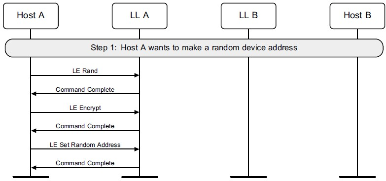

# 待机状态
## 初始化设置
- 主机处于接收数据的状态，等待控制器发送数据，控制器发送一个重置命令，开始进行初始化设置
- 主机先将控制器reset到一个确定的状态，然后去读取控制器所支持的功能。
- 接下来设置 event mask 和 LE event mask，读 buffer 和 LE buffer的大小以检查应用于数据流的 buffer。
- 还需要读取所支持的LE的特性并选择希望使用的特性。
- 最后读取设备的地址。

## 设置随机设备地址
- 蓝牙设备有两个地址，一个是 public address，一个是 random address
- 需要由主机发起一个LE Rand的命令产生8字节的随机数
- 加密
- 设置随机地址

## 筛选接受列表
- 在初始化、扫描或广播之前，可以清除列表并添加或设备
- 询问控制器列表大小
- 清除列表
- 向列表中增加设备
## 向解析列表添加蓝牙设备地址解析密钥(IRK)
- 询问控制器列表大小
- 清除列表
- 向列表中增加设备
## 默认数据长度
- 建立连接前，主机会为新连接指定控制器的最大传输包长度和最大包传输时间。
- 先指定
- 再读取
## 周期广播列表

# 广播状态
## 非定向广播
一个先配置广播参数，再执行广播。
- 设置广播参数
- 读取广播物理信道发射功率
- 设置广播数据
- 设置扫描响应数据
- 设置启用广播
- 关闭广播
## 定向广播
- 高占空比的会限时，所以可能会超时失败。
- 低占空比不限时
## 使用ADV_EXT_IND广播

## 扫描状态

