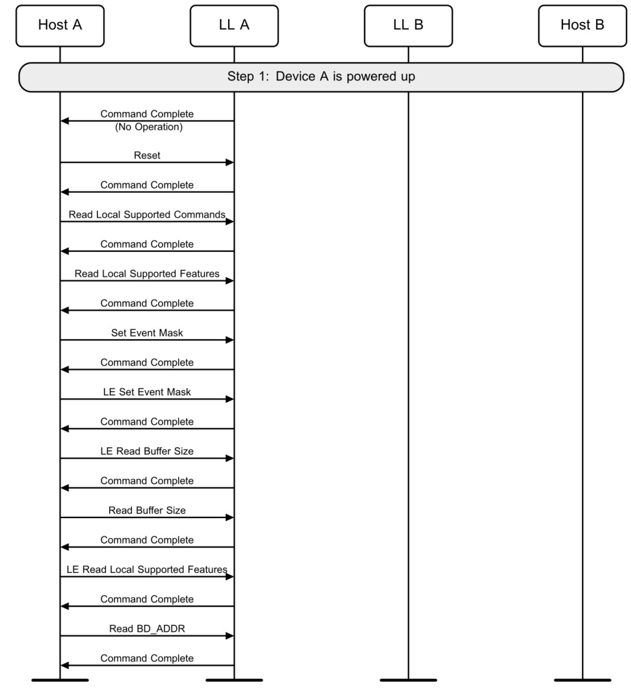

# 待机状态
## 初始化设置
- 主机处于接收数据的状态，等待控制器发送数据，控制器以一个无操作的命令完成(CC)为起点，开始进行初始化设置，主机先将控制器reset到一个确定的状态，然后去读取控制器所支持的功能。
- 接下来设置 event mask 和 LE event mask，读 buffer 和 LE buffer的大小以检查应用于数据流的 buffer。
- 还需要读取所支持的LE的特性并选择希望使用的特性。
- 最后读取设备的地址。

## 随机设备地址
- 蓝牙设备有两个地址，一个是 public address，一个是 random address
- 需要由主机发起一个LE Rand的命令产生8位的随机数
- 

