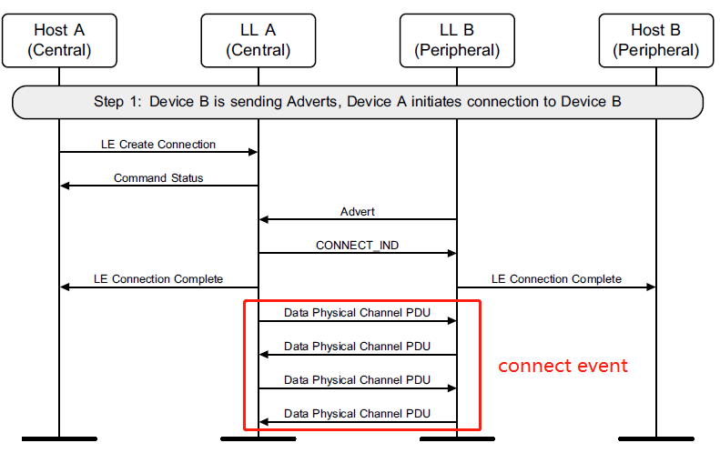

# 待机状态
## 初始化设置
- 主机处于接收数据的状态，等待控制器发送数据，控制器发送一个重置命令，开始进行初始化设置
- 主机先将控制器reset到一个确定的状态，然后去读取控制器所支持的功能。
- 接下来设置 event mask 和 LE event mask，读 buffer 和 LE buffer的大小以检查应用于数据流的 buffer。
- 还需要读取所支持的LE的特性并选择希望使用的特性。
- 最后读取设备的地址。
## 设置随机设备地址
- 蓝牙设备有两个地址，一个是 public address，一个是 random address
- 需要由主机发起一个LE Rand的命令产生8字节的随机数
- 加密
- 设置随机地址
## 筛选接受列表
- 在初始化、扫描或广播之前，可以清除列表并添加或设备
- 询问控制器列表大小
- 清除列表
- 向列表中增加设备
## 向解析列表添加蓝牙设备地址解析密钥(IRK)
- 询问控制器列表大小
- 清除列表
- 向列表中增加设备
## 默认数据长度
- 建立连接前，主机会为新连接指定控制器的最大传输包长度和最大包传输时间。
- 先指定
- 再读取
## 周期广播列表

# 广播状态
## 非定向广播

### LE Set Advertising Parameters

- 高占空比时，会忽略广播间隔的设置
- 广播类型Advertising_Type用于确定包的类型00，02，03是非定向广播
- Advertising_Channel_Map是使用的信道位图（37 38 39）
- Advertising_Filter_Policy仅适用于非定向广播
- 该命令只能在广播开启前设置
### LE read advertising physical channel Tx power

### LE set advertising data

如果广告当前被禁用，则数据应由控制器保存，并在广告启用后使用。
### LE set scan response data
格式同上
## 定向广播
- 高占空比的会限时，所以可能会超时失败。
- 低占空比不限时

### LE Set Advertising Parameters
- 其中的Advertising_Type是01、04时是定向广播
- peer相关选项只适用于定向广播
## 使用ADV_EXT_IND广播
开启一个广播集。

### LE set Extended Advertising Parameters

- Advertising_Event_Properties：类似于前面的Advertising_Type，如果正在使用扩展的广告PDU类型（位4=0），则：广告不应既可连接又可扫描，不得使用高占空比定向可连接广告。
- own_address_type：对于非定向匿名广播会忽略该参数
- 定向广播会使peer相关的有效，使filter无效
- 对于高占空比可连接的定向广播中，不会使用primary_min和max参数
- Own_Address_Type参数指定广告数据包中使用的地址类型。对于随机地址，地址由HCI_LE_Set_Advertising_Set_random_address命令指定。
- 如果使用的是传统的PDU，就应该将Primary_Advertising_PHY设置为LE 1M，并且忽略option的参数。如果是LE编码的PHY，就应该用options设置为倾向的编码方式（S=2或8）
- Secondary_Advertising_Max_Skip参数是在发送AUX_ADV_IND之前可以跳过的广告事件的最大数量
- Advertising_SID参数是对于有AdvDataInfo (ADI)的数据中的SID值，如果没有ADI，该参数被忽略
- Scan_Request_Notification_Enable指示控制器是否应该在收到扫描请求之后发送通知
- 控制器应将 Selected_TX_Power 返回参数设置为将用于传输指定广告集的广告数据包的传输功率。
### LE Set Extended Advertising Data command

- 可以设置或更新扩展的数据格式
- Advertising_Handle用于指示设定哪个handle
- Operation设置数据片段的属性（第一段/最后一段/中间段）
- Fragment_Preference设置是否分片
### LE Set Extended Scan Response Data command

### LE Set Extended Advertising Enable

- Num_Sets是设置的数量，Advertising_Handle是处理的列表

## 扫描请求通知
这组流程只有在启用通知时才会执行

## 扫描状态
## 被动扫描

仅报告lagency类型的PDU
## 主动扫描

## 私有被动扫描定向广播

### 向可解析列表添加设备

- 向可解析列表添加数据，生成并解析可解析私有地址
- 只有当地址可解析不可用时才可以使用
- 广播/扫描开启时不可使用

## 私有主动扫描

## 主动扫描定时更新

## 同步状态

- ADV_EXT_IND会指向AUX_ADV_IND，然后才能发送AUX_SYNC_IND，ACAD是Additional Controller Advertising Data
- ==状态转移？==
- 
### LE Periodic Advertising Create Sync command
无论是否启用扫描，都可以发出该命令。但是，只有在启用扫描时才能进行同步。

- 

# 初始化状态
## 初始化一个连接

### LE Create Connection: 
首先创建一个异步无连接链路（ACL）：
- LE_Scan_Interval：host多久进行一次扫描
- LE_Scan_Window：host一次扫描持续多长时间，window参数应该≤interval
- Initiator_Filter_Policy：Filter accept list是否被使用
- 如果没有使用list，Peer_Address_Type 和 Peer_Address 会指定连接的设备地址
- 如果host和LL支持HCI_LE_Set_Privacy_Mode，且将对端主机地址类型设置为0x02或0x03，就会使用设备隐私模式，对端地址会被随机化。
- Own_Address_Type是本端使用的模式
- Connection_Interval_Min 和 Connection_Interval_Max 定义的是后面发送PDU过程中的时间间隔。最后会由CONNECT_IND来确定。
- MAX_Latency表示最长的延迟是多久，即可以跳过多少个subrate
- Supervision_Timeout表示超时时间，即多久没有发送数据就视为断开连接。
- Min_CE_Length和Max_CE_Length表示事件的期望长度。

### 收到对方的广播包后，向对方发送一个连接的指令—— CONNECT_IND

- 其中InitA和AdvA分别表示发起方和广播方的地址。

- AA：ACL连接的接入地址
- CRCInit：ACL连接的CRC初始值，是LL生成的随机值。
- WinSize：用于表示transmitWindowSize值×1.25ms
- WinOffset：表示transmitWindowOffset值×1.25ms
- Interval：设置connInterval值×1.25ms，6×connInterval之后如果还没有建立连接就被视为断开
- Latency：设置connPeripheralLatency值
- Timeout：设置connSupervisionTimeout值×10ms
- ChM：使用的和未使用的数据信道的映射
- Hop：数据信道选择算法中的hopIncrement
- SCA：设置centralSCA用于确定C的最坏情况睡眠时钟精度
###  两端的控制器向主机发送连接完成—— LE Connection Complete

- status：成功或出错码
- Connection_Handle：
- BD_ADDR：建立连接的对端的地址
- Link_Type：SCO或ACL连接
- Encryption_Enabled：是否加密
### 两端控制器通信交互信道PDU:
- 连接成功之后的C和P之间会持续交替发送数据，且必须要在规定的超时时间内完成。即使受到的数据不符合CRC校验结果，也可以向对方发数据，如果多个连续的CRC出错，才会报错停止传输。对于ACL连接来说，有16位的连接事件计数器。
- 连接事件的起点称为锚点。连接时间的开始间隔是==connINTERVAL==，即两次C给P发送数据的时间间隔为==connINTERVAL==，且在P端接收到C端发送的数据之后，应该至少间隔T_IFS之后再发送数据。
-  connINTERVAL应该是1.25ms的倍数，在7.5ms到4.0s之间，由CONNECT_IND或AUX_CONNEXT_REQ设置。
- BLE中为了降低功耗，会使用subrate进行传输，即在原本的传输交互connEventCount的基础上，每隔connSubrateFactor次传输进行一次采样，connSubrateBaseEvent表示是从第几次传输开始。比如connSubrateBaseEvent=2，connSubrateFactor=5时，表示从第5次开始进行传输，每隔5次传输一次。
- 对于continuatuin event，一个包可能传输不完，那么就需要将包拆分，所以，对于使用了subrate的数据来说，需要在传输完一个周期的包之后再继续连续传输connContinuationNumber个包，直到把这一组包传完。
-  Perpheral延迟可以进一步减少数据交互次数，可以每隔connPeripheralLatency+1次的subrate数据传输一次。但是不能超过整个的超时时间。
- 如果在延迟时间之前收到了正确的包，那么就需要在下一个subrate之前持续监听continuatuin event，如果P在延迟时间之后还没有收到正确的包，就需要监听每一个subrate包并且不会在收到正确包之前使用延迟策略。

## 取消连接
当初始化过程失败时，会取消初始化连接。其中LE Create Connection Cancel只包含状态，即成功或失败码。

# 连接状态
## 发送数据

### Number Of Completed Packets

- Num_handles：所支持的handle的数量
- Connection_Handle：支持的handle的列表
- Num_Completed_Packets：自从上次该命令之后，每个handle成功接收了多少数据。意味着这些数据的空间可以被释放了。
## 更新连接
- 更新连接的过程中，如果C和P都支持连接参数请求（CPR），那么就使用这个程序，否则只要有一端不支持，就要由C发送连接更新请求。
- 如果不知道对方是否支持CPR，就直接使用这个程序，如果对方支持，就完成正常通信，否则切换回连接更新请求。

### LE connection update  —— 字段含义同上

### LL connection update —— 字段含义同上

- Instant：当connEventCount与instant相等时，不用考虑子速率是否满足要求，需要直接传输数据。Instance 是新旧设置的分界点。
### LE Connection Update Complete event

## 更新信道映射

### LE Set Host Channel Classification command
主机根据其“本地信息”为数据、二次广告、周期性和等时物理频道指定频道分类。主机应在知道信道分类已更改后的10秒内发送该命令。两个连续发送的命令之间的间隔应至少为1秒。

### LL_CHANNEL_MAP_IND

ChM是信道映射，instant表示何时开始（P2868）。
### LE Read Channel Map command
为指定的connection_handle返回信道映射。如果对应的handle没有ACL连接，就返回一个错误码。

## 交换特性

- LE Read Remote Features Complete
如果controller缓存了，就直接返回，否则就要和对方确认后才能返回

- LL_FEATURE_REQ
发送的是C端支持的功能

## 交换版本

