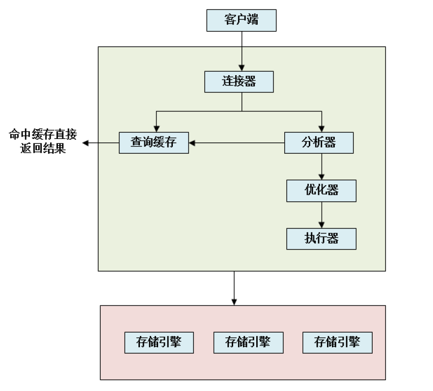

# MySQL
## 数据库原理
### 关系型和非关系型数据库的区别你了解多少？
- 关系型数据库的优点
	- 可以保持数据的一致性。
	- 数据更新的开销比较小。
	- 支持复杂查询（带where子句的查询）
- 非关系型数据库的优点
	- 不需要经过SQL层的解析，读写效率高。
	- 基于键值对，数据的扩展性很好。
	- 可以支持多种类型数据的存储，如图片，文档等等。

### 什么是非关系型数据库？
非关系型数据库也叫NOSQL，采用键值对的形式进行存储。
它的读写性能很高，易于扩展，可分为内存性数据库以及文档型数据库，比如 Redis，Mongodb，HBase等等。
适合使用非关系型数据库的场景：
- 日志系统
- 地理位置存储
- 数据量巨大
- 高可用

### 数据库三大范式
- 1NF：数据库表中的每一列都是不可分割的基本数据项，同一列中不能有多个值（比如不能把成绩单中的所有科目的成绩放在同一列中
- 2NF：满足第一范式，且有主键用于唯一地区分数据库中的每一个实例（比如订单编号、学号、身份证号之类的）
- 3NF：满足第二范式，且数据库表中不包含已在其他表中已包含的非主关键字信息，即属性不依赖于其他非主属性，数据不能存在传递关系，即每个属性都跟主键有直接关系而不是间接关系。（比如一个表中有班级号，就不能在这个表中在增加一列班主任，因为学号是主键，班级号依赖于学号，班主任信息依赖于班级号，所以应该在另一个表中列出班主任和班级号的对应关系。）

### 怎么理解数据库的事务
是并发控制的基本单位。事务可以使一组操作要么全部成功，要么全部失败，保证数据最终的一致性

### 什么是存储过程？
由一些T-SQL语句组成的代码块，这些T-SQL语句代码像一个方法一样实现一些功能（对单表或多表的增删改查），然后再给这个代码块取一个名字，在用到这个功能的时候调用他就行了。
好处是：
- 由于数据库执行动作时，是先编译后执行的。然而存储过程是一个编译过的代码块，所以执行效率要比T-SQL语句高。
- 一个存储过程在程序在网络中交互时可以替代大堆的T-SQL语句，所以也能降低网络的通信量，提高通信速率。
- 通过存储过程能够使没有权限的用户在控制之下间接地存取数据库，从而确保数据的安全。

### 事务四大特性（ACID）
- 原子性：一个事务中所有的操作，要么全部完成，要么全部不完成，不会结束在中间环节，如果中间发生错误，会被恢复至原始状态
- 一致性：事务开始前和结束后，数据的完整性没有被破坏，写入的资料必须完全符合所有的预设规则
- 隔离性：数据库允许多个并发事务同时对其数据进行读写和修改，防止多个事务并发带来数据的不一致
- 持久性：事务处理结束后，对数据的修改就是永久的了

### 关系型数据库的四大特性在得不到保障的情况下会怎样？
会导致数据丢失或错误
- 如果不满足原子性，则可能会导致停留在某个中间状态，发生错误，比如A给B转账100元，A扣了钱，但是B没有增加，这个事务就结束了。
- 如果不满足一致性，则不会检查上面的结果是否符合预设规则，就会保留这种状态，不会回滚。
- 如果不满足隔离性，可能会出现不可重复读等现象。
- 如果不满足持久性，会导致部分写入的数据丢失。

### 数据库如何保证一致性？
首先，数据库通过原子性、隔离性和持久性保持一致性，只有保证这三个特性，才能实现一致性；另外，数据库会通过判断数据库数据是否有效，决定原子操作的结果，即保留数据还是回滚。

### 数据库如何保证原子性？
使用Innodb的undo log保证一致性，这个日志记录了执行过的相应的日志信息，如果需要回滚，则执行已经执行过的操作的反操作，如果delete了一条数据，就要insert回来，update一条数据，就要把原来的数据update回来。

### 数据库如何保证持久性？
- 使用Innodb的redo log保证持久性
- 数据库中的数据存储在磁盘中，需要从磁盘中读到内存上才能修改，修改后再返回到磁盘中。但是如果突然宕机，内存中的数据就会丢失，无法保证数据的持久性。
- 如果写入数据库的每一条记录都要直接写入磁盘，就要将一整个页面的内存刷回到磁盘中，效率太低；而且可能会涉及到多个页面的修改，涉及到随机操作IO，效率更低。
- 因此需要把数据存储到redo log中来解决上述问题，修改数据时，不仅在内存中操作，还会在redo  log中进行记录，提交事务时需要对redo log进行刷盘，服务器宕机重启时，会将redo log中的内容恢复到数据库中，再根据undo log或binlog内容决定回滚还是提交数据。

### 数据库并发事务会带来哪些问题？
- 脏读：两个任务同步执行，其中事务A更改了某一数据，事务B读取了这一数据但并未提交，而事务A的更改操作进行了回滚，这时B读到的就是脏数据
- 不可重复读：事务B先读取一个数据，但是事务A更改并保留了这一数据， 这时就是不可重复读现象
- 幻读：由于增删操作导致的事务B先选择了一个范围的数据，A在这个范围内又增加或删除了一条数据，导致B读取数据范围和之前的不一样
- 丢弃更改：两个写事务同时更改一个数据，导致只保留其中最后写入的一个

### 不可重复读和幻读区别是什么？可以举个例子吗？
不可重复读的原因是修改（update），即当一个事务中一个用户A读取了某一项之后，另一用户B立即修改了这一项，这时A再读这一项，得到的就是和之前完全不同的数值了。幻读的原因是增删操作（delete/insert），由于增删操作导致两次读取出来的记录数不一样。假某工资单表中工资大于3000的有4人，事务1读取了所有工资大于3000的人，共查到4条记录，这时事务2 又插入了一条工资大于3000的记录，事务1再次读取时查到的记 录就变为了5条，这样就导致了幻读。

### 数据库隔离级别
- 未提交读：事务发生修改，在提交之前，其他事务也能看到这个数据（读不加锁），会导致脏读、幻读、不可重复读
- 提交读：事务修改，提交之前，其他事务都看不到这个数据，可以阻止脏读，不能阻止幻读和不可重复读（每次读取数据之前都生成一个readview（当前读），所以可以看到其他事务提交的数据，但不能看到其他事务未提交的数据（属于后面第四种情况））
- 重复读：前后两次读取都是一致的，可以阻止脏读、不可重复读，但不能阻止幻读（第一次读取数据时生成一个ReadView（快照读），所以不能看到第一次读取之后其他事务修改的数据，如果使用了UPDATE，则是快照读）
- 可串行化读：和串行化（单事务）操作的结果一样（读写都加锁），可以阻止脏读、幻读、不可重复读

Innodb默认支持可重复读，使用了next-key-lock锁算法，可以避免幻读，因此达到了可串行化读级别，分布式事务中一般用到可串行化读级别

### MySQL中为什么要有事务回滚机制？
为了保证数据库操作的原子性
- 发生错误或用户执行ROLLBACK时，需要根据undo log恢复原来的数据
- 整个系统崩溃或者数据库进程被杀死后，会将所有的数据刷回到磁盘，但是可能会有未写完的数据，所以需要在重启数据库之后执行undo操作把这些未完成的数据进行回滚

### MVCC是什么？怎么实现的？
- Mulit version concurrency control，多版本并发控制。通过维护历史版本数据，解决并发访问情况下读一致的问题。它可以用更好的方式处理读写冲突，即使有读写冲突，也可以不加锁地非阻塞并发读。使用的方法是版本链和read view
- 对于Innodb引擎，每一行记录都会有两个隐藏列，分别最后一次修改的事务ID和undolog指针（也就是上一次修改的记录），这样就串起了一个版本链。
- 当某个事务快照读时，会产生一个read view，通过这个快照可以获知当前系统中活跃的读写事务的事务ID列表及其最小值、应该分配给下一个事务的ID值、生成该readview事务的事务ID。
	- 如果被访问版本的事务ID和生成该事务的ID相同，则说明当前事务在访问自己修改过的记录，可以访问；
	- 如果小于当前系统中最小事务ID值，说明生成该本吧的事务已被提交，可以访问；
	- 如果大于下一个事务ID值，说明该版本事务在当前事务生成readview之后才开启，不可访问；
	- 如果处于最小ID和下一个ID之间，就判断事务ID是否在活跃的ID列表中，如果在，说明不可访问，否则可以访问。
- 如果某个版本数据对当前事务不可见，就顺着版本链找到下一个版本的数据，重复以上操作直到最后一个版本。

https://zhuanlan.zhihu.com/p/383842414
https://www.zhihu.com/question/334408495/answer/2135229572
## 数据库索引

### 为什么使用索引？
- 创建唯一性索引，可以保证数据库表中每一行数据的唯一性
- 可以大大加快索引速度
- 帮助服务器避免排序和临时表
- 将随机IO变为顺序IO
- 加速表与表之间的连接

### MySQL中有哪些索引？有什么特点？
- 普通索引：仅加速查询，没有唯一性的限制，允许为NULL值
- 唯一索引：数据列不允许重复，一个表允许多个列创建唯一索引，加速查询+列值唯一（可以有null）
- 主键索引：是MySQL默认的索引，数据列不允许重复，不允许为NULL，一个表只能有一个主键，加速查询+列值唯一
- 组合索引：使用多个列值组成一个索引，用于组合搜索，效率高于索引合并
- 全文索引：对文本内容进行分词，进行搜索
- 索引合并：使用多个单列索引组合搜索

### 为什么使用索引会加快查询？
添加索引后，MySQL通过BTREE算法生成一个索引文件，查询时只需要通过这个索引文件查找即可

### MySQL中的四种索引类型
- 全文索引：可以在CREATE TABLE、ALTER TABLE、CREATE INDEX使用，只有char类型的数据可以创建
- 哈希索引：具有唯一性，可以一次定位，但是对于范围查询、排序和组合索引效率不高
- BTREE：将索引值按照一定的算法，存入一个二叉树中，每次查询都是从root开始，依次遍历node，获取叶子节点的值
- RTREE：仅支持geometry数据类型，优势在于范围查找

### 什么时候需要建立数据库索引呢？
频繁使用的，用以缩小查询范围的字段，需要排序的字段

### 覆盖索引是什么？
想要筛选的对象和条件字段，正好和建立的索引一致，比如：
```
select a,b,c,d from t1 where b=1 and c =1 and d=1;
count(*) from t1 where a=0;
```
其中bcd是条件字段，这些就可以作为索引，得到a，正好就是返回的对象。
或者只是统计个数。
因此，覆盖索引通过非聚集索引得到结果，不需要再回表即可得到相应的目标

### 聚集索引与非聚集索引的区别是什么?
- 聚集索引就是在B+树的叶子节点处存储真正的数据（一般选取主键作为键值）；
- 非聚集索引就是在B+树的叶子节点处存储数据在磁盘中的地址或者是数据的主键值，然后再通过主键值查找数据；
- 一个表中只能有一个聚簇索引，而非聚簇索引可以有多个；
- 聚簇索引键值的逻辑顺序决定了表中相应行的物理顺序，而非聚簇索引中的逻辑顺序与物理顺序无关。

### 什么是回表？
利用辅助索引（非聚集索引）查询，但是辅助索引中没有返回的全部信息，就需要找到主键索引的键值，再通过主键索引查出主键索引里面的数据

### 索引如何提高查询速度的
将无序的数据变成相对有序的数据

### MyISAM和InnoDB实现B树索引方式的区别是什么？
MyISAM的索引方式时非聚集索引，即通过B+树查询叶子节点，如果找到了叶子节点就读取叶子结点的data域的值，再以这个data域的值进行索引找到存放数据的具体地址，所以索引文件和数据文件是分离的。
InnoDB的索引方式是聚集索引，数据本身就是索引文件，索引的key就是数据表的主键，数据表本身就是主索引，叶子结点的data域就是要查找的数据本身，而其他索引都是辅助索引，data域记录的是主键的值而不是地址，取出这个值之后还要再走一遍主索引。

### MySQL索引主要使用的两种数据结构是什么？
哈希索引（适用于单条记录）和B树索引

### 数据库索引采用B+树而不是B树的主要原因是什么？
- B树是索引和数据一起存储的，所以每一个非叶子节点占用的空间都比B+树要大，在查找数据时，只需要将B+树的索引从磁盘中读取到内存中，然后找到相应的数据后再从内存中找到这一块页面读到内存中即可；如果是B树，需要不断地把索引及其数据从磁盘中读取出来，每次能取出的节点数量有限，效率比B+树要低。
- B+树的叶子节点是一个双向链表串起来的，更适合范围查询，而B树只能中序遍历所有的节点才能完成范围查询
- B+树的查询效率更稳定，因为每一次查询都必须要从根节点走到叶子节点处才能完成一次查询，而B树查询路径的长度不确定

### 数据库不采用红黑树或哈希存储的原因
当数据量非常庞大时，红黑树会很高，如果要查找的数据在最底层，会导致效率很低。
哈希表也是需要把数据全部从磁盘中搬移到内存中，如果数据量很大，非常消耗内存和时间，而且哈希表的数据存储不连续，范围查询的效率不高。

### Hash索引怎么实现的？
只有精确匹配索引所有列的查询才有效，对于每一行数据，存储引擎都会对所有的索引列计算一个哈希码（hash code），并且Hash索引将所有的哈希码存储在索引中，同时在索引表中保存指向每个数据行的指针。

### Hash 索引和 B+ 树索引区别是什么？
- B+树支持范围查询，而hash索引不能
- B+树支持order by排序，而hash索引不能
- 等值查询时，hash索引更快
- B+ 树支持联合索引的最左侧原则，Hash 索引不支持。
- B+ 树使用 like 进行模糊查询的时候，like 后面（比如 % 开头）的话可以起到优化的作用，Hash 索引根本无法进行模糊查询。

### 一棵B+树能存储多少条数据？
取决于键值的大小，B+树是一个m叉树，一般来说为了提高查询效率，每个非叶子节点都占用一页。一般三层树就可以满足千万级的数据存储。

### 增加B+树的路数可以降低树的高度，那么无限增加树的路数是不是可以有最优的查找效率？
不可以，因为这样会退化成为一个有序数组，在搜索时，还会在树的路数上查找这一阶段耗费时间，另外，这种情况下，数据的索引和数据本身就存放在了一起，整个数组没有办法一次全部存储到磁盘中，效率反而更低。

### 既然索引有那么多优点，为什么不对表总的每一列创建一个索引呢？
- 对表中的数据进行增加、删除等操作时，每一个索引都有同步进行更新和维护，降低了数据的处理速度；
- 索引需要占用物理空间；
- 创建和维护索引需要耗费时间。

### 创建索引时需要注意什么？
- 作为索引的列不应该包含非空字段：应该指定列为NOT NULL，如果想要存储NULL，则可以将其设置为0或一个特殊值，否则会使得索引、索引的统计信息以及比较运算更复杂（可能会放弃索引进行全表扫描）
- 取离散值大的字段：离散程度高的字段放在索引的前面，匹配的结果就越少，这样可以提高查询速度（比如性别不能建立索引）
- 索引字段越小越好：字段越小，一次磁盘IO所能传递进内存的数据就越多，搜索得越快
- 在经常被使用的列上创建可以加快搜索的速度
- where字段中不能使用函数运算符，否则会造成无法命中索引
- 特大型表的维护开销大，不适合建立索引，最好用逻辑索引
- 删除长期未使用的索引，不用的索引会造成效率的下降
- 组合索引代替多个单列索引
- 过长的字段，使用前缀索引
- 不建议用无序的值(例如身份证、UUID )作为索引
- 频繁更新的值不能作为索引，否则会频繁维护索引文件
- 组合索引应该要把区分度高的值放在前面
- 唯一、不为空、经常被查询的字段适合作为索引。
（在经常用到连续的列上，这些列主要是由一些外键，可以加快连接的速度与业务无关时多使用逻辑主键，也就是自增主键在使用InnoDB时使用与业务无关的自增主键作为主键，即使用逻辑主键，而不要使用业务主键。删除长期未使用的索引，不用的索引的存在会造成不必要的性能损耗在使用limit offset查询缓存时，可以借助索引来提高性能。）

### 索引哪些情况下会失效呢？
- 查询条件包含or，可能导致索引失效
- 如果字段类型是字符串，where时一定用引号括起来，否则会因为隐式类型转换，索引失效
- like通配符可能导致索引失效。
- 联合索引，查询时的条件列不是联合索引中的第一个列，索引失效。
- 在索引列上使用mysql的内置函数，索引失效。
- 对索引列运算（如，+、-、*、/），索引失效。
- 索引字段上使用（！= 或者 < >，not in）时，可能会导致索引失效。
- 索引字段上使用is null， is not null，可能导致索引失效。
- 左连接查询或者右连接查询查询关联的字段编码格式不一样，可能导致索引失效。
- MySQL优化器估计使用全表扫描要比使用索引快,则不使用索引。

### 什么是最左匹配原则？
在联合索引中，只有匹配了前一个/左边的值之后才能匹配下一个。
比如组合索引(a1,a2,a3)，相当于创建了(a1)、(a1,a2)和 (a1,a2,a3) 三个索引。因为建立该索引之后得到了一个B+树，这个B+树就是优先根据a1数据判断并排序的，即a1相等时，a2才是有序的。

### 什么是多范围读优化
Multi-range read(MRR)，可以减少磁盘的随机访问，将随机访问转换为较为顺序的数据访问。查询时首先将查询得到的辅助索引键值根据RowID排好序存放于一个缓存中，然后根据RowID排序的顺序访问实际的数据文件。

### 什么是索引条件下推优化？
索引条件下推优化（index condition pushdown, ICP）是指如果存在某些被索引的列的判断条件，在取出索引的同时，进行条件过滤（如where、limit等），即把本应该在服务层执行的过滤操作下推到了存储引擎层。

### 场景题:这句sql语句如何建立索引？
```
select * from t1 where a = 'x' and b != 'x' and c = 'x' order by d desc limit 0,10; 
```
根据最左匹配原则建立a,c,d的索引，b使用了!=条件，用不到索引

### MySQL 索引使用的注意事项
- 不要使用可能会使索引失效的语句
- 应该符合最左匹配原则
- 为多个列创建单列索引不能提高性能
- 可以让一个索引包含额外的列，以实现覆盖索引

### Innodb为什么要用自增id作为主键？
使用自增作为主键，每当新增一条记录时，都会顺序在当前索引节点之后，增加一个主键，当一页写满，就开辟新的一页。
如果使用其他字段作为主键，每次插入主键的值接近随机，就需要将其插入到当前记录的中间位置，频繁的移动分页操作可能会造成大量的碎片，得不到紧凑的索引结构。

### 为什么一定要有主键？
主键可以保证存储数据的唯一性，可以加快数据库的操作速度，在表中添加新记录时，DBMS会自动检查新记录的主键值，不允许该值与其他记录的主键值重复。


 
## 数据库架构

### 你了解MySQL的内部构造吗？一般可以分为哪两个部分？
一般分为服务层和存储引擎层：
- 服务层包括连接器、查询缓存、分析器、优化器、执行器进行命令的分析；
- 存储引擎负责数据的存储和提取。


### 说一下MySQL是如何执行一条SQL的？具体步骤有哪些？
客户端发出SQL请求语句后；连接器会验证用户身份并给予权限；如果查询缓存中有该结果则直接返回；如果没有，则使用分析器分析SQL语法和词法；然后优化器选择最优的执行方案；执行器根据用户的权限提供引擎的接口。
存储引擎根据执行器的指令查询数据并返回结果，如果开启了存储缓存就要把查询结果在存储缓存中也存一份

### 、数据库引擎InnoDB与MyISAM的区别？适用场景分别是？
- Innodb是MySQL默认支持的存储引擎，只有需要它不支持的功能时，使用其他引擎
- Innodb存储表的总行数，而MyISAM不存储总行数
- Innodb是事务型的存储器，支持回滚操作，而MyISAM不支持事务，强制使用不会报错，只是没有办法回滚，数据即时生效
- Innodb支持表级锁和行级锁，而MyISAM只支持表级锁，因此MySIAM只适合读多写少的场景
- Innodb有回滚和在线热备份功能，发生错误后可以快速恢复，而MyISAM崩溃后损坏的概率很大，而且恢复速度也很慢
- Innodb的主索引是聚集索引，在索引中保存了数据，而MyISAM的主索引是非聚集索引，叶子节点中存储的是存放数据的具体地址，是B+树
- Innodb内部的优化包括可预测读、加快读操作并且自动创建的自适应哈希索引、加速插入操作的插入缓冲等；MyISAM的优化包括压缩表，空间数据索引等
- Innodb支持外键，而MyISAM不支持外键
- Innodb不支持全文索引，而MyISAM支持全文索引。查询效率上MyISAM高
- Innodb如果没有主键或非空唯一索引会自动生成一个，而MyISAM允许没有主键和索引

适用场景：
- MyISAM：不频繁插入，但是频繁查找
- Innodb：可靠性要求高，或者要求事务，频繁更新和查询

### 什么是buffer pool
Buffer pool是MySQL启动时向操作系统申请的一块内存，默认大小是128M。在这块空间中会划分出若干个页，以页作为磁盘和内存交互的基本单位，默认大小是16KB。在这个pool中，除了缓存索引页、数据页，还包括undo 页、插入缓存、自适应哈希索引、锁信息等。并且为每个缓存也创建了一个控制块来存储缓存页的信息。

### Buffer pool的内存管理
通过free链表管理空闲页，flush链表管理脏页。这两个链表都是双向链表，通过一个链表头进行管理，每个节点对应一个控制块，控制块再对应一个缓存页。还有一个LRU链表，用于提高缓存命中率。

### 为什么LRU算法不能用在MySQL中？
容易产生以下两个问题：
- 预读失败：由于空间局部性原理，会预先读入与当前页相邻的数据页一起加载进来，从而减少磁盘IO，但是如果这些数据没有被访问，就是预读失效，而这些页面会被存储在链表头，如果又需要换出页面，就会换出链表尾的频繁访问的页面，从而大大降低了缓存命中率。
- Buffer pool污染：当某条语句扫描了大量的数据时，会将buffer pool中的所有页面替换出去，导致大量的热数据被淘汰，当再次访问这些热数据时，由于缓存未命中，就会再次引发大量的磁盘IO，从而导致性能急剧下降。

### MySQL中改进的LRU算法
- 对于预读失效问题，将链表分为young和old两部分，中间以midpoint为分界点，预读的页放在old区域的头部，当页真正被访问时，才会将其放在young的头部，如果预读的页没有被使用，就一直向后移，一直到被移除。
- Young区域存放的都是热点数据，因此只有同时满足“被访问”与“在 old 区域停留时间超过 1 秒”两个条件，才会被插入到 young 区域头部。

### Change buffer
当修改数据时，如果在内存中就修改，不在内存中就将这些操作缓存在change buffer中，这样就不需要从磁盘中读数据页了，当下一次访问这个数据页时再读到内存中修改，可以减少磁盘IO，提高效率和磁盘利用率。

### Change buffer和redolog buffer的不同
- 记录的内容不同：只有内存中没有的数据才会在change buffer中记录，而redolog是全部都要记录
- 效益目标不同：change buffer节省随机读磁盘的IO消耗，redolog节省随机写磁盘的IO消耗
- 内存中位置不同：change buffer属于buffer pool，redolog独立于buffer pool
- 应用场景不同：redolog用于实现crash-safe能力，change buffer适用于写多读少，且写完之后立即被访问的概率小的业务场景。

## 日志
### MySQL日志文件有哪些？分别介绍下作用？
- 错误日志：记录MySQL的启动、运行、关闭过程，用于定位问题
- 慢查询日志：记录MySQL中查询时间超过一个给定变量值的查询语句，可以通过该日志进行查询优化
- 一般查询日志：记录了所有对MySQL数据库请求的信息
- 二进制日志（binlog）：记录了数据库所有执行的DDL和DML语句，以事件形式记录下来（但是不包括select等操作）用于备份和复制
- Redolog：记录了页的物理修改操作
- Undolog：用于回滚行记录到某个特定版本

### Redolog和undolog的区别
https://zhuanlan.zhihu.com/p/410270379
- Redolog用于保证事务的原子性和持久性，undolog用于保证事务的一致性
- Redolog回复提交事务修改的页操作，undolog回滚行记录到某个特定版本
- Redolog通常是物理日志，记录的是页的物理修改操作，undolog是逻辑日志，根据每行记录进行记录。
- Redolog是顺序读写的，undolog需要随机读写。
- redolog数据最终要落盘，undolog不需要落盘，只保存在内存中

### Redolog和binlog的区别
- Redolog是在Innodb存储引擎层产生的，是Innodb专有的日志，而binlog是在数据库的上层产生的
- 内容形式不同，binlog是逻辑日志，记录的是对应的SQL语句；而redolog是物理格式的日志，是对物理页的修改
- 写入磁盘的时间点不同，binlog只在事务提交完成后写入，redolog在事务进行中不断地被写入。
- Redolog是循环写入的，是一个固定大小的缓冲区，空间会被用完，然后就要覆盖前面的文件数据，所以只用来做数据持久化。binlog可以追加写入，不会覆盖以前的文件，因此binlog可以提取出来用于主从复制和数据恢复。

### WAL机制及其原因
WAL全称是write ahead logging，意思是在执行提交事务之前，不直接修改到数据文件中，而是先在redolog中记录，数据库后台根据自身的机制将数据刷新到磁盘中。原因是：
- 直接写道磁盘中是随机读写，速度很慢，而redolog虽然是写磁盘，但是顺序记录，速度相对比较快
- 需要做自动故障恢复

### Redolog组
- 是一个逻辑上的概念，是由多个实际的日志文件组成的，每个文件大小相同，但是总大小有限制，存储的是log buffer中的log block。
- 其中有一个write pos表示当前正在写的位置，checkpoint表示的是要擦除的位置。当writepos追上checkpoint时，就需要修改磁盘中的数据然后擦除数据了。

### Redolog格式
类型、表空间ID、页偏移量、记录实体

### Binlog格式
记录了数据库表结构和表数据变更。有三种格式：分别是statement、row和mixed。
- Statement：存储每一条sql语句，但是对于sysdate等语句会导致主从数据不一致
- Row：仅记录哪条数据被修改了，但是会产生大量的日志
- mixed：对于会引起主从数据不一致的语句采用row方式记录，其他数据采用statement记录

### MySQL怎么知道binlog是完整的？
- Statement格式的binlog最后会有commit
- Row格式的binlog最后会有XID event

### redo log和binlog是怎么关联起来的？
通过XID关联，崩溃恢复时，会顺序扫描redolog，如果遇到既有prepare又有commit的redolog就直接提交，如果只有prepare但没有commit的redolog就用XID去binlog找对应的事情。

### 怎样执行一条更新语句？
- 首先执行器需要查询该数据是否在存储引擎的内存中，如果不在内存中就缺页中断然后将该数据调入内存。
- 执行器将该数据修改后更新到存储引擎的内存中，然后存储引擎写入redolog，将这行记录的状态修改为prepare，告知执行器随时可以提交事务
- 执行器生成binlog写入磁盘，提交事务后，存储引擎把redolog改为提交状态

### 为什么要两阶段提交？
- 单阶段提交会导致原先数据库的状态和被恢复后的数据库的状态不一致。
- 如果先写入redolog后写入binlog，在写完redolog之后系统发生宕机，binlog没有保存该语句，当使用binlog进行备份或恢复时少了上述语句，同理，如果先写入binlog，后写入redolog，当使用binlog恢复时也会多一条语句。
- 两阶段提交时，如果在redolog之后，binlog之前崩溃，由于binlog没有记录且redolog也没有提交，那么就相当于这条语句没有发生过；如果在binlog之后，redolog提交之前崩溃，那么如果redolog事务是完整的（已经有了commit），就直接提交，如果redolog只有prepare，则判断binlog是否完整（有commit标识），如果有则提交，否则回滚。

### Redolog怎么刷盘的？
以下五种方式会触发刷盘：
- Redolog buffer空间不足时（一般是到一半左右）
- 事务提交时
- 后台线程触发
- 服务器正常关闭
- 触发checkpoint规则

刷盘策略可以设置，有三种：
- 事务提交时不刷盘，仅依靠每秒一次的刷盘操作
- 事务提交时刷盘
- 事务提交时仅写入文件系统的缓存（page cache），但不刷盘

### Binlog怎么刷盘的？
系统会给每一个线程分配一块内存作为binlog cache。事务执行过程中先把日志写到binlog cache中，事务提交时把binlog cache写到binlog file中。
但是写到文件中时，先写到文件系统的page cache中，只有fsync之后才会落到文件上。持久化到硬盘上的过程是可以设置的，有三种选项
- 由系统自行判断fsync时间
- 每次提交事务都fsync
- 累积N个事务之后fsync

### 如果刷盘的过程中，程序崩溃了怎么办
重新开启即可。因为Innodb在启动时，不管上次数据库运行时是否正常关闭，都会尝试进行恢复。如果刷盘策略设置为0，那么最多会丢失1秒内的事务；如果设置为1，那么可以直接从redolog中恢复全部的事务；如果设置为2，虽然可能没有刷盘，但是因为只是程序崩溃，数据还在内存中，因此内存中的page cache中的数据还在，所以直接重启就可以了。但是如果操作系统崩溃或者断电了，那么未刷盘的记录就会丢失。

### 正常运行中的实例，数据写入后的最终落盘，是从redo log更新过来的还是从buffer pool更新过来的？
Redolog没有记录完整的数据更新，所以无法自己更新磁盘数据页，而且需要从磁盘中读取，再更新，速度很慢。
- 正常运行时，会刷脏页，有四种方式：
- 当 redo log 日志满了的情况下，会主动触发脏页刷新到磁盘；
- Buffer Pool 空间不足时，需要将一部分数据页淘汰掉，如果淘汰的是脏页，需要先将脏页同步到磁盘；
- MySQL 认为空闲时，后台线程定期将适量的脏页刷入到磁盘；
- MySQL 正常关闭之前，会把所有的脏页刷入到磁盘；

所以是从buffer pool更新的。
崩溃恢复时，会从磁盘中读取redolog，更新之后内存变为脏页，回到第一种场景中。


### Undolog的作用
想要保证事务的原子性，就需要在异常发生时，对已经执行的操作进行回滚，在 MySQL 中，恢复机制是通过 回滚日志（undo log） 实现的，所有事务进行的修改都会先记录到这个回滚日志中，然后再执行相关的操作。如果执行过程中遇到异常的话，我们直接利用 回滚日志 中的信息将数据回滚到修改之前的样子即可！并且，回滚日志会先于数据持久化到磁盘上。这样就保证了即使遇到数据库突然宕机等情况，当用户再次启动数据库的时候，数据库还能够通过查询回滚日志来回滚将之前未完成的事务。

 
## 数据库的锁机制

### MySQL中有哪几种锁，列举一下？
- 按粒度分：表锁、行锁、页锁
- 按加锁机制分：乐观锁、悲观锁
- 按兼容性分：共享锁、排他锁
- 按锁模式分：记录锁、间隙锁、next-key临键锁、意向锁、插入意向锁

### 数据库悲观锁和乐观锁的原理和应用场景分别有什么？
悲观锁认为被它保护的数据是极其不安全的，因此先获取锁，再进行业务操作，避免其他业务意外修改数据。适合在写操作频繁，而读操作很少的情况下使用；
乐观锁认为数据的变动不会太频繁，是先进行业务操作，在最后实际更新数据时检查数据是否被更新过。适合在读操作频繁而写操作很少的情况下使用。从数据库中取数据时，会将该数据的版本也取出来，当事务对数据变动完毕，把版本号和数据表中的版本号进行对比，如果相等，说明没有被更改过，就直接修改数据，并且将版本号加1存储，否则就意味着数据已经发生了变动。

### 说一下数据库表锁和行锁
- 表锁：是读写锁，查询前会给所有的表加锁，增删改前会给涉及到的表加锁。不会出现死锁，但是阻塞的几率高，并发低；
- 行锁：会出现死锁，

### 说一说Innodb里行锁的实现
- 记录锁：使用唯一性的索引，进行等值查询且精准匹配到一条记录时，就直接锁定该记录，这个是用在索引上的，如果没有索引，就要加表锁了
- 间隙锁：间隙锁(Gap Locks) 的间隙指的是两个记录之间逻辑上尚未填入数据的部分,是一个左开右开空间。当我们使用用等值查询或者范围查询，并且没有命中任何一个record，此时就会将对应的间隙区间锁定
- next-key锁：相当于间隙锁+记录锁，当我们使用范围查询，并且命中了部分record记录，此时锁住的就是临键区间。
- 插入意向锁：插入一条记录时需要判断一下插入位置是否已经被别的事务加了意向锁，如果有，就要等待，但是在等待的过程中也要在内存中生成一个锁，表明这个位置想要插入一个数据，

https://zhuanlan.zhihu.com/p/500620576
https://mp.weixin.qq.com/s/i5QWx3QPZNkV51ghFbtXCw
### 意向锁？
意向锁是一个表级锁，是为了支持Innodb的多粒度锁，解决的时表锁和行锁共存的问题。
当表中有行锁时，是不能加表锁的，但是如果没有意向锁，就需要一行一行地判断是否有锁。所以有了意向锁，当有行锁时，就会给表加上意向锁，这样就无法再加表锁了。

### 怎样排查死锁？
- 查看死锁日志 show engine innodb status;
- 找出死锁 sql
- 分析 sql 加锁情况
- 模拟死锁案发
- 分析死锁日志
- 分析死锁结果

### 听说过视图吗？那游标呢？
视图是一种虚拟的表，是一个表或者多个表的行或列的子集
游标是对查询出来的结果集作为一个单元来有效地处理，需要逐条处理数据的时候使用游标

### 视图的作用是什么？可以更改吗？
视图只包含使用动态检索时检索到的数据，简化复杂的SQL操作，使用表的组成部分而不是整个表，保护数据，更改数据格式和表示。
大多数的视图都不可以更改。
适用于：只暴露部分字段给访问者，所以就建一个视图。查询的数据来源于不同的表，而查询者希望以统一的方式查询，这样也可以建立一个视图，把多个表查询结果联合起来，查询者只需要直接从视图中获取数据，不必考虑数据来源于不同表所带来的差异。

### 数据库中的主键、超键、候选键、外键是什么？
- 超键：唯一确定一个元组的属性集（可以不只有一个属性），比如学号、身份证号这一的具有唯一属性的，也可以是(学号，姓名)这样的组合
- 候选键：不含有多余属性的超键，在(学号，姓名)这样的组合中，姓名是多余的属性，所以不是候选键，而只有一个学号，就是候选键，也就是说候选键只能有一个属性
- 主键：作为元组的唯一标识的候选键，可能有多个候选键，比如同时存储了学号和身份证号，那么这两个都可以作为候选键，但是只能选其中之一作为主键。主键必须要保证唯一性，且占用空间尽可能小，而且为了保证插入性能，还要求主键有序。
- 外键：外键是相对于主键来说的，相当于作为两个数据库表的连接，比如一个学生记录数据库中学号是主键，而另一个学生成绩数据库中，也有学号字段，因此，学号是成绩数据库的外键

### next-key lock会锁住哪些数据
https://mp.weixin.qq.com/s/i5QWx3QPZNkV51ghFbtXCw
- 当唯一索引等值查询时，如果命中，则直接退化成记录锁（只锁一行），如果没有命中，退化成间隙锁（防止其他事务插入这个数据）
- 唯一索引范围查询时，如果是左闭区间，那么如果左端点命中，则加上一个记录锁；如果是右闭区间，则不论能否命中区间内的值，都是next-key lock，如果右开区间，则不论能否命中都退化为间隙锁。
- 非唯一索引等值查询时，当记录存在时，除了next-key lock以外，还要在这个范围的后面加上一个间隙锁，当记录不存在时，会加上一个间隙锁。
- 非唯一索引范围查询时，next-key lock 不会退化为间隙锁或记录锁

### MySQL是怎么消除幻读的？
- 首先，MySQL的隔离级别是通过MVCC实现的可重复读，但是正常情况下的select语句通常会造成虚假的串行读结果，即使用的是快照读，只能看到这个事务开启之前的数据，而只有update的时候使用当前读才会看到幻读的数据。
- 幻读会导致数据库中的数据和binlog的执行结果不一致，因为如果在事务执行过程中插入了数据，然后update时把新插入的数据也更新了。
- MySQL使用next-key-lock消除了幻读，当update时，为数据库加上了next-key-lock行锁，这个锁是一个独占锁，因此可以消除幻读。

https://www.zhihu.com/question/437140633/answer/2256579614

### 数据库什么时候会上锁？
普通的 select 是不需要加锁的，而 SELECT ... LOCK IN SHARE MODE; 这种读取需要对记录上共享锁。SELECT ... FOR UPDATE; 需要对记录上独占锁。

### 间隙锁之间会不会冲突？
不会，间隙锁的唯一目的就是防止其他事务插入数据到间隙中 ，所以即使两个间隙锁要锁住相同的间隙也没有关系，因为它们的目的是一致的，所以不冲突。

### 什么是插入意向锁？
当某个区间以及被加锁了，但是有一个事务由于该区间有锁而而被阻塞，那么就需要生成这样一个插入意向锁表明有事务在等待该锁的释放。当资源被释放时，唤醒该事务。


### 下面两个SQL语句会加什么锁？
索引idx_a_b_c,
```
set autocommit = 0;
update t set t.a=123 where t.a=1;
set autocommit = 0;
update t set t.a=1234 where t.a=1;
```

## 数据库优化

### 为什么需要读写分离？
- 在业务复杂的系统中，有这么一个情景，有一句sql语句需要锁表，导致暂时不能使用读的服务，那么就很影响运行中的业务，使用主从复制，让主库负责写，从库负责读，这样，即使主库出现了锁表的情景，通过读从库也可以保证业务的正常运作。
- 做数据的热备
- 架构的扩展。业务量越来越大，I/O访问频率过高，单机无法满足，此时做多库的存储，降低磁盘I/O访问的频率，提高单个机器的I/O性能。

### 数据库读写分离的概念
- 数据库服务器搭建主从集群，一主一从、一主多从都可以。
- 数据库主机负责读写操作，从机只负责读操作。
- 数据库主机通过复制将数据同步到从机，每台数据库服务器都存储了所有的业务数据。
- 业务服务器将写操作发给数据库主机，将读操作发给数据库从机。

### 读写分离的分配怎么实现呢？
- 程序代码封装：在业务服务器代码中抽象一个数据访问层，实现读写操作分离和数据库服务器连接的管理
- 中间件封装：独立一套系统出来，实现读写操作分离和数据库服务器连接的管理。中间件对业务服务器提供 SQL 兼容的协议，业务服务器无须自己进行读写分离

### 分库分表后的ID怎么生成的？
涉及到分布式ID生成算法，有借助MySQL自增，借助redis自增，基于雪花算法自增

### 主从复制原理
- master数据写入，更新binlog
- slave发起连接，连接到主库
- master创建一个dump线程向slave推送binlog
- slave连接到master的时候，会创建一个IO线程接收binlog，并记录到relay log中继日志中
- slave再开启一个sql线程读取relay log事件并在slave执行，完成同步并且记录自己的binglog

### 主从同步延迟怎么处理？
当SQL在服务器上运行时间比较长或锁表而没有提交，在主服务器上积压了大量的SQL没有同步到从服务器时会出现主从同步延迟
解决方法包括：
- 写操作后的读操作指定发给数据库主服务器
- 读从机失败后再度一次主机
- 关键业务读写操作全部指向主机，非关键业务读写分离

### 数据库为什么要进行分库和分表呢？都放在一个库或者一张表中可以吗？
减小单库单表的负担，提高查询效率。当数据量少时，可以提高查询性能，缩短查询时间，也就是减少了锁的时间
分库就是把单表的数据分散到不同的物理机上，从而减轻了服务器的压力。

### 如何分库？
- 垂直分库：按照业务归属不同，将不同的库拆分到不同的库中。（比如用户数据、商品数据等）
- 水平分库：以字段为依据，按照一定策略（hash、range 等），将一个库中的数据拆分到多个库中。

### 如何分表？
水平分表和垂直分表：
- 水平分表：把海量的数据拆成多个表，每个表里存放数据的结构都是一样的，可以主键值取模之后分表，相同模值的数据放在一张表中。解决了单表中数据量增长的压力。
- 垂直分表：把不同表项放在不同的表中，可以将不常用的字段拆出来放在一张表中，大文本字段单独拆出来，经常访问但很少修改的单独拆出来，经常修改的数据拆出来。解决了表与表之间的io竞争

### 水平分表有哪几种路由方式？
- 范围路由：选取有序的数据列 （例如，整形、时间戳等） 作为路由的条件，不同分段分散到不同的数据库表中，比如按照时间分表。优点是可以随着数据增加而平滑地扩充新表。缺点是分布不均匀。
- 哈希路由：选取某个列 （或者某几个列组合也可以） 的值进行 Hash 运算（比如对id号进行简单的取余运算），然后根据 Hash 结果分散到不同的数据库表中。难点在于表数量的选取，优缺点和范围路由相反。
- 配置路由：配置路由就是路由表，用一张独立的表来记录路由信息。克服了上述所有的缺点，但是需要多查询一次。

### 不停机扩容怎么实现？
- 第一阶段：在线双写，查询走老库
	- 建立好新的库表结构，数据写入旧库的同时，也写入拆分的新库，在旧库查询数据
	- 数据迁移，使用数据迁移程序，将旧库中的历史数据迁移到新库
	- 使用定时任务，新旧库的数据对比，把差异补齐
- 第二阶段：在线双写，查询走新库
	- 完成了历史数据的同步和校验
	- 把对数据的读切换到新库
- 第三阶段：旧库下线
	- 旧库不再写入新的数据
	- 经过一段时间，确定旧库没有请求之后，就可以下线老库

### 常用的分库分表中间件有哪些？
sharding-jdbc
Mycat

### 分库分表会带来什么问题呢？
- 事务问题：需要用分布式事务
- 跨节点Join的问题：解决这一问题可以分两次查询实现
- 跨节点的count,order by,group by以及聚合函数问题：分别在各个节点上得到结果后在应用程序端进行合并。
- 数据迁移，容量规划，扩容等问题
- ID问题：数据库被切分后，不能再依赖数据库自身的主键生成机制，最简单可以考虑UUID
- 跨分片的排序分页问题

### 百万级别以上的数据如何删除？
- 可以先删除索引
- 然后删除其中无用数据
- 删除完成后重新创建索引，创建索引也非常快

### 百万千万级大表如何添加字段？
- 通过中间表转换过去
创建一个临时的新表，把旧表的结构完全复制过去，添加字段，再把旧表数据复制过去，删除旧表，新表命名为旧表的名称，这种方式可能回丢掉一些数据。
- 先在从库添加 再进行主从切换
如果一张表数据量大且是热表（读写特别频繁），则可以考虑先在从库添加，再进行主从切换，切换后再将其他几个节点上添加字段。

### MySQL 数据库 cpu 飙升的话，要怎么处理呢？
如果是 mysqld 导致的，show processlist，查看 session 情况，确定是不是有消耗资源的 sql 在运行。找出消耗高的 sql，看看执行计划是否准确， 索引是否缺失，数据量是否太大。
进行相应的调整 (比如说加索引、改 sql、改内存参数)，重新跑这些 SQL。如果有大量的 session 连进来导致 cpu 飙升，这种情况就需要跟应用一起来分析为何连接数会激增，再做出相应的调整，比如说限制连接数等

### 你知道哪些数据库结构优化的手段？
- 范式优化：消除冗余
- 范范式优化：适当增加冗余并减少连结
- 限定数据范围
- 读写分离，主库负责写，从库负责读
- 拆分表

### MySQL优化
- 优化表结构：
	- 尽量使用整型表示字符串：因为引擎在处理查询和连接时会逐个比较字符串中每一个字符
	- 尽可能的使用 varchar 代替 char：变长字符串更节省空间
	- 尽可能选择小的数据类型和指定短的长度
	- 尽可能使用非空的数据
	- 单表字段不应该过多
- 查询优化
	- 查询时避免使用不必要的列，例如select *，这样无法使用覆盖索引，需要回表
- 分页优化：（limit offset, num）offset大就会搜到offset+num条数据然后丢弃offset条
	- 延迟关联：先通过where条件提取出主键，在将该表与原数据表关联，通过主键id提取数据行，而不是通过原来的二级索引提取数据行
	- 书签方式：找到limit第一个参数对应的主键值，根据这个主键值再去过滤并limit
- 索引优化
	- 使用索引覆盖可以减少回表
	- 避免使用or、!=、<>、列上函数查询
	- 对文本可以使用前缀索引
	- 使用联合索引应该正确使用最左匹配原则
- Join优化
	- 尽量使用 Join 语句来替代子查询，因为子查询会创建一张临时表
	- 关联查询的时候要拿小表去驱动大表，因为关联的时候，MySQL内部会遍历驱动表，再去连接被驱动表。
	- 适当增加冗余字段：增加冗余字段可以减少大量的连表查询，
- 排序优化
	- 利用索引扫描做排序
- Union优化
	- 将where、limit等子句下推到union的各个子查询中
- 分库分表，读写分离

### 数据库高并发是我们经常会遇到的，你有什么好的解决方案吗？
- 在web服务框架中加入缓存，缓存高频访问的数据
- 增加数据库索引，从而提高查询速度
- 读写分离
- 拆分数据库
- 分布式架构

### 场景题
#### 假如你所在的公司选择MySQL数据库作数据存储，一天五万条以上的增量，预计运维三年，你有哪些优化手段？
- 设计良好的数据库结构，允许部分数据冗余，尽量避免join查询，提高效率。
- 选择合适的表字段数据类型和存储引擎，适当的添加索引。
- mysql库主从读写分离。
- 找规律分表，减少单表中的数据量提高查询速度。
- 添加缓存机制，比如memcached，apc等。
- 不经常改动的页面，生成静态页面。
- 书写高效率的SQL。

#### 数据库订单表每天新增100w条数据，订单表有三个字段：订单ID、用户ID和订单金额。要求可以根据订单ID查询订单信息，也可以根据用户ID查询订单列表。
- 因为MySQL单表一半存储500W到1000W数据，所以需要考虑分表，每天新增100W数据，读写压力大，因此需要分库。
- 对于第一个要求，可以以订单id作为key，分库策略：订单id哈希之后对库的数量取余；分表策略：订单id哈希之后除以库的数量然后对表取余。
- 对于第二个需求要建立一个索引表，索引表结构是用户ID和订单ID，而且索引表也要分库分表。可以以用户id作为key，分库策略：用户id哈希之后对库的数量取余；分表策略：用户id哈希之后除以库的数量然后对表取余。

## 数据库操作

### SQL中的NOW()和CURRENT_DATE()两个函数有什么区别？
now比current_date多了时分秒

### 说一说Drop、Delete与Truncate的共同点和区别
- drop直接删掉整个表，什么都不保留；truncate删掉表中全部数据，但是不删除表的结构；delete删掉表中全部或部分数据
- delete每次只删除一行，会将删除操作保存到日志中以便完成回滚操作，另外两个操作都无法回滚，不会激活表中的删除触发器
- turncate之后会将整个表和索引所占的空间恢复至初始大小，delete一般不会减少表或索引所占的空间，drop释放全部空间
- truncate针对的只能是table，而delete可以是table和view

### MySQL中CHAR和VARCHAR的区别有哪些？
char 长度不可变，用空格填充到指定大小，varchar长度可变
- char的存取速度比varchar要快
- char的英文字符占一个字节，汉字两个字节。varchar所有字符都占用两个字节
- char最多存放的字符个数时255，varchar最多存放65532

### blob和text有什么区别？
- blob用于存储二进制数据，而text用于存储大字符串。
- blob没有字符集，text有一个字符集，并且根据字符集的校对规则对值进行排序和比较

### DATETIME和TIMESTAMP的异同？
- 相同点：
	- 两个数据类型存储时间的表现格式一致。均为 `YYYY-MM-DD HH:MM:SS`
	- 两个数据类型都包含「日期」和「时间」部分。
	- 两个数据类型都可以存储微秒的小数秒（秒后6位小数秒）
- 不同点：
	- 日期范围：DATETIME 的日期范围是 `1000-01-01 00:00:00.000000` 到 `9999-12-31 23:59:59.999999`；TIMESTAMP 的时间范围是`1970-01-01 00:00:01.000000 UTC `到 `2038-01-09 03:14:07.999999 UTC`
	- 存储空间：DATETIME 的存储空间为 8 字节；TIMESTAMP 的存储空间为 4 字节
	- 时区相关：DATETIME 存储时间与时区无关；TIMESTAMP 存储时间与时区有关，显示的值也依赖于时区
	- 默认值：DATETIME 的默认值为 null；TIMESTAMP 的字段默认不为空(not null)，默认值为当前时间(CURRENT_TIMESTAMP)

### MySQL中 in 和 exists 的区别？
in把内表和外表建立hash连接，exists语句是堆外表做loop循环，每次循环再对内表循环查询。
如果两个表大小相当，区别不大
- 如果一个表大，另一个表小，则子查询表大的用exists，子查询表小的用in。
- 如果使用的是not in或not exists， 使用exists更快。

### MySQL里记录货币用什么字段类型比较好？
货币在数据库中MySQL常用Decimal和Numric类型表示，两者都作为字符串存储，而不是二进制浮点数，以保存精度，避免误差

### UNION与UNION ALL的区别？
如果使用UNION ALL，不会合并重复的记录行
效率 UNION 高于 UNION ALL

### count(1)、count(*) 与 count(列名) 的区别？
count(1)表示只统计第一列，不会忽略NULL
count(*)表示统计所有列，不会忽略NULL，只要某一行有值就会统计进来
count(列名)表示统计列名所在的列，忽略NULL

### SQL语法中内连接、自连接、外连接（左、右、全）、交叉连接的区别
- 内连接：两个数据表中相同项才连接（取交集）
```
SELECT a,b FROM A INNER JOIN B ON A.x=B.x
SELECT a,b FROM A,B WHERE A.x=B.x
```
- 自然连接：多个相同的列只出现一次
- 自连接：在单条语句中使用多次相同的表，比如要查看某个商品，通过这个商品的供应商找出所有相同的供应商的商品（可以使用表别名）
```
SELECT p1.a,p2.a FROM product AS p1, product AS p2 WHERE p1.x=p2.x AND P2.x="..."
```
- 外连接：左外连接就是左边为驱动表，驱动表的数据全部显示，匹配表的不匹配的不会显示
```
SELECT a,b FROM A LEFT OUTER JOIN B ON A.x=B.x
```
- 全外连接：连接的表中不匹配的全部显示出来
- 交叉连接：笛卡尔乘积的结果

### 如何创建表？
```
CREATE TABLE `table_name`
	`id` int(11) NOT NULL AUTO_INCREMENT,
	`name` VARCHARE(255) NULL,
PRIMARY KEY (`id`)
```

### 如何创建索引？
- 在执行CREATE TABLE时创建索引
```
CREATE TABLE tableName(  
  id INT NOT NULL,   
  columnName  columnType,
  INDEX [indexName] (columnName(length))  
);
```
- 使用ALTER TABLE命令去增加索引
```
ALTER TABLE tableName ADD INDEX indexName(columnName);
```
- 使用CREATE INDEX命令创建
```
CREATE INDEX indexName ON tableName (columnName(length));
```

### 怎么看执行计划（explain），如何理解其中各个字段的含义？
- 在select之前增加explain关键字
- id 列：为每个select语句分配一个唯一的id值
- select_type 列，查询的类型，根据关联、union、子查询等等分类，常见的查询类型有SIMPLE、PRIMARY。
- table 列：表示 explain 的一行正在访问哪个表。
- type 列：表示关联类型或访问类型，即 MySQL 决定如何查找表中的行。
- possible_keys 列：显示查询可能使用哪些索引来查找，使用索引优化sql的时候比较重要。
- key 列：这一列显示 mysql 实际采用哪个索引来优化对该表的访问，判断索引是否失效的时候常用。
- key_len 列：显示了 MySQL使用
- ref 列：ref 列展示的就是与索引列作等值匹配的值，常见的有：const（常量），func，NULL，字段名。
- rows 列： MySQL查询优化器根据统计信息，估算SQL要查到结果集需要扫描读取的数据行数，这个值非常直观显示SQL的效率好坏，原则上rows越少越好。
- Extra 列：显示不适合在其它列的额外信息

### SQL 约束有哪几种？
- NOT NULL: 用于控制字段的内容一定不能为空（NULL）。
- UNIQUE: 控件字段内容不能重复，一个表允许有多个 Unique 约束。
- PRIMARY KEY: 也是用于控件字段内容不能重复，但它在一个表只允许出现一个。
- FOREIGN KEY: 用于预防破坏表之间连接的动作，也能防止非法数据插入外键列，因为它必须是它指向的那个表中的值之一。
- CHECK: 用于控制字段的值范围。

### SQL注入攻击了解吗？
攻击者在HTTP请求中注入恶意的SQL代码，服务器使用这些参数构建SQL命令时，这些SQL代码也在数据库中执行，从而造成安全隐患。
预防：
- Web端：有效性检验、限制字符串输入的长度
- 服务端：不用拼接SQL字符串、使用预编译的PrepareStatement、有效性检验、过滤SQL需要的参数中的特殊字符

### 什么是DDL语句？什么是DML语句？
- DDL语句是对数据库或数据表进行修改的语句
- DML语句是对数据库中具体数据修改的语句

## 数据库命令
### 查询操作
```
select things1,things2 from table;
select * from table;
select distinct things1 from table;   //去重
select things1 from table limit 5;   //限制前5个
select things1 from table limit 5,5;  //从第五个开始找5个（678910）
select things1 from table order by things2 (desc);  //（按降序）进行排序
select things1 from table where things3 = 0 order by …;
select things1 from table where things3 is null   //=或<>不能用于判断null值。
```
- 可以使用and或or进行选择
- 可以使用IN进行枚举的选择
- 用like进行通配符过滤，其中%匹配任意多个字符（包含0个），_任意单个字符
- 正则表达式
	- 类似于like，只不过用regexp替换like，后面跟的是正则表达式
	- 匹配不区分大小写，要区分大小写，就要使用BINARY
- 使用concat函数进行拼接，其他的字符串放在’’里
- Trim去掉两边的空格，RTrim去掉右边的空格

### 汇总操作
```
select order_num, sum(quantity*item_price)
from OrderItems
group by order_num
having sum(quantity*item_price) >=1000
order by order_num
```
- 使用GROUP BY进行分组，不同的分组字段用逗号隔开
- 使用having过滤分组

### 子查询
```
select cust_email
from Customers
where cust_id
in(
    select cust_id
    from Orders
    where order_num
    in(
        select order_num
        from OrderItems
        where prod_id = "BR01"
    )
)
```
```
select cust_id, (select sum(quantity*item_price)
                 from OrderItems
                 where OrderItems.order_num = Orders.order_num
                ) as total_ordered
from Orders
order by total_ordered DESC
```

### 连结表
- 普通连结语句（等价于内部连结）
```
select Customers.cust_name, Orders.order_num, 
        (OrderItems.quantity*OrderItems.item_price) as OrderTotal
from Customers, Orders, OrderItems
where Customers.cust_id = Orders.cust_id and Orders.order_num=OrderItems.order_num
order by cust_name, order_num
```
- 内部连结
```
select cust_email
from OrderItems as oi inner join Orders as o inner join Customers as c
on oi.order_num=o.order_num and o.cust_id=c.cust_id
where oi.prod_id="BR01"
```
- 外部连结
```
select cust_name, order_num
from Customers as c left outer join Orders as o
on o.cust_id=c.cust_id
order by cust_name
```

### 组合查询
```
select * from OrderItems where quantity=100
union all
select * from OrderItems where prod_id like 'BNBG%'
order by prod_id
```

### 全文本搜索
- 创建表时使用full_text创建全文搜索
- Match指定被搜索的列，against指定要使用的表达式


### DML语句
- 插入记录
	- Insert into 表名 (字段名) values (字段值)

```
insert into exam_record values(NULL, 1001, 9001, '2021-9-1 22:11:12', '2021-9-1 23:01:12', 90);
insert into exam_record values(NULL, 1002, 9002, '2021-9-4 7:01:2', null, NULL);
```

	- Replace into 表名 (字段名) values (字段值) 如果有相同的记录就替换掉

```
replace into examination_info (exam_id,tag,difficulty,duration,release_time)
values(9003, 'SQL',  'hard', 90, '2021-01-01 00:00:00' )
```

	- Insert into 表名 (字段名) select…… 插入检索到的数据

```
insert into exam_record_before_2021(uid, exam_id, start_time, submit_time, score)
 select uid, exam_id, start_time, submit_time, score from 
exam_record where year(submit_time) < 2021 
```

- 更新记录
 
```
update exam_record
set submit_time = '2099-01-01 00:00:00', score = 0
where start_time < '2021-09-01' and submit_time is null
```

- 删除记录

```
delete from exam_record
where timestampdiff(minute, start_time, submit_time) < 5 or submit_time is null
order by start_time
limit 3
```

### DLL语句
- 创建表
```
delete from exam_record
where timestampdiff(minute, start_time, submit_time) < 5 or submit_time is null
order by start_time
limit 3
```

- 修改表
```
alter table  user_info add  column school varchar(15) after level;
alter table  user_info add age3 int, add age4 int;
alter table user_info change column job profession varchar(10);
alter table user_info modify column achievement int(11) default 0;
```
- 添加列
	- Alter table 表名add column 列名 类型；（默认添加到表的最后一列）
【first|after 字段名】可以指定位置
- 修改列的类型或约束
Alter table 表名 modify column 列名 新类型【新约束】；
- 修改列名
Alter table 表名 change column 旧列名 新列名 类型；
- 删除列
Alter table 表名 drop column 列名；
- 修改表名
Alter table 表名 rename 【to】新表名；

- 删除索引
`drop index full_idx_tag on examination_info;`

- 删除表
`drop table if exists exam_record_2014;`
- 创建索引
```
alter table examination_info add index idx_duration(duration);
alter table examination_info add unique index uniq_idx_exam_id(exam_id);
alter table examination_info add fulltext index full_idx_tag(tag);
```


 


