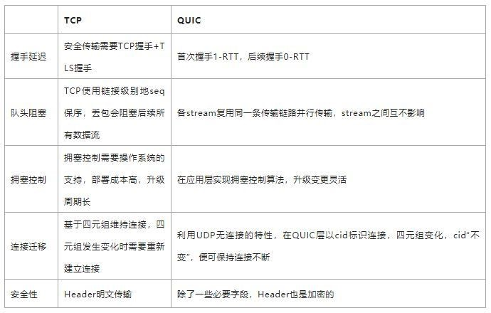
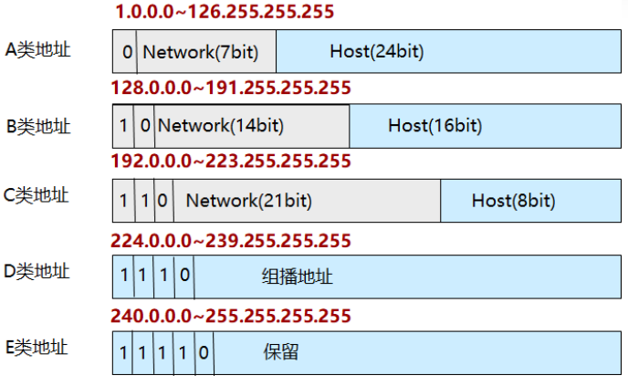
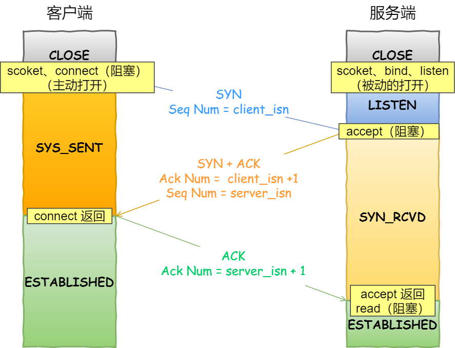

# 计算机网络
## 基础知识
### OSI 的七层模型分别是？各自的功能是什么？主要协议
- 物理层:底层的数据传输，传输的是基本的比特流，常见的物理设备包括中继器、集线器等
- 数据链路层:定义数据的基本格式，如何传输，如何标识，传输的是数据帧，常见的物理设备包括交换机、网桥等，协议包括802.11、802.3、ARP、RARP
- 网络层:定义IP编址，定义路由功能，即不同设备数据的转发，传输的是数据包，常见的物理设备包括三层路由器交换机，常见协议包括RIP、IP、ICMP、IGMP
- 传输层:定义数据传输的基本功能，传输的是数据段，包括TCP、UDP
- 会话层:控制应用程序之间的会话能力，将不同软件的数据分发给不同软件，如session认证、断点续传
- 表示层:数据格式标识，基本的压缩加密功能，图像视频的编解码
- 应用层:各种应用软件，包括FTO、HTTP、DNS、telnet、SMTP

五层模型没有表示层和会话层，四层协议没有物理层

### 为何需要把 TCP/IP 协议栈分成 5 层（或7层）？
- 各层之间相互解耦，灵活性好
- 结构上可以分隔开
- 易于实现和维护

### 数据是怎么发送出去的？
- 调用send函数之后，主要调用的是sendto系统调用，通过fd找到socket，然后构造一个msghdr对象，把用户传入的数据装进去。
- 接下来调用sock_sendmsg函数进入到协议栈，最后就是调用了socket的ops里面的sendmsg函数，实际上就是调用了inet_sendmsg
- 接下来内核会找到socket上的具体协议发送函数，对于TCP协议来说，就是tcp_sendmsg
- 内核会申请一个内核态的skb内存并将其加入到socket的写队列中，将用户待发送的数据拷贝进去，但不一定会真正开始发送
- 当满足一定条件的时候，会调用tcp_write_xmit来发送，这一部分在传输层实现了滑动窗口和拥塞控制，接下来就从skb中取出数据并发送了，首先克隆一个新的skb，发送的只是副本，只有收到对应的ACK的时候才被删除。
- 然后修改 skb 中的 TCP header，根据实际情况把 TCP 头设置好。
- 然后调用queue_xmit，进入网络层
- 网络层里主要处理路由项查找、IP 头设置、netfilter 过滤、skb 切分
- 接下来进入到邻居子系统中，对网络层提供一个封装，让网络层不必关心下层的地址信息，让下层来决定发送到哪个 MAC 地址。主要是查找或者创建邻居项，封装MAC头，将skb传递给Linux网络设备子系统
- 在网络设备子系统中，首先选择发送队列，然后获取排队规则，再接下来把skb添加到队列中，不断地从队列中取出 skb 并进行发送
- 再接下来就是网卡驱动发送了。


https://mp.weixin.qq.com/s/n5WbUl19bSFKMHvddg5gAg


### 数据接收的过程
- 当数据帧从网线到达网卡上的时候，第一站是网卡的接收队列。网卡在分配给自己的RingBuffer中寻找可用的内存位置，找到后DMA引擎会把数据DMA到网卡之前关联的内存里，这个时候CPU都是无感的。当DMA操作完成以后，网卡会向CPU发起一个硬中断，通知CPU有数据到达。
- 硬中断修改了一下CPU的poll_list，然后发出个软中断。
- ksoftirqd内核线程收到了软中断，判断根据当前CPU的软中断类型，调用其注册的action方法。
- 然后判断根据当前CPU的软中断类型，调用其注册的action方法
- 接下来把数据帧从RingBuffer上取下来，一个数据帧用一个sk_buff来表示，收完数据之后进行校验，并设置sbk变量的时间戳，vlanid，协议等字段。
- 后续网络协议栈的处理中，会根据协议的类型将其分配到对应的协议栈中进行处理
- 以IP协议层为例，会进行校验，然后根据其传输层协议分派到不同的上层协议中
- 以UDP为例，会根据skb来寻找对应的socket，当找到以后将数据包放到socket的缓存队列里。如果没有找到，则发送一个目标不可达的icmp包。还要判断的是用户是不是正在这个socket上进行系统调用（socket被占用），如果没有，那就可以直接放到socket的接收队列中。如果有，那就通过sk_add_backlog把数据包添加到backlog队列。当用户释放的socket的时候，内核会检查backlog队列，如果有数据再移动到接收队列中。

总结版：
1. 网卡将数据帧DMA到内存的RingBuffer中，然后向CPU发起中断通知
2. CPU响应中断请求，调用网卡启动时注册的中断处理函数
3. 中断处理函数几乎没干啥，就发起了软中断请求
4. 内核线程ksoftirqd线程发现有软中断请求到来，先关闭硬中断
5. ksoftirqd线程开始调用驱动的poll函数收包
6. poll函数将收到的包送到协议栈注册的ip_rcv函数中
7. ip_rcv函数再讲包送到udp_rcv函数中（对于tcp包就送到tcp_rcv）

https://mp.weixin.qq.com/s/GoYDsfy9m0wRoXi_NCfCmg

## 应用层
### 应用层常见协议知道多少？各自的端口号？
|协议 |名称 |默认端口| 底层协议|
|--|--|
|HTTP| 超文本传输协议| 80| TCP|
|HTTPS |超文本传输安全协议 |443 |TCP|
|DNS |域名解析协议| 53 |服务器间TCP客户端查询UDP|
|Telnet| 远程登录服务协议| 23| TCP
|FTP |文件传输协议 |20传输，21连接| TCP
|TFTP| 简单文件传输协议| 21| UDP
|SMTP| 简单邮件传输协议（发送用）| 25| TCP
|POP| 邮局协议（接收用）| 110 |TCP

### 说一下一次完整的HTTP请求过程包括哪些内容？
- 首先需要查询DNS，获取目标网址的IP地址，查询的顺序依次是浏览器自身的DNS缓存、搜索操作系统的DNS缓存、读取本地的Host文件和向本地DNS服务器进行查询通过端口号建立起客户机到服务器之间的TCP连接。对于向本地DNS服务器查询的操作，如果本地DNS服务器没有目标IP地址的缓存，还需要向区域DNS服务器请求查询。
- 浏览器获得域名对应的IP地址以后，浏览器向服务器请求建立链接，发起三次握手；
- 客户机通过套接字向服务器发送包含url的请求
- 服务器通过socket接收到请求之后，在磁盘中寻找请求的数据，并将器封装成HTTP响应报文发送给客户机
- 然后服务器需要根据请求的是持续链接还是非持续连接判断是否需要断开这个TCP连接，如果是非持续的，就要发送断开连接的请求
- 客户端正确接收就断开连接，然后提取并解析HTTP报文内容
- 浏览器解析并渲染视图，若遇到对js文件、css文件及图片等静态资源的引用，则重复上述步骤并向服务器请求这些资源；
- 浏览器根据其请求到的资源、数据渲染页面，最终向用户呈现一个完整的页面。

### HTTP长连接和短连接的区别
短连接就是客户端每次连接只处理一个请求，服务器发出数据之后就请求断开连接，客户端收到响应报文之后就断开连接，如果解析接收到的报文还需要继续请求服务器端的对象，就要重新建立连接，HTTP/1.0默认使用这种方式，但是这种方式会使服务器处理大量的连接请求，并且会增加RTT时间（建立连接需要一个TCP）
长连接就是客户端和服务器建立连接，服务器响应一次之后并不立即请求断开连接，而是等待服务器继续发请求，一段时间没有接收到请求就释放连接

### 浏览器在与服务器建立了一个 TCP 连接后是否会在一个 HTTP 请求完成后断开？什么情况下会断开？
持续连接不会立即断开，而是在一段时间收不到请求之后才断开，HTTP/1.1以上的默认持续连接，HTTP/1.0需要在首部行中设置connection字段为keep-alive进行设置
非持续连接会立即断开，HTTP/1.0默认是这样，HTTP/1.1以后将connection字段设置为close

### 一个TCP连接可以对应几个HTTP请求？
答：对于持续连接，可以对应多个HTTP请求，对于非持续连接，只能对应一个HTTP请求

### HTTP请求和响应报文有哪些主要字段？
- 请求报文：
	- 请求行、首部行和实体主体：
		- 请求行包括方法、URL和版本号
		- 首部行包括首部字段名和值
		- 实体主体一般用于在请求时携带一些客户端请求的数据
- 响应报文：
	- 状态行、首部行和实体主体
		- 状态行包括版本、状态码和短语；

### HTTP请求方法你知道多少？
- GET：请求指定的页面，并返回实体主体，也可以通过扩展URL携带一些信息
- POST：向指定资源提交数据时的请求，例如提交表单或上传文件，数据包含在请求体中。
- HEAD：类似于GET，但是不会返回实体主体，通常用于故障跟踪
- PUT：将对象上传到服务器的指定路径上，通常于上传文件
- DELETE：客户端请求删除服务器上的对象
- CONNECT：HTTP/1.1 协议中预留给能够将连接改为管道方式的代理服务器
- OPTIONS：允许客户端查看服务器性能
- TRACE：回显服务器收到的请求，用于测试或诊断
- PATCH：对PUT的补充，用于对已知资源进行局部更新

### 常见的HTTP状态码有哪些？
- 1xx：信息型状态码：接收的请求正在处理
	- 100 Continue ：表明到目前为止都很正常，客户端可以继续发送请求或者忽略这个响应。
- 2xx：成功状态码：请求正常处理完毕
	- 200 OK
	- 204 No Content ：请求已经成功处理，但是返回的响应报文不包含实体的主体部分。一般在只需要从客户端往服务器发送信息，而不需要返回数据时使用。
	- 206 Partial Content ：表示客户端进行了范围请求，响应报文包含由 Content-Range 指定范围的实体内容。
- 3xx：重定向状态码：需要进行附加操作以完成请求
	- 301 Moved Permanently ：永久性重定向，比如请求了一个http连接，会返回这个报文，然后永久重定向到https连接
	- 302 Found ：临时性重定向
	- 303 See Other ：和 302 有着相同的功能，但是 303 明确要求客户端应该采用 GET 方法获取资源。
	- 304 Not Modified ：如果请求报文首部包含一些条件，例如：If-Match，If-Modified-Since，If-None-Match，If-Range，If-Unmodified-Since，如果不满足条件，则服务器会返回 304 状态码。
	- 307 Temporary Redirect ：临时重定向，与 302 的含义类似，但是 307 要求浏览器不会把重定向请求的 POST 方法改成 GET 方法。
- 4xx：客户端错误状态码：服务器无法处理请求
	- 400 Bad Request ：请求报文中存在语法错误。
	- 401 Unauthorized ：该状态码表示发送的请求需要有认证信息（BASIC 认证、DIGEST 认证）。如果之前已进行过一次请求，则表示用户认证失败。
	- 403 Forbidden ：请求被拒绝。
	- 404 Not Found
- 5xx 服务器错误
	- 500 Internal Server Error ：服务器正在执行请求时发生错误。
	- 502 Bad gateway：表示作为网关或代理的服务器，从上游服务器中接收到的响应是无效的。
	- 503 Service Unavailable ：服务器暂时处于超负载或正在进行停机维护，现在无法处理请求。

### Http协议相关头
- 请求头
	- Accept：浏览器支持的媒体类型, 比如 text/html,application/json,image/webp等
	- Accept-Encoding: 浏览器发给服务器,声明浏览器支持的编码类型，gzip, deflate
	- Accept-Language: 客户端接受的语言格式,比如 zh-CN
	- Connection: keep-alive , 开启HTTP持久连接
	- Host：服务器的域名
	- Origin：告诉服务器请求从哪里发起的，仅包括协议和域名 CORS跨域请求中可以看到response有对应的header，Access-Control-Allow-Origin
	- Referer：告诉服务器请求的原始资源的URL，其用于所有类型的请求，并且包括：协议+域名+查询参数； 很多抢购服务会用这个做限制，必须通过某个入来进来才有效
	- User-Agent: 服务器通过这个请求头判断用户的软件的应用类型、操作系统、软件开发商以及版本号、浏览器内核信息等； 风控系统、反作弊系统、反爬虫系统等基本会采集这类信息做参考
	- Cookie: 表示服务端给客户端传的http请求状态,也是多个key=value形式组合，比如登录后的令牌等
	- Content-Type： HTTP请求提交的内容类型，一般只有post提交时才需要设置，比如文件上传，表单提交等。
- 响应头
	- Allow: 服务器支持哪些请求方法
	- Content-Length: 响应体的字节长度
	- Content-Type: 响应体的MIME类型
	- Content-Encoding: 设置数据使用的编码类型
	- Date: 设置消息发送的日期和时间
	- Expires: 设置响应体的过期时间,一个GMT时间，表示该缓存的有效时间
	- cache-control: Expires的作用一致，都是指明当前资源的有效期, 控制浏览器是否直接从浏览器缓存取数据还是重新发请求到服务器取数据,优先级高于Expires,控制粒度更细，如max-age=240，即4分钟
	- Location：表示客户应当到哪里去获取资源，一般同时设置状态代码为3xx
	- Server: 服务器名称
	- Transfer-Encoding：chunked 表示输出的内容长度不能确定，静态网页一般没，基本出现在动态网页里面
	- Access-Control-Allow-Origin: 定哪些站点可以参与跨站资源共享

### http1.1长连接时，发送一个请求阻塞了，返回什么状态码？
会由于超时而返回一个408 request timeout

### GET 方法参数写法是固定的吗？
答：常见写法是再URL后面加上“？”并用&分割，接收到数据之后通过正则表达式获取头部和信息，提取参数，所以只要收发端约定好就可以，比如自己写的服务器可以解析自己定义的方法参数

### GET 方法的长度限制是怎么回事？
答：协议中不会限制长度，但是URL的限制大多来自于服务器或浏览器。因为处理长URL会消耗很多资源，所以服务器为了防止恶意长URL攻击，会给URL长度加限制

### POST 方法会产生两个 TCP 数据包？你了解吗？
答：POST在传输过程中可能会将header和body分开传输，传输header之后返回100状态码之后再发送body，协议中没有要求必须分开传输，属于浏览器自定义行为

### GET与POST传递数据的最大长度能够达到多少呢？
GET通过URL传递数据，因此限制取决于URL的长度限制
POST的长度限制取决于服务器设置和内存大小

### GET 和 POST 的区别
- GET获取数据，POST修改数据
- GET把请求的数据放在URL上，POST把数据放在HTTP的body里
- GET提交的数据量取决于URL长度的限制，POST提交的数据量取决于服务器设置和内存
- GET是不安全的，因为GET请求发送数据是在URL上，是可见的，可能会泄露私密信息，如密码等； POST是放在请求头部的，是安全的
- GET请求会被浏览器主动缓存，POST不会

本质区别：GET是幂等的，POST是非幂等的（幂等性是指一次和多次请求某一个资源应该具有同样的副作用，返回同样的结果）因此不能用GET增删改数据，否则会有重复操作的风险

### POST 方法比 GET 方法安全？
答：因为数据在地址栏上不可见。但是从传输的角度来说，两者都不安全，要想安全要使用https协议

### 为什么服务器会有缓存这一项功能?如何实现的？
缓存服务器部署在原始服务器和客户端之间，与缓存服务器相连的客户端近期请求过的数据都会被记录在缓存服务器中，当有用户在未失效的时间内请求时，会直接返回这个数据，但是如果缓存服务器中没有，缓存服务器会请求原始服务器获取数据
目的是：
- 减少主服务器的访问次数
- 减少用户的等待时间，因为从缓存服务器到用户的传输速度往往更快
- 具体的实现一般是采用客户端浏览器缓存或者代理服务器

实现方式：
- 强制缓存：只要浏览器判断缓存没有过期，就直接使用本地缓存，而是否决定使用缓存取决于浏览器发出的请求。当浏览器第一次向服务器请求资源时，服务器会在返回资源时，在响应的头部加上一个cache-control字段并设置超时时间大小，或者expire字段设置一个绝对超时时间，两者都有时cache-contro优先级更高，浏览器再次访问相同资源时，会先计算是否超时，如果没有超时，就从缓存中获取数据，否则就向服务器请求数据
- 协商缓存：第一次请求之后返回的响应报文中，会有last-modified字段标识资源的最后修改时间。后续再请求资源时，会先发一个if-modified-since字段询问是否以及更改过了，服务器与资源的最后修改时间对比，如果修改过了就返回最新资源，状态码变为200OK，如果没有修改过就响应304走缓存。或者基于唯一标识符Etag实现的。

### HTTP中有个缓存机制，但如何保证缓存是最新的呢？（缓存过期机制）
答：缓存服务器需要先向源服务器请求确认最后更改时间，如果和上次一样，源服务器就只传输header，不传输body，同时反馈304代码，缓存服务器再把数据传回给用户，还可以指定要求确认缓存（下题）。此外还会有一个指定过期时间
max-age出现在请求报文，则如果缓存资源的生存时间小于这个值，就会被直接返回，否则需要请求
max-age出现在响应报文，表示缓存资源在缓存服务器中生存的时间

### HTTP如何禁用缓存？如何确认缓存？
答：HTTP通过Cache-Control控制缓存
禁用缓存Cache-Control:no-store，不允许对请求或响应的任何一部分进行缓存
强制确认缓存：Cache-Control:no-cache，每次请求前需要先向源服务器请求确认数据是否有效

### HTTP中缓存的私有和共有字段
Cache-Control:private是私有的，一般存储在用户浏览器中
Cache-Control:public是公有的，一般存储在代理服务器（缓存服务器）中

### http版本的对比
- HTTP1.0版本：是一种无状态、无连接的应用层协议。
	- 浏览器和服务器之间建立的是短连接，即服务器处理完客户端的请求后立即断开连接。
	- 服务器不跟踪每个客户端也不记录过去的请求。
- HTTP1.1：
	- 默认长连接节省通信量，只要客户端服务端任意一端没有明确提出断开TCP连接，就一直保持连接，可以发送多次HTTP请求，而不用一个个等待响应。
	- 但仍然属于无状态协议，需要借住cookie技术。
	- 允许流水线传输数据，即发送数据后不用等待返回的ACK即可之间传输下一帧数据。但是没有解决响应的队头阻塞，即如果队头数据处理得很慢，就无法响应后面的数据。
- HTTP2.0：
	- 基于HTTPS，因此安全性有保障；
	- 二进制分帧：采用二进制格式的编码将其封装为头信息帧和数据帧，接收端可以直接解析二进制包文，提高效率；
	- 首部压缩：对于相同或相似的头信息帧，协议会消除重复部分，因此设置了专门的首部压缩设计的HPACK算法，收发两端维护着一张头信息表，所有字段都会存入这个表并生成一个索引号，后续可以只发索引号；
	- 数据流：HTTP/2的数据包不是按顺序发送的，同一个连接里面连续的数据包可能属于不同的回音，因此必须要对数据包标记一个stream ID以区分属于哪个回应。
	- 请求优先级：指定数据流的优先级，优先级高的请求服务器先响应；
	- 多路复用：消除了队头阻塞问题，如果有操作比较费时间，就可以先暂时不返回这个操作的结果，而是返回其他请求的结果，即不必按顺序返回。
	- 流量控制：设置了接收某个数据流的多少字节一些流量控制
	- 服务器推送：就是服务器可以对一个客户端请求发送多个响应。服务器向客户端推送资源无需客户端明确的请求。
- HTTP/3：基于可靠的UDP协议QUIC

### 请你说一下http协议会话结束标志怎么截出来？
看tcp连接是否有断开的四部挥手阶段

### Cookie是什么？
Cookie相当于是一个服务器分配给客户端的唯一标识符，当一个用户第一次访问这个服务器时，服务器会在HTTP响应报文中通过set-cookie给该客户端分配一个cookie，客户端会将cookie和服务器的映射存储在本地，在后续的客户端到服务器的请求报文中就一直携带这个cookie，服务器端也会存储cookie和该客户端的状态信息的映射

### Cookie有什么用途？
- 会话状态管理（如用户登录状态、购物车、游戏分数或其它需要记录的信息）
- 个性化设置（如用户自定义设置、主题等）
- 浏览器行为跟踪（如跟踪分析用户行为等）

### Session是什么？
session是存储在服务器端的对于用户状态信息的记录
是session-id到用户信息的键值对

### Session 的工作原理是什么？
- 用户进行登录时，提交包含用户名和密码的表单，通过http进行传输
- 服务器验证用户名和密码，如果正确就把信息存到数据库中，并且设置session-id
- 这个id号会在发set-cookie时发出去，客户端收到之后会存入浏览器中
- 客户端后续对同一服务器请求时会包含cookie值，服务器收到之后取出id，在数据库中寻找信息

### cookie安全性问题
- 有效期可以设置得短一些
- 对cookie加密
- 尽可能使用https
- session和cookie同时使用
- 设置httponly属性为true，防止js脚本读取cookie信息

### Cookie和Session区别是什么？
- 存储位置不同：cookie存储在用户端的浏览器，session存储在服务端
- kv对的value类型不同：cookie存储的是字符串，session存储的是对象
- 存储数据大小限制不同：cookie的存储限制来自于浏览器，session的存储限制来自于内存
- 生命周期：cookie的生命周期从创建开始一直到事件结束都是有效的，session是从创建开始，一直到生命周期内没有访问，则被销毁

### Session和cookie应该如何去选择（适用场景）？
cookie只能存储ASCII字符串，而session可以存储任何类型的数据，因此，如果需要存储复杂数据，需要使用session
cookie用于客户端，session用于服务器端

### 一个 TCP 连接中 HTTP 请求发送可以一起发送么（比如一起发三个请求，再三个响应一起接收）？
HTTP/1.1的pipelining技术允许多发多收，在 HTTP2 中由于 Multiplexing 特点的存在，多个 HTTP 请求可以在同一个 TCP 连接中并行进行。

### 浏览器对同一 Host 建立 TCP 连接到的数量有没有限制？
有限制，比如chrome浏览器只允许6个TCP连接。当需要进行多路传输时，一般会先尝试使用http2.0，如果不能就用http1.1建立多个连接

### DNS是什么？
DNS是Domain Name System，域名系统，是一个查询域名和IP地址映射的服务器，通过域名解析，可以得到要访问的IP地址。一个IP可以绑定多个域名，但是一个域名只能绑定一个IP

### DNS的工作原理？
当需要解析域名时，一般先会查看本地缓存，即浏览器缓存，系统缓存，路由器缓存。
如果没有就要查DNS服务器了：递归地查询ISP服务器缓存（本地DNS缓存），本地DNS迭代器更像是一个代理，帮助主机请求不同的DNS地址，然后迭代地查询根域名服务器缓存，得到顶级域名服务器地址，然后查询顶级域名服务器缓存，得到权威域名服务器地址，然后查询权威域名服务器缓存。

### 为什么域名解析用UDP协议？而区域传送用TCP协议？
客户端向DNS服务器查询域名，一般返回的内容都不超过512字节，用UDP传输即可。不用经过TCP三次握手，这样DNS服务器负载更低，响应更快。
辅助域名服务器会定时（一般是3小时）向主域名服务器进行查询以便了解数据是否有变动。如有变动，则会执行一次区域传送，进行数据同步。区域传送将使用TCP而不是UDP，因为数据同步传送的数据量比一个请求和应答的数据量要多得多，保证了数据的准确性。 

### DNS负载均衡是什么策略？
一些繁忙的站点会被冗余地分布在多个服务器上，每台服务器对应着不同的IP地址，DNS服务器上对应于每个域名都会存储一个IP地址的集合，DNS返回报文中回答时会旋转这些地址的排放顺序，而客户端更倾向于使用排在前面的地址，因此每个地址都会被均衡地访问

### HTTP的缺点有哪些？
- 使用明文进行通信，可能会被窃听
- 不验证通信方的身份，通信方的身份可能会时伪装的
- 无法证明报文的完整性，可能会被篡改

### HTTPS是什么
HTTPS是在HTTP的基础上增加了一个SSL子层用于加密，从而具有了加密、认证和完整性保护的功能

### HTTPS采用的加密方式有哪些？是对称还是非对称？
HTTPS 采用混合的加密机制，使用非对称密钥加密用于传输对称密钥来保证传输过程的安全性，之后使用对称密钥加密进行通信来保证通信过程的效率。
加密过程：
- 客户端发送协议版本号、一个随机数和客户端支持的加密方法
- 服务器端确认双方使用的加密方法，给出数字证书和服务器生成的随机数
- 客户端确认数字证书有效，就提取证书中的公钥生成一个前主密钥，然后使用公钥加密该前主密钥，并将其发给服务器
- 服务器使用自己的私钥，解析Client发来的前主密钥
- Client和Server根据约定的加密方法，使用前面的三个随机数，生成”对话密钥”（session key），用来
加密接下来的整个对话过程。
- 然后在互相发送所有握手的MAC报文

### https证书的颁发是在哪一个阶段
SSL三次握手的第二次握手时颁发证书

### HTTPS和HTTP的区别
- http传输的数据是未加密的，而https协议是SSL+HTTP协议加密传输且进行身份认证的
- http使用的端口是80号端口，而https是443端口
- http连接相对简单，只需要TCP的三次握手即可建立连接，而https连接需要再三次握手之后再进行ssl/tls握手
- https需要向CA申请数字证书来确保服务器身份是可信的。

### HTTPS解决了HTTP的哪些风险？
- 窃听风险，黑客即使获取到发送的数据也无法读取数据，采用对称加密和非对称加密结合的混合加密算法。
- 篡改风险，黑客无法修改https的内容，篡改了就无法正常显示，摘要算法可以为数据生成独一无二的指纹，如果接收端再用摘要算法得到的指纹和收到的指纹相同，就说明没有被修改过
- 冒充风险，因为需要CA认证，所以无法冒充服务器。

### 在浏览器中输入url地址后显示主页的过程?
- 先查看缓存，如果缓存中有且没有过期，就直接在缓存中读取
- 根据域名进行DNS解析
- 得到IP地址向服务器的80端口号后建立TCP连接
- 服务器通过socket接收到请求之后，在磁盘中寻找请求的数据，并将器封装成HTTP响应报文发送给客户机
- 然后服务器需要根据请求的是持续链接还是非持续连接判断是否需要断开这个TCP连接，如果是非持续的，就要发送断开连接的请求
- 客户端正确接收就断开连接，然后提取并解析HTTP报文内容


### 与服务器建立的连接是否会在一个HTTP请求后断开？什么情况下断开？
HTTP/1.0版本会在一个HTTP请求后断开，后续的版本中HTTP头部的connection字段默认支持不断开连接，只有当connection字段设置为close之后才会断开

### 一个 TCP 连接中 HTTP 请求发送可以一起发送么？
HTTP/2版本是可以一起发送的，因为HTTP2中引入了多路复用的机制，不同的业务之间是不同的stream，所以可以一起发送

## 运输层
### UDP是什么
UDP是面向无连接的，不提供可靠数据传输的协议

### UDP的特点有哪些（附赠TCP的特点）？
- UDP是面向无连接的，每次发送数据时都直接发送；TCP是面向连接的，发送数据前需要建立连接才能发送，发送完毕之后要断开连接
- UDP不提供可靠通信，主机不需要维持复杂的连接状态；TCP提供可靠通信，数据无差错不丢失不重复且按序到达
- UDP是面向报文的，即直接将应用层的数据打包成报文段，交给网络层；TCP是面向字节流的，即把应用程序交付的数据全部看作是无结构的字节流，每次传输都截取字节流打包，由于TCP传输要求按序到达，因此会在接收端重新解包并组合成接受的字节流，由应用层解析
- UDP支持一对一、一对多、多对多的交互通信；而TCP只能一对一
- UDP首部开销小，只有8字节；而TCP的首部有20个字节
- UDP没有拥塞控制，因此网络出现拥塞不会使源主机的发送速率降低；TCP有拥塞控制
- UDP没有流量控制，因此接收端容易出现缓存溢出，而TCP有流量控制机制，避免缓存溢出
- UDP是单向的数据传输，不用返回确认信息；TCP是双向的，必须要返回确认信息

### UDP对应的应用层协议
- SNMP网络管理
- NFS远程文件服务器
- DNS域名解析
- 流式多媒体、互联网电话等
- TFTP简单文件传输协议

### 在进行UDP编程的时候，一次发送多少bytes好?
答：以太网的MTU要求在46~1500之间，即IP数据包最长1500字节，而IP数据包的包头有20字节，因此UDP最多应该有1480字节，UDP数据报又有8字节的包头，因此最多应该发送1472字节，但是超过这个字节也能发送，会在网络层拆包，但是由于UDP不保证可靠通信，所以拆分的包在接收端未必能正确组包。而由于不同的路由器支持的MTU值可能不同，最低为576字节，因此如有必要，还有进一步限制UDP长度为548字节。

### 为什么以太网无法接收大于1500字节的数据包?
在10Mbps的网络中，由于会发生碰撞，所以在CSMA/CA协议中，需要让其中的一方在还在发送数据时检测到冲突，否则这个包就会丢失，而如果包太短而两个发生冲突的计算机又相隔很远，则会在传输完成之后检测到碰撞，因此需要设置最低为46.
而如果一个包太大，就会使其他用户暂时无法发送数据，会造成其他用户的阻塞，而且在网络质量较差的环境中，网络包过大还会导致传输错误丢包的可能性大大提高 
https://www.zhihu.com/question/21524257/answer/2485569339

### TCP是什么？
答：TCP是一种面向字节流的、面向连接的、可以提供可靠通信的传输层协议，可以为网络中的主机提供无损坏、无间隔、非冗余的按序到达的数据包。
- 面向连接的：TCP在传输之前需要建立起收发双方的一对一连接，而不能像UDP一样组播或多播
- 可靠的：TCP可以保证一个报文一定能够到达接收端
- 字节流：所有放入缓存中的数据都会被当作字节流进行读取，消息是没有边界的。

### TCP对应的应用层协议
答：FTP、Telnet、SMTP、HTTP等

### MTU和MSS分别是什么？
答：MTU是数据链路层定义的最大传输单元，要求所有的数据链路层的数据部分（不包括首部）最大长度为MTU，也就是说，MTU是IP报文的长度。MSS值是除去 IP 和 TCP 头部之后，一个网络包所能容纳的 TCP 数据的最大长度，MSS的值受限于本地发送主机的MTU值。因为如果MSS值过大，就会在IP层对数据包进行分片，但是如果分片中的其中一片丢失，则整个数据包就要重传，这样效率会降低，因此MSS值要受限于MTU值

### TCP头部报文字段介绍几个？各自的功能？
- 源端口号和目的端口号：建立起源到目的端的连接，用于多路复用/分解来自或送到上层应用的数据
- 序号和确认号：用于向对方反馈收到的数据的序号和下一个期望收到的序号，保证了数据的可靠传输和有序传输
- 接收窗口：接收方可以接收的最大字节数量
- 标志位：SYN（连接请求）FIN（释放连接请求）ACK（反馈确认，确认序号有效）RST（强制断开连接）URG（紧急指针有效）PSH（接收方应该尽快将这个报文交给应用层）
- 校验和：使用CRC循环冗余校验对整个报文进行校验
- 紧急数据指针：指向紧急数据，存在紧急数据时，必须要通知接收端的上层实体。
- 选项

### 序号的作用
- 接收方可以去除重复数据
- 接收方可以按序接收
- 发送方可以通过ACK帧知道需要重传哪些数据

### 列举你所知道的tcp选项，并说明其作用


### 什么是TCP的自连接，如何解决
同一台机器上的客户端和服务端（端口：50000）建立了一个长连接，服务端的进程挂掉了，端口50000释放，客户端去connect这个服务端的目的端口的时候正好选择了50000作为源端口，此时该端口没人用（因为服务端挂断了），使用是合法的，于是自连接形成了。
解决办法：
- 让服务监听的端口与客户端随机分配的端口不可能相同即可
因为客户端随机分配的范围由 /proc/sys/net/ipv4/ip_local_port_range 文件决定，，所以只要让服务监听的端口小于 客户端分配的端口范围，就不会出现客户端与服务端口相同的情况。

- 出现自连接的时候，主动关掉连接

### TCP带外数据
- 所谓带外数据就是指优先级比较高的，应该要优先送到应用层的数据
- 发送端会通过MSG_OOB选项指出带外数据的报文
- 接收端收到紧急报文之后会产生一个SIGURG信号，在信号处理函数中使用带有OOB选项的recv函数来接收


### 两台机器A-B进行TCP通讯
#### 进程崩溃会怎么样？
进程崩溃时，崩溃的那一方会优雅地关闭socket来结束TCP连接。
- 如果本端TCP正在发送数据，对端进程崩溃，则对端会发送一个FIN来关闭连接，如果本端再发送一个数据，对方会回复一个RST来强制关闭连接。
- 本端正在主动接收数据，对端TCP会发送FIN作为一个提前结束的标志

#### 进程死锁会怎么样？
- 如果是发送端进程死锁，会一直没有数据发出，接收端一直等待数据，如果等待2h之后仍然没有数据到达，就会发送keep-alive探测报文，由于对方已经死锁，所以不会返回任何数据，这样接收端就发送RST终止连接。
- 如果接收端死锁，那么会导致接收端缓存满，发送端关闭窗口，然后启动持续计时器，计时器超时就会发送一个窗口探测报文，由于对方死锁，窗口肯定还是0，三次探测之后就会发送RST终止连接。


### TCP 能否发送0字节的数据包
可以，MTU最短字节，因此只要IP头部和TCP/UDP头部加起来达到这个值就可以。
当接收端缓冲区满之后，会发送一个零窗口通知，要求发端不能再发送数据了，为了避免因为接收端发送的新的ACK被阻塞或丢包而导致一直无法发送数据，发送端就需要每间隔一段时间就发送一个探测窗口来询问对方是否有空闲。

### tcp/ip数据包在互联网传输过程中，有哪些头会保持不变
应用层和运输层的头会保持不变，而对于网络层的数据会在每经过一个路由器的时候改变一次，其中TTL和首部校验和一定会变，如果路由器支持的报文长度比较小导致分片，那么标识标志片偏移也会变。

### 使用Linuxepoll模型，水平触发模式；当socket可写时，会不停的触发socket可写的事件，如何处理？
使用ET模式也就是边沿触发模式，这样每次只有状态发生变化时才会触发。

### Udp的接收缓冲区和发送缓冲区和tcp的区别
udp没有发送缓冲区，需要将自身发送数据先转给Linux内核，然后再由内核发送出去

### 什么是超时重传？
一端发送数据后会启动一个超时计时器，超时时间RTO应该略大于往返时间RTT，每当遇到一次超时重传的时候，都会将下一次超时时间间隔设为先前值的两倍。两次超时，就说明网络环境差，不宜频繁反复发送。

### 为何快速重传是选择3次ACK
大体上，ACK返回确认帧可以分为两种情况，第一种是因为超时没有接收到上一次请求的数据帧而发送，第二种是因为收到了失序的来自发送端的数据帧，每收到一个失序且没有填补上空缺的帧就要发送一个ACK
当发送端收到1~2个相同的ACK帧时，这时可能只是因为失序，还没有到接收端，但是如果收到了三个ACK帧就意味着很有可能是丢失了
这时即使超时计数器没有溢出，发送端也应该重传这个数据帧，因此叫做快速重传

### 什么是SACK和D-SACK
由于丢包引起的快速重传ACK只解决了一个问题，即什么时候重传，但是并没有解决应该传输哪些报文的问题，由于接收端没有反馈已收到的其余信息，只反馈了一个丢包信息，因此发送端不知道应该只传输丢掉的包还是丢掉的包和之后的包。
SACK可以把接收到的数据的序号返回给发送方，让发送端知道哪些数据已经被成功接收了。
D-SACK也是一种SACK包，区别在于普通的SACK包中请求的序列号不包含在SACK中，但是D-SACK包中的ACK包含着SACK中，这让发送端知道是发出去的包丢了，还是接收方回应的 ACK 包丢了，也可以知道是否被网络延迟了。

### 流量控制原理
由于发送端发送数据太快或接收端忙于其他事情，而导致接收端的缓存可能会溢出，因此需要进行流量控制，要求发送端减少流量的传输
TCP让发送方维护一个接收窗口来控制流量，这个接收窗口用于指示接收端还有多少空间可以用于接收数据
接收端在每次返回ACK帧中也带有剩余缓存大小，即填写接收窗口字段，更新发送端的接收窗口

### TCP 利用滑动窗口实现流量控制的机制？
- 在发送端有一个接收窗口，表示的是已发送但未被接收的和还可以继续发送的数据的总和
- 接收端会在每次的ACK帧中返回一个窗口大小，这个是接收端缓存还能接收的数据的大小
- 发送端收到这个ACK帧之后获取到两条信息，即确认序列号，这个表示接收端已经正确接受了的序号，会导致窗口左边沿右移，即窗口合拢；第二条信息就是接收端还能容纳的数据的大小，即发送端提供的缓存的大小，这两条信息会联合确定右边沿的位置

### 窗口关闭、窗口关闭的风险以及解决方案
- 当接收缓存没有空间可以接收数据时，会发送一个窗口值为0的报文，这时就关闭了窗口，发送端不能再发送数据了；
- 窗口关闭后，如果返回的ACK报文丢失，就会导致发送端一直等待ACK，接收端一直等待发送端再发新的数据，导致死锁；
- 为了解决这个问题，TCP 为每个连接设有一个持续定时器，只要 TCP 连接一方收到对方的零窗口通知，就启动持续计时器。如果持续计时器超时，就会发送窗口探测 ( Window probe ) 报文，而对方在确认这个探测报文时，给出自己现在的接收窗口大小。如果三次之后还是关闭状态，则发送RST报文终止连接。

### 糊涂窗口综合症及解决办法
当接收端太忙，就会来不及取走接收缓冲中的数据，发送方的发送窗口越来越小。到最后，如果接收方腾出几个字节并告诉发送方现在有几个字节的窗口，而发送方会义无反顾地发送这几个字节，导致了巨大的开销，这就是糊涂窗口综合症。
接受方窗口大小小于 MSS 与 1/2 缓存大小中的最小值时，就会向发送方通告窗口为 0，也就阻止了发送方再发数据过来。
发送方会采用nagle算法，要等到窗口大小 >= MSS 或是 数据大小 >= MSS或者收到之前发送数据的 ack 回包

### 什么是Nagle算法？
Nagle算法是为了防止网络中小TCP报文段数量过多导致的阻塞，该算法要求TCP连接双方再任意时刻最多只能发送一个未被确认的报文段，在该确认到达之前不能发送任何数据，同时，收集本端产生的微小数据，等到下一次发送时，一起将其发出。因此，确认到达得越快，数据发送得越快。但是会带来粘包的问题。

### 什么是TCP粘包/拆包？发生的原因？
一个大的完整的业务可能会被拆分成不同段发送，称为拆包
可能会把多个小包封装成一个大的数据包发送，称为粘包
原因：
- 应用层要发送的数据长度大于缓冲区的大小，因此会发生拆包，多出缓冲区的数据无法被发送
- 发送数据的长度超过MSS长度，会发生拆包
- 发送的数据小于TCP发送缓冲区的大小，会把缓冲区中所有的数据一起读出来并发送出去，会发生粘包
- 接收数据端的应用层没有及时读取接收缓冲区中的数据，将发生粘包

解决办法：
- 在包尾部增加特殊符号进行分割
- 应用层发送数据时定长发送或增加包头及长度字段等

### 发送方偶尔发送数据时使用仅发送NAK的反馈是否会比仅发送ACK的更好？数据量大的时候呢？（P190 P14）
偶尔发送数据，NAK不如ACK，由于此时接收方判断丢失是依据数据包的上下文，也就是说，当丢失的包的下一个包被接收时，才会发现丢包，因此可能很长时间才发现丢包。
大量数据，使用NAK更好，能够减少数据流量，但是更新接收窗口可能不及时

### 为什么TCP要 引入序号机制？
- 保证接收端数据有序接收；
- 可以根据序号判断是否以前接收过该数据，用于去除重复；
- 判断数据的合法性，比如客户端收到了一个服务器端的过期的响应，就要丢弃这个响应报文；
- 序号机制结合 ACK 可以完成数据重传。

### 三次握手相关内容
- 客户端向服务器发起连接请求，在请求报文中，SYN被置为1，还会选择一个初始序号J，然后客户端从closed转为syn_send状态。
- 服务器接收到请求报文后，分配此次连接的缓存和变量，并且将SYN比特位置为1，确认序号设置为接收到的初始序号+1（J+1），并且随机选择一个自己的初始序号K，为服务端分配变量和缓存此时服务器端从closed状态转为SYN_RECV状态。
- 客户端收到服务器的响应后，分配缓存和变量，SYN设置为0，返回序号和确认号，分配变量和缓存，这时客户端转为ESTABLISHED状态。服务器收到响应报文之后也转为ESTABLISHED。

### 第三次握手中，如果客户端的ACK未送达服务器，会怎样？
- Server端：由于Server没有收到ACK确认，因此会每隔 3秒 重发之前的SYN+ACK（默认重发五次，之后自动关闭连接进入CLOSED状态），Client收到后会重新传ACK给Server。
- Client端，会出现两种情况：
	- 在Server进行超时重发的过程中，如果Client向服务器发送数据，数据头部的ACK是为1的，所以服务器收到数据之后会读取 ACK number，进入 establish 状态
	- 在Server进入CLOSED状态之后，如果Client向服务器发送数据，服务器会以RST包应答。

### 为什么需要三次握手，两次不行吗？ 
三次握手出于三点原因：
- 防止旧的重复连接初始化造成混乱：如果客户端发送连接请求因为延迟很大而在一定时间内没有到达接收端，超时之后就会再发一次请求，从而建立连接，但是这时第一次发送的连接请求到达服务器，就会建立一个无效连接，浪费服务器端的资源。而如果是三次握手，就会回复一个RST，终止连接。
- 可靠地建立连接：如果仅握手两次，当第二次握手的SYN+ACK丢失，但是服务器已经进入了ESTABLISHED状态，但是客户端还没有建立连接，也会浪费服务端资源；或者第一次握手被阻塞，也会由于超时重传再重新建立一个连接
- 同步双方初始序列号，两次握手只保证了一方的初始序列号能被对方成功接收，没办法保证双方的初始序列号都能被确认接收。

### 为什么要随机选择初始序号？
- 为了防止历史报文被下一个相同四元组的连接接收：
假设序列号都从0开始编号，在建立连接之后，如果一个数据报文因为阻塞而没有到达接收端，恰好接收端发送了一个RST信号要求重新建立连接，则再从序列号为0开始编号建立连接，建立好连接后，刚刚阻塞在链路中的数据到达接收端，这时接收端就会误以为是新的连接的数据。
- 为了安全性，防止黑客伪造的相同序列号的 TCP 报文被对方接收；

### 初始序列号 ISN 是如何随机产生的？
起始 ISN 是基于时钟的，每 4 微秒 + 1，转一圈要 4.55 个小时。
此外，还要再加上一个根据源 IP、目的 IP、源端口、目的端口通过哈希函数生成一个随机数值，通常选用 MD5 算法。

### 三次握手过程中可以携带数据吗？
前两次握手的过程中都没有准备好缓存和变量，因此不能携带数据，第三次可以携带数据。假如第一次握手可以携带数据的话，如果有人要恶意攻击服务器，那他每次都在第一次握手中的 SYN 报文中放入大量的数据。因为攻击者根本就不理服务器的接收、发送能力是否正常，然后疯狂地重复发 SYN 报文的话，这会让服务器花费很多时间、内存空间来接收这些报文。

### 第一次握手丢失了，会发生什么？
发送端迟迟收不到SYN-ACK信号，就会启动超时重传机制，1s收不到信号之后就重传，然后等待2s、4s、8s、16s，总共重传5次，最后等待32s之后如果还没有就不再等待。

### 第二次握手丢失了，会发生什么？
由于第二次握手中包含第一次握手的ACK信号，所以客户端收不到反馈，会触发客户端的超时重传机制，客户端重传SYN数据包；同时，由于这次握手中还包含服务端的SYN数据包，而发送过程中丢失会导致服务端收不到ACK，因此也会触发服务端的超时重传机制。

### 第三次握手丢失了，会发生什么？
服务端收不到ACK，就重传SYN-ACK信号

### 如果已经建立了连接，但客户端出现了故障怎么办？
服务器每收到一次客户端的请求后都会重新复位一个计时器，时间通常是设置为2小时，若两小时还没有收到客户端的任何数据，服务器就会发送一个探测报文段，以后每隔75秒钟发送一次。若一连发送10个探测报文仍然没反应，服务器就认为客户端出了故障，接着就关闭连接。

### 四次挥手相关内容
- 第一次挥手：客户端向服务器发起释放连接的请求，即发送一个FIN报文，表明客户端已经没有数据要发送，等待服务端的确认，这时客户端已经从ESTABLISHED转为了FIN_WAIT_1
- 第二次挥手：服务端收到FIN报文后，发送ACK报文确认，此时服务端处于CLOSE_WAIT状态，这时的TCP处于半关闭状态，客户端收到服务端的确认之后，就释放了从客户端到服务器的连接，这时客户端进入FIN_WAIT2状态
- 第三次挥手：服务端也想断开连接，发送一个FIN报文，指定一个序列号，这时服务端处于LAST_ACK状态，等待客户端确认
- 第四次挥手：客户端接收到报文，返回一个ACK帧表示同意断开连接，然后进入TIME_WAIT状态，等待2MSL之后，进入CLOSE状态

### 挥手为什么需要四次？
任何一方都可以在传输数据结束之后就发送请求释放连接，对方确认之后才正式释放连接，并进入半关闭状态，但是此时对方可能仍然有数据需要发送，因此需要等待对方发送完数据，对方才能发送释放连接的请求，确认请求之后才彻底关闭TCP连接

### 挥手过程中报文丢失会发生什么？
- 第一次挥手报文丢失会使客户端重传
- 第二次挥手丢失也会导致客户端重传，因为没有对ACK信号的反馈，而只有客户端由于ACK帧超时才会重传
- 第三次挥手丢失会导致服务端超时重传，但是此时如果客户端调用了close函数发送的FIN数据包，则处于FIN_WAIT2的时间太长，就会主动结束连接，但是如果调用的是shutdown函数，且关闭的是写缓存则会一直等待到FIN数据包
- 第四次挥手丢失会导致服务端超时重传FIN。

### 服务端出现长时间的close_wait状态可能会是什么原因？
Close_wait状态就是服务端在向客户端发送剩余的数据，发送完数据之后，服务端会调用close来关闭连接，即发送FIN报文，但是出现长时间的close_wait状态可能是服务端的代码中忘记调用close了，或者是fork之后父进程没有关闭这个socket，这种情况下要看客户端怎么处理，如果客户端调用close，会等待一段时间后关闭连接，2小时后服务端通过keepalive报文探测，会收到一个RST报文，然后才能关闭；但是如果调用shutdown关闭则会一直等待FIN，当收到keepalive报文时，应该也是会收到RST的。

### 四次挥手释放连接时，等待2MSL的意义?
- 可靠地实现TCP全双工连接的终止：
因为客户端返回的ACK帧可能会丢失，如果丢失了，服务端会超时重传，否则无法正常关闭，因此需要等待2MSL之后才能彻底释放连接
MSL是最长报文段寿命，一旦发送的ACK丢失，服务端等待1MSL没有等到，重发需要1MSL，如果客户端再次收到服务端的请求，就重启2MSL计时器
- 允许老的重复分节在网络中消逝：
如果关闭连接之后立即由新的连接复用了这个socket四元组，而正好这个时候网络中还有上次连接中的数据没有到达，那么就会误以为是这个新的连接的数据。

所以，用户关闭连接之后如果立即重新建立连接，则不允许这个插口对重新使用

### TIME_WAIT 过多有什么危害？
- 内存资源占用：每建立一堆连接就会为服务端分配一段缓存和变量，只有close之后才会被释放。
- 对端口资源的占用，一个 TCP 连接至少消耗发起连接方的一个本地端口，而总共只有65535个端口，如果耗尽就会无法建立新的连接；

### 如何优化TIME_WAIT
- 打开 net.ipv4.tcp_tw_reuse 和 net.ipv4.tcp_timestamps 选项；
- net.ipv4.tcp_max_tw_buckets
- 程序中使用 SO_LINGER ，应用强制使用 RST 关闭。

https://mp.weixin.qq.com/s/85eVDBP03Tf8xVtC46mC1Q
### 常见TCP的连接状态有哪些？
- CLOSED状态：初始状态
- LISTEN：服务器处于监听状态
- SYN_SEND：客户端发送一个SYN连接请求
- SYN_RECV：服务器收到SYN连接请求并允许建立连接，发送ACK帧之后
- ESTABLISH：客户端发送ACK帧并建立起连接
- FIN_WAIT_1：客户端发送FIN帧请求释放连接
- CLOSE_WAIT：服务器接收到FIN请求并发送ACK信号
- FIN_WAIT_2：客户端收到ACK信号之后等待服务器端发送FIN信号释放连接
- LAST_ACK：服务器发送FIN请求，等待客户端返回ACK
- TIME_WAIT：客户端发送ACK信号，等待2MSL后回到CLOSED状态

### 什么是半连接队列？
答：当服务器收到一个SYN请求之后，就会处于SYN_RECV状态，但是双方还没有建立起完全的连接，服务器会把这种状态下的请求放到一个队列中，这个队列就是半连接队列，收到ACK之后才会移入accept队列

### SYN攻击是什么？
- 正常来说，在服务端会有一个SYN半连接队列存放SYN_RECV状态的连接，这个队列中的连接会反馈给客户端一个SYN-ACK数据包，收到ACK就把这个连接移入accept队列中，客户端再调用accept系统调用来获取这个连接。
- 但是SYN攻击中，客户端大量发送SYN数据包给服务器，但是在并不发送ACK给服务器完成第三次握手，这样服务器端就会在第二次握手时一直创建缓存，直到服务器的连接资源被耗尽，占满服务端的半连接队列，使得服务器不能为正常用户服务。

为了避免SYN攻击，有两种方法：
- SYN cookie技术：当SYN 队列满之后，后续服务器收到 SYN 包，不进入SYN 队列，而是根据源和目的IP地址和端口号通过散列函数生成一个cookie作为初始TCP序列号，如果ACK返回的是一个合法的cookie，则直接建立一个完整的连接，否则也不会由于分配资源而产生危害
-修改内核参数 
	- 缩短超时时间
	- 修改SYN-RCVD状态的连接个数
	- 超出处理能力时，对新的 SYN 直接回报 RST，丢弃连接

### ISN(Initial Sequence Number)是固定的吗？
答：不是固定的，当一端需要建立连接而发送连接请求时，选择的ISN会随着时间而变化，每个连接都有不同的ISN，这是为了防止在网络中被延迟的分组在后续被传输时，接收到两个相同的ISN，会导致某个连接的一方对其做出错误的解释。另外还可以防止攻击者猜出下一个ISN序号


### 可以解释一下RTO，RTT和超时重传分别是什么吗？
- RTT：数据从发送出去一直到返回所用的时间，即一个数据报在网络中的往返时间，RTT是指数加权移动平均的结果
- RTO：上一次发送数据之后，长时间没有得到响应，就会重传，中间间隔等待的这段时间就是RTO，也就是重传间隔。一般是RTT的1、2、4、8倍
- 超时重传：发送数据之后，没有得到ACK帧，需要重传，一般有三种情况：
	- 发送数据丢失
	- ACK丢失
	- 接收端拒绝或丢弃数据

### 封包和拆包你听说过吗？它是基于TCP还是UDP的？
- 是基于TCP的，因为TCP是基于字节流的传输，因此每次从发送缓存中取出一定长度的字节进行传输
- 封包是指在发送端取一定字节作为数据报的数据部分，然后再为其添加包头进行封装
- 拆包就是再接收到数据包之后去掉其包头获取数据部分

### 拥塞控制原理听说过吗？
拥塞控制是为了解决发送端发送太多数据占用过多网络资源，从而导致网络中出现数据阻塞和丢包，因此需要进行拥塞控制
- 控制发送端发送速率：设置一个拥塞窗口，每次发送未确认的和待发送的数据之和应该小于拥塞窗口和接收窗口中最小的
- 感知阻塞：超时未收到ACK帧或收到冗余ACK
- 如何改变发送速率：如果拥塞就减小拥塞窗口从而降低速率；正常的确认到达意味着可以增大拥塞窗口

### TCP四大拥塞控制算法总结
- 慢启动：最一开始将拥塞窗口设置为1MSS，然后每收到一个ACK就增加一个MSS，这样就相当于一个拥塞窗口的数据传输成功后就将窗口翻倍，指数增加。**一旦出现超时，就立即置为1并且设置一个阈值为发生拥塞时拥塞窗口大小的一半**，如果出现三个冗余的ACK就快重传。
- 拥塞避免：当后续以指数增加到阈值之后，就线性增长，每收到拥塞窗口数量的ACK之后就增加1个，如果超时，就更新阈值超时时阈值的一半并且窗口从1开始增长；如果是收到了冗余ACK就阈值设置为阻塞时窗口，然后窗口减半再继续
- 快重传：收到三个重复的ACK之后，即使没有超时也要重传
- 快恢复：当出现冗余ACK之后，阈值减半，但是窗口是阈值+3，因为收到了三个ACK帧

**总结：**首先是慢启动，窗口从1MSS开始，指数增长，一旦出现了超时重传就将当前窗口置为1，并且将门限值设置为发生阻塞时窗口大小的一半。一旦窗口大小超过了门限值，就变为拥塞避免阶段，这时的窗口大小呈线性增加，同样，出现超时重传就转为慢启动，重新设置窗口大小和门限值。无论是慢启动还是拥塞避免阶段，只要发生三次冗余包就会启动快重传，然后进入快恢复阶段，在这个阶段中，收到一个冗余ACK就将窗口+1，收到新的ACK会转为拥塞避免并且将窗口大小设置为门限值。超时重传则进入慢启动

### TCP 协议如何保证可靠传输？
- 首部校验：确保数据报正确
- ACK确认重传机制：确保不丢包，丢包会重传
- 流量控制：避免接收端缓存溢出导致数据丢失
- 拥塞控制：发送端控制发送速率减少链路中出现拥塞，防止丢包
- 序号确认：保证数据有序到达

### 如何区分流量控制和拥塞控制？
- 流量控制属于通信双方协商，而拥塞控制是基于整个链路情况做出的
- 流量控制的窗口是通过通信双方协商的数据确定的，而拥塞窗口是试探之后自适应调整的
- 流量控制是为了防止接收端缓存溢出而设置的，拥塞窗口是为了减小网络中的负载而使用的。

### 确定一个TCP连接的四元组
源IP，源端口，目的IP，目的端口


### 一台主机最多可以建立多少个TCP连接？
取决于主机的设置，建立的TCP连接的数量取决于：系统可以打开的最多的文件描述符限制，和内存限制（每建立一个TCP连接都会分配一定的内存，而这个分配的内存大小也是可以自己调整的）

### 为什么 UDP 头部没有首部长度字段，而 TCP 头部有首部长度字段呢？
原因是 TCP 有可变长的「选项」字段，而 UDP 头部长度则是不会变化的，无需多一个字段去记录 UDP 的首部长度。

### 如何在 Linux 系统中查看 TCP 状态？
通过 netstat -napt，其中t表示查看tcp，a表示查看所有监听和非监听状态的TCP连接，p表示列出PID和程序名字，n表示禁止域名解析

### TCP通讯，服务端的程序挂掉了，客户端会怎么样？
- 如果程序崩溃，服务端会发送FIN报文断开连接。
- 如果重启了，再发包，服务器会给客户端发RST包让客户端关闭连接。
- 如果是因为断电或网线被拔，则仍然通过keepalive判断。

### TCP有什么缺陷？
- 建立连接有延迟：需要经过运输层的TCP三次握手和SSL/TLS层的四次握手才能建立连接。三次握手操作可以通过TCP快速打开特性来解决：在第一次建立连接时，服务端会在第二次握手时产生一个cookie发给客户端，其他操作不变；而在第二次建立连接时，客户端在建立连接时直接把SYN、cookie和HTTP请求一起发给服务端，提前跳过三次握手，服务端可以从cookie获取TCP连接相关的信息。
- 队头阻塞问题：只有前面的报文被完整接受了，才能处理这个这个报文和后续的报文。
- 网络迁移需要重新建立TCP连接：比如手机从4G切换到WIFI时，IP地址变化了，就必须要断开连接，然后重新建立TCP连接，还要经历慢启动过程

### 怎样设计一个可靠的UDP协议？
- 可以在UDP的上层还要加上一层协议来保证数据的可靠性，而且UDP无连接的特性就使得这种协议避免了使用HTTP/2时的TCP的队头阻塞：当其中一个stream被阻塞时，就会导致所有的stream被阻塞，而基于UDP的协议可以避免这种阻塞。
- ACK确认重传机制：确保不丢包，丢包会重传
- 序号确认：保证数据有序到达，但是这里的编号和TCP不一样，这个编号字段是一个单调递增的数，也就是说即使重传，也不会重复这个数，这一就避免了超时重传时引起的歧义，返回ACK时不知道是第一次发的还是重传的ACK，这样就使得采样RTT的值变得不准确了，进一步影响RTO的值。但是这样也就意味着不能用这个编号作为数据的偏移地址，而应该在这个数据包里面再封装一层，这里面需要包含属于哪个连接stream的（因为可以基于HTTP/2，所以引入了流的概念），以及该数据在stream中的偏移。这也使得QUIC支持乱序确认，
- 流量控制：不同的stream维护各自不同的滑动窗口，接收方告诉发送方，它的接收窗口有多大，当接收到并且确认的数据占最大接收窗口的一半时，就将最大接收窗口向右滑动；对于发送端的发送窗口来说，左边沿窗口收缩到已确认的偏移量，收缩到一定的阈值时，再向发送方请求增长的最大绝对字节偏移量，协商完毕后右边沿右移。即使有一个stream阻塞也不会引发所有数据的阻塞。连接的流量控制的接收窗口就是各个stream接收窗口大小之和
- 拥塞控制：可以在应用层根据应用的特性实现各种不同的拥塞控制算法，包括TCP的控制算法

https://zhuanlan.zhihu.com/p/495586658
https://zhuanlan.zhihu.com/p/524824554
https://zhuanlan.zhihu.com/p/470122778

### 简述QUIC协议 
http://www.52im.net/thread-1309-1-1.html
在UDP的上层还要加上一层协议以保证数据的可靠性。
- 优化建立连接过程：TCP和TLS是分层的，分别属于运输层和表示层，所以无法一起完成全部的握手过程。所以在这里由于UDP是一个面向无连接的，所以在运输层这一层面不需要进行握手连接，只需要在应用层进行连接即可。采用的也是三次握手，但是这个三次握手中的前两次就是两端互相交换连接ID，同时完成ECDA的密钥交换，在最后一次握手时直接传输数据即可。
- 包头部字段中增加一个编号字段，而这个编号字段是一个单调递增的数，也就是说即使重传，也不会重复这个数，这一就避免了超时重传时引起的歧义，返回ACK时不知道是第一次发的还是重传的ACK，这样就使得采样RTT的值变得不准确了，进一步影响RTO的值。这也使得QUIC支持乱序确认，
- 解决队头阻塞问题：通过HTTP/2的stream概念实现并发传输，每个stream都有一个单独的滑动窗口，使得一个连接上的stream之间没有依赖关系，都是相互独立的，即使丢包也会只会阻塞一个stream
- 流量控制：可以实现基于stream和连接的流量控制。其中基于stream的意味着对于每一个stream都有独立的滑动窗口
- 迁移连接：通过连接 ID来标记通信的两个端点，客户端和服务器可以各自选择一组 ID 来标记自己，因此即使移动设备的网络变化后，导致 IP 地址变化了，只要仍保有上下文信息（比如连接 ID、TLS 密钥等），就可以“无缝”地复用原连接


### linux网络包的收发是怎么做的？
首先，网卡收到网络数据之后，网卡驱动会在自己的缓冲区中找到一个可以存放数据的地址，把收到的数据通过DMA放入这块内存中，然后触发硬中断，中断处理函数发出软中断请求，然后尽快释放CPU。ksoftirqd线程发现有软中断请求到来，先关闭硬中断。然后线程开始调用驱动的poll函数收包，poll函数将收到的包送到协议栈注册的ip_rcv函数中，ip_rcv函数再将包送到udp_rcv函数中（对于tcp包就送到tcp_rcv），接下来通过recvfrom函数返回到用户态，最后再将其写入到磁盘上。

### 端口有效范围是多少到多少？是否可以修改？如果想要用的端口超过这个限制怎么办？
0-1023是知名端口号，1024-65535是动态端口号，可以修改，可以通过修改MaxUserPort进行配置

### UDP中一个包的大小最大能多大
IP数据包最长1500字节，而IP数据包的包头有20字节，因此UDP最多应该有1480字节，UDP数据报又有8字节的包头，因此最多应该发送1472字节，

## 计算机网络中的安全问题

### 对称密钥加密的优点缺点？
对称密钥加密（Symmetric-Key Encryption），加密和解密使用同一密钥。
优点：运算速度快
缺点：无法安全地将密钥传输给通信方

### 非对称密钥加密你了解吗？优缺点？
非对称密钥在接收端有一个公开加密密钥和私有解密密钥，发送端获取公开加密密钥之后使用一个众所周知的加密算法可以对数据进行加密发送，接收端接收到之后再使用私有密钥和公开的算法解密密钥，而其他人由于不知道私有密钥而无法解密
优点：更安全
缺点：运算速度慢

### 什么是SSL/TLS ？
SSL是安全套接字层，TLS是运输层安全性。用于加密和验证应用程序和web服务器之间发送数据的协议，可以认证用户和服务，加密数据，维护数据的完整性。
SSL相当于在应用层和运输层之间加了一个SSL子层，使用SSL套接字和应用层之间通信，TCP套接字和运输层通信。

### 为什么有的时候刷新页面不需要重新建立 SSL 连接？
SSL连接是随着TCP连接而建立的，所以如果TCP连接没有断，就不需要重新建立SSL连接。

### SSL中的认证中的证书是什么？里面都包含那些内容
- CA证书用于对通信双方进行认证。
- CA是一个通信双方都可信赖的第三方机构，一个实体向CA提出公开密钥的申请，CA在判明提出者的身份之后，会对已申请的公开密钥做数字签名，然后分配这个已签名的公开密钥，将公开密钥放入公开密钥证书后绑定在一起。证书中包含了公钥和公钥所有者全局唯一的身份标识信息。通信时，对方会把CA证书发送过来，取得其中的公开密钥并且验证数字签名，如果验证通过，就可以通信了。
- 包含公钥和公钥所有者全局唯一的身份标识信息（比如IP地址）、有效期、版本号等


### RSA和ECDH协商过程
RSA算法就是通过公钥（CA证书）和私钥进行对称加密过程的随机数的协商。
而ECDH算法是收发双方分别传输对称密钥的一半给对方，对方收到之后再和自己的一半结合起来就是对称密钥，而由于椭圆曲线难题，黑客即使截获两个对称密钥的一半也无法知道对称密钥

### TLS1.2和TLS1.3
TLS1.2就是基于RSA算法加密的过程，所以需要四次握手才能成功交换对称密钥
而TLS1.3基于ECDH算法进行加密，只需要一个RTT就可以完成对称密钥的交换。

### HTTPS是如何保证数据传输的安全，四次握手的流程是什么？（SSL是怎么工作保证安全的）
- 建立TCP连接后，客户端发起SSL请求，包括客户端支持的SSL/TLS协议版本、支持的加密算法列表和一个客户端生成的用于后续生成会话密钥的随机数
- 	服务器选择SSL/TLS版本、一种加密算法、一种公钥算法和一种报文鉴别码、CA证书和服务器的随机数发送给客户端
- 	客户验证证书并且提取服务器的公钥，生成一个前主密钥，用服务器的公钥加密这个前主密钥并发送给服务器，并且把之前所有内容的发生的数据做个摘要，用来供服务端校验
- 	使用相同的加密算法，客户和服务器独立地从前主密钥和两个随机数中计算出会话密钥，后续双方就可以根据该会话密钥进行加密和鉴别。服务端把前面所有的数据做个摘要供客户端校验。
- 	后续客户端和服务器就可以使用会话密钥进行加密通信了

### 如何保证公钥不被篡改？
公钥放在CA证书中，只要证书是可信的，公钥就是可靠的

### 公钥加密计算量太大，如何减少耗用的时间？
通信双方每次会话都生成一个对称密钥，然后使用非对称密钥对该对称密钥加密，双方协商好对称密钥之后，再使用非对称密钥进行通信

### SQL注入攻击了解吗？
攻击者在HTTP请求中注入恶意的SQL代码，服务器使用这些参数构建SQL命令时，这些SQL代码也在数据库中执行，从而造成安全隐患。
预防：
- Web端：有效性检验、限制字符串输入的长度
- 服务端：不用拼接SQL字符串、使用预编译的PrepareStatement、有效性检验、过滤SQL需要的参数中的特殊字符

### DDos 攻击了解吗？
DDOS分布式拒绝服务攻击，多台主机同时向一台主机发送请求，造成被攻击主机无法提供正常的服务。

### XSS攻击是什么？
跨站点脚本攻击，是一种代码注入攻击。攻击者通过在目标网站上注入恶意脚本，使之在用户的浏览器上运行。利用这些恶意脚本，攻击者可获取用户的敏感信息如 Cookie、SessionID 等，进而危害数据安全。
https://zhuanlan.zhihu.com/p/45568315

### CSRF攻击？


### 如何防范CSRF攻击


### 文件上传漏洞是如何发生的？你有经历过吗？


### 如何防范文件上传漏洞

 
## 网络层协议
### IPv4数据报格式（最少20个字节）
- 版本号：表示v4还是v6
- 首部长度：因为存在选项字段
- 服务类型：区分实时报文和非实时报文（如FTP）
- 数据报长度：首部+数据
- 标识：一个IPv4报文有一个自己的序号作为标识，发送主机会将其发送端每一个报文的标识号增加1
- 标志：分片时，除了最后一片为0，其他都是1
- 片偏移：当前该片应该放在初始IP数据报的哪个位置
- 寿命：该报文最多可以经过多少路由器
- 协议：将网络层和运输层绑定到一起，6表示交给TCP，17表示交给UDP
- 首部检验和：对首部并进行CRC校验
- 源和目的IP地址
- 选项：
- 数据：


### 请你说说传递到IP层怎么知道报文该给哪个应用程序，它怎么区分UDP报文还是TCP报文
IP报文中有一个协议字段可以标识是TCP还是UDP协议

### IPv4地址分类

特殊IP地址：
- 主机部分全0，代表一个网段
- 主机部分全1，表示广播地址，网段内所有节点
- 网络部分127：环回地址

### 路由器的分组调度算法
- FIFO：先进先出
- 	优先权排队：不同优先权的数据有自己的队列，优先从高优先权的队列选择数据进行传输。这样可以保证网络管理信息、实时话音分组可以被优先传输
- 	循环排队：所有类数据不存在优先级，都是平等的，轮流对不同的类进行传输。

### 不同协议层使用的不同的校验算法
- UDP/TCP：将所有的二进制数据16bit一组相加，如果有溢出就回卷，最后再按位取反。接收端将所有数据相加，如果全为1，就说明正确。
- IP：和上面一样
- 数据链路层：CRC校验

### 为什么要在不同的协议层都要校验
IP层只对首部进行校验，而TCP/UDP对整个运输层的报文进行校验；
TCP/UDP不一定运行在IP协议上，IP协议也未必会交付给TCP/UDP协议，因此需要分别进行校验

### IPv4数据报的分片
IPv4数据报分片是由于不同设备的链路层的最大传输单元不同，为了满足最大传输单元的限制，需要对IP数据包在路由器中分片，然后在端系统中组合。标识、标志和偏移三个字段描述了数据报的分片，发送主机每发送一个数据报都会使其标识增加1，因此如果收到了标识号相同的数据包就表示来自于同一个数据报的不同分片；标志字段指示当前数据包是否是分片中的最后一个（0表示是最后一个）； 偏移字段描述的是当前数据包相对包头的偏移，用于确定该片应该放在初始IP数据包的哪个位置。

### 静态路由和动态路由各自的优缺点
- 静态路由由管理员配置，需要手动维护，当网络拓扑变化时不会自动调整；动态路由会占用路由器CPU资源来计算和分析路由更新，但是网络拓扑变化时会自动调整。


### 什么是CIDR
CIDR是无类别域间路由选择，将子网寻址的概念一般化了，也就是说允许将前面的任意数量的字节数看作是一个子网

### DHCP
动态主机配置协议，允许主机从DHCP服务器处获得一个临时的IP地址，包括子网掩码、默认网关、本地DNS服务器等。
主机接入网络后，首先以0.0.0.0作为源IP，255.255.255.255作为目的IP广播一个DHCP发送报文，DHCP服务器接下来使用255.255.255.255广播做出相应，该报文携带各种配置信息，客户端收到这条配置报文后，会发送一个DHCP request使用这个IP地址，服务器发送ACK报文确认，客户端发送免费ARP，若没有响应，则使用该IP，若有响应，则向服务器发拒绝报文拒绝该地址。

### 网络地址转换（NAT）
- 由于Ipv4地址数量的限制，不能使每个计算机分配一个IP地址，因此对于地理位置上相邻的计算机使用同一个公网地址，而在这样的局域网内，再由网关分配IP地址。
- NAT可以分为SNAT和DNAT，其中SNAT是局域网内的地址转换为公网地址，DNAT是公网地址转换成局域网地址。
- 一般用于专用网络或者具有专用地址的地域，网络中的IP地址仅针对这个内网的主机有效，当其发送到公网中，需要进行IP地址转换。内网中的报文要发送到公网中，需要先将报文发送到NAT路由器，路由器将其IP地址转换为一个公网地址，在公网中就用这个IP地址进行通信。NAT转化表中通过端口号建立起WAN和LAN中映射关系。
- NAT能够有效地避免来自网络外部的攻击，隐藏并保护网络内部的计算机。
- 使用IPTABLES可以实现NAT功能
- 有四种NAT方式：
	- 静态NAT：每台计算机独占一个IP，即使没有连接到公网，也会占用这个IP
	- 动态NAT：NAT通过地址池为计算机分配IP，每个计算机占用一个公网IP，如果使用的计算机数量超过地址池中IP地址的数量，就会无法接入公网
	- NAPT：通过端口号实现公网地址和局域网地址的一对多映射
	- Easy IP：没有地址池的概念，而是将接口地址作为公网IP地址进行NAT，适用于没有固定公网IP地址的场景

### IPv6和IPv4的区别
- 地址容量更大，IP地址长度从32bit增加到128bit
- 	增加了任播地址，可以使数据报交付给一组主机中的任意一个
- 	首部变为40个字节，更加简洁高效，不再支持选项，不支持分片，没有首部检验和
- 	流标签：给属于特殊流的分组加上标签，一般是需要特殊处理的流

### SDN
路由器不再是单纯的转发的功能，而是一个更为通用的分组交换机设备，每一个分组交换机中都会有一个匹配加动作表，由远程控制器计算、安装和更新。匹配就是指对入端口、数据链路层、网络层和运输层相应字段为关键字的匹配，然后对其做出相应的动作。

### IP组播有什么好处
- 需要相同数据流的客户端加入相同的组共享一条数据流，节省了服务器的负载。具备广播所具备的优点。
- 由于组播协议是根据接受者的需要对数据流进行复制转发，所以服务端的服务总带宽不受客户接入端带宽的限制。
- 此协议和单播协议一样允许在Internet宽带网上传输。

### 单播、多播（组播）和广播的区别
- 单播：一对一通信，只有目的主机可以收到这个数据
- 组播：同一个组的主机可以接受到此组内的所有数据，网络中的交换机和路由器只向有需求者复制并转发其所需数据。
- 广播：同一个网段内的所有主机都可以收到这个报文

### 有哪些私有保留地址
- A类地址中的10网段、127网段
- B类地址中的172网段、169网段
- C类地址中的192网段

### 三层交换机和路由器的区别


### Ping命令基于哪一层协议的原理是什么？
ping命令基于网络层的命令，是基于ICMP协议工作的，ICMP是网络层协议，但是报文被封装在IP报文内。
其中标识符字段置为发送进程的ID号，以使ping程序可以识别出不同的ping程序返回的信息；序号字段从0开始，每发送一次新的回显请求就加1

### ICMP如何进行拥塞控制
发生拥塞的路由器向一台主机发送一个ICMP源抑制报文，强制该主机减小其发送速率。

### ping一个ip发生了什么
源主机发送一个ICMP类型为8编码为0的报文，由于IP协议封装了这个报文，因此会通过IP协议找到对应的目的主机，然后目的主机返回一个ICMP类型为0编码为0的报文。

### 为什么有时ping服务器第一包丢失
因为第一个包还没有ARP解析，也就是没有对应的目的mac地址，在尚无mac地址的情况下，系统内核是不会发包的，路由器在一段链路中是使用mac地址的。无目的mac地址的数据包根本就不会发出去，所以不知道目的mac地址，首先先发ARP解析mac地址，同时第一个包还没有发出去就被自己kill了。后续的包因为有了对应的mac地址就顺利的发出去了。

### 两台笔记本电脑连起来后ping不通，你觉得有哪些问题造成的？
- 物理层网线或端口坏了
- 两个电脑使用了动态IP且没有任何一个电脑开了DHCP
- 两个电脑都使用了静态IP且不在同一个网段
- 电脑开了防火墙，阻止了ICMP报文


## 数据链路层
### 为什么有IP地址还要MAC地址？
- 如果不使用IP地址，那么就需要维护一个极其庞大的MAC地址表，在查找目的机器的时候，就需要向全世界发送数据包
- IP地址可以把目标主机的范围缩小在一定的范围内，寻址更方便快捷
- 到达目标主机所在的局域网中之后，由于主机的IP地址是不固定的，因此需要通过MAC地址来找到真正的目的主机

### 什么是ARP协议？
ARP协议用于从IP地址到MAC地址的转换。每台主机都有一个ARP缓存，存储局域网中IP地址到MAC地址的映射，当有数据要发往局域网内的一台主机时，就会先查询ARP缓存表，找到对应的MAC地址再发送。如果缓存表中没有，就要广播一个ARP请求报文，并携带自己的IP地址和MAC地址。收到报文的主机会检查自己的IP和报文中的IP是否一致，如果一致，就把源主机的IP和MAC地址保存到自己的ARP缓存表中，然后反馈一个ARP响应数据包，源主机在收到响应之后，将其添加进ARP缓存中，然后再发送数据。
如果不在同一个局域网中，就把数据发送到局域网的路由中，接下来由下一跳路由进行操作。

### 什么是RARP？工作原理
是一个网络层协议
作用：具有本地磁盘的系统引导时可以从磁盘的配置文件中读取IP地址，但是对于无盘机（如X终端和无盘工作站）需要采用RARP获得IP地址。
过程：从接口卡上读取唯一的硬件地址，然后发送一份RARP请求报文，请求某个主机响应该无盘系统的IP地址。实际上是通过询问RARP服务器，确定本机IP地址。

### 以太网首部
- 前同步码：用于唤醒接收适配器，并且进行时钟同步。
- 目的MAC地址和源MAC地址
- 类型：网络层协议，比如IP等
- CRC：监测是否出现差错


### 数据链路层的CSMA/CD协议

### 数据链路层常见协议？可以说一下吗？
 
## 网络编程

### sockaddr和sockaddr_in的区别
sockaddr_in是ipv4专用的套接字结构，通常进行网络编程时需要对这个结构体进行赋值操作；sockaddr是一个通用的套接字结构，不仅适用于IPv4，还适配其他结构，因此在bind、recvfrom、sendto等通用socket函数中对于套接字的操作都需要使用这个结构体；所以需要对sockaddr_in进行强制类型转换成sockaddr，由于两个结构体大小相等，因此可以直接转换。sockaddr中有一个8字节的空白字段用于填补空缺。

### 建立TCP服务器的各个系统调用过程是怎样的
- 首先使用socket函数创建一个指定本地协议的socket描述符
- 	然后使用bind将一个描述符和本地地址绑定起来，客户端不一定要先调用bind，即不确定自己的IP和端口号，而服务器需要绑定一个众所周知的端口。
- 	服务器调用listen函数会把一个未连接的套接字转换为一个等待请求到达的状态。listen会有一个内核监听队列，第二个参数指定了队列中处于完全连接状态的socket的上限。而队列满，则其余用户处于未连接状态，这些用户将会收到错误信息
- 	服务器调用accept函数一直阻塞到有客户端连接的到来。从listen监听队列中接受一个连接。其中accept不关心对端的状态，即使已经变为CLOSE_WAIT状态也会接收，不关心网络状况的变化
- 	客户端调用connect建立和服务器之间的连接，这时如果没有bind，那么内核会确定源IP地址，选择一个临时端口作为源端口，connect会激发TCP三次握手。

### TCP连接过程中RST响应的产生条件：
- 目的地为某端口的SYN到达，但是这个端口上并没有正在监听的服务器（或者处于TIME_WAIT状态）
- 	TCP想取消一个已有连接
- 	半打开状态下收到对方的数据（终止连接之后，对方并没有收到结束报文段，还保持着原来的连接，这时就是半打开状态）
- 客户端收到RST之后会断开连接，这个sockfd失效。

### pselect和select的区别
- pselect的时间精确到纳秒，select的时间精确到微秒
- 	pselect函数增加了第六个参数，允许程序先禁止递交某些信号，再测试由这些当前被禁止信号的信号处理函数设置的全局变量

### 保活定时器
一般在服务器端给TCP设置一个SO_KEEPALIVE，两个小时没有数据通信就会主动发送一个keep-alive探测分节
- 如果对方给了ACK回应，就说明正常通信，但是应用进程不会得到任何通知
- 	如果对端以RST响应，说明对端已经崩溃并重启，将errno设置为ECONNRESET，套接字被关闭
- 	如果对端没有任何响应，就另外发送8个探测分节，如果没有响应，就关闭连接，errno设置为ETIMEOUT，如果是由于路由导致的错误，errno为EHOSTUNREACH

### close之后如果还有数据没有发送会怎样
默认操作是close立即返回，如果有数据残留在发送缓冲区中，就尝试把所有数据发送给对端。可以通过SO_LINGER改变设置。
可以更改为立即关闭close并丢弃缓存中的数据，给对方发送一个RST，这样可以避免TIME_WAIT状态的出现。
或者对于阻塞的socket来说，要等待一段时间或者数据发送完成后关闭
对于非阻塞的socket来说，立即返回，需要根据返回值和errno判断是否发送完

### shutdown和close的区别
close需要等到socket打开的引用计数归零之后才能关闭，而shutdown则随时关闭。
close只能将socket上的读和写同时关闭，而shutdown可以仅关闭读或仅关闭写或全部关闭。

### UDP编程和TCP编程的区别
由于UDP是面向无连接的协议，因此服务器端不需要监听套接字并阻塞等待三次握手，而客户端也不需要连接，就可以直接发送数据了。
套接字类型不同：TCP是字节流套接字，UDP是数据报套接字
TCP服务器大多数都是并发的，UDO一般是迭代的

### UDP中调用connect会发生什么？
TCP中调用connect会和服务器发起三次握手建立连接，但是对于UDP来说，不会给对端主机发送任何消息，只是一个本地操作，只保存对端的IP地址和端口号。只有当UDP客户进程或服务器进程在使用自己的UDP套接字与确定的唯一对端进行通信时，才可以调用connect。

### 什么是半关闭，什么是半打开？
半关闭是指在TCP四次挥手过程中，其中一端向另一端发送FIN报文之后，另一端反馈一个ACK，这时处于半关闭状态，即一端关闭了接收功能，一端关闭了发送功能；
半打开状态是指由于其中一端异常关闭或终止了连接，而另一端没有收到FIN报文，但是还维持着连接，而关闭的那一端，即使重启也没有对于连接的任何信息，这时处于半打开状态。

### 什么时候会产生复位报文段？
- 访问了不存在的端口，包括访问了一个处于time_wait状态的端口
- 	异常终止连接：一端给另一端发送了一个复位报文段
- 	处理半打开连接：一端崩溃之后再重启，这时接收到一个数据帧之后会给它反馈一个RST帧

### 如果服务器主动关闭了连接会怎样？
服务器端进入TIME_WAIT阶段，即使重新开启服务器，在该端口也会在一段时间内不可用，解决方法是设置SO_REUSEADDR选项，可以强制复用这个接口。

### 优化TIME_WAIT的方法：
- 修改内核参数 tcp_tw_reuse：支持TCP时间戳和支持timewait端口复用，开启了该功能，在调用 connect() 函数时，内核会随机找一个 time_wait 状态超过tcp_timestamp 秒的连接给新的连接复用。时间戳的字段是在 TCP 头部的「选项」里，它由一共 8 个字节表示时间戳，其中第一个 4 字节字段用来保存发送该数据包的时间，第二个 4 字节字段用来保存最近一次接收对方发送到达数据的时间。由于引入了时间戳，我们在前面提到的 2MSL 问题就不复存在了，因为重复的数据包会因为时间戳过期被自然丢弃。
- 	修改内核参数 tcp_max_tw_buckets：net.ipv4.tcp_max_tw_buckets 参数的默认值为18000，当系统中处于 TIME_WAIT 状态的连接数量超过阈值，系统会将后面的TIME_WAIT连接重置。
- 	设置套接字选项 SO_LINGER：SO_LINGER选项用于设置调用close() 关闭TCP连接时的行为，注意 SO_LINGER选项会使用RST复位报文段取代 FIN-ACK四次挥手的过程，设置了SO_LINGER选项的一方在调用close() 时会直接发送一个RST，接收端收到后复位连接，不会回复任何响应。默认情况下会使接收缓冲区和发送缓冲区立即被清空，所以应该设置一个超时时间，只有超过这个超时时间才会被清空。
- 	设置套接字选项 SO_REUSEADDR：SO_REUSEADDR 选项用于通知内核：如果端口忙，并且端口对应的TCP连接状态为TIME_WAIT，则可以重用端口；如果端口忙，并且端口对应的TCP连接处于其他状态（非TIME_WAIT），则返回 “Address already in use” 的错误信息。

### accept 和connect发生在三次握手的哪一步？
客户端调用connect，就发送第一次握手的SYN，而服务器端通过listen监听端口，SYN达到后，就调用accept函数，这时服务端阻塞在accept处，并且给客户端发送第二次握手的消息SYN+ACK，客户端收到第二次握手就从connect返回，并发送第三次握手ACK，服务端收到第三次握手的ACK之后就从accept返回。


 
### 什么是网络套接字(Socket)?流套接字(SOCK_STREAM)基于什么协议
socket是一个从应用层到传输层或者是其他协议层的访问接口
SOCK_STREAM是流套接字，用于TCP将数据作为字节流进行传输
SOCK_DGRAM用于UDP进行传输
SOCK_SEQPACKET用于SCTP进程传输

### Connect非阻塞方式的应用场景
- 可以把三次握手叠加到其他处理上
- 同时建立多个连接
- 使用select等待连接的建立，指定一个时间限制，能够缩短connect的超时

### UDP使用connect的好处
- 和TCP调用不同，TCP调用connect之后会三次握手建立连接，但是UDP调用之后并不会真正建立起连接，而是使内核保存对端的IP和端口号
- TCP只能调用一次connect，否则会报错并标记errno，而UDP可以多次调用，调用过之后表示断开原有连接，并指定一个新的IP和端口的连接
- UDP使用connect可以提高效率，每次使用UDP发送报文时，都要先建立连接，发完之后还要断开连接，而使用了connect之后只要不再次调用connect，就会一直保持这个连接。而且每次发送报文都不再需要路由查询了，直接就可以发送
- 还可以提高稳定性，因为必须要手动切换目标IP和端口，因此如果需要让A与BC交替通信，则使用connect可以保证，但是如果不用connect就会出现乱序的情况

https://blog.csdn.net/weixin_32493541/article/details/112805183


### 如果select返回可读，结果只读到0字节，什么情况


### 当应用程序调用Send之后怎么判断对方是否成功接收

### tcp 阻塞socket send recv需要注意的操作

### 怎样理解阻塞非阻塞与同步异步的区别

### tcp如何设定超时时间
- 调用alarm，指定超时期满时发生SIGALARM信号，这种方式会使原有的alarm失效，并且在多线程中很难用
- select中阻塞等待IO，而不是阻塞在read或write调用上
- 使用SO_RCVTIMEO或SO_SNDTIMEO选项，用setsockopt进行设置

### 基于socket网络编程和tcp/ip协议栈，讲讲从客户端send()开始，到服务端recv()结束的过程，越细越好
首先用户调用send把从某块内存开始的buffer的n个字节数发送到缓冲区中，如果缓冲区已满或者不足以存储这么多数据，就阻塞在send处。
接下来tcp协议会从缓冲区中取数据，


### Tcp客户端的正确关闭方式
- 直接调用close，这样会使这个文件描述符的引用计数减1，如果是从父进程派生出来的进程执行该操作，需要父进程派生之后就立即关闭该fd，否则该连接无法被释放。
	- **linger中的l_onoff为0：**默认操作是等待发送和接收缓冲区中的所有数据，发送完成之后终止TCP连接
	- **l_onoff不为0且l_linger为0：**立即发送一个RST并且清空缓冲区，不会四次挥手
	- **l_onoff不为0且l_linger不为0：**等待l_linger的时间或者等待缓冲区中的数据被发送完，如果在缓冲区中的数据全部确认之前到时间了，close就会返回一个EWOULDBLOCK错误，这是缓冲区中的数据就都会被丢弃
- 使用shutdown不用等引用计数变为1就能直接发送FIN关闭连接
	- 关闭读端，套接字中不再有数据接收，且丢掉缓冲区中现有的数据，并给发送端返回ACK确认
	- 关闭写端，将缓冲区中所有的数据全部发送掉之后发送FIN
	- 关闭读写：相当于调用两次shutdown

由于使用close不能确认对方的应用层已经接收到了数据，那么需要使用shutdown来关闭。因此客户端正确的关闭方法应该是：
- 客户端把所有的数据放入到缓冲区之后，调用shutdown并且设置为SHUT_WR来关闭写端，这样在所有数据全部发送完成之后就发送一个FIN，服务端收到FIN之后返回一个ACK帧，自己把数据全部发完之后再close


### socket套接字在多线程发送数据时要加锁吗


### select什么情况返回0


### epoll可读情况有哪些


### 可能会引起阻塞的套接字调用
- 输入操作（read系列）：套接字的接收缓冲区中没有数据可读，就会被阻塞
- 输出操作（write系列）
- accept操作：没有新连接到达，就会一直阻塞
- connect操作：可能不会很快建立连接，发出第一次握手信息就返回

如果因为阻塞而返回，则errno会被设置为EWOULDBLOCK错误，所以如果是该错误就可以不用管了，直接处理剩下的操作即可，如果返回的是非WOULDBLOCK则说明有错误


### 若设置为非阻塞模式，对各操作有何影响？
- 对于connect来说，涉及到三次握手，这个过程的交互可能会需要一段时间，因此如果阻塞在connect处，即使一次成功，性能也会下降；而如果没有成功，则可能需要75s才能直到无法建立连接。因此connect设置为非阻塞模式可能会更好一些。在非阻塞的模式下，如果没有连接成功，则会返回-1，这时需要通过errno判断是哪里出了问题，如果是EINTR之类的错误，就要重新connect；而如果是表示正在连接，那么就可以继续通过select或epoll来判断该socket是否可以写，最后还要使用getsockopt函数判断此时socket是否有错误，当连接建立成功时，套接口描述符变成可写；当连接出错时，套接口描述符变成既可读又可写。

### 如何设置非阻塞
- 非阻塞读写：把已连接套接字通过fcntl更改为nonblock
- 非阻塞connect：同上设置为nonblock，然后使用select等待建立连接，可以缩短等待时间。但是还有两种特殊情况
	- 调用connect在函数返回时就已经建立了连接，这时会返回0，直接返回即可，不用再等待了
	- POSIX中在select一个非阻塞connect时，如果成功建立了连接会使描述符变得可写，如果遇到错误就使描述符变得可读且可写。所以需要检查套接字的读写情况。这时会涉及移植性问题，Berkeley的实现要求调用getsockopt使用SO_ERROR时，发生错误则返回0，并且通过指针传递errno，而Solaris实现却要求返回-1。有如下解决方案
		- 调用getpeername来取代getsockopt，如果失败则会返回错误ENOTCONN，然后再调用getsockopt取出错误码
		- 以0长度调用read，如果失败，则connect是失败的，并且errno会给出失败原因
		- 再次调用connect，如果EISCONN失败，说明已经连接成功
- 非阻塞accept：如果服务器正忙，没有及时处理select获悉的监听套接字上的请求，但是客户端又发送了一个reset并且关闭了这个连接，这时服务端就会把这个连接驱逐出队列，但是如果此时队列中没有其他的已完成连接，服务器再调用accept就会阻塞，一直阻塞到其他某个客户建立了连接。
	- 当使用select获悉某个监听套接字上有以完成连接准备好被accept时，会把这个监听套接字设置为非阻塞
	- 后续accept调用中忽略一些错误。


### 什么是零拷贝？
- 普通的数据传递需要进行多次拷贝，以网络通信为例，服务端首先需要把数据从内存或磁盘中拷贝到发送缓存中，然后从缓存中再发送到socket中，客户端还需要从socket中读取数据存放到缓冲区中，并且把数据从缓冲区搬运到内存上。
- 零拷贝技术可以将文件数据直接从内核发送出去，无需再拷贝到应用程序缓冲区，比如：
	- splice函数用于在两个文件描述符（至少有一个是管道）之间移动数据，也是零拷贝操作。  
	- tee函数用于两个管道之间复制数据，是零拷贝操作  
	- sendfile函数可以直接将一个文件发送出去

### 请问server端监听端口，但还没有客户端连接进来，此时进程处于什么状态？
阻塞状态，这时会监听端口阻塞地等待客户端的连接

### 请你讲述一下Socket编程的send() recv() accept() socket()函数？
```
//返回文件描述符，参数：协议族、套接字类型和协议
int socket(int family, int type, int protocal) 
 
//把本地协议地址赋予一个套接字，myaddr是一个地址结构指针，结构体中定义了服务本地的协议类型、地址和端口号
int bind(int sockfd, const struct sockaddr* myaddr, socklen_t addrlen) 

//客户端发起三次握手，建立与TCP服务器的连接servaddr是服务器的地址和端口号
int connect(int sockfd, const struct sockaddr* servaddr, socklen_t addrlen) 

//监听sockfd端口
int listen(int sockfd, int backlog) 

//返回一个新的文件描述符（已连接套接字），用于和客户端的连接，还会返回客户的IP地址和端口号等信息）
int accept(int sockfd, struct sockaddr* cliaddr, socklen_t* addrlen) 

// 关闭套接字，终止连接
int close(int sockfd)

//sockfd从from中的地址处接受到数据并且填写到buff中，长度为nbytes
ssize_t recvfrom(int sockfd, void* buff, size_t nbytes, int flags, struct sockaddr* from, socklen_t* addrlen)

//sockfd把长度为nbytes的数据buff，通过to中的地址发送出去
ssize_t sendto(int sockfd, const void* buff, size_t nbytes, int flags, const struct sockaddr* to, socklen_t* addrlen)

//读取数据
ssize_t recv(int sockfd, void* buff, size_t nbytes, int flags)

//发送数据
ssize_t send(int sockfd, const void* buff, size_t nbytes, int flags)

//分散读，从iov数组中的base处读出len长度的数据
int readv(int fields, const struct iovrc* iov, int iovcnt)

//分散写
int writev(int fields, const struct iovrc* iov, int iovcnt)

//读取数据，把所有信息包裹在msghdr中，功能最全
ssize_t recvmsg(int sockfd, struct msghdr* msg, int flags)

//发送数据
ssize_t sendmsg(int sockfd, struct msghdr* msg, int flags)
```


### Socket什么时候可读?（没有回答好）


-------------------------------------------------------------------------------------


### 集中式路由选择算法和分散式路由选择算法
- 集中式：每个路由器都掌握全局的网络知识，可以直接计算出从源到目的的最低开销路径。通常称为链路状态（LS）算法。OSPF就是基于这种算法，因为OSPF运行在单一ISP的网络中，网络的规模相对较小，这样路由器维护的路由表就比较小。
- 分散式：每个路由器仅掌握与其直接连接的路由器的相关信息，通过迭代计算过程与相邻节点进行数据交换，从而收敛到到达目的节点的最低开销路径。通常称为距离向量算法（DV）。

### LS算法
分为两部分，一个是链路状态信息的获取，一个是最短路径选择
链路状态信息获取是通过链路状态广播来完成的，可以使每个节点都知道全局的网络状态
最短路径选择算法是基于链路状态的dijkstra算法，最差情况下的时间复杂度是O(n^2 )
由于链路状态是基于路径的开销选择开销最小的，而链路的开销又是随时在动态变化的，当一条链路上数据量很大时，开销就大，数据量小时，开销就小。因此链路中可能会产生震荡，即当A到B的所有数据都走同一条链路时，这条链路就会变得拥挤，开销变大，下一次LS更新时，会选择另一条链路，因此会导致另一条链路开销变大，而原来的链路开销变小，再下一次更新时，又会选择原来的那条链路。解决办法就是不要让全部的路由器同时更新，而应该是随机更新。

### DV算法
是迭代的、分布式的、异步的算法：迭代是因为一直要持续到邻居之间无更多信息交换为止，异步是因为不要求邻居节点步伐一致地进行操作，分布式意味着不需要知道全局的信息进行集中计算。
每个节点保存它到路由表中所有其他节点的最短路径，每当其中有一个更新时，会将更新的内容广播出去，收到广播报文的相连的用户就会更改路由表中相应的项，核心原理就是bellman-ford方程。最终可以保证最短路径收敛到最低开销
每个节点只有当与其直接相连的链路状态发生变化时，才会更新自己的路由表中存储的距离向量，只有当最低开销路径更新时，才会广播通知其邻居节点。

### LS算法和DV算法的比较
报文复杂性：LS算法中只要有一条链路的开销发生变化，就会通知整个网络中所有的节点。DV算法只要求相邻节点之间交换报文
收敛速度：LS算法是一个要求O(NE)个报文的O(n^2 )的算法，DV收敛较慢，收敛时会遇到路由选择环路，还会遇到无穷计数的问题。
健壮性：LS算法仅计算自己的转发表，因此即使一台路由器发生错误或者链路断开，也不会影响整体的性能；而DV算法可能会出现路由选择回路，向相邻节点通过不正确的路由开销，因此健壮性不如LS

### 什么是自治系统
自治系统的提出是为了解决网络中的规模问题和管理自治问题。
整个网络中路由器数量极其庞大，每个路由器中都存储这样的全局信息进而使用LS算法不现实，所以，希望在一个规模相对较小的网络中使用。ISP通常希望按照自己的意愿运行路由器，或者对外部隐藏内部网络结构。因此引入了自治系统，AS中运行的每一个路由器都运行着相同的路由选择算法，每个AS都有自己的编号，类似于IP地址一样。

### OSPF协议
基于洪泛链路状态信息和dijkstra算法实现的LS算法，允许系统管理员自行配置链路开销。每当链路状态改变就要广播链路状态信息，即使没有变化也要周期性更新。
特点：
- 洪泛链路状态信息时，不直接传递路由表的路由，只是传递链路状态信息，这样可以减少链路中的网络流量
- 	所有路由器各自维护链路状态信息并根据最短路径优先算法计算路由
- 	将链路带宽作为选路时的参考依据
优点：
- 安全：通过鉴别，只能使受信任的路由器参与OSPF协议，防止恶意入侵者将错误的信息注入到路由表内。
- 允许使用多条相同开销的路径
- 支持单播和多播

### OSPF的五种报文
- Hello报文：用于发现和维护邻居关系，在广播和NBMA类型的网络中选举指定路由器和备份指定路由器
- DD报文：用于路由器之间发送链路状态数据库LSDB中LSA头部的报文，可以在不同的路由器之间互通有无
- LSR报文：在收到DD报文之后就知道了有哪些自己没有但是邻居节点有的路由，可以通过这条报文进行请求
- LSU报文：响应LSR
- LSACK报文：确认上一条报文

### OSPF的状态
- 邻居状态：两个路由之间物理上连接，但是并不在彼此的路由表中
- Down状态：没有收到邻居的hello数据包
- Init状态：收到了hello包，但是不在邻居列表中，尚未与邻居建立双向通信关系
- 2-Way状态：建立起双向通信
- 邻接状态：两个路由器之间可以互相通信
- Exstart：开始向邻居发送DD报文，形成主从关系和初始DD序列号，这些报文不包含链路状态
- Exchange状态：互相发送包含LSDB的DD报文
- Loading状态：路由器相互发送LSR和LSU
- Full状态：路由的LSDB已经同步

### OSPF是怎样建立起路由表的
- LSA中包含两类信息，一类是拓扑信息，用于通告与自己直接相连的路由器的ID，一类是路由信息，用于通告自己所能到达的子网的信息。
- 首先每个路由器以自己为根节点，建立一个最短路径树，将与自己相连的路由作为候选路由，在这些路由中选择一个路径最短的作为自己的下一跳路由，然后根据下一跳路由的拓扑信息继续找下一个。
- 建立起整个最短路径树之后，还要根据树上每个节点的路由信息完成最优路由的计算，依次计算到每个节点相连的网络的最短路径及下一跳。

### OSPF的防环机制
首先，OSPF的域内路由通过SPF算法可以避免环路的产生，而域间路由则由于区域边界路由器（ABR）会向相邻区域发送三类LSA，因此可能会产生环路，避免措施是定义骨干区域和非骨干区域，所有的非骨干区域只能和骨干区域之间相连，非骨干区域之间的路由只能通过骨干区域进行中转。
当骨干区域和非骨干区域之间物理上不连接时，可以通过在两个ABR之间建立虚连接使其逻辑上连接。

### 五类LSA
- 一类LSA：router-LSA，传递的是拓扑信息
- 二类LSA：network-LSA，传递的是网络信息
- 三类LSA：network-summary-LSA，用于区域间传递路由，是ABR产生的
- 四类LSA：也是由ABR产生的，用于告知AS内通往ASBR的路径
- 五类LSA：由ASBR产生，用于告知域内路由通过这个ASBR才能到达域外。

### IS-IS网络中链路状态信息的交互
P2P网络中：RTA向RTB发送CSNP，如果RTB发现没有同步，就返回一个PSNP请求LSDB同步，RTA发送LSP并等待RTB的PSNNP的回复，如果超时没有收到，就重传。

### BGP协议
- 进行不同自治系统之间的通信，是一种使用了DV算法的协议。
- 路由器通过使用179端口的半永久TCP连接交换路由选择信息，从而保证了可靠性，但是只采用单播建立连接。
- 为了传播可达性信息，使用了iBGP和eBGP会话。在两个AS之间通报路由信息的称为eBGP会话，AS内部的称为iBGP会话。当有多条有效路由时，BGP路由器仅将自己最优的路由发布给邻居；通过eBGP获得的最优路由发送给所有邻居；通过iBGP获得的最优路由不会发送给其他的iBGP邻居（可以防止在AS内部形成路由环路）。
- 只有eBGP会话才会将AS信息添加到AS-PATH中。如果路由器在AS-PATH中看到了自己的AS，就会拒绝该通告以避免产生环路；next-hop标识了到达下一个AS需要走的IP地址