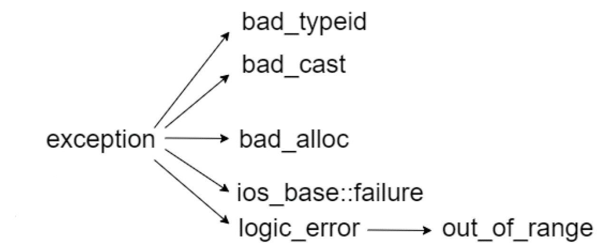

# C++
## 基本概念
### 编译型语言和解释型语言的区别
编译型语言在程序在执行之前需要一个专门的编译过程，通过编译器把程序编译成为可执行文件，再由机器运行这个文件，运行时不需要重新翻译，直接使用编译的结果就行了。而解释型语言是一边执行一边转换的，其不会由源代码生成可执行文件，而是先翻译成中间代码，再由解释器对中间代码进行解释运行，每执行一次都要翻译一次。

### 数据类型的长度
| 有符号 | 无符号 | 32位 |  64位 |
|---- | ----   | ----|----|
|char|unsigned char|1|1|
|short|unsigned short|2|2|
|int|unsigned int|4|4|
|long|unsigned long|4|8|
|int32_t|uint32_t|4|4|
|int64_t|uint64_t|8|8|
|float|non|4|4|
|double|non|8|8|

### char和int之间的转换
- 直接赋值
- 使用强制类型转换：`int i = (int)c;   char cc = (char)i;`
- static_cast转换：`int i = static_cast<int>c; char cc = static_cast<char>i`

### 32位整数-1右移两位是啥
由于右移时，空缺处补上符号位，所以右移两位之后还是-1
对于非-1和1的数，右移都相当于除以2，左移相当于乘以2.对于-1，右移不变，对于1，右移为0

### doule 和float二进制怎么存的，double 1.5 和 float 1.5 的大小
分为三个部分，分别是符号、阶码和尾数。
- *s*:符号1位，表示该数的符号，即0表示整数，1表示负数
- *E*:阶码float是8位，double是11位，以补码形式表示
- *M*:剩下的都是尾数，隐含的以1开头
	- 阶码部分全0表示非规格化的，即在算出最终结果之后不加1
	- 阶码部分全1且尾数全为0表示无穷大，非全0表示NaN
	- 其他则表示规格化的，即结果需要加1

1.5对应的二进制表示就是 0,01111111,100000000000000000000……


long和int的取值范围都一样，16位系统上int是2字节的

### 说出字符常量和字符串常量的区别，并使用sizeof 计算有什么不同
- 形式上: 字符常量是单引号引起的一个字符，字符串常量是双引号引起的若干个字符
- 含义上: 字符常量相当于一个整型值( ASCII 值),可以参加表达式运算；字符串常量代表一个地址值(该字符串在内存中存放位置，相当于对象)
- 占内存大小：字符常量只占1个字节，sizeof的结果是1；字符串常量占若干个字节(至少一个字符结束标志) ，sizeof的结果是指针长度

### 变量定义和声明的区别
- 声明：仅声明变量的类型，并不分配空间；可以有多处声明
- 定义：要在定义的地方分配内存空间；只能有一处定义

```
    int a;                             	//定义   
    extern int a;			//声明
```

### C和C++的区别
- new/delete替换了malloc/free
- iostream替换了stdio
- 字符串类替换了字符数组处理函数
- C++中允许函数重载
- C++中可以在任意地方定义变量
- C++中引入了引用

### 初始化和赋值的区别
对于简单类来说没有区别
对于复杂类来说，初始化分为拷贝初始化和直接初始化，直接初始化调用构造函数，拷贝初始化调用拷贝构造函数，用于将一个对象复制到一个新创建的对象中，赋值调用需要重载operator=，如果用一个对象对新的对象赋值，则调用的是拷贝构造函数，如果是一个已有的对象，则调用的是operator=
### extern C的用法
相当于告诉编译器，这部分代码是C语言写的
```
#ifdef __cplusplus
extern "C" {
#endif
	void *memset(void *, int, size_t);   // 表示如果是C++程序，这段代码应该被extern C声明， 要按照C语言的方式编译
#ifdef __cplusplus
}
#endif
```
### C和C++的类型安全
C中的类型不安全的例子：
- printf格式输出，如果对一个int类型的数据按float输出，则会发生错误
- malloc分配内存错误，因为不会进行类型检查

C++中保障类型安全的例子：
- new操作符分配内存时会进行类型检查
- void\*为参数的函数可以改写为
- 函数，支持类型检查
- \#define宏可以定义为inline函数
- dynamic_cast关键字可以使转换过程更安全

### 用代码判断大小端
大端存储的意思是高字节存在低地址中；小端存储的意思是低字节在低地址中
- 用强制类型转换
```
#include <iostream>
using namespace std;
int main()
{
	int a = 0x1234;
	//由于int和char的长度不同，借助int型转换成char型，只会留下低地址的部分
	char c = (char)(a);
	if (c == 0x00)
	cout << "big endian" << endl;
	else if(c == 0x34)
	cout << "little endian" << endl;
}
```
- 用union判断
```
#include <iostream>
using namespace std;
//union联合体的重叠式存储，endian联合体占用内存的空间为每个成员字节长度的最大值
union endian
{
	int a;
	char ch;
};
int main()
{
	endian value;
	value.a = 0x00001234;
	//a和ch共用4字节的内存空间
	if (value.ch == 0x00)
	cout << "big endian"<<endl;
	else if (value.ch == 0x34)
	cout << "little endian"<<endl;
}
```

### 大小端转换
```
#define BigtoLittle16(A)   (( ((uint16)(A) & 0xff00) >> 8)    | \
                                       (( (uint16)(A) & 0x00ff) << 8))
#define BigtoLittle32(A)   ((( (uint32)(A) & 0xff000000) >> 24) | \
                                       (( (uint32)(A) & 0x00ff0000) >> 8)   | \
                                       (( (uint32)(A) & 0x0000ff00) << 8)   | \
                                       (( (uint32)(A) & 0x000000ff) << 24))
```
### C++中的异常处理
常见的有数组下标越界、空间分配不足等异常，需要及时处理异常以避免程序崩溃
处理机制：try、throw、catch关键字
在try块中执行主体语句，并在发生错误的地方throw抛出异常，在try块外面catch异常，这里的catch需要进行精准捕获，不会出现类型转换，在catch里面还可以再throw给上一级
异常声明列表
```
int fun() throw(int,double,A,B,C){...}; //抛出int,double,A,B,C类型的异常
int fun() throw(){...}; //不抛出任何异常
int fun()  //可能抛出任何异常
```
异常类exception：

- bad_typeid：使用typeid运算符，如果其操作数是一个多态类的指针，而该指针的值为 NULL，则会拋出bad_typeid异常
- bad_cast：在用 dynamic_cast 进行从多态基类对象（或引用）到派生类的引用的强制类型转换时，如果转换是不安全的，则会拋出此异常
- bad_alloc：在用 new 运算符进行动态内存分配时，如果没有足够的内存，则会引发此异常
- out_of_range:用 vector 或 string的at 成员函数根据下标访问元素时，如果下标越界，则会拋出此异常

### 构造函数是否可以抛出异常
不应该抛出异常
- 因为析构函数只能析构那些完全构造的对象，如果在构造函数内部抛出异常导致对象没有构造完成而其中的分配的内存没有被释放会导致内存泄漏。
- 因此创建对象时的异常不能逃离构造函数，即应该在构造函数内有一个try-catch块来处理异常。
- 如果类成员对象是一个const指针，那么应该在初始化成员列表中初始化，但是这样就不能使用try-catch块来处理了，但是可以将这些指针改为智能指针的实现，这样只要构造函数中抛出异常，就会在对象被销毁时随之销毁

### 是否在析构函数抛出异常
不应该抛出异常
因为通常是在程序段结束时自动执行析构函数，一旦抛出异常，则没有机会处理这些异常，通常的解决方法有以下两种：
- 显示地提供一个用于释放对象资源的接口，由用户主动调用，一旦发生了异常，用户还有机会处理异常
- 如果用户没有使用这个接口，那么就应该在析构函数内部处理掉这些异常，不能让异常逃离析构函数，否则会引起异常终止。

### C++的四种强制类型转换
- dynamic_cast：可以用于多态中指针或引用，对于两个类对象指针，只有A类是B类的基类时，才能将B类转化为A类的指针，如果失败则赋给一个空指针
有类型检查，比static_cast更安全
```
High* ph;
Low* pl;
pl = dynamic_cast<Low*> ph;
```
- const_cast：用于修改类型的const或volatile属性
```
const High *pbar;
High *pb = const_cast<High *> (pbar);
```
- static_cast：用于有派生关系之间的类进行转换
```
High bar;
Low = blow;
High* pb = static_cast<High *> (&blow);
Low* pl = static_cast<Low *> (&bar);
```
	- 派生到基类是安全的，基类到派生是不安全的但是可以转换
	- 可以用于基本数据类型之间的转换
	- 可以把空指针转换成目标类型的空指针
	- 把任何类型的表达式转换成void

- reinterpret_cast：用于各种类型之间的转换，包括把一个8字节的数据转换成一个指针，但是不能把函数指针转换成数据指针，不能把指针转换成更小的整型或浮点型

### 如何获得结构成员相对于结构开头的字节偏移量
```
(size_t)&(((S*)0)->x)
```
骗编译器说有一个指向类（或者结构体）s的指针，它的值是0

### 静态类型和动态类型，静态绑定和动态绑定的介绍
- 静态类型：对象在声明时采用的类型，在编译期就已经确定，静态类型不能更改
- 动态类型：指针或引用目前所指的对象的类型，在运行期决定，因此动态类型可以更改
- 静态绑定：绑定的是静态类型，对应的函数或属性依赖于对象的静态类型，发生在编译期
- 动态绑定：绑定的是动态类型，发生在运行期

虚函数都是动态绑定，调用的是真正的对象指针所使用的方法
非虚函数是静态绑定，调用的是声明这个对象的方法

### 引用是否能实现动态绑定，为什么可以实现？
可以，要注意只能访问虚函数。
只有虚函数才能实现动态绑定

### 全局变量和局部变量之间的区别
- 全局变量的生命周期和主程序相同，而局部变量仅在声明的那部分函数体内存在
- 全局变量分配在全局数据段可以在任一部分内使用，局部变量分配在堆栈区，只能在局部使用

### 怎样判断两个浮点数是否相等？
对于两个浮点数比较只能通过相减并与预先设定的精度比较，记得要取绝对值

### 写C++代码时有一类错误是 coredump ，怎么调试？
由于程序运行异常终止时产生的core文件，会记录程序运行时的内存、寄存器状态、内存指针和函数堆栈信息等。对这个文件进行分析可以知道程序异常时对应的堆栈调用信息
使用gdb调试core文件

### 使用智能指针管理内存资源，RAII是怎么回事？
RAII是resource acquisition is initalization，也就是资源获取即初始化，在构造函数中申请并分配资源，析构函数中释放资源，在RAII的指导下，我们应该使用类来管理资源，将资源和对象的生命周期绑定。
将每个资源封装入一个类，其中：
- 构造函数请求资源，并建立所有类不变式，或在它无法完成时抛出异常，
- 析构函数释放资源并决不抛出异常；

始终经由 RAII 类的实例使用满足要求的资源，该资源
- 自身拥有自动存储期或临时生存期（可以在离开代码段时由于生命周期结束而自动析构），或
- 具有与自动或临时对象的生存期绑定的生存期（比如智能指针会在没有任何指针指向的时候自动析构）

智能指针（std::shared_ptr和std::unique_ptr）即RAII最具代表的实现，使用智能指针，可以实现自动的内存管理，再也不需要担心忘记delete造成的内存泄漏。

### 你知道const char* 与string之间的关系是什么吗？
- string是C++标准库中的类，底层封装的就是char\*
- string转const char\*需要使用string中的方法c_str
- const char\*到string的转换则直接使用string的构造函数即可

### C++中标准库是什么？
标准库可以分为两部分
- 标准函数库：由通用的、独立的不属于任何类的函数组成，继承自C
- 面向对象的类库：类及其相关函数的集合
### C++从代码到可执行程序经历了什么？以及对应的g++编译语句
- 预编译：处理所有的#开头的语句，并生成一个.ii或.i文件，可能会由于找不到头文件报错
	- 删除所有的注释
	- 删除#define并展开宏定义
	- 处理条件预编译指令
	- 保留#pragma编译器指令
	- 添加行号和文件标识
```
g++ -E test.cpp > test.ii
```
- 编译：
	- 词法分析：将源代码输入到扫描机中，将其分割成一系列的记号
	- 语法分析：将上一步得到的记号进行语法分析，产生语法树
	- 语义分析：判断语句是否符合逻辑，是否有意义
- 优化：
	- 目标代码生成：将中间代码转换为目标机器代码，并用汇编语言表示
	- 目标代码优化：对上述目标进行优化，寻找合适的寻址方式，删除多余的指令等
```
g++ -S tets.ii
```
- 汇编：
	- 将汇编代码通过as转换位机器码，这一步和上一步可能会由于语法错误而报错
```
g++ -c test.s
```
- 链接：将不同的源文件产生的目标文件连接起来，形成可执行程序，可能会找不到定义（so文件）
	- 静态链接：编译链接可执行文件时，链接器从库中复制这些函数和数据并把它们和应用程序组合在一起创建最终的可执行文件
	- 动态链接：把程序按照模块拆分成各个相对独立的部分，程序运行时才将其链接在一起。
```
g++ test.o -o test
```

### 动态编译与静态编译
- 静态编译：把用到的动态链接库中的函数从库中提取出来，并连接到可执行文件中去，这样，在程序运行过程中就不再需要依赖于动态链接库
- 动态编译：可执行文件需要负载一个动态链接库，执行时调用其对应的动态链接库的命令。

### 静态链接和动态链接
- 静态链接：编译器和汇编器将多个文件（模块）生成多个可重定位的目标文件，静态链接器在链接时将多个可重定位目标文件链接成可执行的文件
- 动态链接：动态链接器需要在链接时先通过静态连接器传入一些重定位和符号信息，后续在可执行文件加载或者运行的时候先加载动态链接，随后根据重定位等信息将目标动态库文件加载到内存中。

### 动态链接的优缺点
优点：缩小了执行文件本身的体积，加快了编译速度，节省了系统资源
缺点：即使只用到了链接库的一两条命令，也需要附带一个相对庞大的链接库；如果其他计算机上没有安装对应的运行库，则用动态编译的可执行文件就不能运行。

### 如何判断一段程序是由C 编译程序还是由C++编译程序编译的？
```
#ifdef __cplusplus
cout<<“c++”;
#else
cout<<“c”;
#endif
```
### 用变量a给出下面的定义 
a) 一个有10个指针的数组，该指针是指向一个整型数； 
b）一个指向有10个整型数数组的指针； 
c）一个指向函数的指针，该函数有一个整型参数并返回一个整型数； 
d）一个有10个指针的数组，该指针指向一个函数，该函数有一个整型参数并返回一个整型数
```
int *a[10];
int (*a)[10];
int (*a)(int);
int (*a[10])(int);
```
### 编码了解么？unicode和utf-8的区别
编码就是将二进制与符号一一映射，然后通过二进制码解析出对应的符号。ASCII码只能用于表示字母、半角字符等，中国的GBK可以表示汉字和全角字符。ISO针对文字与符号的编码方式指定了Unicode标准，是一个全球统一的符号集，规定了每个符号对应的二进制编码，这个编码的长度是不确定的，由字符来决定。虽然如此，但是他却没有表示这个符号该如何存储，比如一个英文字符只需要一个字节就可以处理，而一个汉字可能就需要两个字符存储。问题是我在解码的时候并不知道这N个字节的二进制编码到底表示的是一个还是N个符号。这样，UTF-8出现了，他提供了一种Unicode的存储方式，它是一种变长的编码方式。它可以使用1~4个字节表示一个符号，根据不同的符号而变化字节长度。
UTF-8的编码规则只有两条：

- 对于单字节的符号，字节的第一位设为0，后面7位为这个符号的unicode码。因此对于英语字母，UTF-8编码和ASCII码是相同的。

- 对于n字节的符号（n>1），第一个字节的前n位都设为1，第n+1位设为0，后面字节的前两位一律设为10。剩下的没有提及的二进制位，全部为这个符号的unicode码。

这样，通过判断每个字节前面的几位，就可以判断其表示的是某个符号还是符号的一部分了。
因此，Unicode是编码方式，utf-8是存储方式

### 你知道Debug和release的区别是什么吗？


### 全局变量的缺点
- 长期占用内存：生命周期长，程序运行期一直存在，始终占有那块存储区；
- 难以定位修改：全局变量是公共的，全部函数都可以访问，难以定位全局变量在哪里被修改，尤其是对于多线程来说，加大了调试的难度；
- 初始化顺序：全局变量的初始化顺序不定，如果全局变量之间有依赖，有可能导致某些变量初始化失败，引起莫名其妙bug；
- 污染命名空间：全局变量会污染命名空间，在函数中局部变量会覆盖全局的值，会出现同一个变量名多个值的情况，造成困惑；
- 增加耦合性：修改全部变量会影响所有用到它的模块，不利于调试；且线程不安全

### C++对象的生命周期
- 对于全局对象来说，该对象位于程序段中的全局数据区，在程序启动时分配，在程序结束时销毁
- 对于局部变量来说，在栈中分配内存，进入定义该变量的程序块时创建，离开程序块时被销毁
- 局部static变量在全局数据区分配，在第一次使用前分配，在程序结束时销毁，但离开定义的代码块之后就不可见了
- 动态分配的对象在堆中，只有显式地delete时才会被释放

### 四种编程范式
- 函数式编程：函数式编程中整个应用由数据驱动，应用的状态在不同纯函数之间流动，更偏向于声明式编程，代码更加简洁明了、更可预测，并且可测试性也更好。核心是函数式编程是只使用纯粹的数学函数编程，函数的结果仅取决于参数，而没有副作用
- 泛型编程：屏蔽掉数据和操作数据的细节，让算法更为通用，让编程者更多地关注算法的结构，而不是在算法中处理不同的数据类型。
- 面向过程编程：把待解问题规范化、抽象为某种算法是解决问题的关键步骤。其次，才是编写具体算法和完成相应的算法实现问题的正确解决。
- 面向对象编程：通过类、方法、对象和消息传递，来支持面向对象的程序设计范式。

### 函数模板和类模板
- 函数模板：实际上是建立一个通用函数，它所用到的数据的类型（包括返回值类型、形参类型、局部变量类型）可以不具体指定，而是用一个虚拟的类型来代替（实际上是用一个标识符来占位），等发生函数调用时再根据传入的实参来逆推出真正的类型，这个通用函数就称为函数模板
```
template<typename type1,typename type2>//函数模板
type1 Max(type1 a,type2 b)
{
	return a > b ? a : b;
}
```
- 类模板：定义的类型参数可以用在类声明和类实现中。

### C++空类的sizeof大小
C++空类的大小为1，如果含有虚函数的话，大小为指针的大小。C++要求即使是空类，对象也要有存储空间。含有虚函数的空类则是因为对象由虚函数指针。
这是类结构体实例化的原因，空的类或结构体同样可以被实例化，如果定义对空的类或者结构体取sizeof的值为0，那么该空的类或结构体实例化出很多实例时，内存上就不能区分出该类实例化出的实例。

### 编译器常见的优化
- EBO技术：子类如果继承空类，并不会产生额外的大小，其大小还只是子类本身的大小，在STL中，经常继承空类，可以节省存储空间
- 常量优化：如`int a = 2; int b = a; return b`;可能会优化为 `int b=2; return b; `进一步会优化为`return 2`;
- 无用代码消除比如函数返回值以及参数与该表达式完全无关，直接会优化掉这段代码
- 表达式预计算和子表达式提取常量的乘法会在编译阶段就计算完毕，相同的子表达式也会被合并成一个变量来进行计算
- RVO技术：函数返回的对象如果是新构造的值类型就直接通过一个引用作为参数来构造，进而避免创建一个临时的“temp”对象，减少一次拷贝构造函数（因为是传递引用，所以直接在引用上构造）
- NRVO技术：对于RVO，如果函数在返回前创建了一个临时变量，这个临时变量还是会被构造的，而NRVO直接跳过临时对象的构造
- i++优化
- unlikely优化：在判断语句中，会进行分支预测，处理器会取出位于它预测的分支会跳到的地方执行，并且对指令进行译码，如果预测错误，就重新设置到分支点的状态，重新译码。unlikely提高了分支预测的命中率。


### `#include<file.h>`与 `#include "file.h"`的区别
第一种写法是在标准库中搜索这个头文件，找不到的话才在当前文件所在的目录中索索，而第二种写法是直接在源文件所在的目录中搜索

### i++是否原子操作？
一般来说不是原子操作，从汇编语言的角度来看这条指令，是先把i复制了一份，然后给它加1，最后返回的是复制的i。但是有时如果执行语句中i++之后没有用到原来的i，编译器的优化也会把i++优化成原子操作，即直接在寄存器上执行自加操作
如果i被声明为C++11之后的原子变量，就是原子操作


## 函数调用问题
### main前后执行的代码
- main函数执行前：
	- 先设置栈指针
	- 初始化.data字段中的static和global变量
	- 将未初始化的.bss字段的全局变量赋初值
	- 为全局的对象调用构造函数，设置环境变量
	- 将main函数的参数argc和argv传递给main函数
- main函数执行后：
	- 调用全局对象的析构函数
	- 执行atexit函数设置的钩子函数

### 写一个在main之前调用的函数
```
class Before {
public:
    Before() {
        std::cout << "构造函数" << std::endl;
    };
    static Before s;
};
Before Before::s;
int main(void)
{
    std::cout << "begin" << std::endl;
    return 0;
}
```

### 宏定义和函数的区别
- 宏定义在编译时是直接进行文本替换的，因此运行时不会调用函数，因此速度更快；而函数要进行压栈等操作，然后跳转到函数的地址上执行，最后再返回，因此速度较慢
- 宏定义没有返回值，而函数有返回值
- 宏定义参数没有类型，不会进行类型检查；而函数有类型，会进行类型的检查
- 宏定义不能加分号

### strlen和sizeof的区别
- strlen仅针对字符串，且不包含\0；sizeof可以是任意数据结构
- strlen是一个函数，而sizeof是一个运算符，可以在编译时得到
- sizeof在编译时确定，不能用来得到动态分配的内存的大小，而strlen是在运行时得到的
- sizeof得到的是数据类型所占内存的大小，而strlen得到的是字符串的实际长度
- 数组作为sizeof参数时会退化为指针，得到的是一个指针的大小，而数组作为strlen的参数，不会退化

### 形参与实参的区别
形参只有在调用时才会分配内存，调用结束时立即释放内存，因此只在函数内有效；实参可以是任意形式的表达式，但是在传参时必须是一个确定的数值
数据传递是单向的，只能实参传给形参
当参数是值传递时，实参传递参数后，函数内会分配内存并复制一份数据在函数内使用
参数是指针或引用时，不需要复制实参数据，只是直接在在传递的内存上操作

### C++函数调用的压栈过程
答：计算机为单个过程分配的部分叫做栈帧，是程序的一段，有两个端点，esp表示栈顶指针，是结束地址，开始地址指针是ebp；
- 在调用函数之前先在栈上分配栈空间
- 调用者函数把被调用函数的参数按照从右到左的顺序依次压入栈中
- 然后call这个函数，并且把call的下一条指令的地址也压入栈中，作为函数返回的地址
- 在被调函数中，被调函数首先保存调用者函数的栈底地址ebp（以后还要用）
- 然后记录当前栈底地址作为以后找形参的地址，即mov ebp,esp
- 从ebp位置处开始存放被调函数中的局部变量和临时变量
- 对于函数的返回值，会存储在eax中返回，对于8字节的，剩下的4字节会存储在edx中返回。对于一个大对象来说，调用者函数会首先在它的栈空间中开辟一块内存用来临时存放这个对象temp，将temp的地址作为隐藏参数传递给被调用函数，然后被调用函数将数据拷贝给temp对象，并且把这块地址用eax返回，函数返回后，将eax指向的temp对象的内容拷贝给n，也就是实际存储这个数据的地方。


### 函数指针？
函数指针指向的是函数的入口地址，函数指针的类型取决于参数列表和返回值类型，而不是函数的名称。
```
double pam(int);						//函数
double (*pf)(int);						//函数指针的声明
pf = pam;								//函数指针的定义
void estimate(int lines, double (*pf)(int)) 	//函数的使用
{
	cout<<pf(line)<<endl;
}
```
当希望在同一个函数中通过使用相同的形参在不同的时间使用产生不同的效果时使用。

### 要是想让程序跳转到绝对地址是0x100000去执行，应该怎么做？
```
*((void (*)( ))0x100000 ) ( );  
首先要将0x100000强制转换成函数指针,即:  
(void (*)())0x100000  
然后再调用它:  
*((void (*)())0x100000)();  
用typedef可以看得更直观些:  
typedef void(*)() voidFuncPtr;  
*((voidFuncPtr)0x100000)();
```
### 以下语句分别表示什么意思？
```
void *(*(*fp1)(int))[10];  
float (*(*fp2)(int,int,int))(int);
int (*(*fp3)())[10]();
```
- `void *(*(*fp1)(int))[10]; ` fp1是一个指针，指向一个函数，这个函数的参数为int型，函数的返回值是一个指针，这个指针指向一个数组，这个数组有10个元素，每个元素是一个void型指针。
- `float (*(*fp2)(int,int,int))(int);` fp2是一个指针，指向一个函数，这个函数的参数为3个int型，函数的返回值是一个指针，这个指针指向一个函数，这个函数的参数为int型，函数的返回值是float型。
- `int (*(*fp3)())[10](); `fp3是一个指针，指向一个函数，这个函数的参数为空，函数的返回值是一个指针，这个指针指向一个数组，这个数组有10个元素，每个元素是一个指针，指向一个函数，这个函数的参数为空，函数的返回值是int型。

### 你知道printf函数的实现原理是什么吗？

### cout和printf有什么区别？
cout<<是一个函数，后面可以接各种类型的数据是因为重载了<<这个运算符。
Linux平台下都是行缓冲，必须通过flush或者endl强迫缓冲输出
VS下的不用强迫缓冲输出

### 程序在执行`int main(int argc, char *argv[])`时的内存结构，你了解吗？
首先调用main函数的调用者函数把main的所有参数全部压栈，在main中，先把调用者函数的ebp压栈，然后保存新的ebp，当读取参数时，首先读到的就是argc，argc存储的是传参的个数，因此会接下来读取argc个参数

### 你知道strcpy和memcpy的区别是什么吗？
复制的内容不同，strcpy只能复制字符串，memcpy可以复制任何内容
复制方法不同，strcpy不需要指定长度，结束标志是\0，而memcpy需要指定长度

### 实现一个strcpy
```
char * strcpy( char *strDest, const char *strSrc )
{
    assert( (strDest != NULL) && (strSrc != NULL) );
    char *address = strDest;
    while( (*strDest++ = * strSrc++) != '\0' );
    return address;
}
```

### strncpy和memcpy的区别
复制的内容不同，strncpy只能复制字符串，memcpy可以复制任何内容
当需要复制的内容长度 > 目标空间的长度时，strncpy会用NULL来填充复制内容不足的目标空间，而memcpy则会继续复制源地址空间的内容

### 说一说strcpy、sprintf与memcpy这三个函数的不同之处
- 操作对象不同：strcpy的源和目的对象都是字符串，sprintf的源可以是任意类型，目的是字符串，memcpy源和目的都可以是任意字符
- 效率不同：memcpy最高，strcpy次之，sprintf最慢
- 功能不同：strcpy主要是字符串之间的拷贝，sprintf是把其他类型的数据转化为字符串格式化输出，而memcpy是内存块之间的拷贝

### strcpy函数和strncpy函数的区别？哪个函数更安全？
strcpy不安全，如果目的缓冲区不够大，会造成缓冲溢出，而strncpy复制源字符串的前n个字节，目的缓冲区必须要有足够的空间存放n个字符。
- 如果目标长>指定长>源长，则将源长全部拷贝到目标长，自动加上’\0’
- 如果指定长<源长，则将源长中按指定长度拷贝到目标字符串，不包括’\0’
- 如果指定长>目标长，运行时错误；

### 重写memcpy()函数需要注意哪些问题，（strcat strncat strcmp strcpy）哪些函数会导致内存溢出
需要考虑地址重叠问题。
strcpy系列的函数都不安全，没有检查边界，都会导致内存溢出
strcmp只是比较，不会导致内存溢出
strncat也会导致内存溢出

### 将引用作为函数参数有哪些好处？
可以减少拷贝构造函数的使用，对于大对象，优势尤其明显。传参的过程中需要进行拷贝构造，如果还需要把这个对象返回给调用者函数，也会执行一次拷贝构造函数，对于大对象来说，这样效率比较低。使用引用作为参数，可以直接对这块内存进行操作，不用进行复制。

### main函数的返回值有什么值得考究之处吗？
返回值类型必须是int，这样返回值才能传递给程序激活者（如操作系统）表示程序正常退出。

### 你知道回调函数吗？它的作用？
发生某种事件时，自动调用注册的回调函数，类似于中断处理函数，在写这个功能的时候可能并不知道要执行什么样的操作，所以可以通过回调函数让用户传入应该执行的操作，而这个操作就是回调函数。
使用中断处理函数需要声明、定义并且设置触发条件。也就是在函数中把回调函数名转化为地址作为一个参数，便于系统调用。
回调函数就是一个通过函数指针调用的函数，把函数的指针作为参数传递给一个函数，当这个指针被用为调用他所指向的函数时，就是回调函数。

### 为什么不能把所有的函数写成内联函数?
在编译好的程序中，内联函数直接把函数部分替换到使用函数的位置，而不是使用函数跳转，所以内联函数的运行速度比普通函数要快。但是仅限于把小函数设置为内联函数，如果很庞大的函数也设置为内联函数，则编译出来的文件就会很大，也就是说会使这个程序的代码段很大。而且对于这样的函数来说，内联函数跳转所带来的优化微乎其微。

### 理解 `(*(void (*)())0)()`
- `(void (*)())`是一个类型转换，表示一个“指向返回值为void类型的函数的指针”的类型转换。
- `(void (*)())0`表示将常数0转换为“指向返回值为void的函数指针”类型。
- `(*(void (*)())0)()`就表示调用一个这样的函数
这条语句主要用于模拟在计算机启动时，作为硬件调用首地址为0的子程序的C语句。


### 成员函数指针了解么？可以转换为Void*么？为什么？
https://www.cnblogs.com/jans2002/archive/2006/10/13/528160.html
https://zhuanlan.zhihu.com/p/47869981
delegate是什么？实现思路？与event的区别？

### 常见的函数调用类型
- __cdecl：按照c语言标准，从右到左，可以实现可变参数，调用者弹出参数。返回时需要调用者清理栈
- __stdcall：按照c++标准，函数参数从右到左，不支持可变参数，函数返回自动清空。但是有的时候编译器会识别并优化成cdecl。函数返回时自行清理栈。
- __thiscall：参数从右向左入栈，若是参数个数肯定，this指针经过ecx传递给被调用者；若是参数个数不肯定，this指针在全部参数压栈后被压入堆栈。对参数个数不定的，调用者清理堆栈，不然函数本身清理堆栈
- __fastcall：函数的第一个和第二个DWORD参数（或者尺寸更小的）经过ecx和edx传递，其余参数经过从右向左的顺序压栈，被调用函数清理堆栈

### rand函数需要注意什么
因为rand是一个伪随机数，需要先使用`srand((unsigned)time(NULL))`播一个种子。
会返回一个0到最大随机数的任意整数

### assert()的作用，static_assert？
assert是一个宏定义，先计算表达式，如果其值为假（即为0），那么它先向stderr打印一条出错信息，然后通过调用 abort 来终止程序运行。
static_assert静态断言，是C++关键字，作用是让编译器在编译期对常量表达时进行断言。如果通过，就不报错；如果不通过，就报错

### memcpy的实现
```
void *memcpy(void *dest, const void *src,size_t n)
{
	if(dest==nullptr||src==nullptr)
	    return nullptr;
	void *res = dest;
	if(dest<=src||(char*)dest>=(char*)src+n){
	        while(len--){
	//从低地址开始复制
	        *(char*)dest =*(char*)src;
	        dest=(char*)dest+1;
	        src=(char*)src+1;
	        }
	}
	else{
	//从高地址开始复制
	      src = (char*)src + len -1;
	      dst = (char*)dst + len -1;
	      while(len--){
	            *(char*)dst = *(char*)src;
	            dst = (char*)dst -1;
	            src = (char*)src -1;
	          }
	    }
	return res;
}
```
优化
```
void* m_memcpy(void* d, void* s, int n) {
    void* ans = d;
    if (d<=s||(char*)d>=(char*)s+n) {
        while (n && (long long)s%sizeof(long long)) {
            *(char*)d = *(char*)s;
            d = (char*)d + 1;
            s = (char*)s + 1;
            n--;
        }
        while (n/ sizeof(long long)) {
            *(long long*)d = *(long long*)s;
            d = (long long*)d + 1;
            s = (long long*)s + 1;
            n -= sizeof(long long);
        }
        while (n--) {
            *(char*)d = *(char*)s;
            d = (char*)d + 1;
            s = (char*)s + 1;
        }
    }
    else {
        s = (char*)s + n - 1;
        d = (char*)d + n - 1;
        while (n-- && (long long)s % sizeof(long long)) {
            *(char*)d = *(char*)s;
            d = (char*)d - 1;
            s = (char*)s - 1;
        }
        while (n / sizeof(long long)) {
            *(long long*)d = *(long long*)s;
            d = (long long*)d - 1;
            s = (long long*)s - 1;
            n -= sizeof(long long);
        }
        while (n--) {
            *(char*)d = *(char*)s;
            d = (char*)d - 1;
            s = (char*)s - 1;
        }
    }
    return ans;
}
```
## 指针和引用
### 指针和引用的区别
- 指针可以先声明再初始化，且可以为null，而引用则必须要声明的同时初始化；
- 指针初始化之后可以更改指向其他地址，而引用则永久生效，不允许改为其他变量
- 指针是一个变量，存储的是一个地址，而引用与其所指向的数据是同一个对象，只是其他变量的别名
- 指针可以有多级，而引用只有一级，比如int\*\* a合法但int&& a不合法
- sizeof指针得到的是指针的大小，而sizeof引用得到的是所指向的变量的大小
- 把指针作为参数传递时，也是将实参的一个拷贝传递给形参，两者指向的地址相同，但不是同一个变量，因此在函数中改变变量的指向不影响实参，而引用可以改变实参
- 传递引用时不会创建临时变量，而传递指针会创建
- 指针使用的最常见的场景就是在堆上new一个对象

### 传递参数时，何时使用指针，何时使用引用？
- 对栈空间大小敏感的使用引用传递，因为不会创建临时变量，开销比较小
- 传输类对象用指针或引用都可以，但最好用引用
- 传输数组应该用指针
- 传输结构体，使用指针或引用都可以
- 对于自定义的链表，需要用指针

### 区别以下指针类型
```
int *p[10]
int (*p)[10]
int *p(int)
int (*p)(int)
```
- 第一个表示一个指针的数组，数组元素是指针
- 第二个表示是一个数组的指针，数组有10个元素，而\*p就是数组的起始地址
- 第三个表示的是函数的声明，返回值是一个int\*的指针
- 第四个表示的是函数指针，指针指向这个函数，函数的返回值是int类型

### 常量指针和指针常量的区别
- 常量指针是一个不能改变指针指向的指针，也就是说指针是一个常量，写作`int *const p`
- 指针常量是一个指向常量的指针，写作`int const *p`或`const int *p`

### a和&a有什么区别
- a是数组名，表示数组首元素的地址，a+1表示的是数组中第二个元素的地址，即元素相对于数组起始地址的偏移；
- &a是数组的指针，表示的是整个数组，因此a+1表示的是a数组最后一个元素的下一个地址

### 数组名和指针的区别
- 都可以通过增减偏移量访问数组中的元素
- 数组名不是实际意义上的指针，可以理解为常指针，没有自增自减等操作
- 当数组名作为函数参数传递给函数时，数组名就退化为指针，和普通指针一样，且sizeof之后不能得到数组的大小

### 野指针和悬空指针
- 野指针指的是未被初始化的指针,成因包括：
	- 指针变量没有被初始化
	- 指针指向的内存被释放了，但是指针没有置NULL
	- 指针超过了变量了的作用范围，比如b[10]，指针b+11
- 悬空指针指的是所指内存被释放掉的指针，为避免，可以使用智能指针

### 深拷贝和浅拷贝的区别
- 如果一个类拥有资源，当这个类的对象发生复制过程的时候，如果资源重新分配了就是深拷贝；反之没有重新分配资源，就是浅拷贝。
- 浅拷贝只拷贝了一个指针，使两个指针指向同一块内存，如果原指针所指向的内存被释放了，再释放浅拷贝的指针就会出问题
- 深拷贝不仅拷贝了指针，还拷贝了所指向的内存空间中的数据。需要自己通过memcpy实现深拷贝

### 值传递、指针传递、引用传递的区别和效率
- 值传递需要复制参数，如果是一个类对象，还要调用其拷贝构造函数
- 指针传递传输的是一个地址，在函数内如果需要使用某个值需要解引用
- 引用传递传递的也是一个地址，但是相当于给参数起了一个别名，函数内直接使用即可，不需要解引用

### 从汇编层去解释一下引用
答：

### C++中的指针参数传递和引用参数传递有什么区别？底层原理
- 指针参数传递本质上是值传递，只不过传递的是一个地址值。当传递这个地址时，被调函数的形参会被当作一个局部变量，通过栈指针将实参复制到这个函数的栈帧空间中，因此，函数对于指针形参所做的任何操作都是作为局部变量进行的，实参不会变
- 引用参数传递的也是指针，只不过这次传递的是实参的地址，被调用对形参的任何操作都会被处理成间接寻址，因此对引用传递的参数的改变都会影响主调函数中的实参
- 程序在编译时分别将指针和引用添加到符号表上，符号表中记录的是变量名及变量所对应地址。指针变量在符号表上对应的地址值为指针变量的地址值，而引用在符号表上对应的地址值为引用对象的地址值（与实参名字不同，地址相同）。符号表生成之后就不会再改，因此指针可以改变其指向的对象（指针变量中的值可以改），而引用对象则不能修改。

### 指针和引用之间如何转换？
```
int a  =0;
int *p = &a;
int &r = *p;     //指针到引用
int *pp = &r;  //引用到指针
```
### 指针的作用
cpp里面大致可以分为三种类型的指针
- 第一种是普通的指针，可以指向数据存储的地址，常用的场景包括数组中的寻址，函数传参等操作。
- 第二种是智能指针，用于动态内存管理，防止出现野指针和内存泄漏
- 第三种是stl提供的迭代器，可以指向容器中的元素，常用于遍历容器或者作为容器中查找、删除等操作的返回值

### 为什么流操作符重载返回值要申明为引用？
流操作符<<和>>，这两个操作符常常希望被连续使用，因此这两个操作符的返回值应该是一个仍然支持这两个操作符的流引用，所以会返回一个运算符的引用。

### 成员函数指针
```
float (SomeClass::*my_memfunc_ptr)(int, char *);
float (SomeClass::*my_const_memfunc_ptr)(int, char *) const;
    SomeClass *x = new SomeClass;
(x->*my_memfunc_ptr)(6, "Another Arbitrary Parameter");
```

https://www.cnblogs.com/jans2002/archive/2006/10/13/528160.html

## 常用关键字
### 为什么const修饰成员函数后不能修改成员变量
每个成员函数在调用的时候，都会把this作为第一个参数传进去。我们在用const修饰成员函数的时候，就相当于修饰了this，也就是说我们的第一个参数应该是
```
const 类型* this
``` 
所以我们不能去修改this的成员变量，编译器不允许通过。

### 宏定义和typedef的区别
- typedef一般用于定义一个别名；宏主要用于定义常量及书写复杂的内容
- typedef是一条语句，因此后面需要加分号；而宏定义不是语句
- typedef是编译的一部分；而宏定义是在编译前进行的替换
- typedef不检查类型；而宏定义检查类型
- 对于指针的差别
```
typedef    (int*)      pINT;
#define    pINT2    int*
pINT a,b    // 等价于 int *a; int *b
pINT2 a,b   // 等价于 int *a, b;
```

### C++中static的作用
- 所有声明为static的变量具有全局生存期，将这些变量分配在静态数据存储器，即使是临时变量，也会永远驻留在静态内存区中，不会像其他变量一样作用域结束之后就被删除，只不过变量名失效，但是内存上还是有数据的
- 作用域仅限于文件内部，而未声明为static的变量在整个工程内都是可用的；
- 默认初始化为0（也叫做0初始化），随后会静态初始化或动态初始化，静态初始化是指通过常量表达式在编译阶段初始化，而动态初始化是指在链接、执行阶段初始化（一般是指调用了某个函数）；但是默认初始化为0和初始化为特定数值的变量地址不连续
- 如果一个静态类成员函数被声明为了非public，那么就需要设计类成员函数来存取，否则只能初始化，以后就不能再用了。
- 如果类中的成员变量声明为static
	- 则这个变量只能与类相关联，不能与对象相关联，即无论使用了多少个对象，始终只能有一个该变量。
	- 定义是要分配空间，不能在类声明中初始化，因为类声明可能会被多个文件所包含；必须要在类定义体外部进程初始化
	- 可以被非static成员访问
- 如果类中的成员函数被声明为static
	- 不具有this指针，因为它不是和一个具体的对象绑定，而是这个类绑定
	- 无法访问类对象的非static成员变量和非static成员函数
	- 不能被声明为const、虚函数、volatile、virtual
	- 可以被非static成员函数访问
	- 不需要生成对象就可以访问该函数

### C++中const的作用（Dan Saks）
- 在常量声明时必须初始化，且不能更改
- const形参可以接收const或非const的变量，表示在函数内不会改变这个值
- 如果类成员中有const定义的数据，必须要使用函数初始化列表初始化这些const数据，且必须要有构造函数
- 一个引用指向了一个const变量，则引用也不能改变这个变量的值；反之，如果一个const引用指向一个非const变量，则不能通过引用改变原数据，只能直接修改原数据，但引用也会改变（这里const固定的是到该变量的引用）
- 对于函数来说，传参是const和非const之间不能重载，传参是指向const的指针和指向非const的指针之间可以重载，const类型的指针和非const类型的指针之间可以重载，const类型的引用和非const类型的引用之间不可以重载
- const成员函数，const对象不可以调用非const成员函数，非const的对象都可以调用，不可以改变非mutable数据的值
- 可以通过const_cast转换为非const类型

### define宏定义和const的区别
- define在预处理阶段起作用；const在编译运行阶段起作用
- define只做替换，没有类型；const有数据类型，会进行安全检查
- define在内存中会产生多份相同的备份，而const只有一个备份，且可以将复杂的表达式计算出的结构放入常量表
- 宏定义的数据没有分配内存空间，const会分配内存空间

### volatile关键字的用法
- 表示这个值可能会在硬件或者其他线程的作用下发生改变，因此不同的时候读取出来的volatile声明的值可能会不同
- 声明的原因是：当多次使用同一个变量后，编译器会以为这个变量没有被改变，只是将其读到寄存器中，以后使用的时候直接在寄存器中读入，这样可以提高效率，但是这种变量可能会被系统改变，因此需要声明为volatile变量，表示这个值在后续程序中可能会改变，不要使用寄存器优化，而是每次都从内存中读取数据
- const也可以修饰volatile，表示程序员不能修改这个值，但是系统可以修改
- volatile指针：
```
const char* cpch;volatile char* vpch; // 表示指针所指向的对象是volatile
char* const pchc;char* volatile pchv; // 指针自身是volatile
```
可以把一个非volatile int赋给volatile int，但是不能把非volatile对象赋给volatile对象
- 多线程下的volatile：两个线程同时用到某一个变量且值会被改变，则需要声明为volatile

适用场景：
- 中断服务程序中修改的供其他程序检测的变量
- 多任务环境下各线程间需要共享的标志
- 存储器映射的硬件寄存器
### mutable关键字的作用
- mutable声明的变量，即使在const函数中，也可以改变它的值
- 如果是在mutable声明的类中，如果其中有些跟类状态无关的数据成员，可以用mutable修饰某些成员或方法

### explicit关键字的作用
- explicit只能用于类内部的构造函数声明上
- 只作用于单个参数的构造函数
- 被explicit修饰的构造函数的类，不能发生相应的隐式类型转换

### 内联函数和宏定义的区别
- 内联函数在编译时将函数嵌入到代码中，而宏定义是在预编译时进行文本替换
- 内联函数会进行参数类型检查且有返回值，可以重载，而宏定义不会检查

内联函数的应用场景：
- 可以使用宏定义的地方都可以使用内联函数
- 可以作为类成员的接口函数读写类私有成员或保护成员

### 静态变量何时初始化
在主程序之前，编译器为其分配好了内存，并且初始化，程序结束时，用atexit反方向逐个析构

### define、const、typedef、inline的使用方法？他们之间有什么区别？
- define和const：
	- define数据没有类型，只是进行字符串的替换，而const有类型
	- define只在预处理阶段有用，直接进行替换，而const是在编译链接中都有作用
	- define预处理后，占用的是代码段空间，而const占用的是数据段空间
	- define定义过的还可以通过undef取消定义，而const不可以
- define和typedef
	- define在预处理阶段起作用，而typedef在编译阶段起作用
	- define不进行类型检查，而typedef会进行类型检查
	- define的功能更广泛，可以定义变量常量和编译开关，而typedef只用于定义类型的别名
	- define没有作用域限制，而typedef有自己的作用域
- define和inline
	- define在预处理阶段进行文本替换，而inline在编译阶段进行替换
	- define只替换没有类型检查，而inline替换过之后有类型检查

### 全局变量和static变量的区别
全局变量的作用范围是整个工程，在其他的源文件中也有效，而static变量只在当前源文件中有效。

### 普通函数和static函数的区别
- static函数和普通函数的区别也在于作用域不同，static函数只能在源文件内部说明，而其他函数需要在头文件内部声明并包含该头文件。
- static函数和普通函数最主要的区别在于static函数在内存中只有一份，会被自动分配在一个一直使用的存储区，直到退出应用程序实例，避免了调用函数时压栈出栈。普通函数在每个调用中维持一份拷贝。

### 说一下你理解的 ifdef endif代表着什么？
- 条件编译，也就是只希望程序中只有部分代码能够被编译。
- 因为可能在一个工程中，可能会有多个文件包含同一个头文件，如果把这些文件编译链接之后，会出现重定义的错误，因此需要使用条件编译避免重定义。

### static_cast比C语言中的转换强在哪里？
- 更安全：不允许基本内置类型数据之间指针的互相转换，否则会造成地址越界访问，使用了static_cast在编译阶段就无法通过；不允许两个没有派生关系的类之间互相转换。
- 更明显，可以明显地看出是什么类型转换为什么类型，清晰地辨别出强制转换

### C++中的顶层const和底层const
- 顶层const是指const修饰的变量、引用、指针是const，这时const在\*号右边；底层const是指const修饰的变量所指向的对象是一个变量，这时const在\*号左边
```
int a = 10;int* const b1 = &a; //顶层const，b1本身是一个常量
const int* b2 = &a; //底层const，b2本身可变，所指的对象是常量
const int b3 = 20; //顶层const，b3是常量不可变
const int* const b4 = &a; //前一个const为底层，后一个为顶层，b4不可变
const int& b5 = a; //用于声明引用变量，都是底层const
```
- 对象拷贝时，常量的底层const不能赋值给非常量的底层const
- 使用const_cast时，只能改变运算对象的底层const
- int const和const int是一样的

### enum枚举类型
```
enum type { a,b,c,d=6,e}
```
- 可以通过上述语句定义一个枚举类型type，其中具体的值就是abcde，每个值都会被赋予一个默认值，从0开始，a就是0，b就是1，也可以指定d=6，那么后面的e就表示7；可以有多个相同的枚举值，只能是整型，包括int、long、char等，但不能是浮点型
- enum只有赋值运算符，没有算术运算符，且不能为其赋予enum以外的数
- int到enum会报错，但是可以从enum转换到int

### const比define应该尽量用哪个？
对于单纯变量来说，可用const代替，相比于define来说这样有类型检查，代码调试时也有这个变量；如果define定义了形似函数的函数的宏，则可改用inline内联。

### inline 内联函数
- 相当于把内联函数里面的内容写在调用内联函数处，因此不用执行进入函数的步骤，也就不用再执行
- ，而是直接执行函数体；
- 相当于宏，却比宏多了类型检查，真正具有函数特性；
- 不能包含循环、递归、switch 等复杂操作；
- 在类声明中定义的函数，除了虚函数的其他函数都会自动隐式地当成内联函数。

### 编译器对 inline 函数的处理步骤
- 将 inline 函数体复制到 inline 函数调用点处；
- 为所用 inline 函数中的局部变量分配内存空间；
- 建立起 inline 函数的输入参数和返回值到调用函数空间中的映射；
- 如果 inline 函数有多个返回点，将其转变为 inline 函数代码块末尾的分支（使用 GOTO）。

### inline函数的优缺点：
- 优点：
	- 省去了参数压栈弹栈，结果返回等操作，从而提高程序运行速度；
	- 内联函数会做类型检查，和自动类型转换
	- 类中声明的同时定义的成员函数可以自动转换为内联函数，因此可以访问类的成员变量，而宏定义不能
	- 运行时可调试
- 缺点：
	- 代码膨胀
	- Inline函数无法随着函数库省级而升级，函数的改变需要重新编译
	- 是否内联是由编译器决定的，而不是由程序员决定的

### 虚函数可以是内联函数吗
可以是内联函数，但是当表现出多态性质时不能是内联函数，因为内联是编译器决定的，是在编译期将内联函数编译进代码段，而多态性是在运行期，编译器无法指定运行期调用哪个代码。而虚函数唯一可以内联的时候是编译器知道调用的对象是哪个类时，即必须是编译器知道具有实际的对象而不是一个指针或引用时才可以用：
```
Base base;
Base.func();   // 这里的func可以是一个虚内联函数
```

### 一个参数可以既是const又是volatile吗
可以，用const和volatile同时修饰变量，表示这个变量在程序内部是只读的，不能改变的，但是可以由硬件修改。

### constexpr的用途
- 可以编写在编译期就能完成执行的代码，从而提升程序运行时的性能。也就是说，把运行期的一些工作在编译器完成。
- 使用if constexpr可以进行条件编译
- 如果修饰函数，只要参数在编译期确定了，就在编译期返回结果，运行期直接得到返回的结果即可。
- 如果修饰对象：意味着对象是不可变的，且对象的值需要在编译期确定。

### const 和 constexpr的作用和区别
- 当修饰对象时，constexpr和const大部分时候是一样的，都表示不能修改所修饰的对象，但是C++11标准中建议的是让const仅仅表明只读，constexpr表示一个常量
- 当修饰函数时，constexpr表明如果参数在编译器确定，那么在编译期就计算出了结果，运行期只需要返回结果就行了，否则就当作普通函数；而const表明返回的结果是const类型的。


### typename关键字
- 用于模板参数，相当于class
```
template<class T> class Widget; // uses "class"
template<typename T> class Widget; // uses "typename"
```
- 用于修饰类型，即告诉编译器typename修饰的应该是一个类型而不是一个变量。如果类中iterator是一个int类型数据，那么不加typename就会认为这是一个iterator和iter相乘，会造成歧义；而如果是struct就不会有歧义。
```
struct ContainsAnotherType {
struct iterator { /*...*/ };
     static int iterator;
     // ...
 };
typename T::iterator * iter;
```


## 内存问题
### malloc的底层实现?brk系统调用和mmap系统调用的作用分别是什么？
如果小于128K就通过brk分配内存，brk将_edata指针向上推，就完成了虚拟内存分配
如果大于128K就通过mmap分配，从堆和栈的中间分配一块虚拟内存

### mmap的四种映射关系
- 文件映射：把一个文件映射到进程的虚拟地址空间，使用文件的内容初始化物理内存
- 匿名映射：初始化全为0的内存空间
- 私有映射：多进程减共享数据，但是不会把修改落到磁盘上（copy-on-write）
- 共享映射：修改反映到磁盘文件中

因此，mmap可以实现四种映射关系：
- 私有文件映射：多个进程使用同样的物理内存页进行初始化，但是各进程对文件的修改不会共享
- 私有匿名映射：mmap会创建一个新的映射，但是各进程不共享，用于分配大内存。
- 共享文件映射：通过虚拟内存技术共享这一物理内存空间，对内存文件的修改会落到实际的物理文件中，可以用于进程间通信
- 共享匿名映射：可以用于父子进程间通信，fork时不会采用写时复制，父子进程共享同样的物理内存。


### glibc的内存管理———ptmalloc
malloc采用的是内存池的管理方式，采用边界标记法将内存划分为很多块，通过chunk内存块进行组织，从而避免产生过多的内存碎片。
chunk中的信息包括：前一个chunk的大小，当前chunk的大小，前一个chunk是否在使用，当前chunk是否通过mmap获得的，当前chunk是否属于非主分配区，前后chunk的地址（空闲时）。当当前chunk存在于large bins中时，空闲chunk按大小排序，同一大小的chunk可能有多个，因此还有指向前后大小内存块的第一个chunk地址的指针。
fast bin存储的是小内存，避免小内存合并成大内存，而申请小内存时又要从大内存中分配。
malloc首先需要计算出所分配的内存的大小，如果是小于64B就从fast_bin中查找chunk，如果有就分配结束。如果小于512B就从small_bin中查找chunk，如果大于512B就从large_bin中查找chunk。对于fast_bin中的chunk，相邻的要合并，然后链接到unsorted_bin中，然后遍历unsorted_bin，如果有和待分配内存大小相等的chunk就分配，如果有比待分配内存大的，就要切割之后把剩余部分放回到unsorted链表中，然后再对unsorted链表里的chunk分类。
如果large_bin无法满足需求，就在top_chunk中分配，如果仍然无法满足需求就sbrk扩充

https://mp.weixin.qq.com/s?__biz=Mzk0MzI4OTI1Ng==&mid=2247485953&idx=1&sn=f8cd484607ab07f15247ecde773d2e1c&scene=21#wechat_redirect
https://blog.csdn.net/weixin_39094034/article/details/123465963
fmalloc的实现：https://mp.weixin.qq.com/s/01m8VVuvMWvhpRtVszgn1g

### 结构体内存对齐问题
- 按声明顺序存储，第一个成员的地址等于结构体的地址
- 地址对齐则按照size最大的成员对齐，其他成员如果可以多个拼凑成一个最大size的也只占一个
- C++11允许使用alignas指定对齐的最小单位，如小于自动对齐的最小单位，则不生效
- 允许使用alignof读取对齐方式
- 设定结构体、联合以及类成员变量以 n 字节方式对齐
- alignof返回类型的std::size_t。如果是引用，则返回引用类型的对齐方式，如果是数组，则返回元素类型的对齐方式。
- `__attribute__((packed))`告诉编译器取消编译中的内存对齐优化，采用实际占用的字节数进行对齐
- `__attribute__((aligned(N)))` 告诉编译器在编译过程中按照N字节对齐，经过测试这个N只有大于结构体中最大的变量的大小才有用
- `__attribute__((aligned))` 后面不接数字，告诉编译器根据目标机制采用最大最有益的方式对齐，基本上就是16字节对齐
- alignof(X) 返回某类型的对齐大小，与std::alignment_of类似，这两个功能完全相同，但是std::alignment_of可以用于模板元编程
```
#pragma pack(push)  // 保存对齐状态
#pragma pack(4)     // 设定为 4 字节对齐，即起始应该是4的倍数
struct test { … };
#pragma pack(pop)   // 恢复对齐状态
//  或者使用
struct alignas(8) S {  // ...  };
```
### 说一说你理解的内存对齐以及原因
- 内存对齐就是每个变量的起始位置的偏移地址必须时该变量类型大小的整数值，否则就空出位置，在满足整数值处存储数据。
- 原因是：
	- 寻址方便
	- 读取数据更快，只需要一次就能取出数据，比如在64位机上一个int和double一起存储，int只占4个字节，double占8个字节，而cpu一次读取8个字节，如果连续地址存放，那么读一个double就需要两次才能读到，而内存对齐只需要一次就可以读到

C++11的内存对齐：https://zhuanlan.zhihu.com/p/139520591

### 堆和栈的区别
- 分配方式上：栈是系统自动分配的（也可以分为动态分配和静态分配，其中静态分配是由编译器完成，如局部变量分配；动态分配是由alloca函数分配），而堆是由使用者自己申请的（比如使用malloc，当超过临界值就分配在进程的映射区中，否则就分配在堆上）动态分配
- 申请限制不同：栈是向栈底扩展，大小固定；堆是向高地址扩展，是不连续的内存区域
- 申请效率不同：栈更快一些且不会有碎片，而堆更慢一些
- 空间大小不同：一般来讲在 32 位系统下，堆内存可以达到3G的空间，从这个角度来看堆内存几乎是没有什么限制的；对于栈来讲，一般都是有一定的空间大小的，一般依赖于操作系统(也可以人工设置)
- 访问权限不同：栈只能在当前程序段访问，而堆可以在释放前一直都可以访问
- 内存管理机制：
	- 堆的管理：系统中有个记录空闲空间的链表，当系统收到申请内存时，遍历链表找到第一个空间大于申请空间的节点，在链表中删除这个节点并且将这个地方分配出去，然后把剩下的地址加入到链表中，并且分配出去时，必须要在头部加上分配的大小等信息，以便释放时知道该释放多少内存
	- 栈的管理：只要剩余空间大于申请空间就可以直接分配

### 堆快一些还是栈快一些？
- 栈快一些。
- 因为栈是在一段连续的内存上分配数据，不需要系统在内存中搜索数据块即可直接分配
- 获取堆的内容需要两次访问，第一次访问指针，第二次根据指针中保存的地址访问内存
- 操作系统在底层支持栈，由专门的寄存器存放栈地址（esp寄存器指向栈顶，ebp寄存器指向栈底），有专门的push、pop底层指令执行栈操作；而堆是有系统调用实现的，速度较慢。

### new/delete和malloc/free的异同
相同点：都是对内存的操作，new调用了malloc函数
不同点：
- new是C++运算符，因此在使用时不需要库函数文件；而后者是C/C++标准库函数，需要库函数支持
- new自动计算要分配的空间的大小，malloc需要手动计算
- new在分配内存时会先operator new申请足够多的内存，然后调用构造函数为创建的对象初始化，同样地，delete也会先调用析构函数，然后再operator delete释放内存；而malloc和free只分配内存
- new在分配内存时会进行类型检查，即不能声明一个int类型的变量，但是为它分配float的内存；而malloc只管分配内存的大小，不管是否匹配（因此是类型安全的）
- malloc/free返回的是void\*类型的指针，返回后需要进行类型的强制转换；new/delete返回的是具体类型的指针
- new分配空间失败后会抛出bad_alloc错误，当然也可以使用不抛出异常的new，这样会返回一个nullptr指针，但malloc失败后会返回NULL

### new和delete是如何实现的
- new先调用一个名为operator new的标准库函数，分配内存；然后调用构造函数，在分配好的内存上初始化对象；最后返回指向新分配并构造后的对象的指针（所以如果分配了内存但是在初始化时抛了异常，就会造成内存泄漏，因为没有构造好这个函数就没办法执行析构函数）
- delete先调用对象的析构函数，然后调用operator delete的标准库函数释放该对象的内存

### operator new， new operator和placement new有什么区别？
- new operator是C++提供的一个操作符，当调用new时执行的就是这个new operator，这时会先分配内存，然后执行构造函数。相当于执行了operator new和placement new
- operator new只用于分配内存，可以在类中重载，但是不会执行构造函数进行初始化，operator new是在类的具体对象被构建出来之前调用的，所以必须声明为static。
- placement new可以用于在指定内存处进行创建对象
```
char * p = new(nothrow) char [4];   
if (p == NULL)   
{
    cout << "allocte failed" << endl;  
    exit( -1 );
}   
long * q = new (p) long(1000);
delete(p);
```

### 使用new内存分配和对象构造不分离可能会带来的问题
- 没有默认构造函数的类无法创建
- 会执行两次构造函数，一次是分配内存时调用的默认构造函数，一次是使用这个对象时调用的构造函数
- 可能会创建一些用不到的对象

### 为什么有了malloc/free还要有new/delete？
在创建一个非基本类型的对象时，需要执行构造函数，但是malloc和free不能执行构造函数

### 被free回收的内存会立即返回给操作系统吗？
不会，因为被回收的内存会首先被ptmalloc使用双链表保存起来，用户下一次申请内存时，先从ptmalloc中找到合适的内存进行分配，这样就避免了频繁地向堆申请空间的系统调用，以免占用过多的资源，ptmalloc还会对小块内存进行合并，避免过多的碎片

### delete和delete[]的区别
如果是基础的数据类型，那么这两种没有区别，都可以把申请到的内存全部删除。
那么delete删除的是单个的对象，而delete[]删除的是分配的一组对象。由于在分配内存时，new并不会仅仅分配正好是要分配的数据的空间大小，而是要再多分配四个字节用于存储分配了多少空间，这样在释放时就可以根据对象的地址向前找4个字节，读出空间的大小，然后释放并调用析构函数。对于new[]分配的数据，如果不加[]，则会除了第一个对象的析构函数会被调用，剩下其他对象的析构函数不会被调用，因此可能会造成内存泄漏；而对于new分配的地址，如果加上了[]，则会造成意想不到的错误，因为不知道在这段地址之前的四个字节的数据是什么，所以会释放很多数据的内存。但是对于内建数据类型来说，问题不大，因为不会调用析构函数。但是C++17的标准中要求必须对应


### malloc、calloc、realloc、alloca
- malloc：申请指定字节数的内存。申请到的内存中的初始值不确定。
- calloc：为指定长度的对象，分配能容纳其指定个数的内存。申请到的内存的每一位（bit）都初始化为 0。
- realloc：更改以前分配的内存长度（增加或减少）。当增加长度时，可能需将以前分配区的内容移到另一个足够大的区域，而新增区域内的初始值则不确定。
- alloca：在栈上申请内存。程序在出栈的时候，会自动释放内存。但是需要注意的是，alloca 不具有可移植性, 而且在没有传统堆栈的机器上很难实现。alloca 不宜使用在必须广泛移植的程序中。C99 中支持变长数组 (VLA)，可以用来替代 alloca。

### malloc、realloc和calloc的区别
- malloc：需要手动计算申请多少空间
```
void* malloc(unsigned int num_size);
int *p = malloc(20*sizeof(int));
```
- calloc：设置数量和大小
```
void* calloc(size_t n,size_t size);
int *p = calloc(20, sizeof(int));
```
- realloc：给动态分配的空间分配额外的空间
```
void realloc(void *p, size_t new_size);
```

### 什么是内存泄漏？如何检测与避免？
- 内存泄漏是指为某个变量分配内存后，再使用完成后，没有释放这段内存，这个变量名就失效了，从而失去对这个内存块的控制。
- 可能引起内存泄漏的操作：
	- 申请的内存没有释放
	- new/delete未匹配
		- new+free，没有调用析构函数释放成员变量；
		- new[]+delete；
		- 构造函数抛出异常没有构造完成导致析构函数无法释放
		- 析构函数抛出异常导致部分内存无法释放
	- 基类没有用虚析构
	- 循环引用
- 避免方法：
	- 引用计数：分配内存时全局变量加1，释放时减1
	- 将基类的析构函数声明为虚函数，从而让派生类可以释放其自己分配的数据块的内存
	- 对于对象数组要使用delete[]
	- new/delete和malloc/free要成对出现
	- 尽量避免在堆上分配内存（对于小块的内存，可以在栈上调用alloca函数）
	- 避免使用裸指针
	- 使用STL或自己实现对象，如果要对STL的扩展，可以组合
	- RAII
- 检测：
	- linux下使用valgrind
	- windows下使用CRT库

参考资料：https://mp.weixin.qq.com/s/FsoRtUXKzUkAcvm8_vcbpA

### 常见的内存错误及其对策
- 内存分配未成功，却使用了它。
如果指针p是函数的参数，那么在函数的入口处用assert(p!=NULL)进行检查。如果是用malloc或new来申请内存，应该用if(p==NULL) 或if(p!=NULL)进行防错处理。
- 内存分配虽然成功，但是尚未初始化就引用它。
- 内存分配成功并且已经初始化，但操作越过了内存的边界。
- 忘记了释放内存，造成内存泄露。
- 释放了内存却继续使用它。
	- 程序中的对象调用关系过于复杂，实在难以搞清楚某个对象究竟是否已经释放了内存，此时应该重新设计数据结构，从根本上解决对象管理的混乱局面。
	- 函数的return语句写错了，注意不要返回指向“栈内存”的“指针”或者“引用”，因为该内存在函数体结束时被自动销毁。
	- 使用free或delete释放了内存后，没有将指针设置为NULL。导致产生“野指针”。

https://mp.weixin.qq.com/s/ZesF70cdJpRNVuMTCmR6kw

### 为什么C++没有垃圾回收机制？这点跟Java不太一样
https://mp.weixin.qq.com/s/OJKvvglKXrJlYomBuJNlrA


### 什么情况下会引起段错误
- 段错误就是访问了不可访问的内存，这个内存区要么是不存在的，要么是受到系统保护的。
	- 解引用空指针
	- 访问不可访问的内存空间（如内核空间）
	- 访问不存在的内存地址
	- 试图写一个只读内存空间（如代码段）
	- 栈溢出（函数递归调用）
	- 使用未初始化的指针（定义时没有初始化或者已经回收）
- 栈溢出的原因及解决方法
是指函数中局部变量造成的溢出。一般半函数的栈大小为8M，所以如果再栈上定义了一个很大的临时变量，会造成栈溢出；另外，函数调用也会占用一部分的栈空间，因此递归层数过多也会导致栈溢出。
对应的解决方法就是增加栈内存的大小，对于需要分配很大内存空间的数据来说，就分配堆内存。
ulimit -s 102400 	//修改为100M

### C++空类的sizeof大小
- C++空类的大小为1，如果含有虚函数的话，大小为指针的大小。C++要求即使是空类，对象也要有存储空间。含有虚函数的空类则是因为对象由虚函数指针。
- 这是类结构体实例化的原因，空的类或结构体同样可以被实例化，如果定义对空的类或者结构体取sizeof的值为0，那么该空的类或结构体实例化出很多实例时，内存上就不能区分出该类实例化出的实例。
- 如果一个派生类继承了一个空类，那么可能会继承这个占位的1byte的数据，而有的编译器不会继承这1byte的数据。
- 有些机器上可能还会有对于结构体的对齐限制，需要对齐到某个数的整数倍。

### 什么是菱形继承？
- 菱形继承就是指一个类所继承的两个类都共同继承自一个共同的基类：
```
class A { };
class B : virtual public A {};
class C : virtual public A {};
class D :public B, public C {};
```

- 这需要两个中间的类都是虚继承的，否则D中会因为不知道这里面继承自A的成员变量来自于BC哪一个而产生冲突。D的大小就是B和C新增的成员变量的大小+A的成员变量的大小+两个虚基类表指针的大小，如果有虚函数，还要加上两个虚函数表指针的大小。
- 因为虚继承时只保留一份共有的基类，因此不会在基类处冲突，但是每个类都会保留一个指向虚基类表的指针。

### 为什么需要虚继承，虚继承的实现原理？
虚继承用于解决多继承条件下的菱形继承问题（浪费存储空间、存在二义性）。
底层实现原理与编译器相关，一般通过虚基类指针和虚基类表实现，每个虚继承的子类都有一个虚基类指针（占用一个指针的存储空间，4字节）和虚基类表，需要强调的是，虚基类依旧会在子类里面存在拷贝，只是仅仅最多存在一份而已，并不是不在子类里面了；当虚继承的子类被当做父类继承时，虚基类指针也会被继承。
实际上，vbptr 指的是虚基类表指针（virtual base table pointer），该指针指向了一个虚基类表（virtual table），虚表中记录了虚基类与本类的偏移地址；通过偏移地址，这样就找到了虚基类成员，而虚继承也不用像普通多继承那样维持着公共基类（虚基类）的两份同样的拷贝，节省了存储空间。


### 从类对象和类对象指针中存取数据有什么区别？
如果一个类是派生类且继承结构中有一个虚基类，且被存取的成员是一个从该虚基类继承而来的成员时，这个存取操作就必须要延迟至执行期，经由一个额外的间接引导才能解决。

### 类对象中成员的内存分配
- 类成员中的非static对象才会在类对象中分配内存，且按顺序内存对齐地分配。
- 只有继承，没有多态时：基类在前，派生类新增的成员在后。
- 有多态（虚函数）的单继承：在整个类的前面有一个vptr，其他同上。
- 没有多态的单虚继承：被虚继承的类放在后面，派生出来的成员放在前面，还有一个虚表指针
- 有多态的单虚继承：虚继承之前的类共享一个虚函数表，虚继承之后的类共享一个虚表
- 没有多态的多继承：和单继承一样，对前后顺序没有规定
- 有多态的多继承：从几个类派生出来的就有几个虚表。
- 没有多态的多虚继承：只有一个虚表，其他和正常的多继承一样
- 有多态的多虚继承：有虚函数的和有虚继承的都各有一个虚表。内存位置虚继承的派生类在最后面，派生出来的成员放在前面，中间是新增的。每个类的虚表中都有正和负的偏移表示虚基类指针，如果是负的偏移就表示到基类的偏移，如果是正的偏移就是虚函数。如果一个类C虚继承自B，而B又虚继承自A，那么C会存储两个指针分别指向B和A的偏移。

### 编译时，类成员数据和函数名称的特殊处理（mangling）
- 就是把函数的参数等描述信息添加到名称上用于传递更多的信息，可以在函数重载时区分不同的参数列表
- 类成员数据会被编码为成员对象名称和类对象名称的组合，以避免派生过程中出现同名对象。
- 类成员函数会被编码为函数名称和参数列表的组合，因此如果只是返回值不同，不能确定不同的重载

### Delete数组的一部分会发生什么？为什么出现异常？
VC下是异常，实际删除的时候整个数组的内存不仅仅是数据大小还包括CRTHeader，数组长度等信息。如果删除一部分会从数量的位置开始传入，是有问题的。

### 系统是如何知道指针越界的？ 
VC下有一个结构体_CrtMemBlockHeader，里面有一个Gap属性，这个Gap数组放在你的指针数据的后面，默认为0xFD，当检测到你的数据后不是0xFD的时候就说明的你的数据越界了。
https://blog.csdn.net/hdanbang/article/details/45888517

### 传参时如何防止数组退化成指针？
- 传引用
```
void func(int(&v)[10]) {
	cout << sizeof(v) << endl;
	return;
}
```
- 使用array代替传统数组
```
void func(array<int,10> v) {
	cout << sizeof(v) << endl;
	return;
}
int main() {
	array<int,10> v{};
	func(v);
}
```

## 类与多态
### C++中struct和class的区别
- 相同点：
	- 两者都拥有成员函数、公有和私有部分
	- 任何可以使用class完成的工作都可以用struct来完成
- 不同点：
	- struct中的成员默认是public方式的，且公有继承；而class中的成员默认是private的，且私有继承

### C和C++中的struct的区别
- C++中可以有成员函数，而C中不可以
- C++中的数据可以封装，即可以定义为私有的；而C中全部都是公有的
- C的struct是自定义数据类型，C++中的struct是一个抽象数据类型，且可以实现继承
- C中的struct类型使用时，必须要声明为“struct 类型名”， 而C++使用时可以像C一样，也可以省略struct而直接使用类型名。

### final和override关键字
- override关键字添加在派生类中的从基类派生出的虚函数后面，表示这个函数是继承自基类且重写的，且必须要重写该函数，否则无法通过编译。目的是为了防止在写程序时由于疏忽导致和基类的方法不完全一样导致没有重写基类的方法，而是定义了一个新的方法或者是重载了一个方法。
- final关键字添加在某个方法的后面，表示不希望任何它的派生类重写此方法

### 重载、重写和隐藏的区别
- 重载（overload）：在同一定义范围中同名函数之间的是重载，函数名相同，但是参数不同。重载函数与是否是虚函数无关
- 重写（override）：派生类必须要重写基类的同名虚函数，且要求函数名、参数、返回值与基类对应的虚函数完全相同。根据调用对象的类型选择具体调用哪个函数
- 隐藏（overwrite）：派生类中和基类中同名的方法屏蔽了基类中的所有同名方法，不论基类中的方法是非否是虚函数。

### C++中的构造函数
- 默认构造函数：无参数
- 拷贝构造函数：
- 初始化构造函数：通过传参对成员进行初始化
- 转换构造函数：传进来一个其他类的参数，然后根据这个参数初始化并创建一个对象
- 移动构造函数
- 委托构造函数

### 什么时候会产生临时对象？
- 按值传递参数或结果时
- 类型转换生成临时对象

### C++中拷贝赋值函数的形参能否进行值传递？
不能，因为拷贝构造函数的形参进行值传递时，需要把先执行拷贝构造函数，也就是说拷贝构造函数调用了拷贝构造函数，这样就会陷入无限的循环。

### public/protected/private访问和继承权限/public/protected/private的区别
- public修饰的成员在类内外都可以访问
- protected修饰的成员在类内及其派生类中访问
- private只能在类内访问
- 派生时：只有public修饰的成员在public继承之后才能对外可见，其他的都不可见；private修饰的成员在派生后对派生类都不可见，都按照基类的修饰和继承方式中权限最小的方式继承

### 拷贝初始化和直接初始化
当直接创建一个对象时，调用与实参相匹配的构造函数，而拷贝初始化总是调用拷贝构造函数，即先创建一个临时对象，然后用拷贝构造函数将临时对象拷贝到最终要创建的对象

### 什么情况下会调用拷贝构造函数
- 当声明一个类型的变量之后立即通过一个已存在的同类型对象对其进行赋值（用类的一个对象去初始化另一个对象）
- 函数的参数是非引用的类对象时
- 函数的返回值是函数体内局部对象的类对象时发生拷贝构造函数
```
class A {
	public:
	int x;
	A(int a) { x = a; }
	A(const A& a) {
		x = a.x;
		cout << "copy\n";
	}
};
A func(A a) {       		// 参数通过值传递，会调用一次
	A c = a;
	return c;			// 结果是函数体内局部对象且通过值传递，也会调用一次
}
int main() {
	A a(1);
	A b = func(a);		// 初始化后通过其他类进行复制，会调用一次
}
```

### 什么时候调用拷贝构造函数？什么时候调用赋值运算符
- 用一个类初始化另一个类时调用拷贝构造函数，包括传参
- 用一个类给另一个已被创建好的类赋值时调用赋值运算符
- 总之有新的对象产生时就用拷贝构造函数，否则就调用赋值运算符


### 谈谈你对拷贝构造函数和赋值运算符的认识
拷贝构造函数生成新的类对象，而赋值运算符不能。
由于拷贝构造函数是直接构造一个新的类对象，所以在初始化这个对象之前不用检验源对象是否和新建对象相同。而赋值运算符则需要这个操作，即自我赋值时可能会引发错误，比如想要实现深拷贝，在拷贝之前需要先释放原来的空间，但是如果是同一个对象，释放后就是一个空指针了。

### string类的拷贝构造函数
```
//普通构造函数
 String::String(const char *str)
  {
      if(str==NULL)
      {
          m_data = new char[1];   // 得分点：对空字符串自动申请存放结束标志'\0'的空
          *m_data = '\0';         //加分点：对m_data加NULL 判断
      }
      else
     {
         int length = strlen(str);
         m_data = new char[length+1];    // 若能加 NULL 判断则更好
         strcpy(m_data, str);
     }
 }
 // String的析构函数
 String::~String(void)
 {
     delete [] m_data;
 }
 //拷贝构造函数
 String::String(const String &other) // 得分点：输入参数为const型
 {
     int length = strlen(other.m_data);
     m_data = new char[length+1];    //加分点：对m_data加NULL 判断
     strcpy(m_data, other.m_data);
 }
 //赋值函数
 String & String::operator =(const String &other) // 得分点：输入参数为const型
 {
     if(this == &other)  //得分点：检查自赋值
         return *this;
     delete [] m_data;   //得分点：释放原有的内存资源
     int length = strlen( other.m_data );
     m_data = new char[length+1];    //加分点：对m_data加NULL 判断
     strcpy( m_data, other.m_data );
     return *this;   //得分点：返回本对象的引用
 }
```

### 类与类之间的关系：
- has-a关系：类中的成员是其他类（也就是组合）
- use-a关系：一个类使用另一个类，通过类之间的成员函数相互联系，定义友元或通过传递参数实现
- is-a关系：继承关系，具有传递性

### 为什么组合优于继承？
- 有的封装好的基类中没有将析构函数声明为虚函数，因此在使用多态特性时可能会导致内存泄漏（比如string不能被继承）
- 继承层次过深、继承关系过于复杂时会影响到代码的可读性和可维护性

### 知道C++中的组合吗？它与继承相比有什么优缺点吗？
组合是指在派生类中的成员包含其他类的成员
优点：
- 所包含的类的内部结构对于当前类来说是不可见的
- 当前对象与包含的对象低耦合，如果修改包含对象类中的代码不需要修改当前类
- 可以在运行时动态绑定所包含的对象

缺点：
- 容易产生过多的对象，使用继承的方法，每次只创建一个对象，而使用组合的方法，就是组合了多少个对象，就产生了多少个对象；
- 为了组合多个对象，需要仔细对接口进行定义

### 类成员初始化方式？构造函数的执行顺序？为什么用成员初始化列表会快一些？
- 初始化方式：
	- 赋值初始化：在构造函数的函数体内初始化
	- 列表初始化：在构造函数的函数体执行前，为类成员分配空间之后就直接进行初始化
- 派生类构造函数的执行顺序：
	- 基类的构造函数
	- 类成员对象的构造函数
	- 派生类自己的构造函数
- 析构函数的执行顺序：
	- 派生类自己的析构函数
	- 类成员对象的析构函数
	- 基类的析构函数
- 初始化列表是直接对其进行初始化，按照他们在类中出现的顺序进行初始化的，而不是按照他们在初始化列表出现的顺序初始化的，如果有成员是类，那么初始化成员列表会直接调用类构造函数进行初始化
- 赋值初始化的本质还是赋值，赋值操作会产生临时对象，由于没有为成员为类的对象指定参数，因此创建空间之后先调用默认构造函数，进入函数体之后接收到了参数，需要创建一个临时对象，还要再调用赋值运算符把这个对象赋值给通过默认构造函数创建的对象

### C++中新增了string，它与C语言中的 char *有什么区别吗？它是如何实现的？
答：string类封装了char\*，在char\*的基础上，还增加了表示字符串长度的类成员，以及其他的类方法，因此同样长度的字符串，使用string类存储所占用的空间要比char\*存储占用的空间大；string类对象可以扩展空间大小，每当空间不够用时，就会再申请2\*n的内存空间，把原空间内的全部内容复制过去，然后增加新的内容。

### 对象复用
由于对象粒度太小，导致在程序中需要大量地创建对象产生大量的开销，因此，可以将对象存储到“对象池”中实现对象的重复利用，从而避免创建对象的开销。

### 介绍面向对象的三大特性，并且举例说明
继承、多态、封装
- 继承：派生类继承基类的所有功能，对其进行类成员和/或类方法的扩展
	- 实现继承：完全使用基类的属性和方法，同时为派生类扩展其他基类没有的属性和方法
	- 接口继承：仅使用基类属性和方法的名称，在派生类中重新定义这些接口
- 多态：
	- 通过重载实现编译时多态，通过虚函数实现运行时多态
	- 运行时多态：设置一个基类指针的数组，但是可以在里面存放各种派生类的指针，运行时根据具体的指针类型来判断具体执行哪个类的方法
	- 编译时多态：有两种，一种是函数重载，允许存在多个同名函数，但是函数的参数列表不同，可以根据不同的传参确定具体执行哪个函数；另一种是模板（泛型编程），允许在函数运行时自动推断参数类型。
- 封装：	
	- 避免外界干扰和不确定性的访问，将可信的数据和方法暴露给用户，隐藏不可信的信息
	- 将类成员和方法分为私有、保护、公共三类，也可以通过这三类方法继承，从而实现对数据的不同的封装

### 多态的实现原理
- 类中声明虚函数的时候，类里会生成一个虚函数表Vtbl，表里存储了实际要执行的函数指针Vptr，类实例化的每一个对象都有一个虚函数表的虚表指针指向Vptr，一般虚函数表的地址就是类的地址。初始化对象时，会根据具体的类来初始化虚函数表，父类指针指向子类对象时，调用虚函数实际上调用的是子类对象的Vptr，指向子类的Vtbl。
- 对于编译时多态来说，每个同名方法对应于不同类型的参数，都有不同的特征标，通过这些特征标找到对应的方法

### 多重继承时，多态如何实现
对象的虚表指针用来指向自己所属类的虚表，虚表中的指针会指向其继承的最近的一个类的虚函数

### 类如何实现只能静态分配和只能动态分配
- 只能静态分配：将operator new和operator delete两个运算符重载为private属性
- 只能动态分配：将构造函数和析构函数声明为protected属性，并派生出一个子类来动态创建

### 如果想将某个类用作基类，为什么该类必须定义而非声明？
因为派生类需要继承自基类，需要知道基类内应该有什么成员，所以必须要定义而非声明。

### 继承机制中对象之间如何转换？
- 向上类型转换：派生类指针或引用自动转为基类的指针或引用，向上转换是安全的。可以使用dynamic_cast向上类型转换。
- 向下类型转换：基类指针或引用转换为派生类的指针或引用，向下转换不会自动进行，因为可能会由多重继承，因此必须要用static_cast进行类型转换

### 结构体变量比较是否相等
重载operator ==运算符依次进行比较

### 为什么模板类一般都是放在一个h文件中
因为编译器不会给模板类实例化，也就不会分配空间，只有当需要它的时候才会实例化，因为如果将模板的定义放到cpp文件中，只在h文件中声明，则看到声明时，无法实例化模板，只能创建一个具有外部连接的符号并期待连接器能够将符号的地址决议处理，但是模板的cpp文件发现没有该实例，也就不会生成相应的二进制代码。
另外，在连接器和编译器的某一处，会进行类模板的去重工作，为了使用方便，会将所有的类模板放在一起。

### 模板会写吗？写一个比较大小的模板函数
```
template<T1,T2>
bool cmp(T1 a, T2 b){
	return a>b;
}
```
### 你知道重载运算符吗？
- 引入运算符重载是为了实现类的多样性
- 重载运算符可以是成员函数或非成员函数，如果是非成员函数，应该是友元函数。
- 非成员函数比成员函数少一个参数，因为成员函数默认this绑定左侧运算符对象
- 下标运算符[]必须是成员函数
- 箭头运算符必须是类的成员，且返回类的指针

```
++运算符的重载：
ca operator++() { 				//前置递增
	pos++;
	return *this;
}
ca operator++(int) {			//后置递增
	ca ret = *this;
	++*this;  //这个会调用上面的函数，其实这里可以换成pos++;
	return ret;
}
```

### 不允许重载的5个运算符
- .：但是->时可以重载的
- :: ：域名运算符
- .\*：取类中的地址
- ?:：
- Sizeof：

### 子类能/不能从父类中继承的函数
- 不能继承的：
- 、析构函数、拷贝构造函数、内联函数
- 能继承的：静态成员函数、友元函数、重载函数

### 当程序中有函数重载时，函数的匹配原则和顺序是什么？
- 名字查找
- 确定候选函数
- 寻找最佳匹配

### 纯虚函数实现原理
纯虚函数在类的vftable表中对应的表项被赋值为0。也就是指向一个不存在的函数。由于编译器绝对不允许有调用一个不存在的函数的可能，所以该类不能生成对象。在它的派生类中，除非重写此函数，否则也不能生成对象。

### 隐式转换，如何消除隐式转换？
- 所谓隐式转换就是指不同类型的对象之间可以自动进行的类型转换。
- 基本数据类型之间可以进行隐式类型转换。
- 类类型之间转换：一般都是子类默认可以向父类转换，父类到子类的转换可以通过重载拷贝构造函数或重载赋值运算符或者使用static_cast
- 基本类型到类类型的转换：一般可以通过构造函数的重载可以实现
```
Stone myCat{
public:
	int a;
	double weight;   
	myCat(double wei) {   weight = wei; }
	myCat(int a, double wei) { a=a; weight = wei;} 
}                
myCat = 19.5; 
```
先创建一个临时的Stone对象，并将19.5作为初始化的值，然后对对象中的值分别进行设置，这一过程是隐式转换的。若定义myCat=20，则会先自动转换成double型，然后再转换成Stone。除非两参数的构造函数中对double默认定义为一定值，否则永远使用单参数的。
可以对单参数的构造函数使用explicit关键字关闭隐式转换（多参数的构造函数不会进行隐式类型转换）

### 如果有一个空类，它会默认添加哪些函数？
默认构造函数、默认析构函数、默认赋值运算符、默认拷贝构造函数、取址运算符、取址运算符 const 。

### 如何阻止一个类被实例化？有哪些方法？
将类定义为抽象基类
将构造函数设置为private

### 如何禁止程序自动生成拷贝构造函数？
手动重写，如果不希望调用，则将其声明为private
或者定义一个base类，将base类中的拷贝构造函数声明为private，派生类中就不会自动生成。而且由于base中该函数时私有的，派生类会阻止编译器执行相关操作。

### 成员函数里`memset(this,0,sizeof(*this))`会发生什么
会将类内所有的成员全部置为0，但是如果类内有虚函数，则不能这样，否则会将虚函数表也设置为0，这样在调用虚函数时就会出错。如果类内有其他类对象，也不能这样操作，由于这个对象在构造函数体的代码之前就完成了内存分配，因此这样做会破坏对象的内存。

### 友元函数和友元类的基本情况
- 友元为不同类的成员函数之间、类成员函数和一般函数之间提供的数据共享机制，使得一般函数或者另一个类中的函数也能访问类中的私有成员和保护成员。
- 友元函数的本质就是一个普通函数，只不过这个函数定义在类外，但是要在类内声明为友元，使之可以访问类内的私有成员。一个函数可以是多个类的友元函数，但是必须要在这些类中声明。
- 友元类是指：若B是C的友元类，则C中会有一个成员是B并且将其声明为friend，而B中可以访问C的全部成员。

但是：
- 友元关系不能被继承，即B继承了A，但是A中定义了的友元函数不能访问B中的私有数据；
- 友元关系是单向的，不具有交换性，若B是A的友元，则A未必是B的友元，要看是否有声明
- 友元关系不可传递，C是B的友元，B是A的友元，则C不一定是A的友元，也是要看是否有声明

### 为什么友元函数必须在类内部声明？
因为友元函数要访问类内的全部数据，因此必须要在类内声明。

### 为什么重载operator<<时一定要将其声明为友元函数？
因为对于双目运算符来说，只需要设置一个量作为其右侧运算量，左侧运算符是类成员函数默认传递的this指针，所以为了避免传递这样的一个指针，就需要将其声明为友元函数，这样又能访问对象的数据，又避免了传递this指针
```
friend ostream& operator<<(ostream& os, Singleton* s);		//类中声明

ostream& operator<<(ostream& os, Singleton* s) {			//类外具体实现
	os << s->a << " " << s->b << " " << s->c << endl;
	return os;
}
```

### 为什么建议多用组合少用继承？
- 类的继承层次越深，继承关系就越复杂，也破坏了类的封装性，因为要将父类的细节暴露给子类，子类的实现高度依赖于父类，两者高度耦合，一旦父类代码被修改，会影响子类的逻辑
- 如果类之间的继承结构稳定（不会轻易改变），继承层次比较浅（比如，最多有两层继承关系），继承关系不复杂，我们就可以大胆地使用继承。反之，系统越不稳定，继承层次很深，继承关系复杂，我们就尽量使用组合来替代继承。


### 用C语言实现C++的继承


### 静态成员与普通成员的区别是什么？
生命周期：静态成员存在于整个程序的生命周期内，而普通成员在类被销毁后就会灭亡
在内存中的位置：静态成员在静态全局区，而普通成员在堆栈区
共享方式：静态成员全类共享，而普通成员只在类内使用
初始化方式：静态成员变量只能在类外初始化，普通成员可以随意初始化

### 如何设计一个类计算子类的个数？
定义一个static静态变量作为计数器，并初始化为0，在构造函数和拷贝构造函数中将计数器+1，析构函数中将其-1.

### 纯虚函数
- 至少有一个纯虚函数的类称为抽象基类，抽象基类不能直接生成对象，有时候创建基类对象是不合适的，所以通过纯虚函数避免创建这类对象；
- 因为继承了纯虚函数的派生类必须要实现这个虚函数，因此声明为纯虚函数可以防止派生类忘记实现虚函数。
- 纯虚函数不具有函数的功能，一般不能直接调用该函数。
- 一个派生类也可以声明一个纯虚函数，这样也变成了抽象基类，不能创建对象
- 如果派生类中没有重新定义纯虚函数，而只是继承基类的纯虚函数，则这个派生类仍然还是一个抽象类。

### 关于虚函数
- 动态分配内存时必须要将析构函数声明为虚函数，否则无法回收释放的内存，基类在delete的时候，需要先调用派生类的析构函数，然后调用基类的析构函数。
- 友元函数不支持虚函数：因为友元函数不是成员函数，且虚函数的目的是通过基类对象访问派生类的方法，而成员函数不属于任何类。
- 虚函数必须要在基类实现。
- 虚函数是C++实现多态的机制
- 虚函数表的指针放在所有的成员变量之前
- 有虚函数的类都会有一个虚函数表
- 单继承的情况下，虚函数表中的指针顺序按照虚函数声明的顺序，基类的虚函数指针在派生类的前面；重写时，直接会在一个新的地址创建这个虚函数
- 多继承时按照继承顺序排列虚函数表


### 虚函数和纯虚函数的区别
- 定义了纯虚函数的类无法实例化，定义了虚函数的类可以
- 目的不同：定义纯虚函数的类是作为一个抽象的接口让其他类来继承
- 纯虚函数必须要被重载，否则派生出来的类同样无法被实例化，而虚函数可以不被重载。


### 虚函数的优缺点
优点：实现多态
缺点：
- 子类很少覆盖父类函数实现时开销太大，需要再对象里创建一个虚表
- 基类指针指向派生类对象时，不方便内联优化
- 执行效率上多了一些开销，需要经过一次寻址才能调用
- 虚表会破坏封装安全，可以通过虚表指针加上偏移访问一些private的虚函数

### 哪些函数不能是虚函数？
- 构造函数
- 内联函数：因为有虚函数的类对象必有虚函数指针(vfptr)，虚函数指针指向虚函数表(vftable),因为内联函数无地址，所以不能为虚函数
- 静态成员函数：虚函数为了实现多态需要通过this指针找到虚表，但是静态成员函数没有this指针
- 友元函数：没有继承特性，甚至都不是类成员函数

### 构造函数和析构函数可以是虚函数吗
- 构造函数不能是虚函数，构造对象的时候，必须知道对象的实际类型。而虚函数行为是在运行期间确定实际类型的，在构造对象的时，对象还没有构造成功，编译器无法知道对象的实际类型是该类本身还是其派生类。虚函数的运行依赖于虚函数指针，而虚函数指针在构造函数中进程初始化，让它指向正确的虚函数表，而在对象构造期间，虚函数指针还未构造完成；
- 析构函数可以是虚函数。基类的析构函数最好是虚函数，如果非虚，当析构一个指向派生类的基类的指针，会导致派生类中的部分对象不被析构，造成局部销毁。因此需要使用虚析构函数，通过基类接口处理派生类对象。

### 派生类的拷贝构造函数和拷贝赋值运算符应该调用基类的相应函数完成初始化和赋值

### 什么时候用多态，什么时候用模板？
模板属于泛型编程，在编译期实例化，而多态是运行期确定的。在设计函数时，如果类型是同一层次的，并且类型不会影响函数内容，就用模板；反之如果类型有继承关系或类型会影响函数内容，那就用继承多态。

### 如何定义一个只能在堆上（栈上）生成对象的类？
只能在堆上：将构造函数或析构函数设置为私有
- 原因：C++ 是静态绑定语言，编译器管理栈上对象的生命周期，编译器在为类对象分配栈空间时，会先检查类的析构函数的访问性。若析构函数不可访问，则不能在栈上创建对象。

只能在栈上
- 方法：将 new 和 delete 重载为私有
- 原因：在堆上生成对象，使用 new 操作符操作，其过程分为两阶段：第一阶段，使用 new 在堆上寻找可用内存，分配给对象；第二阶段，调用构造函数生成对象。将 new 操作设置为私有，那么第一阶段就无法完成，就不能够在堆上生成对象。


### 访问基类的私有虚函数：
```
#include <iostream.h> 
class A
{ 
   virtual void g() 
   { 
      cout << "A::g" << endl; 
   } 
  private: 
   virtual void f() 
   { 
      cout << "A::f" << endl; 
   } 
}; 
class B : public A 
{ 
   void g() 
   { 
      cout << "B::g" << endl; 
   } 
   virtual void h() 
   { 
      cout << "B::h" << endl; 
   } 
}; 
typedef void( *Fun )( void ); 
void main() 
{ 
   B b; 
   Fun pFun; 
   for(int i = 0 ; i < 3; i++) 
   { 
      pFun = ( Fun )*( ( int* ) * ( int* )( &b ) + i ); 
      pFun(); 
   } 
}
```
### 有哪几种情况只能用intialization list而不能用assignment?
- 类成员中有引用或const
- 有一个类成员只有一个带参数的构造函数，而没有默认构造函数，这时要对这个类成员进行初始化，就必须调用这个类成员的带参数的构造函数

### 模板的特化和偏特化
类似于函数的默认参数，如果又偏特化版本的定义，且参数类型就是偏特化版本中定义的，就使用偏特化，如果没有匹配，就使用特化版本

### 静态成员函数存在的意义
- 作用基本上相当于：一个带有命名空间的全局函数，和普通的成员函数的区别在于不需要创建一个类就可以调用这个函数
- 用处：
	- 实现特殊的设计模式：比如单例模式
	- 由于没有this指针，可以把系统API的
	- 以静态函数的形式封装到类的内部，比如在线程池中使用C++11的thread函数创建线程，如果直接将线程的函数名作为参数，是不能将其声明为non-static的，因为这种类成员函数会默认传递一个this指针，而线程的创建函数要求这个回调函数必须是一个`(void*)(void*)`类型的，参数只能先转化为void\*再传递，所以我们将其声明为static的，并且把this指针通过参数传递进去，再回调函数内部再强制类型转换为类指针。

### 何时编译器会自动生成默认构造函数
所谓默认构造函数就是没有参数的构造函数
- 含有类对象的数据成员，且该类对象有默认构造函数
- 基类带有默认构造函数的派生类
- 带有虚函数的类（包括自己本身就有和继承了虚函数）：因为初始化虚表指针是要在构造函数中做的事情，编译器需要把这段代码插入到每一个构造函数中，如果没有构造函数就自动生成一个默认构造函数
- 虚拟继承时：也会在派生类中合成一个指向虚基类的指针

### 何时编译器会自动生成拷贝构造函数
- 类包含的成员变量是object，并且这个object的类有拷贝构造函数。
- 类继承自一个基类，这个基类有拷贝构造函数。
- 类声明了1个或者多个虚函数。
- 类继承自一个基类，这个基类有1个或者多个虚函数。

### RTTI的底层实现原理，如何动态获得类型，怎么判断指针对象的继承关系
- dynamic_cast：只能从派生类转换到基类，可以通过转换的结果判断是否正确转换，如果失败，对于指针来说返回的是空指针，对于引用来说，则会触发异常。
- typeid：接受类名或结果为对象的表达式两种参数，返回的是type_info类。
```
typeid（Magnificent)==typeid(*pg)
```
如果pg指向的是一个Magnificent对象，那么上式就是true

### 关于this指针
- this指针是一个隐含于每一个非静态成员函数中的特殊指针。它指向正在被该成员函数操作的那个对象，即对象的首地址。
- 当对一个对象调用成员函数时，编译程序先将对象的地址赋给 this 指针，然后调用成员函数，每次成员函数存取数据成员时，隐含使用 this 指针。
- 当一个成员函数被调用时，自动向它传递一个隐含的参数，该参数是一个指向这个成员函数所在的对象的指针。
- this 指针被隐含地声明为: `ClassName *const this`，这意味着不能给 this 指针赋值；在 ClassName 类的 const 成员函数中，this 指针的类型为：`const ClassName\* const`，这说明不能对 this 指针所指向的这种对象是不可修改的（即不能对这种对象的数据成员进行赋值操作）；
- this 并不是一个常规变量，而是个右值，所以不能取得 this 的地址（不能 &this）。
- 在以下场景中，经常需要显式引用 this 指针：
	- 为实现对象的链式引用；
	- 为避免对同一对象进行赋值操作；
	- 在实现一些数据结构时，如 list。


# C++新标准
https://www.zhihu.com/question/65209863/answer/1957019832
## C++11
### C++ 11有哪些新特性？
- 新增了nullptr关键字
- 增加了auto、decltype类型推断
- 增加了shared_ptr、weak_ptr和unique_ptr三个智能指针
- 增加了右值引用以及移动语义，并在其基础上增加了移动构造函数
- 增加了POD类型的概念，且union之中可以有非POD类型
- 增加了列表初始化
- 改进了模板的右尖括号，可以连续两个尖括号，增加了using定义别名可以支持定义template，函数模板支持默认类型，支持变长模板。
- 基于范围的for循环（但是不能改变其中的值）
- 委托构造函数和继承构造函数
- 新增了final和override
- 新增了defult，加在构造函数后面，意味着是默认构造函数
- 成员函数中新增了delete关键字，表示不允许使用该默认构造函数，比如不想使用拷贝或赋值
- 新增了explicit关键字，表示只能显式地转换，不能被隐式转换
- 新增了enum class
- sizeof可以通过类名称::类成员变量的方式读取到一个成员变量的大小
- 引入static_assert声明，用于在编译期间检查，如果第一个参数值为false，则打印message，编译失败。
- 新增了各种不同的随机数风格
- 支持正则表达式

### enum class
不同enum之间的枚举值可以直接比较，但这是不合逻辑的。  
新增的enum class不允许不同枚举之间的值比较


### constexpr
可以编写在编译期就能完成执行的代码，从而提升程序运行时的性能。也就是说，把运行期的一些工作在编译器完成。  

### explicit关键字
```
struct A {
    explicit A(int value) {
        cout << "value" << endl;
    }
};
int main() {
    A a = 1; // error，不可以隐式转换
    A aa(2); // ok
    return 0;
}
```

### auto、decltype和decltype(auto)的用法
- auto：让编译器自行推断变量类型
	- 增强程序可读性
	- 避免类型声明时的错误：比如在类运算中扩展了精度，返回可以自动获取返回的类型
	- 自适应泛型编程
- decltype：通过一个表达式的类型确定一个变量的类型，但是表达式不会被运算
- decltype(auto)：可以用来声明变量以及指示函数返回类型。在使用时，会将“=”号左边的表达式替换掉auto，再根据decltype的语法规则来确定类型
```
// 尾置返回允许我们在参数列表之后声明返回类型
template <typename It>
auto fcn(It beg, It end) -> decltype(*beg)
{
    // 处理序列
    return *beg;    // 返回序列中一个元素的引用
}
```

### auto的注意事项
- 不声明为指针或引用时，auto忽略等号右边的引用类型或cv限定
- 声明时必须同时初始化，否则无法推断
- 一行定义多个变量时，不能产生二义性
- 不能用作函数参数
- 不能用于推导模板参数
- 不能定义数组但是可以定义指针
- 类中auto不能用作非静态成员变量

### C++中NULL和nullptr区别
C++中，NULL的具体定义取决于实现，有可能是0，也可能是`((void*)0)`，但是C++又不允许void\*类型的值隐式地转换为其他类型。而如果定义为了0，就意味着如果NULL作为参数，重载可能会出错。   
当重载的参数是char*或int时，NULL会被当作int类型的0

### 智能指针的作用
智能指针主要解决了C++传统指针显示管理堆内存的三大弊端：
- 野指针：未被初始化的指针
- 重复释放：程序试图释放已经被释放过的内存单元。
- 内存泄漏：不再需要使用的内存单元没有被释放

### 说说你了解的auto_ptr作用
auto_ptr的提出是为了解决指针及其所指内存生存时间不一致的问题，常规的指针需要显式地释放，如果由于抛出异常等其他原因，无法释放，就会造成内存泄漏。auto_ptr将指针封装成为一个类，于是可以通过在auto_ptr声明的指针失效时，调用其析构函数，这时就会释放掉指针所指的内存空间，从而避免了内存泄漏。  
但是由于auto_ptr声明了explicit关键字，因此不能隐式转换。  
auto_ptr时基于所有权的指针，在复制时，完成从原有指针到新指针的所有权的转移，因此会让原有指针失效，这也是现在很少使用auto_ptr的原因。  
auto_ptr内部释放空间用的是delete而不是delete[]，因此不能用于管理数组  
```
auto_ptr<string> p1(new string(“auto”));
auto_ptr<string> p2;
p2 = p1;					// 合法，接下来p1不会再指向有效数据
```
> get():返回auto_ptr指向的那个对象的内存地址
> release():返回auto_ptr指向的那个对象的内存地址,并释放对这个对象的所有权为null，比直接使用赋值运算符更安全
> reset():重新设置auto_ptr指向的对象。类似于赋值操作，但赋值操作不允许将一个普通指针指直接赋给auto_ptr，而reset()允许

### 智能指针的原理、常用的智能指针及实现
原理：为了解决指针及其所指内存生存时间不一致的问题，常规的指针需要显式地释放，如果由于抛出异常等其他原因，无法释放，就会造成内存泄漏。智能指针将指针封装成为一个类，于是可以通过在智能指针声明的指针失效时，调用其析构函数，这时就会释放掉指针所指的内存空间，从而避免了内存泄漏。  
- auto_ptr：是一个基于所有权的指针，就是把一个普通的指针进行简单的包裹，并且进行了指针所有权的转移，但是转移之后会使原指针失效变成一个悬挂指针，所以C++11中已经被弃用。
- unique_ptr：是一个基于所有权的指针，这种类型的指针总是指向它所指向的资源，没有复制构造函数，因此不能把一个指针赋值给另一个指针；但是有移动构造函数，即可以通过move，把一个该类型的指针赋给另一个指针，但是原指针失效（被置为nullptr）。这种指针的意义在于安全地管理指针，而不能进行复制操作。
> get() release() reset() 
> get_deleter()：可以自定义删除器
> swap()：交换两个指针所指向的具体内容
- shared_ptr：是一个基于引用次数的智能指针。每有一个复制或者与原指针共享的操作，都会使这个指针的引用数量+1，每有一个指针失效，引用数量-1，但不会影响原指针。只有当指针的引用计数为0时，才会释放堆内存。对一个对象进行赋值时，赋值操作符减少左操作数所指对象的引用计数（如果引用计数为减至0，则删除对象），并增加右操作数所指对象的引用计数
> swap() get() reset() 
> use_count()：获取引用计数
> unique()：判断是否是唯一的拥有者
> owner_before()：判断两个指针是否指向同一对象
- weak_ptr：它是为了配合shared_ptr而引入的一种智能指针，它指向一个由shared_ptr管理的对象而不影响所指对象的生命周期，也就是说，它只引用，不计数，而且weak_ptr本身是不能直接调用原生指针的方法的。当shared_ptr析构之后，不论是否有weak_ptr，内存都会被释放。但是weak_ptr不保证它指向的内存一定是有效的，需要在使用之前调用lock函数进行检查是否为空指针。
> swap() get() reset() use_count() expired() owner_before() 
> lock()：如果未过期，就返回一个shared_ptr，否则就返回一个空的shared_ptr

https://mp.weixin.qq.com/s/nUumAxYOLCNk63einY4mEQ
### shared_ptr的引用计数是怎么实现的？
shared_ptr内部有两个指针，一个指向变量的地址，另一个指向堆中的一个地址，这里存储的是引用计数的数量和weak_ptr的数量。
当用一个指针初始化shared_ptr时就会创建这个引用计数的地址，用指针初始化或者赋值的时候，就在这里执行一个原子的自增操作。

### 如何用普通指针初始化 shared_ptr
使用reset函数

### 用普通指针初始化 shared_ptr 这种用法有什么坏处
- 如果不小心释放了裸指针会造成段错误
- 如果将这个裸指针赋给了不同的智能指针，如果其中一个智能指针释放了这块空间也会造成段错误

### share_ptr的线程安全性
- shared_ptr的引用计数操作是原子的，因此是线程安全的
- 如果多线程用的是指向同一内存的同一个shared_ptr，则赋值操作不是线程安全的
- 如果多线程用的是指向同一内存的不同shared_ptr，则赋值操作是线程安全的
- 如果多线程指向的数据不安全，那么是线程不安全的
	比如shared_ptr指向的是一个vector容器，那么在对其进行push_back的时候是线程不安全的

https://zhuanlan.zhihu.com/p/416289479
### 智能指针的循环引用
当两个shared_ptr类型的指针互相指的时候，通常不能正常调用对象的析构函数，造成内存泄漏。当原指针失效后，还有一个指向另一个智能指针的指向，因此这两个指针不会被析构。比如一个双向链表

### 智能指针出现循环引用怎么解决？
使用weak_ptr，由于weak_ptr类似于一个普通的指针，因此不会增加引用技术，当正常的引用计数全部归零后，自动释放。

### 手写实现智能指针类需要实现哪些函数？
- 泛型编程，使用模板
- 构造函数：不同参数匹配的构造函数用于初始化指针，如果是shared类型的，还要初始化引用次数，如果是无参数的，要将指针指向nullptr；根据需求判断是否关闭隐式自动转换，如果要关闭，就要声明一个explicit
- 复制构造函数和赋值运算符：如果是shared类型的，需要把左边的智能指针的引用次数-1，并把右边的引用次数+1；如果是unique类型的，需要关闭这个复制构造函数，可以在复制构造函数后面加上=delete。
- 移动构造函数：unique类型的需要更改指针的指向
- 析构函数：对于shared类型的引用次数为0时，才能析构；对于unique类型的数据可以直接析构

### 说一说你了解的关于lambda函数的全部知识
lambda表达式可以看作是是一个内嵌的匿名函数，可以替换独立的函数。  
当定义一个lambda表达式之后，编译器会生成一个匿名类，称为闭包类，重载了()运算符，运行时，函数就会返回这个类，也就是一个右值。  
内联函数的一大优势是编译器会对其进行内联优化，即相当于把函数声明为了内联函数  
lambda表达式中可以指定捕获的参数及其传递类型，即所有的参数可以不用传参进去，而是直接通过在方括号中定义传参类型，就能直接在函数内使用外部的参数。  
由于lambda函数总是一个const函数，所以需要声明一个mutable取消其常量性  
定义规则：  
```
[capture] （parameters） mutable ->return-type {statement};
```

### 什么是继承构造函数？
当派生类继承自基类时，只能继承基类的成员变量和接口（即虚函数和纯虚函数），无法继承基类的构造函数，所以，对于派生类的初始化操作，需要重新定义类构造函数，而如果基类本身又有特别多不同版本的构造函数，则需要全部定义。使用继承构造函数，可以不用重写那么多的基类构造函数，只需要一条语句就可以将全部的基类构造函数继承过来，包括其他的非虚函数（如果派生类需要调用基类的一个非虚函数，而又不对其增加新的定义，又没必要将其声明为虚函数，就可以这样继承过来）。而对于派生类中增加到变量的定义，需要使用默认值。  
简而言之，可以让一个派生类直接使用基类的构造函数
```
using base::base               //继承基类
```

### 什么是委派构造函数？
如果在构造函数中有大量重复的代码，可以将其抽象为一个基准的构造函数，然后其他个性化的构造函数调用这个基准构造函数进行初始化。但是不能在调用委托构造函数的同时，使用列表初始化。可以用于构造函数模板，避免大量重复代码    
允许在同一个类中一个构造函数调用另外一个构造函数，可以在变量初始化时简化操作。比如在一个类中有一个三参数的初始化操作，一个两参数的初始化操作，那么可以使用这个两参数的构造函数作为三参数构造函数的初始化成员列表。
```
class Info {
public:
	Info() { //init }                             // 基准版本
	Info(int i) : Info() {type = i;}      // 委托构造
	Info(char e) : Info() {name = e;}
private:
	int type;
	char name;
```

### 什么叫移动语义？什么叫做移动构造函数
用对象a初始化b，需要把a中的对象全部赋值给b，但是如果后续不再使用a，则可以直接让b使用a的空间。比如在拷贝构造时，如果临时变量占用了很大的存储空间，则让b使用a的空间会更好一些。  
对于a中的指针，只需要浅拷贝，并且让a中的指针指向nullptr即可，这样在析构a的时候就不会回收这一部分的空间  
移动构造函数的参数是一个右值引用，或者使用move()将一个左值引用转为一个右值引用  
```
A(A&& a) {
        this->size_ = a.size_;
        a.data_ = nullptr;
        cout << "move " << endl;
}
A a(10);
    A c = std::move(a);
```

### 什么是完美转发？
函数模板编程中，经常需要使用模板参数去调用另一个函数，但是不论是左值还是右值，只要传递进模板之后就全都变成了左值，所以为了能够在模板内随意地使用左值和右值参数传递，需要在模板中实现完美转发，即模板接收到的是什么类型的就转发什么类型的。当然，被调用的函数需要支持相应的参数传入。  
```
void Test(T &&t) {
PrintV(std::forward<T>(t));		//其中的forward就可以完美转发t的类型
}
```

### 完美转发的实现
是通过模板的特化和引用折叠来实现的
```
template< class T >
T&& forward( typename std::remove_reference<T>::type& t ) noexcept;
template< class T >
T&& forward( typename std::remove_reference<T>::type&& t ) noexcept;

template< class T > struct remove_reference      {typedef T type;};
template< class T > struct remove_reference<T&>  {typedef T type;};
template< class T > struct remove_reference<T&&> {typedef T type;};
```


### 什么是左值？什么是右值？
左值是可以取地址的，有名字的变量；右值是不能取地址没有名字的变量，比如a=b+c，a就是左值，b+c就是右值。  
C++11中对右值有更细致的定义，由两个概念组成：将亡值（xvalue）和纯右值（prvalue），其中的纯右值继承C++98的定义，将亡值是C++11新增的定义，表示将要被移动的对象，包括：返回右值引用T&&的函数返回值，move的返回值，转换为T&&的类型转换函数的返回值。将亡值一般是一个匿名变量，只占有一定的内存但是没有变量名，可以直接获取它的内存保证不被销毁，然后给它赋一个新的变量名  
- 左值包括：  
	- 函数名和变量名
	- 字符串的字面值（&("as")是合法的）
	- 返回左值引用的函数调用（int& f()）
	- 前置自增自减表达式++i、--i
	- 由赋值表达式或赋值运算符连接的表达式(a=b, a += b等)
	- 解引用表达式\*p  
- 右值包括：
	- 除字符串以外的字面值
	- 运算的结果
	- 后置自增自减
	- 取地址表达式
	- 返回非引用类型的函数调用  

### 说一下C++左值引用和右值引用
左值引用是一个有名变量的别名，而右值引用是一个无名变量的别名  
左值引用可以获取变量的地址，右值无法获取地址，但右值引用可以获取临时对象的存储地址  
右值引用的特点：  
- 通过右值引用的声明，可以使右值的声明周期变得和右值声明一样长，而move不会改变生命周期
- 右值引用独立于左值和右值。意思是右值引用类型的变量可能是左值也可能是右值
- T&& t在发生自动类型推断的时候，它是左值还是右值取决于它的初始化

### 什么是POD类型
- POD类型应该拥有平凡的默认构造函数和析构函数，即什么都不干。
- 默认构造函数是POD的，但是一旦显式地声明了一个构造函数，即使什么都不做，也是非POD的，只有声明了=default，才会被视为POD类型的。
- 拷贝构造函数、移动构造函数、拷贝赋值运算符、移动赋值运算符也都应该是平凡的
- 不能包含虚函数和虚基类
- 非静态成员具有相同的访问权限
- 派生类中有非静态成员，且只有一个仅包含静态成员的基类；基类由非静态成员，而派生类没有非静态成员（即，只要有父类，普通成员只能在其中一个类中，不可分散）
- 类中第一个非静态成员的类型与基类不同

### 哪些情况必须要使用成员列表初始化？
- 初始化常量成员：只能进行一次赋值，所以必须要创建之后立即初始化  
- 引用类型成员：引用类型也是只能进行一次初始化，后续不能更改其指向的变量  
- 调用一个基类的构造函数，且该构造函数拥有一组参数。因为在进入派生类构造函数的函数体之前需要先调用默认构造函数构造基类，但是如果自定义了构造函数，就无法使用默认构造函数，因此无法使用。  
- STL中任意长度容器的初始化，传入一个initializer_list作为参数，然后循环赋值  
- 委派构造函数

### 零拷贝
零拷贝是避免CPU将一块存储拷贝到另一块存储的技术，可以减少数据拷贝和共享总线操作的次数。  
比如vector的emplace_back操作可以直接在vector的尾端原地写入数据。  
系统调用函数有个sendfile函数也可以直接在文件描述符之间直接传递数据，避免了内核缓冲区和用户缓冲区之间的数据拷贝。  
splice函数用于在两个文件描述符（至少有一个是管道）之间移动数据，也是零拷贝操作。  
tee函数用于两个管道之间复制数据，是零拷贝操作  

### std::bind
将可调用对象和参数一起绑定，绑定后的结果使用std::function进行保存，并延迟调用到任何我们需要的时候。可以：  
- 将可调用对象与参数一起绑定为另一个std::function供调用
- 将n元可调用对象转成m(m < n)元可调用对象，绑定一部分参数，这里需要使用std::placeholders
```
	using namespace std::placeholders;		//允许占位绑定
	int n = 7;
    auto f1 = std::bind(f, _2, 42, _1, std::cref(n), n); 	// 这里的_1和_2均表示提前占位，后面需要传入参数，分别表示传入的第1，2个参数
    n = 10;		// 只有真正调用f1的时候才把n绑定上，
    f1(1, 2, 1001);	//这里相当于f(2,42,1,10,7);1 为 _1 所绑定， 2 为 _2 所绑定，不使用 1001
	Foo foo;
    auto f3 = std::bind(&Foo::print_sum, &foo, 95, _1);		//绑定指向成员函数指针，因为这里是成员函数，所以可以有传入的值
    f3(2);
    auto f4 = std::bind(&Foo::data, _1);
    std::cout << f4(foo) << std::endl;		//这里明确输出的是foo的data，指向成员变量，不能有其他传入值
```

### std::function
可以存储、调用或复制一个可调用对象，包括：
- 函数指针
- 具有operator()成员函数的类对象、lambda表达式
- 可以被转换为函数指针的类对象
- 类成员（函数）指针
- Bind表达式
```
void print_num(int i) { std::cout << i << '\n'; }
std::function<void(int)> f_display = print_num;
f_display(-9);			//相当于一个函数指针
https://zhuanlan.zhihu.com/p/137884434
```

### using别名
```
typedef std::vector<std::vector<int>> vvi;
using vvi = std::vector<std::vector<int>>;
typedef void (*func)(int, int); 
using func = void (*)(int, int);
```
### 模板实例化增强


### 支持新的数据结构
- forward_list：前向链表
- unordered_set/unordered_map：底层是哈希
- array：数组，越界访问时会抛出异常，可以代替普通数组，保存在栈内存中
- tuple：元组类型，类似于pair，可以支持更多数量的元素
	- tie：拆包，但是后续可以用更好的来代替
	- make_tuple：创建
	- get：获取某个位置的值
	- tuple_cat：合并两个元组

### 支持新的算法
- all_of：检测表达式是否对范围[first, last)中所有元素都返回true，如果都满足，则返回true
- any_of：检测表达式是否对范围[first, last)中至少一个元素返回true，如果满足，则返回true，否则返回false
- none_of：检测表达式是否对范围[first, last)中所有元素都不返回true，如果都不满足，则返回true，否则返回false
- find_if_not：找到第一个不符合要求的元素迭代器，和find_if相反
- copy_if
- minmax_element：以pair的形式返回容器内最大元素和最小元素位置

## C++14新特性
### 函数返回值推导
不用像C++11那样通过后置的推导来判断返回值类型了，用auto就可以搞定了，而且模板中也可以使用。 
返回值推导失败的情况：
-  有多个返回值分支，但有分支返回不同的类型。
-  return一个初始化列表
-  函数是虚函数

### lambda表达式可以使用auto， C++11中不可以

### 支持变量模板和别名模板
```
template<typename T, typename U>
struct A {
    T t;
    U u;
};
template<typename T>
using B = A<T, int>;

template<class T>
constexpr T pi = T(3.1415926535897932385L);
int main() {
    cout << pi<int> << endl; // 3
    cout << pi<double> << endl; // 3.14159
    return 0;
}
```
### constexpr的限制
C++14允许使用局部变量和循环。  
不必把所有内容都放在一条语句中

### 定义时可以使用二进制字面量与整形字面量分隔符

### 智能指针中可以使用make_unique

### 可以使用shared_timed_mutex和shared_lock实现读写锁
```
struct ThreadSafe {
    mutable std::shared_timed_mutex mutex_;
    int value_;

    ThreadSafe() {
        value_ = 0;
    }

    int get() const {
        std::shared_lock<std::shared_timed_mutex> loc(mutex_);
        return value_;
    }

    void increase() {
        std::unique_lock<std::shared_timed_mutex> lock(mutex_);
        value_ += 1;
    }
};
```
### std::exchange可以把一个右值赋给左值

### std::quoted可以给字符串加引号

### 新增编译声明
- [[carries_dependency]] 让编译期跳过不必要的内存栅栏指令
- [[noreturn]] 函数不会返回
- [[deprecated]] 函数将弃用的警告

## C++17新特性
### 构造函数模板隐式推导
```
// C++17之前：
pair<int, double> p(1, 2.2);
vector<int> v = {1, 2, 3};
// C++17之后
pair p(1, 2.2); // c++17 自动推导
vector v = {1, 2, 3};
```

### 结构化绑定
```
pair a(1, 2.3f);
auto[i, f] = a;		// 这里使用 auto& [i,f]可以修改pair中的值
cout << i << endl; // 1
cout << f << endl; // 2.3f
```
不能用于constexpr  
可以用于数组、结构体和自定义类

### if语句的优化
```
// if (init; condition)
if (int a = GetValue(); a < 101) {
    cout << a;
}
```
限制if里面判断条件的作用域

### 内联变量
```
struct A {
    static const int value;  
};
inline int const A::value = 10;
// ==========或者========
struct A {
    inline static const int value = 10;
}
```

### 折叠表达式
```
template <typename ... Ts>
auto sum(Ts ... ts) {
    return (ts + ...);
}
int a {sum(1, 2, 3, 4, 5)};
```

### constexpr lambda表达式
可以在编译期计算
```
constexpr auto lamb = [] (int n) { return n * n; };
```
函数体不能包含汇编语句、goto语句、label、try块、静态变量、线程局部存储、没有初始化的普通变量，不能动态分配内存，不能有new delete等，不能是虚函数。

### namespace嵌套

### __has_include预处理表达式，可以判断编译器是否有某个头文件

### 在lambda表达式用*this捕获对象副本
正常情况下捕获的this是一个指针，在多线程的场景下，如果捕获了这个指针之后，其他线程将这个对象析构了，在表达式里面再调用这个对象的成员函数就会出现错误，因此可以捕获\*this获得一个副本
```
auto f = [*this] { cout << a << endl; };
```

### 新增Attribute
+ [[fallthrough]]，用在switch中提示可以直接落下去，不需要break，让编译期忽略警告
```
case 1:
    xxx; // warning
case 2:
    xxx; 
    [[fallthrough]];      // 警告消除
```
+ [[nodiscard]] ：表示修饰的内容不能被忽略，可用于修饰函数，标明返回值一定要被处理
```
[[nodiscard]] int func();
void F() {
    func(); // warning 没有处理函数返回值
}
```
+ [[maybe_unused]] ：提示编译器修饰的内容可能暂时没有使用，避免产生警告
```
void func1() {}
[[maybe_unused]] void func2() {} // 警告消除
void func3() {
    int x = 1;
    [[maybe_unused]] int y = 2; // 警告消除
}
```

### std::variant
更高级的union，而union只能存储简单的POD(plain old data)类型
```
std::variant<int, double, std::string> var("hello");
cout << var.index() << endl;	// 1
var = 123;
cout << var.index() << endl;	// 0
var = "world";
std::string str = std::get<std::string>(var); // 通过类型获取值
var = 3;
int i = std::get<0>(var); // 通过index获取对应值
cout << str << endl;
cout << i << endl;
```
而且可以实现成功时返回结果，失败时返回错误信息
```
variant<RetrunType, Err> func(const stirng& in){
	RetrunType ans;
	if(in.size() == 0)
		return Err{"input is empty"};
	return {ret};
}
```
第一个类需要一个构造函数，可以使用monostate打桩，模拟一个空状态
```
std::variant<std::monostate, A> var;
```

### std::optional
如果一个函数成功返回一个值，失败就不返回值，那么就应该使用optional，这个返回值类型更像是一个指针，需要\*解引用才能得到结果  
`optional<T>`表示一个可能存在的T值，工厂函数中可能会频繁使用。
```
std::optional<int> StoI(const std::string &s) {
    try {
        return std::stoi(s);
    } catch(...) {
        return std::nullopt;
    }
}
```

### std::any
可以存储任何类型的单个值
```
std::any a = 1;
cout << a.type().name() << " " << std::any_cast<int>(a) << endl;
a = 2.2f;
cout << a.type().name() << " " << std::any_cast<float>(a) << endl;
if (a.has_value()) {
    cout << a.type().name()<<endl;
}
a.reset();
if (a.has_value()) {
    cout << a.type().name()<<endl;
}
a = std::string("a");
cout << a.type().name() << " " << std::any_cast<std::string>(a) << endl;
```

### std::apply
可以将tuple展开作为函数的参数传入，见代码：
```
int add(int first, int second) { return first + second; }
std::cout << std::apply(add, std::pair(1, 2)) << '\n';
```

### std::make_from_tuple
使用make_from_tuple可以将tuple展开作为构造函数参数
```
struct Foo {
    Foo(int first, float second, int third) {
        std::cout << first << ", " << second << ", " << third << "\n";
    }
};
int main() {
   auto tuple = std::make_tuple(42, 3.14f, 0);
   std::make_from_tuple<Foo>(std::move(tuple));
}
```
### std::string_view
通常我们传递一个string时会触发对象的拷贝操作，大字符串的拷贝赋值操作会触发堆内存分配，很影响运行效率，有了string_view就可以避免拷贝操作，平时传递过程中传递string_view即可。两者共用同一块内存，只不过string_view截取了其中一段，所以如果原字符串被赋予了一个新的值，那么string_view也会同步得到一个新的值，但是长度是min(之前指定的长度,实际长度)  
涵盖了string的所有只读接口，但不具有写入的权力。  
兼容`string`和`const char *`两种接口。
```
void func(std::string_view stv) { cout << stv << endl; }
int main(void) {
    std::string str = "Hello World";
    std::cout << str << std::endl;
    std::string_view stv(str.c_str(), str.size());
    cout << stv << endl;
    func(stv);
    return 0;
}
```

### as_const
使用as_const可以将左值转成const类型
```
std::string str = "str";
const std::string& constStr = std::as_const(str);
```

### filesystem
提供了关于文件的大多数功能，基本上应有尽有
```
namespace fs = std::filesystem;
fs::create_directory(dir_path);
fs::copy_file(src, dst, fs::copy_options::skip_existing);
fs::exists(filename);
fs::current_path(err_code);
```

### 使用if constexpr进行条件编译  
如果修饰函数，只要参数在编译期确定了，就在编译期返回结果，运行期直接得到返回的结果即可。  
如果修饰对象：意味着对象是不可变的，且对象的值需要在编译期确定。 
```
template <typename T>
string convert(T input){
	if constexpr(is_same_v<T, const char*> || is_same_v<T, string>) return input;
	else return to_stirng(input);
}
``` 

### map/unordered_map的优化
- try_emplace：使用emplace时会判断map中是否已经有这个值了，如果没有就不插入，但是这样也会构造一个对象，使用try_emplace可以避免这样无效的构造
- insert or assign：

## C++20新特性
### 比较运算<=>
对于 (a <=> b)，如果a > b ，则运算结果>0，如果a < b，则运算结果<0，如果a==b，则运算结果等于0，返回值根据a和b的值来判断，所以返回值最好使用auto

### for循环括号里初始化
```
for (auto n = v.size(); auto i : v) // the init-statement (C++20)
    std::cout << --n + i << ' ';
```

### 新增[[likely]]和[[unlikely]]：分支预测，方便编译器优化

### 需要显式捕获this，`[=, this]`

### lambda表达式可以使用模板

## QT
### 说说信号与槽？
一个对象发射信号，对应的另外一个对象的槽函数就会被执行。
### 信号可不可以连接到信号？
可以的。
### 信号与槽有哪几种连接方式？
就第5个参数嘛，我记得是有4,5种，但是现在我只能想起2种，一种是直接连接，相当于直接调用，另外一种是队列的方式，背后会有事件循环，循环到了才会去调用。
### qt信号和槽的原理，优缺点
优点：信号和槽是松散耦合的。
### 自定义信号
没有返回类型，应该是void
只需要声明不需要实现
可以有参数，可以重载

### 自定义槽函数
没有返回类型，应该是void
需要声明和实现
可以有参数，可以重载
信号和槽的参数必须一一对应，信号参数个数可以多于槽函数的个数，反之不可以


