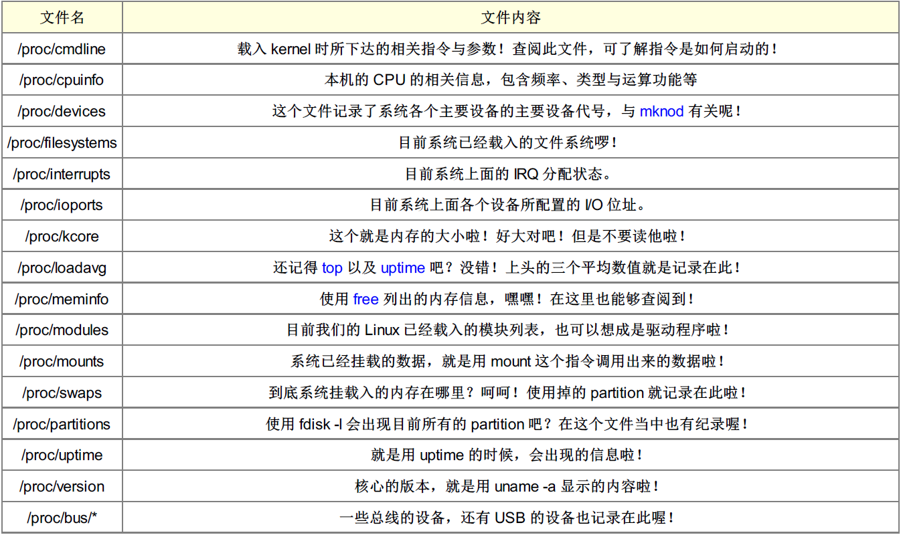
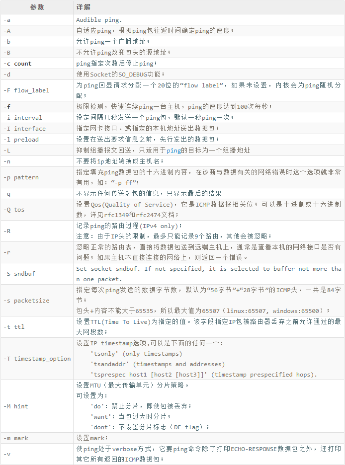

# Linux操作系统
## 基本概念
###软链接和硬链接的区别
- 硬链接是文件的别名，他们公用一个inode，使用的是引用计数，而软链接可以看作是一个文件的快捷方式，会单独创建一个inode
- 删除原文件之后，软链接无法访问，而硬链接仍然可以访问

### buffers和cache的区别
- buffers是缓冲区，是给写入数据加速使用的
- cached是缓存，读取数据时加速使用的

### 目录结构
- /bin：bin 是 Binaries (二进制文件) 的缩写, 这个目录存放着最经常使用的命令。
- /boot：这里存放的是启动 Linux 时使用的一些核心文件，包括一些连接文件以及镜像文件。
- /dev ：dev 是 Device(设备) 的缩写, 该目录下存放的是 Linux 的外部设备，在 Linux 中访问设备的方式和访问文件的方式是相同的。
- /etc：etc 是 Etcetera(等等) 的缩写,这个目录用来存放所有的系统管理所需要的配置文件和子目录。
- /home：用户的主目录，在 Linux 中，每个用户都有一个自己的目录，一般该目录名是以用户的账号命名的，如上图中的 alice、bob 和 eve。
- /lib：lib 是 Library(库) 的缩写这个目录里存放着系统最基本的动态连接共享库，其作用类似于 Windows 里的 DLL 文件。几乎所有的应用程序都需要用到这些共享库。
- /media：linux 系统会自动识别一些设备，例如U盘、光驱等等，当识别后，Linux 会把识别的设备挂载到这个目录下。
- /mnt：系统提供该目录是为了让用户临时挂载别的文件系统的，我们可以将光驱挂载在 /mnt/ 上，然后进入该目录就可以查看光驱里的内容了。
- /opt：opt 是 optional(可选) 的缩写，这是给主机额外安装软件所摆放的目录。比如你安装一个ORACLE数据库就可以放到这个目录下。默认是空的。
- /proc：proc 是 Processes(进程) 的缩写，/proc 是一种伪文件系统（也即虚拟文件系统），存储的是当前内核运行状态的一系列特殊文件，这个目录是一个虚拟的目录，它是系统内存的映射，我们可以通过直接访问这个目录来获取系统信息。
- /root：该目录为系统管理员，也称作超级权限者的用户主目录。
- /sbin：s 就是 Super User 的意思，是 Superuser Binaries (超级用户的二进制文件) 的缩写，这里存放的是系统管理员使用的系统管理程序。
- /srv：该目录存放一些服务启动之后需要提取的数据。
- /tmp：tmp 是 temporary(临时) 的缩写这个目录是用来存放一些临时文件的。
- /usr：usr 是 unix shared resources(共享资源) 的缩写，这是一个非常重要的目录，用户的很多应用程序和文件都放在这个目录下，类似于 windows 下的 program files 目录。
- /var：var 是 variable(变量) 的缩写，这个目录中存放着在不断扩充着的东西，我们习惯将那些经常被修改的目录放在这个目录下。包括各种日志文件。
- /run：是一个临时文件系统，存储系统启动以来的信息。当系统重启时，这个目录下的文件应该被删掉或清除。如果你的系统上有 /var/run 目录，应该让它指向 run。


## 常用操作
### 查看栈帧大小
ulimit -s
### 修改栈帧大小
ulimit -s 102400

### linux下检查内存状态的命令
- free –m：用于检查有关系统RAM的使用情况（查看系统的可用和已用内存）
- vmstat -s(参数)

### linux中改变文件属性的命令
chmod 777 /文件名
文件权限的三元组：rwx
所有者，所有者组内其他用户，其他用户

### 解压缩命令:tar -xvf


### 创建定时任务
- at命令，执行一次就结束，交互式输入任务，输入ctrl+d提交任务，可以通过mail命令查询命令执行结果
- cron命令，可以周期性执行
	- 系统性定时任务：会查看/var/spool/crom、/etc/cron.d、/etc/anacrontab文件夹下的定时任务文件
	- 用户定义任务：可以使用crontba命令配置，存储在var/spool/cron/系统用户 路径下

### linux如何设置开机自启动


### 如何查看服务器运行时间？看是否有重启和宕机？

### 怎么查询24小时内修改过的文件？


### Linux 操作系统挂起、休眠、关机相关命令
- 挂起
	- pm-suspend
	- pm-suspend-hybrid
	- hibernate-ram
- 关机
	- halt 立刻关机
	- poweroff 立刻关机
	- shutdown -h now 立刻关机(root用户使用)
- 休眠
	- pm-hibernate
	- hibernate-disk
- 重启
	- reboot
	- shutdown -r now 立刻重启(root用户使用)

## 神奇的proc
### /proc存在哪里
- /proc存放在根目录下，是一个虚拟文件系统 
- /proc 文件系统是一种内核和内核模块用来向进程 (process) 发送信息的机制 (所以叫做 /proc)。这个伪文件系统让你可以和内核内部数据结构进行交互，获取有关进程的有用信息，所以它存放在内存中而不是磁盘中



### 进程的内存使用情况：/proc/进程号/status

### 释放系统内存缓存：/proc/sys/vm/drop_caches

## 常用命令
### sort
- -f ：忽略大小写的差异，例如 A 与 a 视为编码相同；
- -b ：忽略最前面的空白字符部分；
- -M ：以月份的名字来排序，例如 JAN, DEC 等等的排序方法；
- -n ：使用“纯数字”进行排序（默认是以文字体态来排序的）；
- -r ：反向排序；
- -u ：就是 uniq ，相同的数据中，仅出现一行代表；
- -t ：分隔符号，默认是用 [tab] 键来分隔；
- -k ：以那个区间 （field） 来进行排序的意思

### xargs
参数代换
- -0 ：如果输入的 stdin 含有特殊字符，例如 `, \, 空白键等等字符时，这个 -0 参数
- 可以将他还原成一般字符。这个参数可以用于特殊状态喔！
- -e ：这个是 EOF （end of file） 的意思。后面可以接一个字串，当 xargs 分析到这个字串时，
- 就会停止继续工作！
- -p ：在执行每个指令的 argument 时，都会询问使用者的意思；
- -n ：后面接次数，每次 command 指令执行时，要使用几个参数的意思。
- 当 xargs 后面没有接任何的指令时，默认是以 echo 来进行输出喔！

### find
- 与时间有关的选项：共有 -atime, -ctime 与 -mtime ，以 -mtime 说明
	- -mtime n ：n 为数字，意义为在 n 天之前的“一天之内”被更动过内容的文件；
	- -mtime +n ：列出在 n 天之前（不含 n 天本身）被更动过内容的文件文件名；
	- -mtime -n ：列出在 n 天之内（含 n 天本身）被更动过内容的文件文件名。
	- -newer file ：file 为一个存在的文件，列出比 file 还要新的文件文件名
- 与使用者或群组名称有关的参数：
	- -uid n ：n 为数字，这个数字是使用者的帐号 ID，亦即 UID ，这个 UID 是记录在
	- /etc/passwd 里面与帐号名称对应的数字。这方面我们会在第四篇介绍。
	- -gid n ：n 为数字，这个数字是群组名称的 ID，亦即 GID，这个 GID 记录在
	- /etc/group，相关的介绍我们会第四篇说明～
	- -user name ：name 为使用者帐号名称喔！例如 dmtsai
	- -group name：name 为群组名称喔，例如 users ；
	- -nouser ：寻找文件的拥有者不存在 /etc/passwd 的人！
	- -nogroup ：寻找文件的拥有群组不存在于 /etc/group 的文件！
- 与文件权限及名称有关的参数：
	- -name filename：搜寻文件名称为 filename 的文件；
	- 	-size [+-]SIZE：搜寻比 SIZE 还要大（+）或小（-）的文件。这个 SIZE 的规格有：c: 代表 Byte， k: 代表 1024Bytes。所以，要找比 50KB还要大的文件，就是“ -size +50k ”
	- 	-type TYPE ：搜寻文件的类型为 TYPE 的，类型主要有：一般正规文件 （f）, 设备文件 （b, c）,目录 （d）, 链接文件 （l）, socket （s）, 及 FIFO （p） 等属性。
	- 	-perm mode ：搜寻文件权限“刚好等于” mode 的文件，这个 mode 为类似 chmod的属性值，举例来说， -rwsr-xr-x 的属性为 4755 ！
	- 	-perm -mode ：搜寻文件权限“必须要全部囊括 mode 的权限”的文件，举例来说，我们要搜寻 -rwxr--r-，亦即 0744 的文件，使用 -perm -0744，当一个文件的权限为 -rwsr-xr-x ，亦即 4755 时，也会被列出来，因为 -rwsr-xr-x 的属性已经囊括了 -rwxr--r-的属性了。
	- 	-perm /mode ：搜寻文件权限“包含任一 mode 的权限”的文件，举例来说，我们搜寻-rwxr-xr-x ，亦即 -perm /755 时，但一个文件属性为 -rw-------也会被列出来，因为他有 -rw.... 的属性存在！
- 额外可进行的动作：
	- -exec command ：command 为其他指令，-exec 后面可再接额外的指令来处理搜寻到的结果。
	- -print ：将结果打印到屏幕上，这个动作是默认动作！

查找当前目录以及子目录下以.c结尾的文件，且文件中包含”hello world”的文件的路径：
```
find ./ "*.c" | xargs grep "hello world"
find ./ "*.c" -exec grep "hello world" {} \;
```

### fuser
在这次启动过程中打开了多少文件
-u ：除了程序的 PID 之外，同时列出该程序的拥有者；
-m ：后面接的那个文件名会主动的上提到该文件系统的最顶层，对 umount 不成功很有效！
-v ：可以列出每个文件与程序还有指令的完整相关性！
-k ：找出使用该文件/目录的 PID ，并试图以 SIGKILL 这个讯号给予该 PID；
-i ：必须与 -k 配合，在删除 PID 之前会先询问使用者意愿！
-signal：例如 -1 -15 等等，若不加的话，默认是 SIGKILL （-9） 啰！

### lsof
查出某个程序打开或者使用的文件与设备
-a ：多项数据需要“同时成立”才显示出结果时！
-U ：仅列出 Unix like 系统的 socket 文件类型；
-u ：后面接 username，列出该使用者相关程序所打开的文件；
+d ：后面接目录，亦即找出某个目录下面已经被打开的文件！


### ps
|选项|作用|
|---|---|
|a|不与 terminal 有关的所有 process|
|A|所有的 process 均显示出来|
|u|有效使用者相关的process|
|x|通常与 a 这个参数一起使用，可列出较完整信息|

- 可以确定当前线程是繁忙还是阻塞的命令：ps -axf
- 进程消耗内存占比和排序：ps aux --sort -rss

### ping

欲发送10个分组报文测试与主机http://abc.tuu.edu.cn的连通性，应使用的命令和参数
`ping http://abc.tuu.edu.cn -n 10`

### strace


### pstree
- -A ：各程序树之间的连接以 ASCII 字符来连接；
- -U ：各程序树之间的连接以万国码的字符来连接。在某些终端接口下可能会有错误；
- -p ：并同时列出每个 process 的 PID；
- -u ：并同时列出每个 process 的所属帐号名称。

### top
- -d ：后面可以接秒数，就是整个程序画面更新的秒数。默认是 5 秒；
- -b ：以批次的方式执行 top ，通常会搭配数据流重导向来将批次的结果输出成为文件。
- -n ：与 -b 搭配，意义是，需要进行几次 top 的输出结果。
- -p ：指定某些个 PID 来进行观察监测而已。
- 在 top 执行过程当中可以使用的按键指令：
	- ? ：显示在 top 当中可以输入的按键指令；
	- P ：以 CPU 的使用资源排序显示；
	- M ：以 Memory 的使用资源排序显示；
	- N ：以 PID 来排序喔！
	- T ：由该 Process 使用的 CPU 时间累积 （TIME+） 排序。
	- k ：给予某个 PID 一个讯号 （signal）
	- r ：给予某个 PID 重新制订一个 nice 值。nice值越大，说明优先级越低
	- q ：离开 top 软件的按键。

buffer是块设备的读写缓冲区，比如磁盘，cache是文件系统的缓存，常用于文件
### free
观察内存的使用情况
- -b/m/k/g：表示单位
- -t：显示全部内存
- -s：让系统每几毫秒输出几次
- -c：与-s同时处理，让free列出几次
- -l：显示高低内存的利用率

### fdisk
MBR 分区表请使用 fdisk 分区， GPT 分区表请使用 gdisk 分区

### df
显示分区的使用情况
- -a ：列出所有的文件系统，包括系统特有的 /proc 等文件系统；
- -k ：以 KBytes 的容量显示各文件系统；
- -m ：以 MBytes 的容量显示各文件系统；
- -h ：以人们较易阅读的 GBytes, MBytes, KBytes 等格式自行显示；
- -H ：以 M=1000K 取代 M=1024K 的进位方式；
- -T ：连同该 partition 的 filesystem 名称 （例如 xfs） 也列出；
- -i ：不用磁盘容量，而以 inode 的数量来显示


### du
显示目录或文件的大小
-a ：列出所有的文件与目录容量，因为默认仅统计目录下面的文件量而已。
-h ：以人们较易读的容量格式 （G/M） 显示；
-s ：列出总量而已，而不列出每个各别的目录占用容量；
-S ：不包括子目录下的总计，与 -s 有点差别。
-k ：以 KBytes 列出容量显示；
-m ：以 MBytes 列出容量显示；

### iptables
- /etc/init.d/iptables stop        #关闭iptables命令
- iptables -nL                        #查看iptables详细策略信息
- iptables -A INPUT -p tcp --dport 8080 -j ACCEPT            #放通入方向的8080端口
- iptables -A OUTPUT -p tcp --sport 8080 -j ACCEPT        #放通出方向的8080端口
- iptables  -F：清除所有制订的规则
- iptables  -X：清除所有用户“自定义”的chain
- iptables  -Z：将所有chain的计数与流量统计都归零
- iptables --line -vnL INPUT                #显示入方向所有策略
- iptables -t filter -D INPUT 2                #删除入方向的第二条策略

https://blog.csdn.net/weixin_44792344/article/details/109674599?spm=1001.2101.3001.6661.1&utm_medium=distribute.pc_relevant_t0.none-task-blog-2%7Edefault%7EBlogCommendFromBaidu%7ERate-1-109674599-blog-121248469.pc_relevant_vip_default&depth_1-utm_source=distribute.pc_relevant_t0.none-task-blog-2%7Edefault%7EBlogCommendFromBaidu%7ERate-1-109674599-blog-121248469.pc_relevant_vip_default&utm_relevant_index=1
https://blog.csdn.net/qq_42975225/article/details/121248469

### route
- 查看路由表信息 route -n（不进行DNS解析）
	- U表示up状态
	- G表示网关路由器
	- H表示是一个主机
	- ！表示该路由已被禁止
- 删除默认网关地址：route del default
- 增加默认网关地址：route add default gw 192.168.172.8


### iostat
记录从开机到现在，磁盘已经存取多少数据
- -c ：仅显示 CPU 的状态；
- -d ：仅显示储存设备的状态，不可与 -c 一起用；
- -k ：默认显示的是 block ，这里可以改成 K Bytes 的大小来显示；
- -m ：与 -k 类似，只是以 MB 的单位来显示结果。
- -t ：显示日期出来；

### netstat
- -a：所有
- -A 网络类型：列出与该网络类型相关的地址
- -c：持续列出网络状态
- -C：显示路由器配置的cache信息
- -e：显示inode和user等信息
- -n：直接使用IP地址，而不使用域名解析
- -r：显示路由表
- -t/-u：tcp/udp
- -l：列出所有监听中的服务器socket
- -x：监听unix端口
- -p：显示正在使用 Socket 的程序识别码和程序名称

查看占用端口的进程netstat netstat -anp | grep port

### vmstat
虚拟内存统计，侦测系统资源变化
- -a ：使用 inactive/active（活跃与否） 取代 buffer/cache 的内存输出信息；
- -f ：开机到目前为止，系统复制 （fork） 的程序数；
- -s ：将一些事件 （开机至目前为止） 导致的内存变化情况列表说明；
- -S ：后面可以接单位，让显示的数据有单位。例如 K/M 取代 Bytes 的容量；
- -d ：列出磁盘的读写总量统计表
- -p ：后面列出分区，可显示该分区的读写总量统计表
- vmstat 1 3：统计目前主机 CPU 状态，每秒一次，共计三次

- 程序字段 （procs） 的项目分别为：
	- r ：等待运行中的程序数量；b：不可被唤醒的程序数量。这两个项目越多，代表系统越忙碌 （因为系统太忙，所以很多程序就无法被执行或一直在等待而无法被唤醒之故）。
- 内存字段 （memory） 项目分别为：
	- swpd：虚拟内存被使用的容量； free：未被使用的内存容量； buff：用于缓冲内存； cache：用于高速缓存内存。 这部份则与 free 是相同的。
- 内存交换空间 （swap） 的项目分别为：
	- si：由磁盘中将程序取出的量； so：由于内存不足而将没用到的程序写入到磁盘的 swap 的容量。 如果 si/so 的数值太大，表示内存内的数据常常得在磁盘与内存之间传来传去，系统性能会很差！
- 磁盘读写 （io） 的项目分别为：
	- bi：由磁盘读入的区块数量； bo：写入到磁盘去的区块数量。如果这部份的值越高，代表系统的 I/O 非常忙碌！
- 系统 （system） 的项目分别为：
	- in：每秒被中断的程序次数； cs：每秒钟进行的事件切换次数；这两个数值越大，代表系统与周边设备的沟通非常频繁！ 这些周边设备当然包括磁盘、网卡、时间钟等。
- CPU 的项目分别为：
	- us：非核心层的 CPU 使用状态； sy：核心层所使用的 CPU 状态； id：闲置的状态； wa：等待 I/O 所耗费的 CPU 状态； st：被虚拟机（virtual machine） 所盗用的 CPU 使用状态 （2.6.11 以后才支持）。


### tcpdump
- host IP：IP的收发包都可以被捕获到
- src/dst IP：源/目的为IP的才可以被捕获
- net IP/mask：捕获这一网段
- port P：捕获P端口的报文，对于一些固定的协议，可以使用协议名
- portrange P-Q：捕获P到Q端口的报文
- -i：指定监听哪个网卡，any会监听所有端口
- -w xxx.pcap：保存抓包信息
- -W n：指定只创建n个文件，循环写入
- -r xxx.pcap：读取抓包文件信息，可以使用前面的规则过滤
- -n：不把IP转化成域名
- -nn：IP和端口都不转换成域名
- -N：不打印出主机的域名
- -t：每行的输出中不输出时间
- -tt：每行输出中会输出时间戳
- -ttt：每两行输出的时间间隔（ms）
- -tttt：每行打印的时间戳之前添加日期打印
- -v：产生详细的信息，包括TTL，id标识，数据包长度，IP包的选项，附加包的完整性检测
- -vv：更详细的信息，比如NFS回应包中的附加域
- -vvv：
- -c：指定抓取数据包的数目
- -C：需要与W配合使用，指定输出文件的大小，以MB为单位，写满之后会新创建一个文件
- -Q in/out/inout：选择入方向或出方向
- -q：简洁打印输入输出，只打印很少的信息
- -D：显式所有可用网络的列表
- -L：列出网络接口的已知数据链路（比如Ethernet）
- -s：指定每个包捕获的长度（字节），超过截断并在输出后面增加一个[|proto]
- -A：以ASCII格式打印出所有分组，并将链路层的头最小化
- -X：以十六进制和ASCII字符串打印报文的全部数据
- -b：数据链路层上选择协议，包括ip/arp/rarp/ipx都在这一层
- -e：在输出行打印出数据链路层的头部信息
- -F filename：从指定的文件中读取表达式，忽略其他的外部的表达式
- -l：使标准输出变为缓冲形式，可以数据导出到文件`tcpdump -l | tee dat`


### ipcs
```
ipcs -mqs
```
可以用于查看当前系统使用的共享内存（m）、共享队列（q）、信号量（s）的使用情况，常用于多进程通信
-c：查看创建者和所有者
-l：IPC资源的限制信息
-p：IPC资源的创建者和使用的进程ID
-t：最新调用IPC的详细时间
-u：查看资源状态的汇总信息

### ipcrm
```
ipcrm -mqs $id
```
其中大写表示通过key来删除，小写表示通过id号来删除

### awk
文本报告生成器（格式化文本）
- awk语法
`awk [option] 'pattern[action]' file....`
- 内置变量

|变量|解释|
|--|--|
|$n|指定分隔符后当前记录的第n个字段|
|$0|完整的输入记录|
|FS|字符按分隔符，默认是空格|
|NF|分割后，当前行一共有多少字段|
|NR|当前记录数，行数|
|ARGC|          命令行参数个数|
|FILENAME|    当前输入文档的名称|
|FNR    |         当前输入文档的当前记录编号，尤其当有多个输入文档时有用|
|NR     |          输入流的当前记录编号|
|NF    |           当前记录的字段个数|
|FS （-F） |    字段分隔符 　　　　　　　|
|OFS    |    输出字段分隔符，默认为空格|
|ORS   |     输出记录分隔符，默认为换行符\n|
|RS     |     输入记录分隔符，默认为换行符\n|

```
//加上逗号之后可以在输出时加上默认分隔符——空格
awk '{print $1,$4,$5}' chaoge.txt		
//自定义输出内容，必须是外层单引号，内层双引号
awk '{print "第一列："$1,"第二列："$4}' chaoge.txt  
//处理多个文件显示行号
awk '{print NR,$0}' chaoge.txt luffe.txt		//显示所有的行号，将两个文件看作一个文件
awk '{print FNR,$0}' chaoge.txt luffe.txt		//分别显示两个文件的行号

```

- 自定义变量
```
awk -v myname="jch" 'BEGIN{print "my name is?", myname}'
awk -v myname=$NAME 'BEGIN{print "my name is?", myname}'	//其中NAME是一个全局变量
```


- 参数

|参数|解释|
|--|--|
|-F|指定分割字符段|
|-v|定义或修改一个awk内部变量|
|-f|从脚本文件中读取awk命令|

```
//显示文件第五行
awk 'NR==5{print $0}' chaoge.txt 
//显示文件2-5行
awk 'NR==2,NR==5{print $0}' chaoge.txt 
//给每一行添加行号
awk '{print NR,$0}' chaoge.txt 
//显示文件3到5行且输出行号
awk 'NR==3,NR==5{print NR,$0}' chaoge.txt 
//显示文件第一列，倒数第二和最后一列
awk '{print $1,$(NF-1),$(NF)}' chaoge.txt
//输出IP地址
ifconfig ens33 | awk 'NR==2{printf $2}'
//指定输入分隔符
awk -F ":" '{print $1}' pwd.txt
awk -v FS=":" '{print $1}' pwd.txt
//指定输出分隔符
awk -F ":" -v OFS=":" '{print $1}' pwd.txt
```

- 模式

|模式|解释|
|--|--|
|BEGIN|在开始之前执行|
|END|在结束之后执行|
|关系运算符|执行满足关系运算符的语句|
|~|正则匹配|


- 格式化输出
	- print会自动换行输出，而printf需要指定格式输出
	- -表示左对齐，默认右对齐
	- +表示显示数值符号，`printf "%d"`

```
//在每一列的文本前面都加上对应的汉字
awk 'printf "第一列：%s， 第二列：%s，   第三列：%s\n", $1, $2, $3}' yu.txt
//正则表达式匹配
awk '/^games/{print $0}' pwd.txt
//找出禁止登陆的用户名单
awk '/\/sbin\/nologin$/{print $0}' pwd.txt
//找出文件区间的内容
awk '/^operator/,/^ntp/{print $0}' pwd.txt
//ngingx日志
//统计访客日志的IP数量
awk '{print $1}' access.log | sort -n | uniq | wc -l
//查看访问最多的前10个IP
awk '{print $1}' access.log | sort -n | uniq -c | sort -nr | head -10

```

练习题：
```
//在当前系统中打印出所有普通用户和家目录
cat /etc/passwd | awk -F ":" '$3>=1000{print $1,"\t\t", $6}'
//给/tmp/chaoge.txt文件的前五行添加#
awk 'NR<6{printf "#",$0}' chaoge.txt
//统计文本信息
//显示所有的电话号码
awk -F "[ :]" '/!^$/{print $4}' tel.txt
//显示tom的电话
awk -F "[ :]" '/!^Tom/{print $4}' tel.txt
//显示D开头的姓
awk -F "[ :]" '$2~/^D/{print $2}' tel.txt
//显示mike的捐款信息，在每一款前加上美元符
awk -F "[ :]" '/^Mike/{print "$"$(NF-2),"$"$(NF-1),"$"$(NF)}' tel.txt
```


### sed
stream editor：流编辑器，文本编辑工具
工作原理：从文件中每次读取一行，放入模式空间，进行模式匹配，如果匹配失败则输出到屏幕（可以被取消），成功则处理后输出到屏幕
sed 选项 内置命令字符 文件
选项：

|参数选项|解释|
|--|--|
|-n|取消默认输出，常与命令p一起使用|
|-i|直接将修改结果写入文件，否则只是将结果输出出来，然后修改内存中的数据，没有修改磁盘上的数据|
|-e|多次编辑，不需要管道符|
|-r|支持正则扩展|

内置命令：

|命令字符|解释|
|---|---|
|a|追加，在指定行后面添加一行/多行文本|
|d|删除匹配行|
|i|插入文本，在指定行前添加一行/多行文本|
|p|打印匹配行的内容|
|s/正则/替换内容/g|匹配正则内容，然后替换内容，结尾为g表示全局搜索|

匹配范围：

|范围|解释|
|--|--|
|空地址|全文|
|单地址|指定文件的某一行|
|/pattern/|被模式匹配到的每一行|
|范围区间|10，20表示10到20行|
|步长|1~2表示1，3，5，7，9行|

```
sed "2,3p" test.txt -n		输出2和3两行
sed "/linux/p" test.txt -n	输出含有linux的行
sed "/linux/d" test.txt -n	删除含有linux的行
sed '5,$d' test.txt -n		删除第5行以后的数据
sed "s/My/I/g" test.txt -n	把My替换成I
sed -e "s/I/My/g" -e "s/123/321/g" test.txt -n	多次替换
sed "2a hhhhhh" test.txt -n	在第2行后面增加一行，添加多行可以使用\n
sed "a ------" test.txt -n	所有行后面添加数据
```
实战：打印网卡eth0的IP地址
```
ifconfig eth0 | sed "2p" -n | sed -e "s/^.*inet//" -e "s/net.*$//"
```
练习题：
```
//替换文件的root为chaoge，只替换一次和替换所有
sed 's/root/chaoge/' pwd2.txt
sed 's/root/chaoge/g' pwd2.txt
//替换文件的root为chaoge，且仅仅打印替换的结果
sed 's/root/chaoge/gp' pwd2.txt -n
//替换前十行b开头的用户，改为C，且仅仅打印替换的结果
sed -n '1,10s/^b/C/p' pwd2.txt
//替换前十行b开头的用户，改为C，且将m开头的行改为M，且仅仅打印替换的结果
sed -n -e '1,10s/^b/C/p' -e 's/^m/M/p' pwd2.txt
//删除4行后面所有
sed '4,$d' pwd2.txt
//删除从root开始到ftp之间的行
sed '/^root/,/^ftp/d' pwd2.txt
//将文件中空白字符开头的行添加注释符
sed -e 's/^[[:space:]]/#^[[:space:]]/g' -e 's/^$/#/g' lover.txt
//删除文件的空白和注释行
sed -e '/^#/d' -e '/^$/d' lover.txt
//给文件的前三行添加@符号
sed -r '1,3s/(^.)/@\1' lovers.txt'
//取出ip地址
ifconfig eth0 | sed '2p' -n | sed 's/^.*inet//' | sed 's/netmask.*//'
ifconfig eth0 | sed '2s/^.*inet//;s/netmask.*//p' -n
//找出系统版本
cat /etc/issue | sed -r 's/^.*release[[:space:]]([^.]+).**/\1/p' -n
//
//
```


### grep
文本过滤工具
grep 参数 正则表达式 文件名

|参数|解释说明|
|--|--|
|-v|排除匹配结果|
|-n|显示匹配行与行号|
|-i|不区分大小写|
|-c|只统计匹配的行数|
|-E|使用增强版指令|
|--color=auto|添加颜色|
|-w|只匹配过滤的单词|
|-o|只输出匹配的内容，不会输出整行|

练习题：
```
//输出有关root的行
grep "root" test.txt
//找出root开头的行
grep "^root" test.txt
//以root或以yu开头的行
grep -E "^(root|yu)" test.txt
grep -E "^(root|yu)\>" test.txt		//>表示单词的结束
//过滤出bin开头的行且显示行号
grep "^bin" test.txt -n
//过滤出除了bin开头的行
grep "^bin" test.txt -v
//统计yu用户出现的次数
grep -c "^yu" test.txt
//匹配yu用户，最多2次
grep -m 2 "^yu" test.txt
//匹配多文件，列出存在信息的文件名字（不列出具体的匹配内容）
grep "yu" -l test1.txt test.txt test2.txt
//显示文件中不以/bin/bash结尾的行
grep -v "/bin/bash$" test.txt
//找出文件中的两位数或三位数
grep -E "\<[0-9]{2,3}\>" test.txt
//找出文件中以至少一个空白字符开头，后面是非空字符的行
grep -E "^[[:space::]].*" test.txt
grep -E "^[[:space::]]+[^[:space::]]" test.txt
//找出文件中所有大小写i开头的行
grep -E "^(i|I)" test.txt
//找出系统上root、yu、nobody用户信息
grep -E "^\<(root|yu|nobody)\>" test.txt
//找出文件中所有函数名
grep -E "[a-zA-Z]+\(\)" test.txt
//找出用户名和shell相同的用户
grep -E "^([^:]+\>).*\1$" /etc/pwd
```

### free

### df

### fdisk

### iostat

### iptable

### nm

### ldd


## 正则表达式
通配符用于查找文件或目录，正则表达式用于在文件或数据流中过滤内容
### 普通正则表达式
| 符号 | 作用 |
|----|----|
|^|用于模式的最左侧，表示以后面所跟字符串开始的行|
|$|用于模式的最右侧，表示以后面所跟字符串结束的行|
|^$|空行|
|.|匹配任意一个且只有一个字符，不能匹配空行|
|\|转义字符|
|*|匹配前一个字符连续出现一次或0次以上，0次表示空，即匹配全部内容|
|.*|匹配任意字符|
|^.*|匹配任意多个字符开头的内容|
|.*$|匹配以任意多个字符结尾的内容|
|[abc]|匹配集合内任意一个字符或者[a-c]|
|[^abc]|匹配除了abc以外的字符|

### 扩展正则表达式
| 符号 | 作用 |
|----|----|
|+|匹配前一个字符1次或多次|
|[]+|匹配括号内的一次或多次|
|?|匹配前一个字符0次或1次|
|\||表示或者，同时过滤多个字符串|
|()|分组过滤，被括起来的内容表示一个整体|
|a{n,m}|匹配前一个字符最少n次，最多m次|
|a{n,}|匹配前一个字符最少n次|
|a{n}|匹配前一个字符恰好n次|


# 常用工具使用


## gdb
### 调试普通程序
+ 编译程序时需要加上-g选项
+ gdb 程序名：开始调试该程序
+ b 行号：在该行设置断点
+ r：运行到断点处停止
+ n：执行当前行语句，如果是函数，不进入函数执行
+ s：执行当前行语句，如果是函数，进入函数执行，如果没有函数源码，则不能进入
+ p 变量名：显示当前该变量的值
+ c：继续执行到下一个断点
+ set var 变量名=值：设置变量为该值
+ set args 参数：使用参数作为程序输入进行调试
+ q：退出

### 调试core文件
可以通过`ulimit -c unlimited`把core文件大小设置为无限制
+ gdb 程序名 core文件名：查看core文件中产生错误的行
+ bt：查看函数的调用栈

### 调试正在运行中的程序gdb 
+ gdb 程序名 -p 进程号：程序停止

### 调试多进程的程序
+ set follow-fork-mode parent：调试父进程
+ set follow-fork-mode child：调试子进程
+ set detach-on-fork on/off：调试当前进程时，其他进程继续运行（on）
+ info inferiors：查看正在调试的进程号
+ inferior 进程id：切换到该进程

### 调试多线程的程序
+ info threads：查看当前调试的线程
+ therad 线程id：切换线程
+ set scheduler-locking on/off：只运行当前线程
+ thread apply 线程id/all cmd：指定某线程/全部线程执行某gdb命令

### gdb查看堆栈中所有遍历

### gdb查看shared_ptr指向的内容


step和next的区别？
当前line有函数调用的时候,next会直接执行到下一句 ,step会进入函数.

查看内存
(gdb)p &a //打印变量地址

(gdb)x 0xbffff543 //查看内存单元内变量

0xbffff543: 0x12345678

(gdb) x /4xb 0xbffff543 //单字节查看4个内存单元变量的值

0xbffff543: 0x78 0x56 0x34 0x12

多线程调试
(gdb) info threads：查看GDB当前调试的程序的各个线程的相关信息

(gdb) thread threadno：切换当前线程到由threadno指定的线程

break filename:linenum thread all   在所有线程相应行设置断点，注意如果主线程不会执行到该行，并且启动all-stop模式，主线程执行n或s会切换过去

set scheduler-locking off|on\step    默认off，执行s或c其它线程也同步执行。on，只有当前线程执行。step，只有当前线程执行

show scheduler-locking          显示当前模式

thread apply all command        每个线程执行同意命令，如bt。或者thread apply 1 3 bt，即线程1，3执行bt。

查看调用堆栈
(gdb)bt

(gdb)f 1 帧简略信息

(gdb)info f 1 帧详细信息

断点
b test.cpp:11

b test.cpp:main

gdb attach 调试方法：

gdb->file xxxx->attach pid->这时候进程是停止的->c 继续运行

带参数调试
输入参数命令set args 后面加上程序所要用的参数，注意，不再带有程序名，直接加参数，如：

(gdb)set args -l a -C abc

list命令
list　linenum　　显示程序第linenum行的周围的程序

list　function　　显示程序名为function的函数的源程序
## valgrind
### 作用
在运行程序时监视内存的使用情况，比如C 语言中的malloc和free或者 C++中的new和 delete，快速定位到内存泄漏或者非法访问内存地址等。
### 使用
编译时需要加上g选项，然后执行下面两个中的一个
```
valgrind --tool=memcheck ./xxx
valgrind --leak-check=full ./xxx
```
- definitely lost：确定产生内存泄漏
- indirectly lost：间接产生内存泄漏
- possibly lost：可能存在内存泄漏
- still reachable：即使在程序结束时候，仍然有指针在指向该块内存，常见于全局变量


## git


