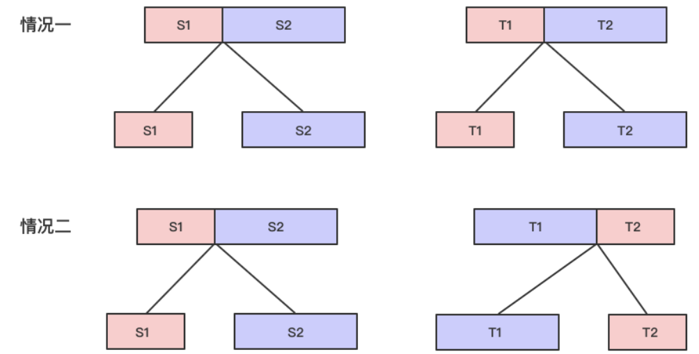

# 动态规划

## 一维路径问题
本质上就是路径问题，有的问题需要条件，就要判断能否到达，对于不需要条件的，直接累加就行
### 70、爬楼梯
### 91、解码方法
需要判断前一个数能否到达且当前数是否有效和前两个数能否到达且前一个数和当前数组合是否有效这两个条件
### 96、不同的二叉搜索树
n个节点的二叉树可以看作1节点和n-2个节点的二叉树的组合，2节点和n-3个节点二叉树的组合……只要把这些加起来就可以
### 198、打家劫舍
有两种选择，分别是：打劫当前这一家然后加上两家前得到的结果，和 不打劫当前这一家就是上一家的结果
### 213、打家劫舍-II
两种情况，从第一家到倒数第二家，第二家到倒数第一家，按照上题计算
### 139、单词拆分
dp[i]表示到第i+1个字母是否可以由单词表组成，为了要得到这个值，需要遍历前面的所有位置如果位置j恰好可以由单词表中的单词组成且第i~j的字母也在单词表中，那么就意味着这个位置可以由单词表组成
### 279、完全平方数
dp数组记录这个数最少由多少个完全平方数组成，如果恰好是完全平方数就是1。
为了减少时间，只向前找`j*j`个数，即`d[i-j*j]`
### 300、最长递增子序列
dp[i]表示到i处的最长递增子序列，遍历i之前的所有点，如果有一个点j小于i处的数，就dp[i]=max(dp[i],dp[j]+1).
### 673、最长递增子序列的个数
在上一题的基础上再加上一个表示有多少个子序列的数组cnt，如果从点j处更新过来的，那么就说明有cnt[j]个最长递增子序列，如果和从点j处一样那么说明可以从多条路径过来，还需要再加上这条路径上的个数。同理还要统计全局的最大值
### 343、整数拆分
一个数i可以通过j和i-j计算到这一点处的值，有两种途径，即拆分i-j和不拆分i-j，分别是dp[i-j]和i-j
### 357、统计各位数字都不同的数字个数
dp[i]表示i位有多少符合条件的数字，可以直接有前面递推过来，一方面是i-1位已有的数字的数量，另一方面是新增的数字的数量，这一部分可以通过计算有且仅有i-1位数字乘上还没有用的数字的数量得到
### 368、最大整除子集
可以先记录最大长度，然后再倒序遍历一次，即可得到最大子集。
### 376、摆动序列
down[i]表示以第i个结尾的序列中最后两位数字是下降的
up[i]表示以第i个结尾的序列中最后两位数字是上升的
如果当前数字和前一个数字是上升关系，那么最长的上升子序列一定是到前一个数字的上升子序列和前一个数字的下降子序列+1中最长的，即分别对应是否选择该数作为上升子序列的一部分，而对于下降子序列来说，就一定是和前一个的下降子序列一样了。
### 338、比特位计数
如果是偶数i，那么就和i/2的1的个数一样，否则就是+1

## 二维路径问题
### 62、不同路径
### 63、不同路径II
### 64、最小路径和
### 120、三角形最小路径和
### 542、01矩阵
dp[i][j]表示(i,j)这一点处到最近的0的距离，首先把所有0处的dp都记为0，然后分别左上到右下和从右下到左上遍历整个二维矩阵，一点处最多可以从四个方向更新，选取四个方向中最小值+1即可
### 576、出界的路径数***
遍历整个数组maxmove次，每次都从已经被走过的地方向四周扩展一次范围。

### 174、地下城游戏***
由于从左上到右下遍历需要记录两个数据，所以考虑从右下向左上遍历。
每一点都表示到达该点时应该有的最小的健康点数（减该点值之前）

## 子数组问题——一维dp
### 53、最大子数组和
和到前一个位置的最大和相加，如果比当前位置的值小，就以当前位置为起始值开始加
### 152、乘积最大子数组
dp[i]表示到这一点处的乘积最大子数组，和上一题一样，但是由于存在负负得正的最大子数组，所以还需要有一个数组用来存最小值，每一个最大值和最小值都要从最大、最小和当前值之中取出。

## 子序列问题——二维dp

## 带状态dp——二维dp
### 257、粉刷房子

### 121、买卖股票的最佳时机-I
只有两种状态，即持有和不持有，且只有四种转移方式，即保持持有、保持不持有、持有转不持有、不持有转持有。所以每一点的收益都从上一个状态中取值。
持有的状态来自于保持之前的持有状态和今天买入，而不持有的状态来自于保持之前不持有的状态和今天卖出。
### 122、买卖股票的最佳时机-II
允许任意次数的买卖就意味着买入时需要在上一次卖出的基础上进行操作
### 123、买卖股票的最佳时机-III
记录五种状态，分别是无操作，第一次持有，第一次不持有，第二次持有和第二次不持有
### 188、买卖股票的最佳时机-IV
同上
### 309、买卖股票的最佳时机含冷冻期
有四种状态，分别是不持有（包括原本就不持有和冷冻期之后不持有），持有，当前卖出，冷冻期。

### 714、买卖股票的最佳时机含手续费
同II，只需要减去一个手续费即可

## 两序列dp——二维dp
### 718、最长重复子数组
因为是子数组，所以只看两个序列的前一个状态即可
`dp[i+1][j+1] = dp[i][j]+1;`

## 一维数据转二维dp
这种题就是表示一个区间内的结果
### 516、最长回文子序列
注意遍历顺序即可，dp[i][j]表示从i到j的最长回文子序列，如果s[i]==s[j]就从i+1到j-1的最长序列距离+2，否则就和i+1到j或者i到j-1一样长
### 486、预测赢家
dp[i][j]表示字符串从第i位到第j位区间当前玩家和另一玩家差值的最大值，如果当前玩家选择了前面的，就是nums[i]-dp[i+1][j]，如果选择的是最后的，就是nums[j]-dp[i][j-1]。
### 132、分割回文串2
首先通过dp判断每一个子串是否是回文串，然后通过dp去计算到第i位最少可以分割成多少个回文串
### 312、戳气球
假设戳k的时候左右两边是i和j，那么i到j区间内的最大值就是i到k的最大值加上k到j的最大值再加上戳k的值。

## 两个字符串dp
本质是字符串匹配问题，二维数组的每一个点dp[i][j]都表示字符串s1的0-i对字符串s2的0-j的匹配情况
### 10、正则表达式匹配
匹配有三种情况：
- 两个字符相等或者p中该字符是.，那么直接`dp[i][j] = dp[i][j]|dp[i-1][j-1];`
- 如果当前字符是*，那么有三种情况，一种是不匹配前一个字符，一种是匹配前一个字符1次，还有匹配前一个字符多次
	- 不匹配前一个字符就要看s的i和p的j-2是否能匹配，即`dp[i][j] = dp[i][j]|dp[i][j-2];`
	- 匹配了前一个字符，就要看s的i和p的j-1是否能匹配，即`dp[i][j] = dp[i][j-1]`
	- 匹配了前面多个字符，就要看s的i-1和p的j，即`dp[i][j] = dp[i-1][j]`

### 44、通配符匹配
- 两个字符相等或者p中该字符是?，那么直接`dp[i][j] = dp[i][j]|dp[i-1][j-1];`
- 如果p中该字符是*
	- 对于s为空字符串，就看p中的前一个是否匹配，即dp[i][j] = dp[i][j-1]
	- 如果是非空，有两种情况
		- 匹配了前面多个字母，即dp[i][j] = dp[i-1][j]
		- 没有匹配任何字母，即dp[i][j] = dp[i][j-1]

### 87、扰乱字符串

有两种情况，分别是s1->t1, s2->t2 和s1->t2, s2->t1
可以用一个数组dp[i][j][w]表示是否成立，其中i表示s1的起始位置，j表示t1的起始位置，w表示s1的长度，len表示s1+s2的长度
- 对于第一种情况可以表示为 dp[i][j][w]&&dp[i+w][j+w][len-w]
- 第二种情况可以表示为：dp[i][j+len-w][w]&&dp[i+w][j][len-w]

### 97、交错字符串
看s1的第i个或s2的第j个是否和s3的i+j-1相等，如果相等，就从s1或s2的状态继续向下走

## 背包问题
**先创建一个大小为背包大小+1的一维数组（因为0用不上）。
如果不允许重复放入，就是01背包问题，这种问题就先遍历物品，然后倒序遍历物背包容量
如果允许重复放入，就是完全背包问题，全部正序遍历，如果是求组合数，就外层遍历物品，内层遍历背包；如果是排列数，就外层遍历背包，内层遍历物品。**
### 416、分割等和子集
### 494、目标和
### 474、一和零
### 377、组合总数

## 编辑距离

## 无法分类的
### 467、环绕字符串中唯一的子字符串
以整个字母表作为dp数组，其中dp[i]表示字母表中以第i个字母结尾的最长子串。所以还需要用l来记录当前子串长度，并且最后更新dp[i]

## 状态压缩+动态规划
### 464、我能赢吗
### 473. 火柴拼正方形
### 526、优美的排列

## 无相关性的反向遍历
### 179、地下城游戏
### 312、戳气球

