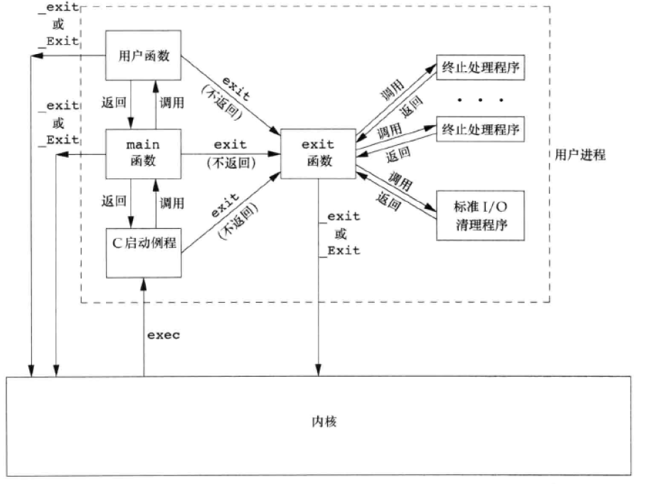
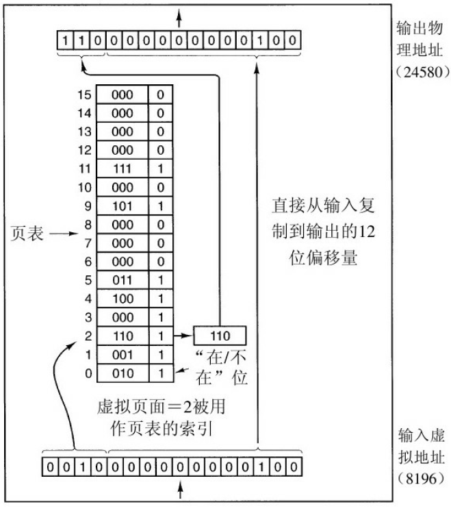
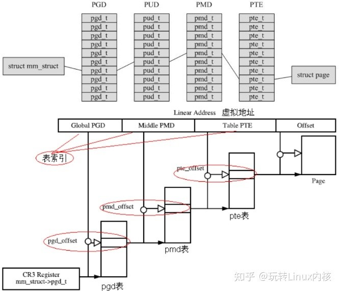

# 进程间通信
## 基础知识
### 管道pipe的用法
PIPE只能在有亲缘关系的进程之间通信，即需要先创建一个pipe，得到读和写的文件描述符，pipefd[0]用于读，pipefd[1]用于写，即pipefd[1]的输出是pipefd[0]的输入，然后再创建一个子进程。由于pipe的具体实现不同，部分版本的pipe只支持单工通信，所以为了平台间的可移植性，通常打开两个pipe，然后父子进程各关闭一个读和一个写，这样就可以建立起父子进程之间的双向连接。由于pipe是通过文件描述符作为接口实现的，所以如果exec的时候关闭了所有的文件，就无法进行通信。

### pipe读写异常的各种情况
- 如果读取一个空管道，会阻塞在read，直到管道中有数据；
- 如果写一个满的管道，会阻塞在write，直到管道中有空间可以写；
- 如果读端关闭，即fd[0]的引用计数变为0，则写操作会触发SIGPIPE信号；
- 如果写端关闭，即fd[1]的引用计数变为0，则将管道中所有数据读完之后会读到EOF；

### FIFO的用法
FIFO提供无亲缘关系的进程之间的通信，需要先用makefifo/makefifoat创建一个FIFO文件，然后以只读或只写的方式打开这个文件，就可以和其他的进程进行通信。

### FIFO和管道的区别
- 管道的pipe函数直接创建并打开，不需要单独打开，而FIFO在创建之后必须要调用open打开，因此如果需要设置一些特殊属性时，管道需要通过fcntl才能实现
- 所有的管道在进程关闭之后都会被关闭，而fifo则需要调用unlink才能从文件中删除。一般是由最终对FIFO进行操作的进程删除FIFO文件
- FIFO可以在没有亲缘关系的进程间通信
- 管道在fork之后，读写端口都被打开，因此需要关闭一个用不到的端口，而FIFO是默认没有打开，需要以读或写的方式打开fifo文件
- 双向管道可以随意关闭用不到的端口。而双向FIFO打开端口有顺序要求，两个进程必须有一个先读后写，另一个先写后读，否则会造成死锁。如果两个都是先读后写，或先写后读，会阻塞在这条语句，即只有当一个fifo文件的读写两端都被打开才可以，否则会一直阻塞。

### 消息队列的用法
消息队列是一种在进程间传递二进制块数据的一种方式，每个数据块都有一个特定的类型，接受方可以根据类型有选择地接收数据。

### 消息队列中异步信号的通知
信号的通知有三种情况，通过mq_notify第一个参数sigev_notify设置
- 不通知：SIGEV_NONE
- 信号通知：SIGEV_SIGNAL
	- sigev_signo是感兴趣的信号，当这个信号到来时，才发送
	- sigev_value是希望通过信号传递的数据，它是一个共用体，如果希望传递一个int类型的数据，就用第一个，如果传的数据很多，就创建一个结构体，通过第二个void类型的指针传递。
- 创建线程：SIGEV_THREAD
	- (*sigev_notify_function) (union sigval)：设置的是当等待的状态发生时，调用这个函数创建线程进行处理，通过sigval传进的参数
	- sigev_notify_attributes：如果非空，则应该是一个指针，用于设置线程属性
	- sigev_notify_thread_id：设置一个线程，当等待的状态发生时，向这个线程发信号，否则可能进程中的任意线程都可能收到该信号


### 信号量的用法
当多个进程同时访问系统上的某个资源时，需要考虑进程间同步的问题，即确保任一进程能够对资源进行独占式的访问，确保任一时刻只有一个进程能够进入临界区。
和互斥锁不同，互斥锁是在进程内部创建的一个mutex类型的变量，而信号量是一个linux系统下的文件，需要创建文件之后才可以进行操作。
信号量保证了对资源的独占式访问，它只能取自然数值并且仅支持两种操作，即PV操作，也就是进入临界区和退出临界区。对于P操作，如果信号量大于0，就将其减1，如果为0，就挂起进程等待直到大于0；反之，对于V操作，如果有其他的进程因为等待该信号量而挂起，就唤醒这个进程，如果没有，就将信号量加1（实际上全部都是对信号量加1，当有进程被挂起了，加1操作就会唤醒这个进程，此时信号量仍然为0）
在POSIX体系中，P操作是sem_wait，V操作是sem_post

### 共享内存的用法
共享内存是最高效的IPC机制，不涉及进程间任何的数据传输。它直接分配一个共享空间，每个进程都可以直接访问，就像访问进程自己的空间一样快捷方便，不需要陷入内核态或者系统调用。
其他的IPC机制中，服务器首先把文件从内核读到进程中，进程把文件写入进程中的IPC，客户端从IPC中把数据复制到进程中，最后再把数据从进程中复制到内核中。而共享内存则直接把服务器控制文件内容从内核中映射到共享内存区中，客户端从共享内存区中直接把文件内容读出到内核中。
对于system V系统，使用时，首先使用shmget获取一段共享内存区，然后使用shmat将其关联到进程的地址空间中，接下来就可以使用shmctl对共享内存区进行操作了
对于POSIX系统，先使用shm_open打开一个文件，然后用mmap把这个文件映射到共享内存区中的一个文件，接着用mmap得到的指针进行操作即可。
使用mmap中的MAP_ANONYMOUS参数实现父子进程间的内存共享，或者使用shm_open在两个进程中打开一个相同的文件，然后对文件进行读写操作即可。

### 互斥量和信号量？分别为了解决什么问题？
互斥量为共享数据提供了锁机制，同一时刻只有一个进程可以持有该互斥量，因此互斥量用于线程间互斥，互斥量的值只能是0/1；
信号量的取值可以是一个非负数，提供了对资源的有序访问
- 互斥锁总是由给它上锁的线程解锁，信号量则不是
- 互斥锁要么被锁住，要么被解开（相当于二值信号量）
- 信号量挂出操作总是会被记住，而条件变量发送信号时，如果没有线程等待该变量，则该变量会丢失。
- 互斥量用于线程间互斥，具有唯一性和排它性；而信号量用于线程间同步，实现访问者对资源的有序访问

引入信号量的原因：提供进程间通信方式，比如生产者-消费者问题，而互斥锁和条件变量往往时作为线程间同步方式的，如果要作为进程间通信的方式，需要在一个共享内存区创建这样一个互斥量以确保进程间可以访问到。

### 根据两个进程号能不能访问到同一地址？
可以通过共享内存技术来实现。mmap可以把一个文件或一个Posix共享内存区对象映射到调用进程的地址空间。使用shm_open以提供无亲缘关系进程间Posix共享内存区

### 进程之间的通信
- 无名管道PIPE：只能在父子进程之间进行数据传递，而且为了保证可移植性，只能半双工通信
- 有名管道FIFO：可以在无亲缘关系的进程之间通信，传递的是基于字节流的数据
- 消息队列：在进程间以消息的形式通信，通常组织为链表的形式，还可以指定消息的优先级。
- 信号量：进程之间可以通过一个信号量来进行同步，类似于互斥量一样，但是信号量的值可以取一个正整数
- 共享内存：进程之间可以通过函数创建并打开一个共享内存区进行进程间通信。

### 保证当多个线程时，数据访问安全的问题？
通过加互斥锁和条件变量来保证

### 互斥量的概念
互斥量也和信号量一样，用于保护临界区代码，使其独占式访问，可以看作是二进制信号量。进入临界区时，需要获得锁，等价于信号量的P操作，离开临界区时，需要解锁，等价于信号量的V操作。

### Linux支持的互斥锁的类型
- 普通锁：必须由加锁的线程解锁，加锁后，其他请求该锁的进程会排队等待。如果对已经加锁的普通锁再加锁，会导致死锁；如果对其他进程加锁的普通锁解锁或者对已经解锁的普通锁解锁会造成不可预计的后果
- 检错锁：对上述死锁情况会报错EDEADLK，对后两者情况会报错EPERM
- 嵌套锁：允许一个线程多次加锁，但是也必须要进行同样次数的解锁操作才可以
- 默认锁：普通锁的三种情况都会造成不可预计的后果

### 编程时可能会导致死锁的情况
- 对一个已经加锁的互斥量加锁
- 两个线程按照不同的顺序获取两个互斥量的锁

### 条件变量的作用
条件变量提供了一种线程间的通知机制，当某个共享数据达到某个值时，唤醒等待这个共享数据的线程。

### 怎样实现唤醒特定的一个等待全局变量的线程？
唤醒操作只能通过broadcast操作唤醒全部线程，或者通过signal唤醒随机一个线程。如果要唤醒特定线程，可以先设置一个特定的全局变量，唤醒之前先设置这个变量，然后唤醒全部线程，然后判断这个变量来判断唤醒的是否是自己。


# 操作系统
## 进程和线程

### 父子进程的区别和关系
- 区别：
	+ fork的返回值不同
	+ pid不同
	+ 父进程ID不同
	+ 子进程的时间项都设置为0
	+ 子进程不继承父进程设置的文件锁
	+ 子进程未处理闹钟被清除
	+ 子进程未处理信号集设置为空集
- 关系
	+ 进程的权限位（uid、gid等）
	+ 环境
	+ 堆栈、指令指针
	+ 内存
	+ 进程组号
	+ 其中数据部分在创建初期共享，用时复制

### wait和waitpid的区别
在一个子进程终止之前，wait使其调用者阻塞，而waitpid的选项可以使其不阻塞  
waitpid不等待子进程终止，可以通过其选项控制所等待的进程
wait阻塞地等待任意一个进程终止返回，waitpid可以通过pid参数控制等待任意子进程/指定子进程/进程组中的子进程
waitpid可以通过改变第三个参数options控制是否阻塞以及作业支持

### 什么是进程，什么是线程？
- 线程:是进程当中的一条执行流程，类似于函数。同一个进程内多个线程之间可以共享代码段、数据段、打开文件等资源，但每个线程各自都有一套独一的寄存器和栈，这样可以确保线程的控制流是相对独立的。  
- 进程：是资源分配和拥有的基本单位，操作系统会为进程分配一定的存储空间和CPU时间。编写的代码作为一个存储在硬盘的静态文件，通过编译后就会变成二进制可执行文件，当我们运行这个可执行文件后，它会被装载到内存中，接着 CPU 会执行程序中的每一条指令，那么这个运行中的程序，就被称为进程
- 协程就是用户态的线程，但是上下文切换的时机是靠调用方（写代码的开发人员）自身去控制的。

### 哪些东西是一个线程私有的？
寄存器和栈。因为线程相当于是进程中的一个函数，所以对于进程中的代码段、数据段和堆中的数据是共享的，而对于栈和寄存器这些和线程运行息息相关的数据是线程私有的。

### 进程和线程和协程的区别和联系
进程是资源分配和拥有的基本单位，操作系统会为每个进程分配一块单独的内存作为该进程的运行空间，不同进程之间不共享内存资源；线程是程序执行的基本单位，在进程内为每个线程分配内存，线程之间可以共享数据；协程是用户态的轻量级线程，是线程内部调度的基本单位  
进程切换时，要保存CPU环境(栈、寄存器、页表和文件句柄等)并且设置新调度的进程的CPU环境；而线程只需要保存和设置程序计数器和少量寄存器和栈的内容，更像是调用函数一样；而协程是保存并设置寄存器的上下文和栈。
进程和线程是需要在操作系统的调度下，从用户态切换到内核态，再切换到用户态执行；而协程是在用户的调度下在用户态内进行切换  
进程拥有CPU资源、内存资源、文件资源和句柄等；线程拥有程序计数器、寄存器、栈和状态字等资源；协程拥有自己的寄存器上下文和栈

协程相关：https://zhuanlan.zhihu.com/p/535658398
### 使用协程有哪些好处？
- 减少了线程的重复高频创建；
- 尽量避免线程的阻塞；
- 提升代码的可维护与可理解性
- 不涉及特权级的切换，所以切换比线程更快一些

### 协程的特点
- 协程可以主动让出 CPU 时间片；（注意：不是当前线程让出 CPU 时间片，而是线程内的某个协程让出时间片供同线程内其他协程运行；）
- 协程可以恢复 CPU 上下文；当另一个协程继续执行时，其需要恢复 CPU 上下文环境；
- 协程有个管理者，管理者可以选择一个协程来运行，其他协程要么阻塞，要么ready，或者died；
- 运行中的协程将占有当前线程的所有计算资源；
- 协程天生有栈属性，而且是 lock free；

### 什么时候用单线程？什么时候用多线程？
+ 多核CPU——计算密集型任务。此时要尽量使用多线程，可以提高任务执行效率，例如加密解密，数据压缩解压缩（视频、音频、普通数据），否则只能使一个核心满载，而其他核心闲置。
+ 单核CPU——计算密集型任务。此时的任务已经把CPU资源100%消耗了，就没必要也不可能使用多线程来提高计算效率了；相反，如果要做人机交互，最好还是要用多线程，避免用户没法对计算机进行操作。
+ 单核CPU——IO密集型任务，使用多线程还是为了人机交互方便，
+ 多核CPU——IO密集型任务，这就更不用说了，跟单核时候原因一样。

### 多进程和多线程的对比
+ cpu调度：进程是资源管理的基本单位，线程是程序执行的基本单位
+ 上下文切换：进程切换时，要保存CPU环境(栈、寄存器、页表和文件句柄等)并且设置新调度的进程的CPU环境；而线程只需要保存和设置程序计数器和少量寄存器和栈的内容，因此进程间切换要比线程间切换的代价要大很多。
+ 数据共享：每个进程都有一个单独的运行空间，因此进程间数据是不共享的，需要借助一些进程间通信方式进行通信；而不同的线程之间，代码段、数据段和堆中的数据是共享的，而栈和寄存器这些是不共享的，因为多线程之间会同时向共享的文件中写数据，因此需要线程间同步机制，比如锁。
+ 多核cup利用率：
- 资源占用：多线程只占用一个进程的资源，而多进程则每个进程都占用4GB虚拟内存资源

### 多进程、多线程的优缺点
+ 多线程优点：
	+ 线程间切换代价小
	+ 变量共享，不需要复杂的线程间通信机制
+ 多线程缺点：	
	+ 线程间需要同步以保证线程安全
	+ 一个线程崩溃可能会导致所有的线程崩溃
	+ 所有线程共用进程的地址空间，受限于4GB地址空间限制
+ 多进程优点：
	+ 编程相对容易；通常不需要考虑锁和同步资源的问题。
	+ 更强的容错性：一个进程崩溃了不会影响其他进程
+ 多进程缺点：
	+ 需要显式的进程间通信方式进行通信
	+ 进程间切换代价比较大

### 多进程与多线程各自的应用场景。为什么有了多线程还是用多进程？
多进程适用于CPU密集型场景，因为这种场景下占用CPU算力大，希望能获得更长的时间轮片而不是经常切换，所以一个进程中只有一个线程，以避免线程调度浪费时间；也适用于多机分布式场景中，易于多机扩展。  
多线程模型适用于IO密集型场景，因为经常会由于I/O阻塞导致频繁的切换线程，所以使用切换代价更小的线程更合适。同时，多线程模型也适用于单机多核分布式场景。线程间有数据共享，并且数据是需要修改的（不同任务间需要大量共享数据或频繁通信时）。提供非均质的服务（有优先级任务处理）事件响应有优先级。与人有IO交互的应用，良好的用户体验（键盘鼠标的输入，立刻响应）  
+ 需要频繁创建销毁的优先用线程
+ 需要进行大量计算的优先使用线程
+ 强相关的处理用线程，弱相关的处理用进程
+ 可能要扩展到多机分布的用进程，多核分布的用线程

### 进程控制块（PCB）是什么？
+ 进程描述信息：
	+ 进程标识符：标识各个进程，每个进程都有一个并且唯一的标识符；
	+ 用户标识符：进程归属的用户，用户标识符主要为共享和保护服务；
- 进程控制和管理信息：
	- 进程当前状态，如 new、ready、running、waiting 或 blocked 等；
	- 进程优先级：进程抢占 CPU 时的优先级；
- 资源分配清单：
	- 有关内存地址空间或虚拟地址空间的信息，所打开文件的列表和所使用的 I/O 设备信息。
- CPU 相关信息：
	- CPU 中各个寄存器的值，当进程被切换时，CPU 的状态信息都会被保存在相应的PCB 中，以便进程重新执行时，能从断点处继续执行。
	
### 一进程可以创建多少线程，和什么有关？
一个进程可用虚拟空间是2G，默认情况下，线程的栈的大小是1MB，所以理论上最多只能创建2048个线程。如果要创建多于2048的话，必须修改编译器的设置。  
线程的创建数和进程的虚拟空间和线程的栈的大小相关

### 线程调度问题
线程调度有两种，分别是分时调度和抢占式调度：

- 分时调度：所有线程轮流拥有CPU的使用权，平均分配每个线程占用CPU的时间
- 抢占式调度：让优先级高的线程使用 CPU，如果线程的优先级相同，那么会随机选择一个，直到执行完毕或者主动放弃执行权

对于分时调度来说，需要注册一个时钟中断处理程序，这个中断处理程序是要在定时器中断之后调用的，如果当前线程的时间片被用完，就通过schedule切换线程，如果只是时间片被用完就把它放到就绪队列的队尾，如果是因为阻塞导致的，就不用做任何事情，因为当前线程本来就不在就绪队列中。然后取出就绪队列头部的一个线程，保存当前的寄存器和上下文，再调用switch_to函数切换到被调度进程的上下文，然后执行新的线程。  
可以了解一下两种调度方式的底层的实现原理

### 线程优先级怎么评价？
默认的线程的优先级是 5  
线程的优先级的范围是 1-10，数值越小优先级越低。

### 内核级调度和用户级调度
用户级调度是由于内核不知道线程的存在，因此还是会以进程为单位来分配时间片，在进程内再通过线程调度程序决定哪个线程运行。但是用户级线程缺乏时钟将运行过长的线程中断。  
内核级调度是内核选择一个特定的线程运行，不用考虑线程属于哪个进程。如果一个线程阻塞了，那么对于两个同样状态的线程，有一个和被阻塞的线程属于同一进程的，那么就选择这个线程继续执行。  
两者的区别：

- 线程切换：内核级调度中，从进程A的线程切换到进程B的线程，相当于进程切换了，因此代价相当于进程切换，需要完整的上下文切换、修改内存映像、使高速缓存失效等。而使用用户级调度时，都是在一个进程内调度，只需要修改少量的机器指令；
- 阻塞处理：使用内核级线程时，一旦线程阻塞在IO上就不需要像在用户级线程中那样将整个进程挂起，而是仅挂起当前线程；
- 用户级线程可以使用专为应用程序定制的线程调度程序，当一个线程阻塞时，可以由线程调度程序决定使用哪个线程运行

### linux用户级进程跟内核线程（进程）有什么差别
- 内核级线程既可以运行在内核态，也可以运行在用户态；而用户级线程只运行在用户态，不涉及内核态到用户态之间的切换，因此切换的代价要更小一些
- 内核并不知道用户级线程的存在，还是按照用户进程来分时间片，但是知道内核级线程的存在，因此会按照线程来分时间片

### 在Linux系统中，对于用户创建的进程(线程)来说，CPU分配时间片的单位是线程还是进程？进程 、线程 、时间片的关系？
Linux系统中分配的是线程，调度也是基于线程来调度的。  
对于多线程而言，同一进程内不同线程的执行时间并不是连续的，比如进程1有ABC三个线程，2有ABC三个线程，不一定是进程1中的三个先分别执行，2中的三个再分别执行，而是根据线程的优先级进行分配的，比如两个进程中都是A的优先级高，BC的优先级比A低但是彼此相同，那么就会先执行1或2的（这里假设是1）A，然后执行另一个（2）的A，再接下来由于执行2的BC所导致的切换的代价更小一些，因此就执行2的BC。所以就Linux系统来说，进程和线程的关系会是调度的依据之一，但不会是全部。

### 多线程下，它们使用了内存中哪些区域?
多线程中共享使用了内存的代码段、数据段和堆，栈是每个线程私有的

### 什么是进程上下文
一个进程在执行的时候，CPU的所有寄存器中的值、进程的状态以及堆栈上的内容，包括每个进程正在消耗的资源和进程迄今为止消耗的总资源等、文件表、文件系统上下文、信号处理程序表、虚拟内存上下文等


### 进程的结构
答：代码段、堆栈段、数据段

### 进程调度算法
- 先来先服务（FCFS）：对长时间任务有利，不利于短时间任务，且有任务阻塞时会一直等待在这里
- 短作业优先：非抢占式
- 最短剩余时间优先：抢占式
- 时间片轮转：和时间片长度有很大关系（时间片长无法保证实时性，时间短耗费资源）
- 优先级调度：每个任务有优先级，优先级可以随时间增加
- 多级反馈队列：设置多个队列，每个队列的优先级递减，时间片运行时间依次递增，保证高优先级的先运行，当没有高优先级的在运行，就运行下一个优先级的
- O(1)调度算法：分为140个优先级，每个优先级由一个队列维护，用位图映射队列，每个cpu要维护一个任务调度相关的信息，如果优先队列、调度次数等。在这里面由active和expired两个优先队列，active用完会将其移到expired，如果actived没有了就两者对调。
前100个优先级是实时进程，使用FIFO或时间轮询，优先处理这些进程，FIFO是直到进程处理结束或者主动退出，时间轮询是用完时间片之后继续分配并放回到active中，并调度其他进程，直到这个进程执行完毕
后40个优先级是普通进程

### 进程的优先级
- 限期进程的优先级是-1
- 实时进程的实时优先级是1-99，优先级数值越大，表示优先级越高
- 普通进程的静态优先级是100-139，优先级值越小，表示优先级越高
- 可通过修改nice值改变普通进程的优先级，优先级等于120加上nice值。

### 进程调度的过程
- 内核根据调度算法设置调度标记
- 根据调度标记判断是否应该执行调度，如果可以调度就调用schedule切换上下文
- 选择要切换的任务并且切换进程上下文

### 解释下线程和协程区别，协程库中yield干嘛用的
线程和进程都是同步机制，而协程是异步机制。  
线程是抢占式，而协程是非抢占式的。需要用户释放使用权切换到其他协程，因此同一时间其实只有一个协程拥有运行权，相当于单线程的能力。  
一个线程可以有多个协程，一个进程也可以有多个协程。  
协程不被操作系统内核管理，而完全是由程序控制。线程是被分割的CPU资源，协程是组织好的代码流程，线程是协程的资源。但协程不会直接使用线程，协程直接利用的是执行器关联任意线程或线程池。  
协程能保留上一次调用时的状态。  
Yield可以主动让出CPU

### 游戏服务器应该为每个用户开辟一个线程还是一个进程，为什么？
应该为用户开辟一个进程，原因有以下几点：

- 单个用户进程崩溃不会影响到其他用户
- 多线程受限于进程的4GB的进程空间，无法接入太多的用户
- 多进程可以分布式部署，满足大量用户同时在线

### 并行编程中多进程和多线程，什么情况下多进程能解决的多线程无法解决
- 线程崩溃问题，一个线程崩溃会导致整个进程崩溃，但是进程崩溃则不会影响其他进程
- 多机扩展问题

### 如何证明一个数据结构是线程安全的
对于该数据结构的操作应该是原子的
对于非原子操作，需要用相同的互斥量加锁

### 异步，多线程和并行的区别
异步是指不同程序之间彼此独立，不需要依赖于其他程序来执行
多线程是指同时运行多个线程
并行是指再同一时刻可以运行多个程序，需要硬件（多核）的支持

### 请问单核机器上写多线程程序，是否需要考虑加锁，为什么？
单核的机器也需要加锁，因为单核也会遇到读取一个内存之后还没来得及做其他的操作，时间片就用完的情况，这种情况不加锁无法同步。

### 请问线程需要保存哪些上下文，SP、PC、EAX这些寄存器是干嘛用的
程序计数器、寄存器信息和栈内存
SP是堆栈寄存器（stack pointer），PC是程序计数器（program counter），EAX是累加器，用于算术运算、bool操作、逻辑操作、返回函数结果等

### 请你说一说线程间的同步方式，最好说出具体的系统调用
- 互斥锁：只允许一个线程获得锁之后进入临界区，其他线程要进入临界区需要先获得这个线程持有的锁，如果没有获得锁挂起等待。这种锁适用于临界区内容比较多且费时的情况。系统调用包括pthread_mutex_lock(trylock unlock)等，
- 读写锁：允许多个线程同时持有读锁，但是一旦有一个线程，持有了读锁，就不允许其他线程持有写锁。只要有一个写锁在等待，后续的线程就不能再持有读锁，而是也要阻塞等待。这种锁适用于读多写少的情况。系统调用包括pthread_rwlock_rdlock(wrlock unlock)
- 条件变量：有时不仅仅是要等待一个锁，还需要等待其他线程修改某个变量之类的条件，这种情况下就要使用条件变量，这种条件变量允许用户等待一个锁和一个条件，一旦某个线程满足了这个条件就会唤醒等待的线程。具体操作是先锁住临界区，然后等待条件变量，这条语句会解锁，允许其他线程持有锁，返回之前还要加锁。系统调用包括：pthread_cond_wait(signal broadcast)等
- 信号量：相当于一个多值的互斥量，有PV操作，P操作是等待一个信号量，就是把信号量递减，如果当前已经是0，就挂起等待信号量变为非0；V操作是post一个信号量，把信号量递增，一般会把信号量初始化为一个非0值，这个值就是V操作的最大值。可以用于进程或线程间通信。系统调用包括sem_post sem_wait(POSIX) semop semctl(System V)

### Linux下的进程间通信方式
- PIPE：是一种半双工通信方式，只能在有亲缘关系之间的进程间通信
- FIFO：半双工通信方式，可以借助FIFO文件在任意两个进程间通信
- 消息队列：是一个消息链表，存放在内核中，传递的是有格式的消息，且缓冲区大，有优先级
- 信号量：是一个计数器，用于控制多个进程对于共享资源的访问。通常作为一种锁的机制
- 共享内存：服务器控制文件内容从内核中映射到共享内存区中，由一个进程创建，多个进程访问。客户端的内核文件直接通过共享内存获取服务器的内核文件。

### 多进程、多线程同步（通讯）的方法，两者有什么区别
由于多线程之间共享代码段和堆，所以需要考虑数据的同步问题，所以需要对数据上锁。
而多进程之间不存在这样共享的数据，所以同步时需要借助都能访问到的，比如信号量文件或共享内存区等加锁。

### 使用线程是如何防止出现大的波峰
使用线程池，当线程池中的线程数达到最大数量时，其他线程就要排队等待

### 线程是否具有相同的堆栈？dll是否有独立的堆栈
线程使用的是其所在的进程的堆空间，栈用的也是所在进程的栈空间，但是栈中的数据是私有的，与堆空间数据不同，栈中数据不共享
dll没有独立的堆栈

### 进程状态的切换你知道多少？
- 新建态：对应于进程被创建时的状态，尚未进入就绪队列，当完成了进程创建的全部操作，且当前资源都可以满足运行状态，就将其转为就绪态等待进程调度
- 就绪态：进程已经获得了除CPU以外运行的全部资源，只需要等待进程调度，即可从就绪态切换为运行态
- 运行态：当前CPU正在运行进程，当时间片结束时，CPU调度其他进程，进程转为就绪态；也有可能在运行期间出现阻塞或等待，比如等待某个信号或者等待IO，就要转为阻塞态
- 阻塞态：当进程处于阻塞态，时间片就不会分给这个进程，直到等待的事件或信号到达之后，才转为就绪态进行排队等待调度，如果当前程序被挂起，就会切换为挂起阻塞态
- 挂起阻塞态：挂起的意思就是由于种种情况，当前进程需要从内存中被交换到外存中去，这样就是挂起阻塞态，当等待的事件到达时，就会转为挂起就绪态；
- 挂起就绪态：当前进程获取了一切资源但是还在外存中，需要被换回内存才能参与就绪排队

### 请问就绪状态的进程在等待什么？
等待操作系统给该进程分配时间片，一旦操作系统调度该进程，就可以转为运行态

### 终端退出，终端运行的进程会怎样
答：终端退出时，会给相应的bash进程发送SIGHUP信号，bash进程收到信号之后会将其发送给会话下面的进程，如果程序没有对SIGHUP信号进行处理，则进程会随着终端的关闭而退出

### 如何让进程后台运行
在命令行中运行程序时在后面加上&，这样就将命令放到队列中了，但是这样后台运行的程序会收到SIGHUP信号，所以如果当前shell或终端关闭，就会结束掉后台运行的进程，如果不希望这样，还可以
- 在命令前加上nohup
- 在运行指令前面加上setsid，将其父进程变为init进程
- 把命令全部放在括号中
- 先ctrl+z挂起进程，然后用jobs查看其序号，最后用bg %序号在后台运行

### 守护进程、僵尸进程和孤儿进程
- 守护进程
是在后台运行的，没有控制终端与其相连的进程，通常会周期性地执行某种任务
- 孤儿进程
成因：子进程还没退出，但是它的父进程已经退出
处理：孤儿进程由init进程接管，并且由init进程回收子进程
- 僵尸进程
子进程先退出，但是父进程还没有回收子进程的资源，所以子进程还没有正正式结束，这时的子进程就是僵尸进程
设置僵尸进程的目的使为了获取子进程的退出信息，包括进程ID，进程的终止状态、进程使用CPU的时间等

### 如何避免僵尸进程？
- 在父进程中忽略SIGCHLD信号，表示不关心子进程的退出状态
- 父进程捕获SIGCHLD信号，在信号处理函数中用waitpid回收子进程
- 调用wait阻塞地等待子进程
- 调用两次fork，父进程等待子进程退出，而子进程创建完它的子进程就立即退出，这样父进程回收了子进程，但是孙进程成为一个孤儿进程由init接管

### 怎样创建守护进程？
- 先fork一个子进程，然后退出父进程，以正确调用setsid
- 调用setsid创建一个新的会话，这个进程会变成新会话的会话首进程，也是唯一进程，新的组长进程，且没有控制终端
- 禁止进程重新打开终端，可以再fork并退出，使进程不再是会话首进程
- 关闭不需要的文件描述符
- 更改当前目录为根目录
- 把文件创建屏蔽字清零
- 忽略SIGCHLD信号（服务器进程经常要创建子进程，不需要等待子进程的退出状态，避免成为僵尸进程）

### 进程终止的几种方式
- 正常终止
	- 从main函数返回（return）
	- 调用exit（只能返回256种情况-128~127）（这个是库函数，会清理IO）
	- 调用_exit或_EXIT（这个是系统调用）
	- 最后一个线程从其启动例程返回
	- 最后一个线程调用pthread_exit
- 异常终止
	- 调用abort
	- 接到一个信号并终止
	- 最后一个线程对其取消请求做出相应

exit和_exit的区别：调用exit之后会再调用钩子函数并且对所有打开流调用fclose函数清理IO，而调用_exit和_Exit之后会直接退出进程
只有在main函数当中的return才能起到退出进程的作用，子函数当中return不能退出进程，而exit函数和_exit函数在代码中的任何地方使用都可以起到退出进程的作用

### 父进程、子进程、进程组、作业和会话
- 父进程：创建一个或多个子进程
- 子进程：
fork之后子进程返回0，父进程返回子进程的pid
继承自父进程，两个进程共享代码空间，但是数据空间相互独立
- 父子进程相同的有：
	- 进程的权限位（uid、gid等）
	- 环境
	- 堆栈、指令指针
	- 内存
	- 进程组号
	- 其中数据部分在创建初期共享，用时复制
- 子进程独有的：
	- 进程号和父进程号
	- 资源使用设置为0
- 进程组
	- 进程组是一个或多个进程的集合，一个进程组中的各进程可以接收到来自同一终端的各种信号
	- 每个进程组有一个组长进程，组长进程的ID就是进程组ID
	- 进程组组长可以创建进程组或创建组中的进程（父进程创建的子进程自动加入者进程组），只有有一个进程存在，进程组就存在
	- 可以使用setpgid加入一个现有的进程组或创建一个新的进程组
	- 进程只能设置自己或者其子进程的进程组ID，但是子进程exec之后就不能再更改
- 作业
	- 是在前台或后台运行的多个进程的组合，一般是不同进程通过管道符连接而成
	- 最多只能有一个前台作业，但是可以有多个后台作业，当前台作业运行结束或被挂起时，shell变为前台作业来运行
	- 作业与进程组的区别：
		- 作业中的进程创建子进程，则该子进程不属于该作业
		- 会话是一个或多个进程组的集合。一个会话可以有一个控制终端。

### 怎么回收线程？有哪几种方法？
- 等待线程结束：pthread_join（可以通过指针获取线程传递回的信息）
- 分离线程：主线程对线程的返回值不感兴趣，直接默认回收，可以在创建进程时直接将其声明为分离线程，也可以由主线程调用将子线程分离

### 进程切换的过程
- 保存处理机上下文，包括程序计数器和其他寄存器。
- 更新PCB信息，包括进程状态的改变。
- 把进程的PCB移入相应的队列，如就绪、在某事件阻塞的队列。
- 选择另一个进程执行，并更新其PCB。
- 更新内存管理的数据结构。
- 恢复处理机上下文。

### Linux中主线程退出后会怎样？
子线程一般不会受到影响，还会继续运行，但是此时的进程会变成孤儿进程并由init进程接管

### 某线程崩溃会导致进程退出吗
如果产生一个段错误，这个错误会产生一个信号，操作系统对于该信号的默认操作是结束进程，但是如果默认操作是忽略，就不会结束进程，对其他线程也没有影响

### 多进程和多线程的区别是什么？什么时候该用多线程，什么时候该用多进程？
- 多线程之间的切换代价比较小，而进程之间的切换代价比较大。因为进程切换要保存CPU环境(栈、寄存器、页表和文件句柄等)并且设置新调度的进程的CPU环境；而线程只需要保存和设置程序计数器和少量寄存器和栈的内容
- 线程之间的数据存储是共享的，而进程之间的存储空间是不共享的，所以在多线程编程中，需要通过加锁的机制保证数据安全性。
- 频繁修改：频繁创建并销毁的优先使用多线程
- 关联性：任务间关联性很强的用多线程，因为线程间可以共享数据
- 计算量：大量计算的优先使用多线程，因为需要消耗大量的CPU资源并且频繁切换
- 多分布：可能要扩展到多机分布的用多进程，多核分布用多线程

### 系统并发和并行？
- 并发是指宏观上在一段时间内能同时运行多个程序，而并行则指同一时刻能运行多个指令。
- 并发引入多进程多线程实现
- 并行需要硬件支持，即多核

### 共享是什么？
系统中的资源被多个并发进程、线程所使用
共享方式：互斥共享和同时共享

### 怎么创建新进程，内核做了啥？
有两种方式可以创建一个新的进程，使用到的都是fork系列的函数：
- fork：首先父进程fork一个子进程，这时子进程的代码和父进程完全相同，然后根据fork的返回值判断是父进程还是子进程，创建之后，并不会立即复制父进程中的全部数据，而是采用写时复制，即只有当父子进程中的任意一个修改了数据，才会进行复制，如果需要在子进程中执行一个其他程序，可以接着调用exec系列函数；
- vfork：用于父进程创建子进程时，目的是执行exec系列函数，这个函数不需要将父进程的地址空间复制给子进程，所以，在调用exec之前，子进程中的程序一直在父进程的环境中运行，如果修改数据或者没有调用exec/exit等函数，会造成意外结果；vfork保证了子进程先执行，只有子进程调用了exec之后才会回到父进程中执行

### 什么是可重入函数
可重入是指当一个进程收到信号调用信号处理函数时，只有执行可重入函数，才能保证不会对调用的进程也就是被中断的函数不会产生任何影响，可重入函数是在信号处理函数中使用的函数。
比如函数正在执行malloc函数，这时中断信号处理函数中也malloc了一段内存，就可能会出现错误，因为被中断时可能正在更改存储的链表。
所有的系统调用都是可重入的，一部分库函数也是可重入的，比如：memcpy
不可重入函数的特征：
- 使用静态数据结构
- 调用malloc或free
- 是标准I/O函数

### 可重入的、线程安全的和异步信号安全的
- 可重入
	- 多线程同时调用 
	- 可以自己调用自己
- 可重入的充要条件：
	- 不是任何（局部）静态或全局的非const变量
	- 不返回任何（局部）静态或全局的非const变量的指针
	- 仅依赖于调用方提供的参数
	- 不依赖任何单个资源的锁
	- 不调用任何不可重入函数
- 线程安全
	- 当且仅当被多个并发线程反复调用时，它会一直产生正确的结果。
	- 多线程中通过加锁保证数据安全
- 异步信号安全
	- 函数对异步信号处理程序的重入是安全的
	- 所有的I/O函数和pthread_XXX函数都不可在信号处理程序中调用
	- 信号处理函数中调用了锁操作或者全局变量写操作，很有可能产生死锁或者未知行为
- 区别
	- 线程安全不一定是可重入的（因为只是引入了互斥量保证不会被反复修改），而可重入函数一定是线程安全的。
	- 线程安全是多个线程下引起的，但可重入函数可以在只有一个线程的情况下发生。
	- 若一个函数中存在全局变量，那么这个函数既不是线程安全的也不是可重入的。
	- 线程安全函数能够使不同的线程访问同一块地址空间，而可重入函数要求不同的执行流对数据的操作互不影响结果是相同的。


### 什么是线程数据？
它和全局变量很象，在线程内部，各个函数可以象使用全局变量一样调用它，但它对线程外部的其它线程是不可见的。例如我们常见的变量errno，它返回标准的出错信息。它显然不能是一个局部变量，几乎每个函数都应该可以调用它；但它又不能是一个全局变量，否则在A线程里输出的很可能是B线程的出错信息，对于这种情况也可以使用锁，但是效率会比较低。因此可以使用线程数据。需要为每个线程数据创建一个键，它和这个键相关联，在各个线程里，都使用这个键来指代线程数据，但在不同的线程里，这个键代表的数据是不同的，在同一个线程里，它代表同样的数据内容。和线程数据相关的函数主要有4个：创建一个键；为一个键指定线程数据；从一个键读取线程数据；删除键。


## 中断
一般外中断=中断，内中断=异常
**中断是CPU从用户态进入内核态的唯一途径，内核态到用户态是通过执行一个特权指令将PSW设置为用户态来实现的**


### 外中断和异常有什么区别？
- 外中断是执行的指令以外的事件引起的，比如IO引起的中断、时钟中断等，中断需要交给处理器进行处理
- 异常是CPU执行内部指令引起的，比如算术溢出、地址越界、trap指令等，异常直接交给内核处理

### 硬中断和软中断？
- 硬中断是指通过硬件引起的中断，一般是CPU中某个引脚的电压变化
- 软中断是指通过操作系统软件触发的中断，给内存中的一个变量的二进制值以通知软中断处理程序。

### 中断类型，系统调用属于什么中断
- 根据中断源可以分为：内中断和外中断、硬中断和软中断
- 系统调用属于内中断、软中断。

### 中断上下文
- 中断上文：硬件通过中断触发信号，导致内核调用中断处理程序，进入内核空间。这个过程中，硬件的一些变量和参数也要传递给内核，内核通过这些参数进行中断处理。中断上文可以看作就是硬件传递过来的这些参数和内核需要保存的一些其他环境（主要是当前被中断的进程环境。
- 中断下文：执行在内核空间的中断服务程序。
- 中断事件发生时，需要调用中断处理程序。中断其他进程时需要保存进程当前的状态。
- 中断上下文切换不涉及进程的用户态。因此，即使中断进程中断了处于用户态的进程，也不需要保存和恢复进程的虚拟内存、全局变量等用户态资源。只需要将用户状态压入内核栈中

### 中断怎么发生，中断处理流程
操作系统中会预先设置一些中断处理函数，当CPU接收到中断时，会暂停程序，然后根据中断号去查找对应的处理函数，中断向量表就是记录中断号和处理函数映射关系的表，在保留现场后自动地转去执行该事件的中断处理程序；执行完后，再返回到原程序的断点处继续执行。
中断处理过程是先保存CPU环境，将处理机状态字（PSW）和保存在程序计数器（PS）中的下一条指令的地址保存到中断保留区（栈）中，然后将CPU的现场信息（寄存器和段寄存器）内容都压入中断栈中（中断处理时可能会用到这些）。再将中断处理函数的入口地址放到PS中，这样下一条指令就会直接进入中断处理函数了。中断处理完成后，就会恢复现场，返回原点。

### 软中断什么时候发生
一般是指令错误导致的，比如除法溢出中断、缺页中断等，当然也有可能是硬中断的处理函数中触发了一个软中断。

### 系统调用是什么
系统调用是指当应用程序想要调用操作系统底层函数时，需要通过操作系统提供的系统调用接口来实现，避免直接调用底层函数引起的错误。

### 为什么要区分用户态和内核态
为了防止应用程序有意或无意地破坏系统程序，其中操作系统在内核态运行，应用程序在用户态运行。当应用程序希望获得底层资源时，比如读写文件、创建进程等，就要通过系统调用获取。

### 请你说一说用户态和内核态区别
使用的指令不同：内核态时运行特权指令，用户态时运行非特权指令；
对内存空间访问权限不同：用户态只能完成一般性的操作和任务，不能直接访问系统的硬件和软件，只能访问用户空间的内存；但是内核态可以访问任意地址，包括用户存储空间和系统存储空间。

### 从用户空间到内核空间有以下触发手段
主要包括：系统调用，异常和中断。
- 常见的系统调用包括write/read/fork等；
- 异常包括缺页异常等；
- 中断：比如硬盘读写操作的完成，系统会切换到硬盘读写的中断处理程序中执行后续操作。如果中断前运行在用户态，那么通过中断就会转到内核态运行。

### 用户态到内核态的转化原理
首先从当前进程的描述符中提取出内核栈的ss和esp寄存器的值。然后把当前用户栈中的寄存器状态保存起来到内核栈中，同时保存被暂停执行的程序的下一条指令。
将先前由中断向量检索得到的中断处理程序的cs，eip信息装入相应的寄存器，开始执行中断处理程序，这时就转到了内核态的程序执行了。

### 用户空间与内核通信方式有哪些？

### 系统调用read()/write()，内核具体做了哪些事情
首先是在保存 read 系统调用号以及参数后，陷入 0x80 中断。0x80 中断处理程序接管执行后，先检察其系统调用号，然后根据系统调用号查找系统调用表，并从系统调用表中得到处理 read 系统调用的内核函数 sys_read ，最后传递参数并运行 sys_read 函数。
对于磁盘的一次读请求，首先经过虚拟文件系统层（vfs layer），其次是具体的文件系统层（例如 ext2），接下来是 cache 层（page cache 层）、通用块层（generic block layer）、IO 调度层（I/O scheduler layer）、块设备驱动层（block device driver layer），最后是物理块设备层（block device layer）

### 系统调用与普通函数调用的区别
- 系统调用会通过软中断发生用户态到内核态的转换，而普通函数调用不会发生转换
- 系统调用的主调函数在用户态，被调函数在内核态，而普通函数的主调和被调函数都在内核态或都在用户态；
- 对于抢占式系统来说，系统调用之后未必会返回原点继续执行，而是有可能会转到优先级更高的进程执行。而普通的函数调用一定会回到原点继续执行
- 系统调用嵌套执行时有嵌套深度的限制，最多6层，而一般调用则没有深度的限制。

### 标准库函数和系统调用的区别？
标准库函数是系统调用的封装，可能不会调用系统调用，也可能会调用多个系统调用；
标准库函数是基于操作系统封装的，因此具有可移植性，而系统调用不具有可移植性；

### 系统如何将一个信号通知到进程？ 
每个进程维护mask和pending两个位图，其中mask全部为1，pending全部为0，每个进程在执行过程中都会由于时间片耗尽而转让给其他进程执行，执行时处于用户态，排队等待时处于内核态，当轮到该进程执行时，需要从内核态切换到用户态，在这个过程中，对mask和pending进行按位与运算，如果有信号发生，则pending中的对应位会被置为1，这样得到的结果就是一个非0值，不再返回到中断前的现场，而是转到对应的处理程序处执行。因此信号发生后并不是立即执行的，而是等待进程的时间片耗尽之后进入内核态，并且准备在此进入用户态时才执行的。如果在这个过程中有多个信号发生，则没有一定的顺序和优先级。如果需要忽略一个信号，直接将mask位置为0即可。转到处理程序之后，会把对应的mask和pending位同时置为0，直到处理程序结束之后，才把mask置为1，并且返回到原来的现场。如果有多个相同信号同时到来，则不能每一个都响应。mask置为0可以防止重入现象。

### kill -9 发生了什么？
向进程发送信号，杀死进程，将该进程得到pending位的SIGKILL置为1.


## 内存管理
### 操作系统在对内存进行管理是需要做些什么？
- 负责空间的分配和回收
- 从逻辑上对内存空间进行扩充
- 逻辑内存到物理内存的转换
- 内存保护保证各进程在各自的存储空间内运行，互不干扰

### 什么是堆，栈，内存泄漏和内存溢出？
- 栈是由编译器自动分配释放，存放函数的参数值，局部变量的值等。
- 堆一般由程序员分配释放。
- 内存泄漏就是指分配出去的内存还没有被收回，指向这个地址的指针就失效了，从而无法回收这段内存。
- 内存溢出是指使用的内存空间超过了系统实际分配的空间

### 内存溢出原因
- 内存中加载的数据量过于庞大，如一次从数据库取出过多数据
- 集合类中有对对象的引用，使用完后未清空，使得不能回收
- 代码中存在死循环或循环产生过多重复的对象实体
- 使用的第三方软件中的BUG
- 启动参数内存值设定的过小

### 计算机中，32bit与64bit有什么区别
- 寻址空间不同，32bit的寻址空间是4GB，而64bit可访问的地址空间是2的64次方；
- 用户空间和内核空间大小不同：32bit的用户空间有3G，内核空间有1G，64bit的用户空间有128T，内核空间有128T，其余的空间是未定义的。
- 32位机器一次最多向内存中存取4个字节，而64位可以存取8个字节

### 2 GB 内存的操作系统中，可以分配4 GB 的数组吗？ 
对于32bit的操作系统来说，会发生OOM，因为在32bit的计算机中用户空间大小只有3G，所以无法分配4GB的数组，申请虚拟内存的时候会失败。
对于64bit的操作系统来说，是可以的，因为用户空间有128T，所以申请虚拟内存是可以的。在运行时，可以通过页面置换的方式保证程序的运行。 

### 介绍Linux内存管理机制、涉及到的算法。

### 共享内存的使用实现原理？共享内存段被映射进进程空间之后，存在于进程空间的什么位置？共享内存段最大限制是多少？
- 共享内存的使用：创建一个共享内存区或者文件，将这块内存映射到每个进程的空间中，进程可以把这块内存当作一块普通的内存空间来使用。
- 这段内存会被映射到进程的堆和栈之间的存储映射区。
- 最大限制32M

### 数据从磁盘到程序的过程

### linux内存管理了解吗？怎么管理的？（其实我是不知道的，但是二面面试官正好告诉我了块式存储，所以我说了块式，然后还说了段页式）

### 说说内存碎片的原因，怎么解决
内存碎片包括内部碎片和外部碎片，内部碎片是因为使用固定大小的内存时，分配的内存太大，但是又没有用到这么大，剩余的部分就被浪费了。外部碎片是指当程序分配了一个比较大的内存并释放后，又把这块内存分配给了相对较小的内存，剩下的很小的一部分内存无法被使用。
解决方法：
- 尽量使用栈空间
- 使用伙伴算法避免外部碎片
- 使用slab算法避免内部碎片

### 伙伴算法
以页框为单位分配。可以分为11个块链表，每个块链表包含大小为 1，2，4，8，16，32，64，128，256，512 和 1024 个连续页框的页块。最大可以申请 1024 个连续页，对应 4MB 大小的连续内存。
申请2^i 个页块存储空间，如果对应的链表有空闲页块，就分配出去，如果没有就找2^(i+1)的链表，如果全都没有，则内存分配失败；如果找到了，就分配出去2^i个页块，剩下的放到对应的链表中去。回收时查找对应的2^i个页块对应的块链表，看是否有物理地址连续的页块，如果有就合并后放到2^(i+1)的链表中去，然后继续查找直到不能合并。

### Slab算法
将内核中经常使用的对象放到高速缓存中，由系统保持为初始的可用状态，这样可以避免频繁地分配内存，而且这些内存统一管理，不会为每一个小内存分配一个页块，避免了内部碎片。

### 现在让你自己设计一个内存管理，你怎么设计（主要是问一个大内存怎么申请，快速查找可用空间，内存碎片怎么最少）


### 进程空间和内核空间对内存的管理不同
进程空间分配的是虚拟地址，内核空间分配的是物理地址
进程空间分配地址之后并不立即占用，只有当真正用到这块地址时才通过缺页中断获取一块真正的物理内存。
进程空间通过malloc函数以字节为单位分配虚拟内存，内核空间以页块为单位通过伙伴算法和slab分配物理内存。

### 虚拟内存的实现

### Linux的slab层
Slab可以看作是一个存储池，可以把来自于伙伴关系管理的空闲页面链表中的页面撕碎成众多小内存块以供分配。
如果不使用slab，那么每次分配一个很小的内存（比如文件描述符、进程描述符）就要为这个很小的内存创建一个页面。这样容易造成内存碎片，而且频繁地分配回收也会带来很大的时间开销。Slab把一个页面分成众多小碎片，这个页面就一直在内存中，小的对象都通过slab进行管理

### 微内核与宏内核
宏内核就是把文件系统、硬件驱动等和内核的基本功能如进程间通信、调度、虚拟内存等编译在一起，运行在一个单独的地址空间中，应用程序需要通过系统调用来调用内核代码。由于内核代码在同一个地址空间中，因此内核中各部分的交互极为简单。但是内核中的任意一处bug都可能会使系统崩溃。
微内核是内核仅提供最基本的功能，文件系统、硬件驱动等都独立于内核，因此如果应用程序需要操作文件，则需要由内核通过进程间通信来交互，因此涉及到多次的上下文切换。

### 为什么要有page cache，操作系统怎么设计的page cache


### 栈内存为什么由系统自动分配和释放


### A* a = new A; a->i = 10;在内核中的内存分配上发生了什么？
首先在栈中分配一个指针型变量a，然后在堆中创建一个A类型的变量，并且把这个变量的地址赋给a。根据A中内存布局，找到成员i的偏移量，把a中存储的地址再加上这个偏移量得到一个内存地址，将这个地址上的数置为10。

### 动态分区分配算法有哪几种？可以分别说说吗？
- 首次适配算法：从低地址开始搜索空闲地址链表，找到第一个能满足大小的地址空间，然后将这个空间再分配成已用链表和空闲链表
- 下次适配算法：将所有的空闲区形成一个环形链表，每次都从上一个遍历过的地方继续遍历
- 最佳适配算法：搜索整个空闲地址，找出能能满足需要的大小的最小地址空间，如果把所有的空闲地址按照从小到大的顺序排列，这样就类似于首次适配算法了
- 最差适配算法：每次分配的都是最大的一块地址空间，这样就很少会产生小碎片了
- 快速适配算法：为常用大小的空闲区，比如4KB、8KB这样的空闲区维护单独的链表，就是数组+链表的形式

### 虚拟技术
虚拟技术把一个物理实体转换为多个逻辑实体
主要有时分复用和空分复用
- 时分复用就是多进程、多线程，把一个CPU的资源分配给多个进程、线程，每次只占一个时间片并快速处理
- 空分复用就是虚拟地址，虚拟内存，把一个物理地址抽象为一个逻辑地址，每个进程都有自己的地址空间，并且映射到物理内存中。

### 什么是虚拟内存？什么是物理内存？
- 虚拟内存是在一定的地址空间中生成的虚拟地址所可以寻址的一片空间，这个内存并不是真正存在的，而是用时才分配的。虚拟内存的大小和CPU的位数有关，即CPU的寻址空间，对于32位系统来说，就是4GB。
- 物理内存是对应在内存即计算机的DRAM上的字节。和内存条的大小有关
- 主存中的每字节都有一个选自虚拟地址空间的虚拟地址和一个选自物理地址空间的物理地址。通过页表可以将虚拟内存映射为一个物理内存。

### 虚拟内存的目的
为了让物理内存扩展成为更大的虚拟内存，让程序获得更多的可用内存
由于程序需要装载到内存上才能运行，包括数据的更新也需要通过内存执行，因此，虚拟内存根本上来说是为了解决程序运行时所需要的空间远大于物理内存的问题
通过建立一个从虚拟内存到物理内存的映射，可以把在程序运行时需要的那部分数据或程序映射到内存上
比如一个典型的C/C++程序需要分配一个很大的地址空间用于存储程序的正文段、数据段、环境变量和堆栈段，其中堆和栈之间有很大的一块内存是很少会被用到的，因为很少会有程序能占满这一段内存，所以这一段就不用存储进内存中了
此外，还为每个进程提供了一致的地址空间，简化了内存管理。
它保护了每个进程的地址空间不被其他进程破坏。防止有多个程序同时运行时互相使用对方的地址。

### 逻辑地址VS物理地址
逻辑地址也叫做虚拟地址，每当进程访问内存时，取一条指令，都需要读或写一个数据字，这个过程中用到的地址就是逻辑地址；当CPU把这个地址发送到总线之前，需要先把这个值送到内存管理单元，得到的这个值就是一个物理地址。
从逻辑地址转为物理地址需要MMU通过访问页表进行映射。通过页号得到对应的页框号，然后把页框号作为物理地址的基址，再加上偏移量即可得到物理地址。

### 通过例子讲解逻辑地址转换为物理地址的基本过程
- 可以通过页表将逻辑地址转换为物理地址
- 以一个16位的虚拟地址为例，这个地址的前4位作为页号，表示16个页面组成的页表，后12位作为偏移量。其中页号可以作为页面的索引，还要判断这个页号是否越界，接下来可以得到在内存中对应的页框号，如果在页框中没有映射，则引起缺页中断，需要进行页面置换，然后再重新调用引起缺页中断的这条语句；如果在页表中，则可以进行地址转换
- 地址转换只需要直接将前四位替换成页表项中所对应的编号即可


### 操作系统中的页表寻址
从CR3寄存器中读取存放页目录表页面的物理地址，其中的高20位有效，和地址中的第一部分相加获得页全局目录的地址，从中取出pgd_t结构的值，即为下一级页表的基地址，和第二部分相加获得页上级目录的地址，从中取出pud_t结构的值，作为下一级页表的及地址，然后和第三部分相加得到页中间目录的地址，从中取出pmd_t的值，作为最终的页面的基地址，最后还要再加上最后一部分的偏移，就可以得到最终的页表了。（下面的图少了pud）


### 什么是快表？
- 快表又叫做转换检测缓冲区，会记录一个页面的相关信息，包括虚拟页号、页面的修改位、保护码、对应的物理页框等
- 页表存储在内存中，在寄存器中有页表的起始地址，所以要进行地址转换，就要先访问内存，得到页表项之后再访问内存执行操作，因此需要对内存进行两次访存
- 是一个缓存表，是一种访问速度比内存快很多的高速缓冲存储器，用于地址转换时的快速匹配

### 如果系统中具有快表后，地址的转换过程变成什么样？
- 当MMU收到一个虚拟地址之后，首先会将这个地址前4位的虚拟页号和快表中存储的页号进行匹配，如果找到了匹配的页号，且不违反保护码原则，就可以直接进行地址转换
- 如果违反了保护码，则产生保护错误，相当于非法访问页表
- 如果没有找到匹配项，就要进行页表查询，然后更新TLB，如果有表项被清除出TLB，则将修改位复制到内存中的页表项，其余的保持不变

### 地址变换中，有快表和没快表，有什么区别？
- 有快表就先在快表中查询，不用再去访问内存中的页表，但是如果查不到就要再去差内存中的页表

### 为什么虚拟地址空间切换会比较耗时？
- 虚拟地址空间切换时，会使快表TLB失效，cache失效导致命中率降低，虚拟地址转换为物理地址的过程就需要再重新查找页表并缓存页表了。

### 内存有什么作用
内存就是DRAM，用于存放数据，程序执行前需要先将数据放在内存上才能进行处理，这样可以缓和CPU与硬盘之间的速度矛盾

### 内存的覆盖是什么？有什么特点？
内存覆盖是指在程序运行时不用将整个程序及其数据全部放入内存中，而是分为固定区和若干个覆盖区，在固定区存放那些经常使用的程序或数据，而其余部分则按照调用顺序依次使用覆盖区，把程序中没有使用到的地方存放在外存（磁盘）中，当调用时才覆盖掉原来的数据
特点是：打破了必须将整个程序全部放入内存中的限制

### 内存交换是什么？有什么特点？
程序在运行过程中，有程序或数据需要被放入内存，也就是说在进行逻辑地址到物理地址的转换时，页表中没有匹配项而发生缺页中断，但是此时的内存中没有空闲的空间可以容纳这段程序，因此就需要和内存中的部分内容之间发生交换
特点：
- 交换页面时会根据一定的页面置换算法进行
- 交换时要将页面的内容写回到磁盘中

### 什么时候会进行内存的交换？
在进程运行且内存空间不足的情况下进行；或者说当进行虚拟地址到物理地址之间转换时，发生缺页中断

### 交换空间与虚拟内存的关系
交换空间是磁盘中的一块特定的区域，在这个区域中没有文件系统，只是专门用于存放程序运行期间的临时数据。
当程序的.text部分需要被交换出来，因为这部分是只读的，所以可以直接写回磁盘的程序段，而.data部分如果是脏页面就要被放入交换空间，同样的，堆栈区也要被放到交换区

### 内存交换中，被换出的进程保存在哪里？
当程序的.text部分需要被交换出来，因为这部分是只读的，所以可以直接写回磁盘的程序段，而.data部分如果是脏页面就要被放入交换空间，同样的，堆栈区也要被放到交换区

### 在发生内存交换时，有些进程是被优先考虑的？ 
- 可优先换出阻塞进程
- 可换出优先级低的进程
- 考虑进程在内存中驻留时间
- 考虑该页面最近是否有被使用过

### 内存交换和覆盖有什么区别？
覆盖技术主要是在计算机发展早期由于内存容量很小，经常无法容纳一个较大的程序而提出的，而现在内存容量已经比较大了，也就很少再使用内存覆盖了；而内存交换同样是为了解决内存不足的问题，但是在现代操作系统中仍然在使用；
交换技术主要是在不同进程（或作业）之间进行，而覆盖则用于同一程序或进程中；
顾名思义，交换技术不仅仅要将磁盘中的数据拷贝过来，将脏页面写回到磁盘中，还需要更新页表，设置页表项，而覆盖技术只进行简单的数据替换

### 内存回收过程
kswapd守护进程会定期扫描内存使用情况，当pages_free高于pages_high时，表示内存充足，不需要进行操作。如果pages_free高于pages_low时，表示内存有一定压力，但还可以满足需求；如果pages_free低于pages_low时，表示内存所剩无几，需要调用kswapd0异步地回收部分内存，直到剩余内存高于pages_high；如果pages_free低于pages_min，就意味着内存几乎已经耗尽，需要阻塞地触发直接内存回收。
内存回收时有两类内存可以被回收，包括文件页和匿名页。其中文件页可以直接释放内存，如果该页面是脏页面，先将其写回磁盘再释放。匿名页是通过mmap动态分配的堆内存，需要将其写回到磁盘中的交换区，然后释放。其中回收匿名页会影响系统性能，因此默认优先回收文件页。
如果还是没有空闲内存，就会触发OOM，OOM killer会杀死一个OOM得分高的进程。这个得分由下面公式计算得出：
> // points 代表打分的结果
> // process_pages 代表进程已经使用的物理内存页面数
> // oom_score_adj 代表 OOM 校准值
> // totalpages 代表系统总的可用页面数
> points = process_pages + oom_score_adj*totalpages/1000

如果有些进程很重要，就要把校准值置为-1000，以免该进程被杀死，否则就置为0，即仅根据使用的物理内存页面数打分。

### 操作系统中的缺页中断
缺页中断的原因是页表中没有建立起从虚拟内存到物理内存的映射，也就是说当前要访问的数据没有加载到物理内存中，有可能还在磁盘中需要调入内存，也可能是分配过虚拟内存的第一次访问。
缺页中断的处理过程
- 如果内存中有空闲的物理页面，则分配一物理页帧r，然后转第4步，否则转第2步；
- 选择某种页面置换算法，选择一个将被替换的物理页帧r，它所对应的逻辑页为q，如果该页在内存期间被修改过，则需把它写回到外存；
- 将q所对应的页表项进行修改，把驻留位置0；
- 将需要访问的页p装入到物理页面r中；
- 修改p所对应的页表项的内容，把驻留位置1，把物理页帧号置为x；
- 重新运行被中断的指令。

### 页面置换算法
- 最优页面置换算法：置换掉在内存的页面中，最久才会被使用到的页面
- 最近未使用（NRU）页面置换算法：由于读或写某个页面会修改其R/M位，因此，每隔一段时间就清空一次R位，以区分出最近未访问页面。优先置换R位为0的页面，在R为0的页面中会优先置换M位为0的
- 先进先出页面置换算法：最先进入的放在链表头，最后进入的放在链表尾，置换时把新调入的放在列表尾，删除表头
- 第二次机会页面置换算法：置换时先看表头的R位是否为1，如果是0就说明又老又没用，需要被置换掉，否则就把它移到表尾，R位清0，然后继续搜索
- 时钟页面置换算法：所有的页面组成一个环形链表，表针指的这个页面R位如果是0就置换掉，并移动表针；如果是1就继续移动表针，直到找到一个0
- 最近最少使用（LRU）算法：置换未使用时间最长的页面
- 硬件LRU实现：在n个页框的机器中，建立一个n*n的矩阵，在访问到页框k时，就把k行置为1，k列置为0，二进制最小的行就是最近最少使用的（因为它被置0的次数最多）
- 软件LRU实现
	- 最不常用（NFU）算法：每个页面和一个计数器相关联，每次扫描都将R位加到计数器上
	- 老化算法：每个页面维护一个数据，每次更新都是将整体右移一位，然后把R位加到计数器最左边
- 基于工作集的页面置换算法：根本原理是找出不在工作集中的页面并替换它。记录上次使用时间和R状态，如果R为1表示正在使用，就更新使用时间，如果为0且上次使用时间距离现在大于了某个值，就不应该在工作集中，可以被移除；如果小于了某个值，就要记录上次使用时间最长的页面
- 工作集时钟页面置换算法：建立循环表，判断R位，如果R位是1，就修改为0，然后移到下一位，此外还要考虑页面是否是干净的，如果是干净的并且R=0，就要换掉这个页面，否则就要继续寻找。

### 抖动是什么？也叫颠簸现象
若每执行几条指令程序就发生一次缺页中断，在磁盘和内存之间频繁地换入换出，那么就称这个程序发生了颠簸

### 程序从堆中动态分配内存时，虚拟内存上怎么操作的
操作系统会在硬盘上分配一段虚拟内存空间，但并不会使用物理内存，当使用了这一部分内存，到页表上查找时，就会产生缺页中断，然后就会将这一段更新到页表上，从而建立起虚拟内存到物理内存上的映射关系

### 内部碎片与外部碎片
内部碎片是指分配给某个进程的内存区域没有被用上
外部碎片是指由于空闲内存块太小，导致无法被使用

### 如何消除碎片文件
可以通过内存紧缩来实现
或者通过内存交换实现，当内存中的部分数据被交换出去之后再换进来的数据要从上一次未使用的地址空间开始存储

### 为什么分段式存储管理有外部碎片而无内部碎片？为什么固定分区分配有内部碎片而不会有外部碎片？
分段式按需分配，因此不会有内部碎片，但是每次分配出去的内存大小是不确定的，当这部分内存被释放之后，再有一个比这个内存小一点的数据占用了这部分内存之后，就会产生一块外部碎片
固定分区每次分配的都是固定大小的内存，因此不会产生外部碎片，但是平均的情况下，最后一个页面中有一半是空的，多余的空间就被浪费掉了，所以会产生内部碎片

### 如何处理大内存页表
- 多级页表：
原理：根据空间局部性原理，大部分的程序只用到了固定的一部分内容，在堆和栈之间有很大一部分没有被使用，因此这部分可以不必存储在页表中，所以引入多级页表减少这部分页表的存储
具体实现：只需要存储使用过的页表范围即可，比如32位的计算机，前10位作为一级页表，接下来的10位作为二级页表，剩下的是地址偏移。一级页表总共有1024项（4K内存），这样每个二级页表表示的就是4M的内存，每个页表项即偏移表示的就是具体的偏移了，所以如果中间有很多的虚拟地址没有使用，就会节省很多的一级表项，这样就剩下了很多的地址空间。其中二级页表甚至可以放在磁盘中，这样更节省内存空间。
- 倒排页表
不再是一个虚拟页面有一个页框，而是一个页框指向一个页表项
地址转换时不能直接通过查表得到，而是要遍历整个倒排表得到
- 备注：
不同的进程会在各自的mm_struct结构体中存储一个不同的pgd的项，所以即使运行相同的程序，但是每个进程映射的物理地址也是不同的，每个进程的pgd都指向物理内存中的PGD，不同的pgd和虚拟地址通过多级页表可以得到相应的地址；mmap指向一个area链表，分别表示.text、.data、heap和stack，.text、.data是从文件映射来的，heap和stack是匿名文件，被换下来之后会被存储到交换空间

### 主要有哪两大局部性原理？各自是什么？
时间局部性原理：如果执行了程序中的某条指令，那么不久后这条指令可能会被再次执行；如果访问了某个数据，则不久后这个数据会被再次访问（因为程序中存在很多的循环）
空间局部性原理：如果访问了某个存储单元，不久之后可能会再次访问其附近的存储单元，因为数据在内存中是连续存放的，程序的指令也是连续存放的

### linux的内存管理机制是什么？


## 锁机制

### 操作系统经典问题之哲学家进餐问题
相邻两个盘子之间放有一把叉子，哲学家的生活中有两种交替活动时段：即吃饭和思考。当一个哲学家觉得饿了时，他就试图分两次去取其左边和右边的叉子，每次拿一把，但不分次序。如果成功地得到了两把叉子，就开始吃饭，吃完后放下叉子继续思考。如果五位哲学家同时拿起左面的叉子，就没有人能够拿到他们右面的叉子，于是发生死锁。
解决方法：
- 使用一个数组state跟踪每一个哲学家是在进餐、思考还是饥饿状态（正在试图拿叉子）。一个哲学家只有在两个邻居都没有进餐时才允许进入到进餐状态。
- 使用一个互斥量对拿叉子操作进行限制
- 对每个哲学家进行编号，奇数的哲学家先拿左边的，再拿右边的，偶数的哲学家先拿右边的，再拿左边的

### 操作系统经典问题之读者-写者问题
一个进程持有读锁，一个进程希望获得写锁，另一个进程希望获得一个读锁，则写锁会被阻塞，读锁可以顺利获得锁。这种方式可能会导致写锁饥饿，需要阻塞写锁之后的全部读锁请求
一个进程持有写锁，一个进程希望获得写锁，另一个进程希望获得一个读锁，则两个锁都会被阻塞，一旦释放了写锁，则阻塞的写锁先获得锁，即写锁具有更高得处理优先级

### 介绍一下几种典型的锁？
- 互斥锁：
	- 一旦有进程持有该锁，就不允许其他任何进程持有该锁
	- 当其他进程申请获取该锁时，会挂起申请的进程，一直等到锁被释放
	- 经常和互斥锁一起使用的是条件变量，可以允许等待某个条件，使用条件变量之前需要先加锁，（以下都是函数内部实现的）以判断这个等待的变量条件（这个变量绝大多数情况都是处于临界区的）如果条件不满足就解锁，然后挂起等待条件满足，条件满足的时候会发送信号唤醒这个条件变量，然后上锁判断变量，即可获得该锁
- 读写锁：
	- 允许多个读者持有读锁
	- 只能有一个写者持有写锁，且不能有任何读锁
	- 写者优先于读者
- 自旋锁：一直等到获取到这个锁
- 递归锁：允许一个线程获此获得同一个锁，一定程度上可以避免死锁

### 什么是临界区？
每个进程中访问临界资源的那段程序称为临界区，一次仅允许一个进程使用的资源称为临界资源。

### 互斥锁和自旋锁的原理和区别
- 互斥锁：当线程加锁失败时，内核会把线程的状态从运行态切换为睡眠态，然后把CPU切换给其他线程运行，当锁被释放时，睡眠态的线程会变为就绪态，等待CPU资源切换到该线程。因此互斥锁上锁会导致线程的上下文切换，即线程的私有数据和寄存器等数据的换入换出。因此，如果被锁住的代码的执行时间很短，就不应该使用互斥锁，因为互斥锁会带来一定的时间损耗。
- 自旋锁：通过CPU提供的CAS函数（compare and swap），在用户态完成加锁和解锁的操作，不会主动产生线程的上下文切换，CAS把查看锁的状态和加锁操作合并为一条硬件级指令，即一个原子操作。发生多线程竞争锁的情况下，加锁失败的线程会使用CPU的PAUSE指令实现忙等待，一直自旋到锁可用。自旋锁在线程切换上的开销比较小，但是如果被锁住的代码执行时间长，会长时间占用CPU

### 乐观锁和悲观锁的区别
- 悲观锁做事比较悲观，它认为多线程同时修改共享资源的概率比较高，于是很容易出现冲突，所以访问共享资源前，先要上锁。
- 乐观锁做事比较乐观，它假定冲突的概率很低，它的工作方式是：先修改完共享资源，再验证这段时间内有没有发生冲突，如果没有其他线程在修改资源，那么操作完成，如果发现有其他线程已经修改过这个资源，就放弃本次操作，然后再重试。

### 锁的实现原理
lock操作将寄存器a1置为0，然后使用xchg指令将该寄存器和内存中的mutex值交换，由于这个操作是原子的，接下来判断a1寄存器中的值是否为0，如果是0，表示当前已被其他先程占用，需要将该线程挂起等待，如果不是0，表示没有线程占用，可以使用占用该互斥量。挂起等待即为将当前PCB加入等待队列中，然后将线程状态置为睡眠状态，调用调度器切换到其他线程。
Unlock操作直接将mutex置为1即可。

### lock-free的实现方式
- 原子RMW（读改写）操作
- CAS操作（compare and swap）
- 将共享变量声明为具有默认内存排序约束的原子类型

### 什么是ABA问题？


### 多线程编程的时候，使用无锁结构会不会比有锁结构更加快


### 抢占式内核和非抢占式内核


### 自旋锁在单cpu与多cpu下的使用


### Linux自旋锁的实现
- 在单cpu，不可抢占内核中，自旋锁为空操作。
- 在单cpu，可抢占内核中，自旋锁实现为“禁止内核抢占”，并不实现“自旋”。
- 在多cpu，可抢占内核中，自旋锁实现为“禁止内核抢占” + “自旋”。

### 两个进程访问临界区资源，会不会出现都获得自旋锁的情况？
单核cpu，并且自旋锁的实现中开了内核抢占可以造成这种情况。
避免这种情况的方法就是像Linux系统一样，自旋锁应该禁止内核抢占。

### 死锁相关问题
- 可抢占资源和不可抢占资源
	- 可抢占资源是指可以从拥有它的进程中抢占而不会产生副作用，比如存储器
	- 不可抢占资源是指在不引起相关的计算失败的情况下，无法将其从占有它的进程处抢占过来。
- 死锁定义：多个进程之间互相等待对方数据的过程，死锁会导致程序卡死
- 死锁的必要条件：
- 互斥条件：每个资源要么是已被分配，要么就是可用的
- 占有和等待条件：得到了某个资源的进程还可以再请求新的资源
- 不可抢占条件：已经分配给一个进程的资源不能强制性地抢占，只能等待其显式地释放
- 环路等待条件：系统中有两个或两个以上的进程组成一条环路，环路中的每一个进程都在等待下一个进程所占用的资源
- 死锁的解决办法：
	- 鸵鸟算法：忽略死锁问题
	- 死锁检测和死锁恢复：
		- 对于每种类型单个资源的情况：从一个节点开始，进行深度优先搜索，遍历所有节点，如果遍历过程中出现已经添加过的节点，就意味着出现了死锁。
		- 对于每种类型多个资源的情况：通过矩阵和向量列出现有资源和可用资源，然后列出资源和进程的分配关系和请求关系。寻找一个没有被标记的进程，如果它的第i行向量小于或等于可用资源矩阵中对应的值，就意味着这个进程的请求可被满足，就要标记该进程并且进程要被释放，于是其分配关系矩阵中对应项就要加到可用资源中。
		- 抢占式恢复：临时将某个资源从它的当前所有者那里转移到另一个进程
		- 回滚恢复：将进程的状态写入一个文件以备以后重启
		- 杀死进程
- 死锁避免：银行家算法：
- 死锁预防：破坏四个条件
	- 破坏互斥条件：例如假脱机打印机技术允许若干个进程同时输出，唯一真正请求物理打印机的进程是打印机守护进程。
	- 破坏请求和保持条件：一种实现方式是规定所有进程在开始执行前请求所需要的全部资源。
	- 破坏不剥夺条件：允许抢占资源
	- 破坏循环请求等待：给资源统一编号，进程只能按编号顺序来请求资源。
解决方案：确保上锁顺序一致，或者使用trylock

### 解释下Cache的运行过程，怎么保证cache一致性
CPU拿到一个内存地址之后会通过MMU把该地址转换成真正的物理地址，接下来会检查L1 cache、L2cache和L3cache，看能否命中查询内容，如果不能命中，就要去查内存甚至是访问磁盘了，cache可以保证程序运行的速度。对于写入的数据有两种方式，分别是写直达和写回机制，写直达是指当cache命中之后，修改cache中数据的同时也要直接修改内存上的数据；写回机制是指命中cache之后，先修改cache中的数据，并且将页面标记为脏页面表示内存和cache数据不一致，如果没有命中，且页面是脏的，就要把页面写回到内存中，如果页面不是脏的，就直接把新的页面写入，然后将页面设置为干净的。
Cache的一致性是通过MESI协议保证的。该协议存在四种状态，分别是modified、exclusive、shared和invalidated，modified就是脏页面标记，invalidated状态表示数据已经失效，不可以再读取，exclusive表示只有一个核心持有该数据，不存在一致性问题，shared表示有多个核心，修改前需要通知其他核心，将对应位置为invalidated状态，然后更新当前cache数据。

### 内存屏障
内存屏障可以让CPU或编译器在内存访问上有序，避免乱序访问。
这种乱序访问来自于两方面，一方面是编译器指令优化导致的，另一方面是多CPU间交互引起的。
编译器屏障的实现：
- 在希望顺序执行的语句之间加上下列语句：
```
__asm__ __volatile__("" ::: "memory");
```
- 将变量声明为volatile
- 将变量临时强转为volatile
```
#define ACCESS_ONCE(x) (*(volatile typeof(x) *)&(x))
int x, y, r;
void f(){    
ACCESS_ONCE(x) = r;    
ACCESS_ONCE(y) = 1;
}
```
运行时乱序：
指令在指令队列中等待时后，会被分配到运行单元，结果会被放入队列而不是立即放入寄存器堆，只有前面的结果被写入寄存器堆之后，指令执行的结果才会被写入寄存器堆。因此实际上是执行结果重排了。
解决方法就是在乱序的语句中间加上：
```
__asm__ __volatile__("mfence" ::: "memory")
```

### 常见的几种磁盘调度算法
- 先来先服务：按照请求到达的顺序寻找相应的磁道，但是这种方式没有任何优化，寻道时间是最长的
- 最短寻道算法：总是选择当前请求中距离当前磁头最近的磁道，但是这种算法会导致在前后边缘的磁道饥饿
- 电梯调度算法：总是向上或向下调度，一直到当前调度方向上没有任何请求，再切换方向，避免了两端的饥饿现象
- 改进：永远向上，当前面没有请求之后就立即转到最低请求的磁道上来

### 冯诺依曼结构有哪几个模块？分别对应现代计算机的哪几个部分？
- 存储器：内存
- 控制器：南桥北桥
- 运算器：CPU
- 输入设备：键盘
- 输出设备：网卡、显示器

### 一个程序从开始运行到结束的完整过程
- 预编译：主要处理程序中所有的#指令，生成.i或.ii文件
	- 删除所有的#define，并展开宏定义
	- 处理所有的条件编译
	- 处理#include，把响应文件中的内容替换到它的位置
	- 删除所有的注释
	- 保留#pragma指令，以供编译器使用
	- 添加行号和文件标识，便于编译时编译器产生调试用的行号信息
- 编译： 
	- 词法分析：利用类似于有限状态机的算法，分析源代码，将字符序列分割为一系列的记号
	- 语法分析：对上一步产生的记号进行语法分析，产生语法树，
	- 语义分析：分析静态语义的表达式是否有意义
- 优化：源代码级的优化
	- 目标代码生成：由代码生成器将中间代码转换成目标机器代码，生成一系列的代码序列
	- 目标代码优化：寻找合适的寻址方式、用位移代替乘法、删除多余的指令等
- 汇编
	- 通过汇编器as将上一步得到的汇编代码转为机器指令，产生.o目标文件
	- 链接：将不同的源文件产生的目标文件连接起来，形成可执行程序
		- 静态链接：编译链接可执行文件时，链接器从库中复制这些函数和数据并把它们和应用程序的可重定位目标文件.o文件组合在一起创建最终的可执行文件（.out）
		- 动态链接：把程序按照模块拆分成各个相对独立的部分，链接时先通过静态连接器传入一些重定位和符号信息，程序运行时才将其链接在一起。

### 静态链接和动态链接的区别：
- 静态链接浪费空间，如果多个程序对同一目标文件产生依赖，则会在内存中保存这一文件的多个副本，而动态链接保证只有一个副本
- 更新：静态链接的其中一个文件更新后需要重新编译链接，而动态链接只需要编译修改的即可
- 运行速度：静态链接在可执行程序中就已经可以直接运行，因此执行时速度快，而动态链接在程序运行时才进行链接，因此性能有一定的损耗

### 静态链接过程

操作系统会读取可执行文件的头部，检查文件的合法性，然后从头部中的 “Program Header” 中读取每个 “Segment” 的虚拟地址、文件地址和属性，并将它们映射到进程虚拟空间的相应位置；
操作系统就会把控制权交给可执行文件的入口地址，然后程序开始执行。

### 动态链接过程

操作系统会读取可执行文件的头部，检查文件的合法性，然后从头部中的 “Program Header” 中读取每个 “Segment” 的虚拟地址、文件地址和属性，并将它们映射到进程虚拟空间的相应位置；
操作系统启动一个动态链接器——ld.so，它其实是个共享对象，操作系统同样通过映射的方式将它加在到进程的地址空间中，加载完动态链接器之后，将控制权交给动态链接器的入口地址；
动态链接器开始执行一系列自身的初始化操作，然后根据当前的环境参数，开始对可执行文件进行动态链接工作；
所有动态链接工作完成后，动态链接器就会将控制权交给可执行文件的入口地址，程序开始正式执行。

### 静态库和动态库
- 静态库：任意个.o文件的集合，程序link时，被复制到output文件。这个静态库文件是静态编译出来的，索引和实现都在其中，可以直接加到内存里面执行。
- 动态库：包含一个或多个已被编译、链接并与使用它们的进程分开存储的函数。在程序编译时并不会被连接到目标代码中，而是在程序运行是才被载入。不同的应用程序如果调用相同的库，那么在内存里只需要有一份该共享库的实例，规避了空间浪费问题。

### Dll和lib的区别
- lib是编译时需要的，dll是运行时需要的
- lib文件必须是在编译期就连接到应用程序中，dll文件是要在运行期才调用的，如果只有lib文件，说明是静态编译，已经放在了可执行文件里，而如果两类文件都有，说明lib文件里面有索引信息，具体的实现在dll文件中

### 知道内部链接与外部链接么 
- 内部链接：如果一个名称对于他的编译单元是局部的，并且在链接时不会与其他的编译单元中同样的名字冲突，那么这个名称就拥有内部链接。
- 外部链接：一个多文件的程序中，一个实体可以在链接时与其他编译单元交互，那么这个实体就拥有外部链接。换个说法，那些编译单元（.cpp）中能想其他编译单元（.cpp）提供其定义，让其他编译单元(.cpp)使用的函数、变量就拥有外部链接，使用extern关键字来实现的。

### Windows和Linux环境下内存分布情况
- 地址由低到高可以分为以下几个部分：
- 程序文本段.text：包括二进制可执行代码
- 已初始化数据段.data：包括静态常量（从0x08040000开始）
- 未初始化数据段：.bss包括未初始化的静态常量
- 堆段：动态分配的内存
- 栈段：局部变量和函数调用上下文等，从0xc0000000开始向下扩展（linux平台下的栈空间大小约为8M，windows平台下由编译器决定，vc++6.0是1M
- 内核空间

### 在执行malloc申请内存的时候，操作系统是怎么做的？
- 首先遍历空闲链表，如果能找到一个可以分配的空间，就分配出去并且把剩下的内存重新加入空闲链表。
- 如果malloc小于128k的内存，则使用brk将数据段的最高地址指针往高地址推
- 如果大于128k，则使用mmap在虚拟地址空间中的堆和栈中间的文件映射区域中找一块空闲的虚拟内存

### 各种不同的alloc函数
- malloc：申请一段内存但未初始化
- calloc：将分配的内存初始化为0
- realloc：扩展现有空间大小
- alloca：向栈申请内存，无需释放
- kmalloc：内核态函数，用于分配小块的连续内存，基于slab进行分配。
- vmalloc：内核态函数，利用不连续的内存块映射成为一个大的连续内存块。

### 常见内存分配方式有哪些？
- 在静态存储区中创建（.data段和.bss段）如全局变量和静态变量
- 在堆上创建，通过malloc动态分配内存
- 在栈上创建，定义的临时变量，或者alloc动态创建，在程序段结束后就被释放了

### 常见内存分配内存错误
- 内存分配未成功就使用（需要malloc之后检查返回值是否为null）
- 分配后未初始化（calloc可以初始化为0）
- 操作越界
- 内存泄漏
- 释放后使用这段内存

### 原子操作的是如何实现的
- 处理器使用基于对缓存加锁或总线加锁的方式来实现多处理器之间的原子操作
- 总线加锁：使用处理器提供的一个LOCK＃信号，当一个处理器在总线上输出此信号时，其他处理器的请求将被阻塞住，那么该处理器可以独占共享内存
- 缓存加锁：

### 服务器高并发的解决方案？
- 应用数据与静态资源分离
将静态资源（图片，视频，js，css等）单独保存到专门的静态资源服务器中，在客户端访问的时候从静态资源服务器中返回静态资源，从主服务器中返回应用数据。
- 客户端缓存
效率最高，消耗资源最小的就是纯静态的html页面，所以可以把网站上的页面尽可能用静态的来实现，在页面过期或者有数据更新之后再将页面重新缓存。或者先生成静态页面，然后用异步请求获取动态数据。
- 集群和分布式
集群是所有的服务器都有相同的功能，请求哪台都可以，主要起分流作用
分布式是将不同的业务放到不同的服务器中，处理一个请求可能需要使用到多台服务器，起到加快请求处理的速度
可以使用服务器集群和分布式架构，使得原本属于一个服务器的计算压力分散到多个服务器上。同时加快请求处理的速度。
- 反向代理
在访问服务器的时候，服务器通过别的服务器获取资源或结果返回给客户端。

### ASCII、Unicode和UTF-8编码的区别？
- ASCII编码只有127个字符，用1字节表示，只用于表示一些英文字母数字和符号
- Unicode统一了世界上所有语言的字符，通常用两个字节表示一个字符
- UTF-8把Unicode编码为1-6个字节，节省了存储空间
- 关系：unicode形式保存，UTF-8形式传输

### 中断、陷阱、故障
- 中断：异步发生的，来自处理器外部的IO设备的信号，如果有中断发生，当处理完当前指令后，会处理中断并且回去执行下一条指令。
- 陷阱：是有意的异常，用于在用户程序和内核之间提供一个像过程一样的接口，即系统调用
- 故障：有错误情况引起，可能能够被故障处理程序修正，并回到引发故障的那条语句重新执行。比如发生缺页中断。

### 用户态和内核态的区别
核心态代码拥有完全的底层资源控制权限，可以执行任何CPU指令，访问任何内存地址，其占有的处理机是不允许被抢占的。内核态的指令包括：启动I/O，内存清零，修改程序状态字，设置时钟，允许/终止中断和停机。内核态的程序崩溃会导致PC停机。
用户态是用户程序能够使用的指令，不能直接访问底层硬件和内存地址。用户态运行的程序必须委托系统调用来访问硬件和内存。用户态的指令包括：控制转移，算数运算，取数指令，访管指令（使用户程序从用户态陷入内核态）。


### 哪些系统调用会从用户态切换到内核态，什么时候会显示切换状态
- 系统调用
这是用户态进程主动要求切换到内核态的一种方式，用户态进程通过系统调用申请使用操作系统提供的服务程序完成工作，比如fork()实际上就是执行了一个创建新进程的系统调用。而系统调用的机制其核心还是使用了操作系统为用户特别开放的一个中断来实现，例如Linux的int 80h中断。 
- 异常
当CPU在执行运行在用户态下的程序时，发生了某些事先不可知的异常，这时会触发由当前运行进程切换到处理此异常的内核相关程序中，也就转到了内核态，比如缺页异常。
- 外围设备的中断
当外围设备完成用户请求的操作后，会向CPU发出相应的中断信号，这时CPU会暂停执行下一条即将要执行的指令转而去执行与中断信号对应的处理程序，如果先前执行的指令是用户态下的程序，那么这个转换的过程自然也就发生了由用户态到内核态的切换。比如硬盘读写操作完成，系统会切换到硬盘读写的中断处理程序中执行后续操作等。

### 使用read和write进行传输时会发生几次拷贝？
会发生四次数据拷贝和四次用户态和内核态的上下文切换：
- 用户进程通过 read()方法向操作系统发起调用，此时上下文从用户态转向内核态
- DMA 控制器把数据从硬盘中拷贝到读缓冲区
- CPU 把读缓冲区数据拷贝到应用缓冲区，上下文从内核态转为用户态， read()返回
- 用户进程通过 write()方法发起调用，上下文从用户态转为内核态
- CPU 将应用缓冲区中数据拷贝到 socket 缓冲区
- DMA 控制器把数据从 socket 缓冲区拷贝到网卡，上下文从内核态切换回用户态， write()返回


### 什么是DMA
DMA通过一个独立于CPU的芯片，在外设设备和内存存储器之间直接进行IO数据传输。
- 用户应用进程调用read函数，向操作系统发起IO调用，进入阻塞状态，等待数据返回。
- CPU收到指令后，对DMA控制器发起指令调度。
- DMA收到IO请求后，将请求发送给磁盘；
- 磁盘将数据放入磁盘控制缓冲区，并通知DMA
- DMA将数据从磁盘控制器缓冲区拷贝到内核缓冲区。
- DMA向CPU发出数据读完的信号，把工作交换给CPU，由CPU负责将数据从内核缓冲区拷贝到用户缓冲区。
- 用户应用进程由内核态切换回用户态，解除阻塞状态

### 什么是零拷贝？
零拷贝并不是没有拷贝数据，而是减少用户态/内核态的切换次数以及CPU拷贝的次数。
具体的实现方式包括：
- 共享内存：使用mmap函数和write函数实现数据的发送
	- 用户进程通过mmap方法向操作系统内核发起IO调用，上下文从用户态切换为内核态。
	- CPU利用DMA控制器，把数据从硬盘中拷贝到内核缓冲区。
	- 上下文从内核态切换回用户态，mmap方法返回。
	- 用户进程通过write方法向操作系统内核发起IO调用，上下文从用户态切换为内核态。
	- CPU将内核缓冲区的数据拷贝到的socket缓冲区。
	- CPU利用DMA控制器，把数据从socket缓冲区拷贝到网卡，上下文从内核态切换回用户态，write调用返回。
- sendfile函数
	- 用户进程发起sendfile系统调用，上下文（切换1）从用户态转向内核态
	- DMA控制器，把数据从硬盘中拷贝到内核缓冲区。
	- CPU将读缓冲区中数据拷贝到socket缓冲区
	- DMA控制器，异步把数据从socket缓冲区拷贝到网卡，
	- 上下文（切换2）从内核态切换回用户态，sendfile调用返回。
- sendfile+DMA Scatter/Gather
- 整个过程发生了2 次用户态和内核态的上下文切换和2 次拷贝，其中更重要的是完全没有 CPU 拷贝，具体流程如下：
	- 用户进程通过 sendfile()方法向操作系统发起调用，上下文从用户态转向内核态
	- DMA 控制器利用 scatter 把数据从硬盘中拷贝到读缓冲区离散存储
	- CPU 把读缓冲区中的文件描述符和数据长度发送到 socket 缓冲区
	- DMA 控制器根据文件描述符和数据长度，使用 scatter/gather 把数据从内核缓冲区拷贝到网卡
	- sendfile()调用返回，上下文从内核态切换回用户态

### 为什么要对资源进行池化？
由于在程序运行过程中对一些资源的申请和释放非常消耗时间，因此可以考虑通过资源的池化也就是预分配，来用空间换取时间。当某个操作需要内存资源或者线程、进程资源时，就可以直接从池中获取资源，而不用向底层申请资源，使用结束之后也不用释放资源，而是直接放回池中。当池中资源耗尽时，可以再向底层申请资源加入到池中。

### 怎样排查Linux进程中CPU使用率过高的问题
使用top和pstack命令查询：
top可以看到CPU利用率高的进程，然后使用pstack (PID)查看堆栈情况

### fork失败的原因
系统中有太多的进程，内存空间不足，子进程创建失败。
实际用户的进程数超过了限制，子进程创建失败。


## C风格系统编程


## C++风格系统编程
https://zhuanlan.zhihu.com/p/137914574
https://mp.weixin.qq.com/s?__biz=MzAxNDI5NzEzNg==&mid=2651163335&idx=1&sn=2801dfc5589977658b945bacb5514b57&chksm=80645b98b713d28e7aa3f875df53053acbea1c496d3075c1ee75c08591d9bd7665c040ade14b&scene=21#wechat_redirect
https://paul.pub/cpp-concurrency/#id-async
### 线程相关操作
- thread类创建，构造函数传参为线程函数名称及其参数
- joinable：判断当前线程是否可以join，以下情况均为false
	- 默认构造的（创建的线程没有执行）
	- 被移出
	- 其中一个成员被join或detach
- join：等待线程退出
- detach：分离线程
- get_id：获取线程ID，但是得到的是一个`std::thread::id`类型的值，无法强转为int，只能先把这个值输出到ostringstream，然后通过str方法将其转换为string，最后再通过stoull转成unsigned long long类型。
- sleep_for：当前线程停止一段时间
- sleep_until：停止到指定时间点
- yield：让出处理器给其他用户使用
- hardware_concurrency：可以使用的CPU数

如果要循环创建一系列线程，可以通过一个vector数组进行管理。  
thread_local：可以创建一个线程共享的变量，即使多次调用，都是在原来的基础上继续进行操作，只会初始化一次。类似于static。
thread的传参不允许是引用，因为无法保证在线程中引用的生命周期，如果这个参数在主线程被析构了，就会导致错误。但是如果想要传递引用，可以使用ref()进行伪装


### 互斥量mutex
- std::mutex：独占的互斥量，不能递归使用，不带超时功能
- std::recursive_mutex：递归互斥量，可重入，不带超时功能
- std::timed_mutex：带超时的互斥量，不能递归
- std::recursive_timed_mutex：带超时的互斥量，可以递归使用

类方法：
- lock，可以同时锁住多个互斥量，一旦无法获得其中的任意一个锁，都会解开其他的锁。
- unlock
- try_lock
- try_lock_for（只有带timed的才能用）

### 锁的RAII封装，可以让锁在离开作用域时解锁
- 锁的策略
	- defer_lock：不获得互斥的所有权，只是用来表示该锁是某种特定的锁（比如unique或shared）
	- try_to_lock：尝试获得互斥锁而不阻塞
	- adopt_lock：假设已经获得了互斥的所有权，只是给这个锁赋予一定的含义（比如unique或shared）
- 常用类
	- lock_guard：更轻量一些，少了一部分成员函数，属于独占锁，可以手动释放，但是比较麻烦。
```
lock(*accountA->getLock(), *accountB->getLock());
lock_guard lockA(*accountA->getLock(), adopt_lock);
lock_guard lockB(*accountB->getLock(), adopt_lock);
```
也可以
```
std::lock_guard<std::mutex> lock(g_i_mutex);	//直接加锁
```
	- unique_lock：可以配合条件变量使用，因为可以手动释放锁
```
unique_lock lockA(*accountA->getLock(), defer_lock); // 当然也可以像上面一样lock之后使用adopt_lock
unique_lock lockB(*accountB->getLock(), defer_lock);
lock(*accountA->getLock(), *accountB->getLock());
```
	- shared_lock：（C++14新增）
	- scoped_lock：C++17新增，是一个用于多互斥体的免死锁RAII封装器
```
scoped_lock lockAll(*accountA->getLock(), *accountB->getLock()); //相当于上面三条语句了
```

### 原子操作atomic
```
std::atomic<int> count;
```

### 常用函数
- call_once：保证某一函数在多线程环境中只调用一次
```
std::once_flag onceflag;
void CallOnce() {
    std::call_once(onceflag, []() {
        cout << "call once" << endl;
    });
}
```
- lock：后面允许跟多个mutex，只要其中有一个被锁，就把所有自己已经加上的锁全部解锁，失败则阻塞，避免了死锁。
- try_lock：尝试加锁，失败则返回。

### 条件变量condition_variable
| API | C++标准 | 说明 |
|---- | ----   | ----|
| condition_variable | C++ 11 | 提供与 std::unique_lock 关联的条件变量 |
| condition_variable_any | C++ 11 |提供与任何锁类型关联的条件变量 |
| notify_all_at_thread_exit |C++ 11 | 安排到在此线程完全结束时对 notify_all 的调用 |
| cv_status | C++ 11 |列出条件变量上定时等待的可能结果 |
+ notify_all
+ notify_one
+ wait_for：有时间限制，一旦收到通知或者等待时间已过，解除阻塞并lock退出。
+ wait：没有时间限制，执行wait的时候需要判断第二项的条件是否满足，如果满足，则直接进行下一步；如果不满足，就解锁让出变量并阻塞等待，其他线程的操作可能会使这个条件满足，因此其他线程只要完成了一个动作就要通知其他一个/所有线程。当阻塞的线程收到通知之后解除阻塞，对变量加锁并判断是否满足条件，如果满足条件就正常执行，不满足就继续等待。
+ 
```
static std::mutex mut;
static bool cond_value = false;
static std::condition_variable cond;
void wait_thread()
{
    std::unique_lock<std::mutex> lk(mut); //a
    cond.wait(lk, []{ return cond_value; }); 
}
void notify()
{
    std::lock_guard<std::mutex> lk(mut); 
    cond_value = true;
    cond.notify_one();
}
```
- 先获取锁，然后等待条件变量为真，如果是假，就解锁让给其他线程
- notify()获取锁，更改cond_value为true，并通过notify_one()通知阻塞的线程，并解锁
- wait得到通知，加锁并继续执行其他操作，直到该锁被释放

+ wait_until：有时间限制，是绝对时间限制

### 异步操作
+ async
```
int func(int in) { return in + 1; }
int main() {
    auto res = std::async(func, 5);		//这里的auto实际上是一个future，如果没有定义这个，就会直接在这里阻塞到返回
    // res.wait();            // 如果是对全局变量做操作，也可以在这里阻塞地等待
    cout << res.get() << endl; // 阻塞直到函数返回
    return 0;
}
```
其中
```
async(std::launch::async | std::launch::deferred, func, args...);
```
	- async表示再另一线程执行任务
	- deferred表示延迟执行任务，调用get或wait才执行
	- 都不指定表示使用调度器决定

若以对象的方法调用，则还需要传入一个对象的引用作为参数，而其他的参数则后面再继续写出来
```
auto f3 = async(&Worker::work, &w);
```
+ std::future某个线程只等待一个一次性事件。作为异步结果的传输通道，通过get()可以很方便的获取线程函数的返回值
```
void func(std::future<int>& fut) {
    int x = fut.get();
    cout << "value: " << x << endl;
}
int main() {
    std::promise<int> prom;		// 包裹的值目前还看不到
    std::future<int> fut = prom.get_future();	//从prom中获得这个值
    std::thread t(func, std::ref(fut));		// 开多线程
    prom.set_value(144);		//给prom赋值，这时func线程就可以得到这个值了
    t.join();
    return 0;
}
```
+ std::promise用来包装一个值，将数据和future绑定起来,一旦调用了set_value，其相关联的future对象就会就绪
+ std::packaged_task则用来包装一个调用对象（函数），将函数和future绑定起来，方便异步调用

```
int func(int in) {
    return in + 1;
}
int main() {
    std::packaged_task<int(int)> task(func);	// 包装这个函数
    std::future<int> fut = task.get_future();	//从task里面获取这个返回值
    std::thread(std::move(task), 5).detach();	//创建线程
    cout << "result " << fut.get() << endl;		//这时可以得到返回的结果了
    return 0;
}```
当需要获取线程中的某个值，可以使用std::promise，当需要获取线程函数返回值，可以使用std::packaged_task。
+ std::shared_future：std::future是不可以复制的，如果需要复制放到容器中可以使用std::shared_future。

reference：https://paul.pub/cpp-concurrency/
https://mp.weixin.qq.com/s/mowGYt4aXhGihQPTva94jg

## 系统设计
### 线程池设计
应该至少包含以下成员数据：线程池容量、线程池数组、请求队列（通过list实现）、请求队列容量、保护请求队列的互斥锁、信号量标识的是否有任务需要处理。
成员函数应包括：
- 向请求队列中添加任务：这里需要互斥量的辅助，并且在添加过一个任务之后，信号量要post
- 工作线程的启动函数：为了方便编程，这里还要再调用另一个成员函数来执行具体的。因为这必须是一个静态函数，该函数会作为创建线程的第三个参数，并且将this指针传递进来，因为线程函数参数必须是`(void*)(void*)`的，所以如果是非静态成员函数默认会传递一个this指针，和函数定义不符，因此需要将this指针作为参数传递进去，并且将参数设置为void*然后在函数里面强制类型。
- 具体的功能函数：因为这个是non-static的成员函数，所以对成员变量和成员函数直接调用即可，不需要通过指针调用了。
- 线程池删除函数，为了避免析构时抛出异常，可以在析构前执行该删除函数，回收线程池资源。
- 析构函数，功能和上一个相同

https://zhuanlan.zhihu.com/p/425393495

### 进程池设计


### 内存池设计


### 生产者消费者模型


### 时间轮设计


### reactor模型


### 简单说一下epoll的原理
epoll是通过一个文件进行操作的，首先需要先创建一个epoll文件描述符，然后向这个文件描述符中添加要监听的文件描述符，并且可以设置监听的事件。epoll内部会把这些文件描述符按照红黑树的形式组合起来，并且为每个文件描述符注册了一个回调函数，当文件的状态发生变化时，就会执行这个回调函数并且把这个文件描述符作为一个准备好的节点返回给用户。


### select/poll/epoll函数的区别及实现
- select
	- 提升效率的操作：
		- 先在栈上分配较少数量的内存结构，需要时再在堆上重新分配
		- 每次判断一整个long类型的数据，非零时才详细判断
	- 缺点：
		- 效率较低，最多只能监视1024个文件描述符，如果还想监视更多也可以，但是效果差
		- 每次设置时都需要从用户层复制整个数组到内核层，会产生巨大的开销
		- 返回时也要从内核层复制整个数组到用户层，同时还要轮询查看触发了哪个文件描述符
		- select的触发方式是水平触发，只要缓冲区有数据就一直触发读，有空余位置也会一直触发写
	
```
	int select(int nfds, fd_set *readfds, fd_set *writefds,fd_set *exceptfds, struct timeval *timeout);
```
- poll
	- 使用链表保存文件描述符，但是其他的缺点依然存在

```
int poll(struct pollfd *fds, nfds_t nfds, int timeout);
struct pollfd {
               int   fd;         /* file descriptor */
               short events;     /* requested events */
               short revents;    /* returned events */
           };
```
- epoll
	- 创建一个epoll时，先创建一个file节点，再创建一个红黑树存储epoll_ctl传来的socket，创建一个list链表，用于存储准备就绪的事件
	- wait时，仅仅观察list链表中有没有数据即可，有数据就返回，没数据就sleep
	- 在ctl添加时，会注册一个回调函数，如果这个句柄的中断到来就放到准备就绪的list链表中
```
int epoll_create(int size);
int epoll_ctl(int epfd, int op, int fd, struct epoll_event *event);
int epoll_wait(int epfd, struct epoll_event *events, int maxevents, int timeout);
```
### 什么样的fd才可以被epoll监视呢？
答：只有底层驱动实现了 file_operations 中 poll 函数的文件类型才可以被 epoll 监视！

### file、fd和FILE的关系
答：file是由内核创建的在内核层使用的结构体，在文件打开时创建，文件关闭时释放；fd是一个小整数，open时产生，起到一个索引的作用，进程可以通过PCB中的文件描述符表找到对应的file；FILE可以看作是对fd直接操作的封装，是使用fopen打开的

### 是否所有的文件类型都可以被 epoll 监视？
不是，只有底层驱动实现了 file_operations 中 poll 函数的文件类型才可以被 epoll 监视！socket 类型的文件驱动是实现了 poll 函数的，因此才可以被 epoll 监视。

### ep->wq 的作用是什么？
wq是一个等待队列，用来保存对该epoll调用epoll_wait的所有进程
如果一个进程调用了epoll_wait，而当前epoll没有任何事件发生，则该进程需要挂起，这个挂起的进程就会被放在ep->wq中等待，当epoll监视的文件中有事件发生，则唤醒ep->wq上的进程。

### 什么是 epoll 惊群？
当一个ep->wq上有不止一个进程在等待事件的发生，会唤醒全部进程，而这些进程中只有一个可获取到这个资源并成功执行，而其他进程被白白唤醒然后又继续挂起，在短时间内造成系统负载过高。

### 怎么解决epoll惊群？
Nginx的解决方案是对epoll_wait设置锁，只有获取到锁之后才能调用epoll_wait，获取不到就挂起等待。
Linux较高版本的内核中提供了EPOLLEXCLUSIVE 选项和 SO_REUSEPORT 选项，我个人理解两种解决方案思路上的不同点在于：EPOLLEXCLUSIVE 是在唤起进程阶段起作用，只唤起排在队列最前面的 1 个进程；而 SO_REUSEPORT 是在分配连接时起作用，相当于每个进程自己都有一个独立的 epoll 实例，内核来决策把连接分配给哪个 epoll。

### ep->poll_wait 的作用是什么
用于解决epoll之间的递归嵌套等待，epoll本身也是一种文件类型，可以被其他epoll所监视，一旦epoll所监视的文件处于了“读就绪”的状态，那么这个epoll也会处于读就绪的状态。
比如epoll1监视两个非epoll文件，epoll2监视epoll1和其他非epoll文件，一旦epoll1监视的文件中有文件准备就绪，这个文件的ep_poll_callback会触发将该fd放入到epoll1的准备就绪队列中，同样地，这时epoll1的poll_wait队列中找到epoll2，调用epoll1的ep_poll_callback函数，将epoll1的fd放到epoll2的准备就绪队列中
也就是说当一个epoll所监视的fd准备就绪了，不仅要通知等待这个epoll的进程，还要通知等待这个epoll的epoll，其中等待的线程存放在wq中，等待的epoll存放在poll_wait中

### ep->rdllist 的作用是什么？
epoll实例中包含的就绪事件的fd所组成的链表，每当一个epoll监视的fd有事件发生时，fd的回调函数就会就会把这个fd放入到epoll的rdllist中，通过扫描这个链表，可以取出所有准备就绪的事件，而不用像select和poll一样全局扫描。
每当调用 epoll_ctl 新增一个被监视的 fd 时，都会注册一下这个 fd 的回调函数 ep_poll_callback， 当网卡收到数据包会触发一个中断，中断处理函数再回调 ep_poll_callback 将这个 fd 所属的“epitem”添加至 epoll 实例中的 rdllist 中。

### ep->ovflist 的作用是什么
用于存放临时数据的链表。
eventpoll中有一个互斥量用于保护fd，即当内核将数据复制到用户空间中时，使用这个锁保护自身数据结构的安全，但是加锁期间新产生的事件不会争抢这个互斥锁，而新触发的事件需要用ovflist来收集，这样就不会更改rdllist了。
同时，还有一个txlist链表，这个链表用于向用户态复制数据，rdllist先把自己的数据全部转移到txlist，然后把自己清空，ovflist上的fd也会被转移到rdllist上
 
### epitem->pwqlist 队列的作用是什么？
用来保存这个 epitem 的 poll 等待队列。简单来说就是监视的事件列表，一个fd可能监视不止一个事件，

### epmutex、ep->mtx、ep->lock 3 把锁的区别是？
- 粒度不同
- epmutex时全局的互斥锁，用于处理跨epoll实例级别的同步操作
- mtx是互斥锁，用于保护epoll实例内部的数据结构的线程安全
- lock是自旋锁，用来保护rdllist的线程安全

### epoll 使用红黑树的目的是什么
维护epoll中所有的epitem，当用户态调用epoll_ctl操作监视文件时，使用epoll效率高。红黑树的组织顺序：先比较 2 个文件指针的地址大小，如果相同再比较文件 fd 的大小。
https://zhuanlan.zhihu.com/p/378892166

### 什么是水平触发、边缘触发
- 水平触发：关注点是数据（读操作缓冲区不为空，写操作缓冲区不为满），epoll_wait 总会返回就绪。LT 是 epoll 的默认工作模式，这种模式相当于是一个高效率的poll，区别在于epoll是确定性地返回准备就绪的fd。当epoll_wait检测到有事件发生并通知应用程序时，应用程序可以不用立即处理该事件，而下一次调用epoll_wait时，由于没有处理这个事件，且仍然保持原来的状态（还有数据），还会再次通知应用程序
- 边缘触发：关注点是变化，只有监视的文件上有数据变化发生（读操作关注有数据写进缓冲区，写操作关注数据从缓冲区取走），epoll_wait 才会返回。当epoll_wait检测到有事件发生并通知应用程序时，应用程序必须立即处理该事件，因为后续的epoll_wait调用没有边缘变化，所以不会再向应用程序通知这一事件。所以ET模式很大程度上降低了同一个epoll事件被重复触发的次数，因此效率比ET高。
- 在编程中，两者的区别除了需要设置不同的events参数之外，还在于读取数据的方式的不同：在LT模式中，每次read可以只读取接收缓冲区长度的数据，不必将socket缓冲区中的数据全部取出，因为如果缓冲区中还有数据，下一次epoll_wait还会被触发，还有机会读取数据；而ET模式中，每次read必须要在一个循环中读取出全部的数据，否则以后可能没有机会再触发epoll_wait，而结束的标志是读到EOF或者是缓冲区中没有数据。

### epoll的特点，同步还是异步，阻塞还是非阻塞
- epoll作为IO复用的一种模式，是属于同步的，因为IP的读写操作都是在IO事件发生后由应用程序完成的；而异步IO模型是指用户通知内核对于读写操作的处理方式，然后由内核处理IO操作
- epoll的阻塞和非阻塞针对的是处理epoll中的read/write/accept/connect/send/recv等操作，最好是采用非阻塞操作，否则会导致读写操作由于没有后续事件而一直处于饥饿状态。

### epoll_create的实现
- epoll_creat的功能是创建并返回一个epoll文件描述符
- 首先创建一个eventpoll的结构体，为其分配内存，然后找到一个未被使用的文件描述符，将这个作为返回的文件描述符。再创建一个匿名文件，最后将fd和file绑定起来。并且这个ep还会和file绑定起来，即file中的private_data会指向这个ep
- 当应用程序操作epoll时，需要传入一个epoll文件描述符fd，内核根据这个fd，找到epoll的file结构，然后通过file中的provate_data获取之前epoll_create申请eventpoll结构变量

### epoll_ctl的实现（增删改）
`int epoll_ctl(int epfd, int op, int fd, struct epoll_event *event);`
- 首先进行一系列的错误情况的检查，需要判断两个fd是否都可用，epfd是否是epoll类型文件，添加的fd是否支持epoll，如果不是删除操作还要判断是否能够将数据从用户空间复制到内核空间。如果是增加或修改操作，需要在非EPOLLEXCLUSIVE状态下完成。如果fd也是epoll并且将其添加到epoll中，则需要判断是否有循环，以避免死锁。
- 然后就是加锁并在红黑树中找对应的epitem，再根据操作op执行接下来的任务。
- 对于增加操作来说，就是先判断是否超出监听的文件数量的最大的限制，然后要分配并初始化epi（也就是要添加到红黑树中的监听的文件描述符的节点，在slab分配器上分配的一个结构体），接下来使用目标文件的poll函数获取目标文件当前产生的事件位，并且将监听项绑定到目标文件的poll钩子里面（最重要的是注册回调函数），这步操作完成后，以后目标文件产生事件就会调用这个回调函数。还要把将当前监听项添加到目标文件（被监听的文件）的f_ep_links链表里面，该链表是目标文件的epoll钩子链表，所有对该目标文件进行监听的监听项都会加入到该链表里面（也就是说每一个被监听的文件里面都会记录一个epitem节点，一旦这个文件有动作，就会通知所有的epitem）。然后把epi插入到红黑树中，接下来还要再检测唤醒风暴。如果在epoll_ctl之前有监听的事件产生，且新增的epi事件还没有插入到就绪链表rdllist，就将该监听项添加到ep的rdllist准备链表里面，如果有任务在等待产生事件时，就唤醒所有正在等待的任务，使用文件的poll函数处理相应的事件。
revents = tfile->f_op->poll(tfile, &epq.pt);
### 回调函数的作用

### epoll_wait的实现
`int epoll_wait(int epfd, struct epoll_event * events, int maxevents, int timeout);`
- 首先是对传参的检查，然后调用ep_poll函数进行真正的处理
- ep_poll中首先是对等待时间的处理，timeout超时时间以ms为单位，timeout大于0，说明等待timeout时间后超时，如果timeout等于0，函数不阻塞，直接返回，小于0的情况，是永久阻塞，直到有事件产生才返回。
- 当没有事件产生时,调用__add_wait_queue_exclusive函数将当前进程加入到ep->wq等待队列里面，然后在一个无限for循环里面，首先将当前进程设置为可中断的睡眠状态，然后当前进程就让出cpu，进入睡眠，直到有其他进程调用wake_up或者有中断信号（比如超时信号，kill -9）进来唤醒本进程，它才会去执行接下来的代码。
- 如果进程被唤醒后，首先检查是否有事件产生，或者是否出现超时还是被其他信号唤醒的。如果出现这些情况，就跳出循环，将当前进程从ep->wq的等待队列里面移除，并且将当前进程设置为TASK_RUNNING就绪状态。
- 如果真的有事件产生，就调用ep_send_events函数，将events事件转移到用户空间里面。

### events事件怎么转移到用户空间中的
- 首先将ep_rdllist里面的数据链接到一个全局的txlist里面，然后清空ep的就绪链表，同时还将ep的ovflist链表设置为NULL，ovflist是用单链表，是一个接受就绪事件的备份链表，当内核进程将事件从内核拷贝到用户空间时，这段时间目标文件可能会产生新的事件，这个时候，就需要将新的事件链入到ovlist里面。
- 仅接着，调用sproc回调函数(这里将调用ep_send_events_proc函数)将事件数据从内核拷贝到用户空间。
- ep_send_events_proc回调函数循环获取监听项的事件数据，对每个监听项，调用ep_item_poll获取监听到的目标文件的事件，如果获取到事件，就调用__put_user函数将数据拷贝到用户空间。
- 在sproc回调函数执行期间，目标文件可能会产生新的事件链入ovlist链表里面，所以，在回调结束后，需要重新将ovlist链表里面的事件添加到rdllist就绪事件链表里面。

同时在最后，如果rdllist不为空（表示是否有就绪事件），并且有进程等待该事件，就调用wake_up_locked再一次唤醒内核进程处理事件的到达（流程跟前面一样，也就是将事件拷贝到用户空间）。
https://zhuanlan.zhihu.com/p/421215254
https://zhuanlan.zhihu.com/p/454021287


### epoll中怎样检查递归死循环和深度的？
每添加一个epoll文件，都会调用一个检查递归的文件进行包裹，在包裹函数中，需要一个全局的检查循环的链表进- 行记录，这个链表中的节点会记录每个epoll文件的上下文和任务标志cookie，如果一个有着相同上下文的任务已经在这个链表中且任务相同，或者递归深度超过了限制，就不能再添加。如果没有，就会在包裹函数中将这个任务添加到这个全局的链表中去，然后再执行相应的检测程序。
- 唤醒风暴检测：会调用一个递归函数，通过这个函数遍历全部的epoll的文件，限制递归的深度和每个深度的数量。
- 循环检测：需要调用ep_call_nested函数进行递归调用，这里有一个全局的visited_list链表，每遍历一个epoll类型的文件就要往链表中添加上这个epoll文件，如果已经遍历过这个文件，就不再处理，这样可以优化速度， 
	

### poll、select和epoll的区别
- select和poll都是内核等待一个集合的事件的发生，当集合中有一个或多个事件发生时，select返回，然后遍历整个fdset，从中找出已经发生的事件进行处理。通常存在最大等待值的限制，而epoll把用户关心的文件描述符上的事件放在内核里的一个事件表中，不必传整个集合
- 	select和poll都需要内核将消息传递到用户空间，需要内核拷贝动作，而epoll通过mmap在内核与用户空间共享一块内存来实现
- 	epoll使用一组函数完成任务，而不是单个函数
- 	epoll需要一个文件描述符来标识内核中的事件表，而select通过数组，poll通过一个链表来描述事件表，因此select有链接数的限制
- 	select在处理完一个事件之后，原set中的对应位会被清除，因此需要重新为其置位才能继续使用，而poll不需要这样做，因为返回的事件会改变revent，而不会改变event参数
- 	select没有把文件描述符和事件绑定在一起，因此需要传入三个文件描述符的集合；而poll则把文件描述符和事件定义在一个结构体中，因此会比select简洁一些；

### 为什么epoll效率比select和poll高？
- epoll 在内核里使用红黑树来跟踪进程所有待检测的文件描述字，把需要监控的 socket 通过 epoll_ctl() 函数加入内核中的红黑树里，通过对这棵黑红树进行操作，这样就不需要像 select/poll 每次操作时都传入整个 socket 集合，而是只需要传入一个待检测的 socket，减少了内核和用户空间大量的数据拷贝和内存分配。
- epoll 使用事件驱动的机制，内核里维护了一个链表来记录就绪事件，当某个 socket 有事件发生时，通过回调函数内核会将其加入到这个就绪事件列表中，当用户调用 epoll_wait() 函数时，只会返回有事件发生的文件描述符的个数，不需要像 select/poll 那样轮询扫描整个 socket 集合，时间复杂度直接变成O(1)，大大提高了检测的效率。
- epoll在被内核初始化时（操作系统启动），同时会开辟出epoll自己的内核高速cache区，用于安置每一个我们想监控的fd。这个内核高速cache区，就是建立连续的物理内存页，然后在之上建立slab层，简单的说，就是物理上分配好你想要的size的内存对象，每次使用时都是使用空闲的已分配好的对象。

### 不同的IO模型
- 阻塞式IO
进程会阻塞在一个系统调用中，直到这里有数据到来，才解除阻塞。这种方法只能使进程等待一个文件描述符的系统调用。
- 非阻塞式IO
只要这个系统调用还没有准备好，就返回一个错误，然后继续重新调用这个系统调用，相当于轮询。性能不好，可以等待多个文件描述符，但是耗费了大量的CPU时间。
- IO复用模型
可以等待多个文件描述符且不用轮询，进程会被阻塞在select处而不是某个具体的文件描述符处，一旦有一个文件描述符有数据就立即返回。但还是会阻塞，虽然比阻塞式IO灵活一些，但还是会阻塞在epoll_wait处，无法处理其他业务。
- 信号驱动式IO模型
可以等待多个文件描述符且不用轮询不会阻塞，进程先注册一个SIGIO的信号处理函数，然后处理其他事情，一旦有一个文件描述符准备好，就会发送一个信号，需要在信号处理函数中处理数据或者通知主循环处理数据。
- 异步IO模型
告知内核启动某个操作，让内核在这个操作全部完成后再通知。和信号驱动式相比，区别在于异步IO在IO操作结束后通知，而信号驱动式是数据到来时通知，然后再处理IO操作。

### 四种IO模型的优缺点？
BIO是同步阻塞,NIO是同步非阻塞,AIO是异步非阻塞,而这些都是针对文件IO的读写操作
- 同步阻塞IO：开发简单、很多线程开销大
	- 优点：程序开发简单；在阻塞等待数据期间，用户线程挂起，不占用CPU资源。
	- 缺点：需要为每一个连接的IO配备一个线程，在高并发应用场景下，需要大量的线程来维护大量的网络连接，内存、线程切换开销会十分巨大。
- 同步非阻塞IO：用户线程不阻塞，轮询占用大量cpu时间
	- 优点: 每次发起的IO系统调用，在内核等待数据过程中可以立即返回。用户线程不会阻塞，实时性较好。
	- 缺点： 需要不断的进行系统调用轮询，测试数据是否准备好，将占用大量的CPU时间，效率低下。
- IO多路复用模型：代理减少了线程开销，select/epoll调用都是阻塞式的
	- 优点： 使用一个查询就绪状态的线程就可以同时同时轮询成千上万个连接。系统不必要创建和维护大量的线程，大大减小了系统的开销。
	- 缺点： select/epoll调用都是阻塞式的，属于同步IO。都需要在读写事件就绪后，由系统调用本身负责进行读写，也就是这个读写过程时阻塞的。
- 信号驱动式IO
	- 和多路复用很像
- 异步IO：内核等待数据和复制数据、用户线程都不阻塞，需要内核支持异步通知
	- 优点： 在内核等待数据和复制数据的两个阶段，用户线程都不是阻塞的。
	- 缺点： 需要操作系统底层内核提供支持。每个流程都要定义一个上下文struct，并手动保存与恢复；每次回调都会切断栈上变量的生命周期，导致需要延续使用的变量必须申请到堆上或存入上下文结构中；由于C++是无GC的语言，碎片化的逻辑给内存管理也带来了更多挑战；回调式的逻辑是“不知何时会被触发”的，用户状态管理也会有更多挑战；

### 服务器的两种并发编程模式
半同步/半异步模式：
同步是指程序完全按照代码顺序执行，异步是指程序的执行需要由系统事件（比如中断、信号等）进行驱动。
同步的特点是：效率相对较低，实时性较差，但是逻辑简单，易于调试
异步的特点是：效率高，实时性强，但不适合于大量的并发
半同步/半异步模式中，同步线程用于处理客户逻辑（实现逻辑单元），异步线程用于处理IO事件（实现IO读写单元）。
领导者/追随者模式：
线程池中有一个领导者，其他都是追随者，领导者用于监听IO事件，如果检测到IO事件，则需要先选出一个新的领导者，自己去处理IO事件。

### 系统中定时器的设计
- 基于排序链表的定时器
对于一些对定时需求不高的应用，比如每隔一定的时间清理一次没有使用的连接，可以使用这种基于排序链表的定时器。原理是定时器每隔一定时间触发一次中断，然后在排序链表中查找失效的定时器的用户，并清除掉这些用户。具体实现过程中，首先将每个连接的用户（sockfd）保存在一个数组中，每个用户持有一个定时器类指针用于在定时器中标识过期时间，而每个定时器也会被保存在有序双向链表中（定时器容器）。每当一个sockfd上面有数据IO，就更新过期时间。每当系统定时器被触发，就检查链表中的失效定时器。这种定时器的问题在于添加删除操作的效率偏低，时间复杂度为O(N)，且定时精度低，最坏情况下可能再经过一个定时器定时时间才会触发
- 基于时间轮的高性能定时器
这种方案可以降低插入的时间，类似于哈希表，有多个slot，每个slot有一个链表，链表中存储的就是slot数量的倍数，是无序的。每过一个si，就移到下一个slot。但是这种方法并没有解决上述第二个问题，即定时不精确的问题。
- 基于时间堆的高性能定时器
将定时器组成一个小顶堆，每次堆顶元素所表示的时间就是截止时间。

### 什么是reactor，什么是proactor？
单reactor模式会在主进程中进行等待数据、读取数据、向进程池分发任务、如果是连接请求就要建立连接，可以分为三个部分，分别是reactor、accessor和handler，其中reactor用于监听事件，等待数据，如果是一个连接请求，就调用accessor建立一个handler对象，如果是一个handle就进行IO来处理业务。对于单线程来说，会在handler中处理数据，而对于多线程来说，会在handler中给资源池分配任务，由资源池中的进程/线程进行相应的操作。但是由于IO也是在主线程中进行的，所以效率可能会比较低
多reactor模式分为两类进程，主进程用于监听文件描述符是否有事件发生，如果有事件发生，就将事件通知给工作进程。工作进程要读写数据、接受新的连接以及处理客户请求。
以epoll_wait为例：
- 主进程往内核中注册socket上的读就绪事件，并调用epoll_wait等待socket上的读就绪事件
- 	epoll_wait返回时，就意味着socket上有数据，主进程就将这个socket上的请求放入请求队列
- 	进程池中的工作进程被唤醒来处理这个socket请求，如果还要向socket写数据，就要往epoll内核事件表中注册这个socket上的写就绪事件
- 	主进程调用epoll_wait等待可写
- 	socket可写时，将事件放入请求队列
- 	进程池读请求并处理请求，向socket写数据
proactor采用异步IO模型，将所有的IO事件交给主线程和内核来处理，工作线程仅专注于业务逻辑。
- aio_read向内核注册socket上的读完成事件（包括缓冲区位置和返回通知方式，其中通知方式可以是信号，应该也可以是pipe等）
- 	主线程继续处理其他逻辑
- 	socket上读完成，向应用程序发送通知
- 	应用程序通过信号处理函数选择一个工作线程处理请求，调用aio_write注册写完成事件
- 	主线程继续处理其他逻辑
- 	socket上写完成，向应用程序发通知
- 	应用程序继续决定应该如何响应
两种模式的区别：
- IO模型不同：reactor模式是同步IO，proactor是异步IO
- 	epoll_wait的功能不同：reactor模式下epoll_wait等待的是所有的读写就绪状态，实际上就是socket上读写的状态变化；而proactor模式下读写完成状态是通过信号等机制进行通知的，所以epoll_wait等待的只是连接操作
开发多线程的程序应该注意哪些问题
17、如何测试线程池的性能
22、多线程网络编程中如何合理地选择线程数
